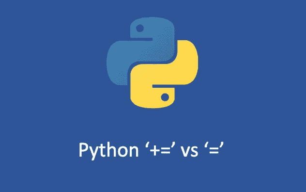

# Python 列表中+=和+的区别

> 原文：<https://medium.com/geekculture/difference-between-and-for-python-list-21d944b5305b?source=collection_archive---------1----------------------->

## 你觉得+=和+一样吗？



作为一名 Python 程序员，你可能每天都在使用 Python `list`，但你能解释一下下面这段代码的输出吗？

```
l1 = [1, 2, 3]
l2 = l1l1 += [4]
print(l1)
print(l2)l1 = l1 +[5]
print(l1)
print(l2)
```