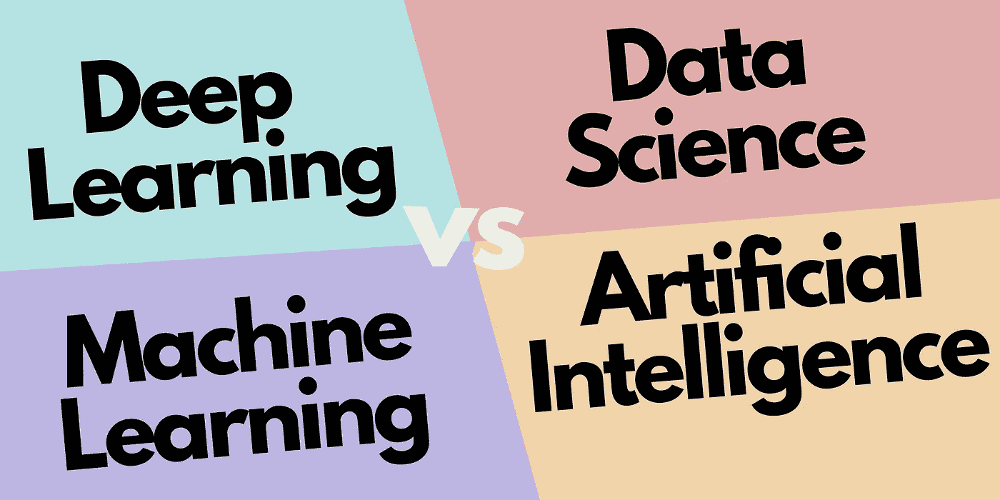
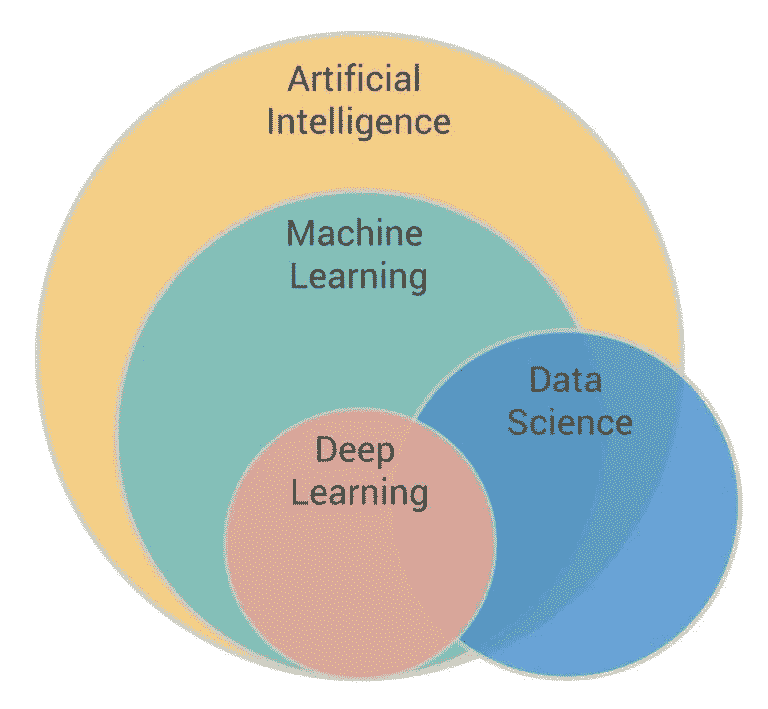
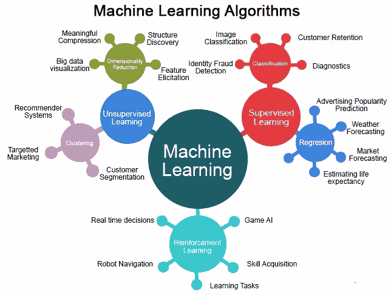
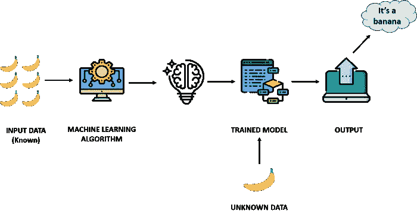
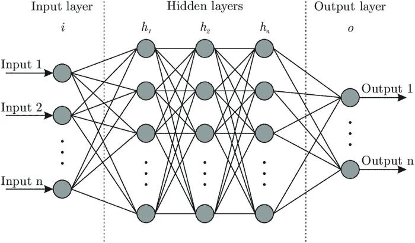
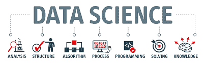
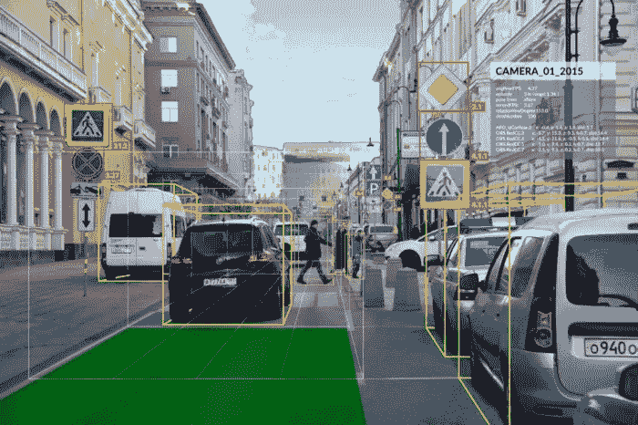

# 人工智能、机器学习、深度学习和数据科学之间的区别

> 原文：<https://medium.com/geekculture/difference-between-artificial-intelligence-machine-learning-deep-learning-and-data-science-a1a4cb35042e?source=collection_archive---------5----------------------->

## 人工智能 vs 机器学习 vs 深度学习 vs 数据科学

在今天的这一代，我们听到像**人工智能、机器学习、深度学习和数据科学**这样的词，他们中的一些人可能正在研究这些技术，或者他们将在未来研究这些技术

因此，今天在这篇文章中，我将澄清人工智能、机器学习、深度学习和数据科学之间的**差异**，因为许多人对此感到困惑，他们认为这一切都意味着相同，但答案是否定的，是一个很大的否定

这些**技术**对你来说可能听起来很普通，但实际上，它们在大多数情况下并不常见，在极少数**场景中也很常见**

**那么让我们开始**

# 人工智能

它是计算机科学的一个分支，通过它我们可以创造出智能机器，这些智能机器可以像人类一样行动，像人类一样思考，并且能够做出决策。

# 机器学习

**机器学习**使**机器**能够自动从**数据**中学习，**从**经验**中改进** **性能**，并且**预测** **事情**而无需明确**编程**。

# 深度学习

**深** **学**，只是一种类型的**机** **学**，灵感来自于**人脑**的**结构**。深度学习算法试图通过不断分析具有给定逻辑结构的数据，得出与人类**类似的**结论**。为了实现这一点，**深度** **学习**使用了一种**多层**结构的**算法**称为**神经网络**。**

# 数据科学

**数据** **科学**是对 **数据**的**海量** **量** **的深度研究，涉及从使用**科学方法、不同技术和算法处理的**原始、结构化和非结构化数据**中提取有意义的见解。****

# 人工智能

这个**条**里的一切其实都是**人工**智能的**部分**但是可以**归类**到这些**类别**

## 机器学习

**机器学习**使**机器**能够自动从**数据**中学习，**从**经验**中改进** **性能**，并且**预测** **事情**而无需明确**编程**。

## **深**浅**学**

只是一种**机器**学习的类型，灵感来源于**人脑**的**结构**。深度学习算法试图得出类似于**的结论**，就像**人类**通过用给定的逻辑结构不断**分析**数据一样。

## 自然语言处理

**自然语言处理**是**人工智能(AI)、计算机科学、**和**语言学**的一个子领域，它帮助机器在**计算机**和**人类** **语言之间进行交互。**

## **Q-学习**

**Q-learning** 是无模型**强化** **学习** **算法**学习一个动作在**特定**状态下的值。它不需要环境的模型，并且它可以处理带有****过渡**和奖励的问题，而不需要**要求** **适应**。**

## ****智能代理****

**一个**智能** **代理**是**感知**它的环境，自主地采取**行动** **以便**实现** **目标**，并且可以**用**学习**或者可以**使用** **来提高**它的**性能********

## **机器人学**

**工程** **的这个**领域**重点是**机器人**的设计**和**制造**。**机器人**经常被用来**执行** **任务**对于**人类**来说**难**执行或者执行**一致**。

## **计算机视觉**

**计算机视觉**使**计算机**和**系统**能够从**数字图像、视频和其他视觉输入**中导出**有意义的** **信息**—**采取** **行动**或**基于该**信息**提出** **建议**。

> 想了解更多关于 [**自然语言处理**](https://becominghuman.ai/what-is-natural-language-processing-nlp-16cc0f94858f) 可以查看链接—[https://becoming human . ai/what-is-natural-language-processing-NLP-16 cc 0 f 94858 f](https://becominghuman.ai/what-is-natural-language-processing-nlp-16cc0f94858f)

# 机器学习

机器学习分为 4 类

## 监督学习

**监督学习**包括学习一个**函数，该函数基于示例**输入-输出对将**输入**映射到**输出**。****

**监督学习**可以被**分组**进一步分成**两个**类别**中的**算法****

*   **分类**
*   **回归**

## 无监督学习

与监督学习不同，**非监督学习**用于**做出推论**和**从输入数据中找到模式**，而不参考标记的结果。

**无监督** **学习**可以进一步归类为**两个** **类别**的**算法**:

*   **聚类**
*   **协会**

## 强化学习

**强化** **学习**是一种基于反馈的学习方法，在这种方法中，一个学习代理对于每一个**正确** **动作**获得一个**奖励**，对于每一个**错误** **动作**获得一个**惩罚**。**代理** **自动学习****以此**反馈****改进**其**性能**。**

****

**working of a machine learning model**

## **半监督学习**

****半监督学习**是一种针对**机器学习**的方法，在**训练**过程中，将**少量已标记数据**与**大量未标记数据**相结合。**

> ****想了解更多关于 [**机器学习**](https://iaviral.medium.com/an-introduction-to-machine-learning-and-artificial-intelligence-505663e3da7f) 可以查看链接—[https://iaviral . medium . com/an-introduction-to-machine-learning-and-artificial-intelligence-505663 e3da 7f](https://iaviral.medium.com/an-introduction-to-machine-learning-and-artificial-intelligence-505663e3da7f)****
> 
> ****要了解 [**所有的机器学习模型**](https://iaviral.medium.com/all-machine-learning-models-explained-a65312aad1b8) 可以查看这个链接——[https://iaviral . medium . com/all-machine-learning-models-explained-a 65312 aad1 b 8](https://iaviral.medium.com/all-machine-learning-models-explained-a65312aad1b8)****
> 
> ****想了解更多 [**监督学习和非监督学习**](https://becominghuman.ai/supervised-learning-vs-unsupervised-learning-8af1bc803210) 可以查看链接—[https://becoming human . ai/supervised-learning-vs-unsupervised-learning-8 af1 BC 803210](https://becominghuman.ai/supervised-learning-vs-unsupervised-learning-8af1bc803210)****
> 
> ****了解更多 [**分类回归模型**](https://becominghuman.ai/difference-between-classification-and-regression-models-b929445b8d54) 可以查看链接—[https://becoming human . ai/difference-between-classification-and-regression-models-b 929445 b8d 54](https://becominghuman.ai/difference-between-classification-and-regression-models-b929445b8d54)****

# ****深度学习****

## ****神经网络****

****一个**神经** **网络**是一系列**算法**，通过一个模仿**人类** **大脑**运作方式的过程，努力**识别一组数据中的**潜在**关系**。**神经** **网络**是指**神经元**的系统。****

********

****a view of neural network****

******神经** **网络**可以进一步归类为**神经****网络**的三个** **类别**:******

## **安**

****人工神经网络** (ANN)，通常简称为**神经网络**，是受构成**动物** **大脑**的生物神经网络启发的计算系统。一个 **ANN** 是基于一组**连接的单元**或**节点**称为**人工** **神经元****

## **美国有线新闻网；卷积神经网络**

**一个**卷积神经网络** (CNN，或 ConvNet)是另一类深度神经网络。CNN 的最常用于**计算机视觉**。给定一系列来自真实世界的**图像**或**视频**，利用 **CNN** ， **AI** **系统**学习**自动**提取这些输入的**特征**来完成一个**特定的**任务**

## **RNN**

**一个**递归神经网络** (RNN)是另一类**人工** **神经网络**，它使用**时序** **数据**馈送。 **RNNs** 已经被**开发**到**地址**时序问题的顺序输入数据**

> **想了解更多关于 [**深度学习和神经网络**【https://becominghuman.ai/what-is-deep-learning-f441713ffb3c】可以查看链接](https://becominghuman.ai/what-is-deep-learning-f441713ffb3c)**

# **数据科学**

**数据科学可以分为许多类别，其中一些类别如下**

****

## **数据可视化**

****数据可视化**是信息和**数据**的图形化表示。通过使用图表、图形和地图等视觉元素。我们在 python 中有 matplotlib 库，所以我们可以绘制我们数据的漂亮表示**

## **数据分析**

****数据分析**用于分析我们的**数据**，因为现实生活中的数据不容易收集，有时我们需要使我们的数据更有效，以提高我们的**模型性能、** **准确性**，并从数据中获得一些有用的信息。我们使用**熊猫**库进行**数据**T42 分析**

## **数据操作**

**数据操作指的是**调整数据以使其有组织且更易于阅读的过程。**数据操作通过插入、删除和修改数据库中的数据来调整数据，例如清理或映射数据。我们在这个领域使用 **NumPy** 。**

## **数据清理**

**在现实世界中，**数据**收集非常困难，有时数据可能会更混乱，因此我们需要首先清理**数据**，以提高我们的模型**精度**和准确度。**

## **数据挖掘**

****数据挖掘**是公司用来将**原始数据**转化为**有用信息**的过程。通过使用软件在大量数据中寻找模式**

## **大数据**

****大** **数据**是一个**字段**，它处理**分析的方法，系统地从中提取信息，或者处理**太**大**或**复杂**的数据集**传统的** **数据处理应用**软件无法处理。**

> **了解更多 [**数据科学**](https://iaviral.medium.com/what-is-data-science-151dfbfe205c) 可以查看链接—[https://iaviral . medium . com/what-is-data-science-151 DFB Fe 205 c](https://iaviral.medium.com/what-is-data-science-151dfbfe205c)**

# **应用程序**

****

## **人工智能**

*   **无人驾驶汽车**
*   **虚拟助手**

## **机器学习**

*   **推荐系统**
*   **预测模型**

## **深度学习**

*   **图像识别**
*   **聊天机器人**

## **数据科学**

*   **互联网搜索**
*   **欺诈和风险检测。**

# **结论**

**在这篇文章中，我希望你们对人工智能、机器学习、深度学习和数据科学之间的区别有一个基本的了解，我还提供了我的文章的其他链接，如果你想对这个主题有一个清楚的解释，可以去看看**

# **更多链接**

**[**机器学习**](https://iaviral.medium.com/an-introduction-to-machine-learning-and-artificial-intelligence-505663e3da7f)——[https://iaviral . medium . com/an-introduction-to-machine-learning-and-artificial-intelligence-505663 E3 da7f](https://iaviral.medium.com/an-introduction-to-machine-learning-and-artificial-intelligence-505663e3da7f)**

**[**所有机器学习模型**](https://iaviral.medium.com/all-machine-learning-models-explained-a65312aad1b8)**—**[https://iaviral . medium . com/all-machine-learning-models-explained-a 65312 aad 1b 8](https://iaviral.medium.com/all-machine-learning-models-explained-a65312aad1b8)**

**[**监督学习和非监督学习**](https://becominghuman.ai/supervised-learning-vs-unsupervised-learning-8af1bc803210)——[https://becoming human . ai/supervised-learning-vs-unsupervised-learning-8 af1 BC 803210](https://becominghuman.ai/supervised-learning-vs-unsupervised-learning-8af1bc803210)**

**[**分类回归模型**](https://becominghuman.ai/difference-between-classification-and-regression-models-b929445b8d54)**—**[https://becoming human . ai/difference-between-classification-and-regression-models-b 929445 b8d 54](https://becominghuman.ai/difference-between-classification-and-regression-models-b929445b8d54)**

**[**深度学习和神经网络**](https://becominghuman.ai/what-is-deep-learning-f441713ffb3c)——[https://becominghuman.ai/what-is-deep-learning-f441713ffb3c](https://becominghuman.ai/what-is-deep-learning-f441713ffb3c)**

**[**数据科学**](https://iaviral.medium.com/what-is-data-science-151dfbfe205c)——[https://iaviral . medium . com/what-is-data-science-151 DFB Fe 205 c](https://iaviral.medium.com/what-is-data-science-151dfbfe205c)**

**[**自然语言处理**](https://becominghuman.ai/what-is-natural-language-processing-nlp-16cc0f94858f)—[https://becoming human . ai/what-is-natural-language-processing-NLP-16 cc 0 f 94858 f](https://becominghuman.ai/what-is-natural-language-processing-nlp-16cc0f94858f)**