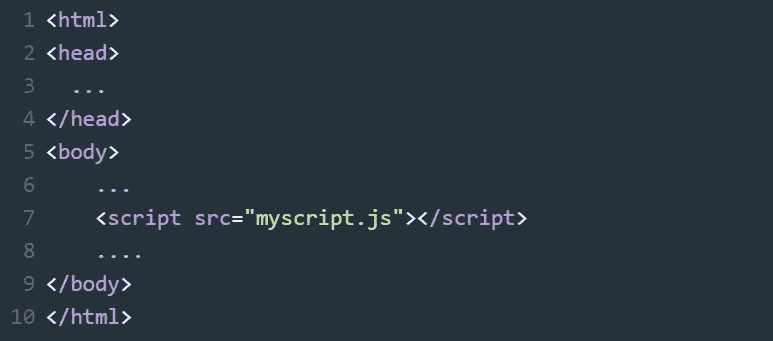

# JavaScript 中“async”和“defer”属性的区别

> 原文：<https://medium.com/geekculture/difference-between-async-and-defer-attributes-in-javascript-fc76babc13f0?source=collection_archive---------1----------------------->

在这里，我们将看到 JavaScript 中“async”和“defer”属性之间的区别，并了解如何以及何时使用它们。

“async”和“defer”是布尔属性，我们使用它们和脚本标签一起将外部 javascript 库有效地加载到我们的网页中。

## 没有这些属性，事物是如何工作的？

我假设你知道当用户请求一个网页时这些东西是如何工作的。如果你不知道事情是如何运作的，或者你想再次快速修改这个概念，请看看[这篇](https://varvy.com/pagespeed/display.html)解释得很好的文章。

加载网页时，web 浏览器会查看整个 HTML 文档，并查找该页面引用的任何 CSS、JavaScript 和图像。这就是我们所说的 **HTML 解析**。如果在 HTML 中找到了资源，web 浏览器就会向服务器请求这些资源文件。一旦 web 浏览器获得了所需的资源，它就可以开始构建页面了。

现在最重要的事情之一是脚本是如何加载的。通常 JavaScript 被认为是一种解析器阻塞语言。为什么？让我们理解这一点。

web 浏览器开始解析 HTML，并在到达**脚本**标签时暂停(这里我严格地说的是**外部 JS 文件和**而不是内联脚本)。此时，HTML 解析被阻止，浏览器请求获取/下载相应的脚本文件。一旦获取了脚本，它就被执行，然后 HTML 解析再次继续。

但是这并不好，因为 JavaScript 文件阻碍了 HTML 的呈现。因此，我们可以在这里引入两个属性“async”和“defer”。

## 如何使用“异步”属性？

使用 **async** (异步)属性，HTML 解析会继续，直到浏览器通过网络获取脚本文件，因此解析和脚本获取会并行发生(如下图所示)。一旦浏览器中的脚本可用，HTML 解析就会暂停并执行脚本。一旦执行完成，HTML 解析就会继续。

所以这是一种异步下载脚本的方式。现在让我们看看“延迟”属性。

## 如何使用“延期”属性？

“defer”这个词在英语中是“抑制”的意思。因此，通过脚本标签中提到的 **defer** 属性，脚本文件被并行下载，同时 HTML 解析继续进行。但是执行被推迟，直到 HTML 解析完成。简而言之，下载的脚本只有在浏览器完成 HTML 解析后才会执行。

既然你已经学会了如何使用**异步**和**延迟**属性，重要的问题是什么时候使用它们？

## 何时使用“异步”,何时使用“延迟”?

当你的页面不依赖于脚本文件时，你可以使用**异步**属性(例如分析)。为什么？因为 **async** 不能保证你的脚本文件下载的顺序。因此，如果你的脚本文件之间有任何依赖，它可能会破坏你的代码。在这种情况下，你可以使用**延迟**属性。

## 最后的想法

现在我们已经有了 **async** 和 **defer** 属性，我们可以把我们的脚本引用放在 **head** 标签中，这样可以让你的脚本尽快下载，而不会阻塞你的浏览器。如果你不使用这些关键字，确保在关闭你的 **body** 标签之前把它放在底部。这将确保 HTML 解析器不会被脚本阻塞。

***参考文献:***

*   Joseph Zacek 的文章[https://www . Josef Zacek . cz/blog/whats-the-difference-async-vs-defer-attributes/](https://www.josefzacek.cz/blog/whats-the-difference-between-async-vs-defer-attributes/)
*   https://www.youtube.com/watch?v=IrHmpdORLu8 阿克谢·塞尼[视频教程](https://www.youtube.com/watch?v=IrHmpdORLu8)
*   张贴在位代码[https://bitsofco.de/async-vs-defer/](https://bitsofco.de/async-vs-defer/)