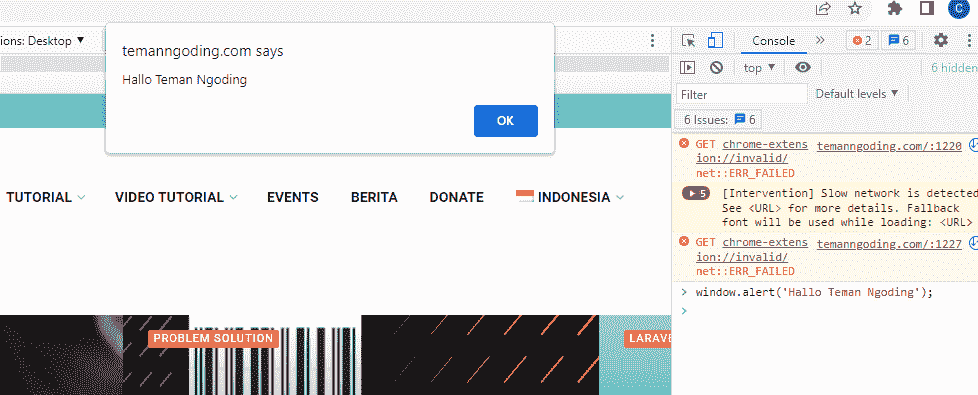
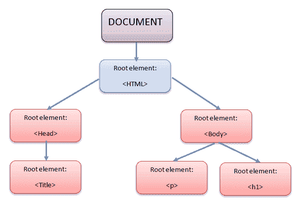
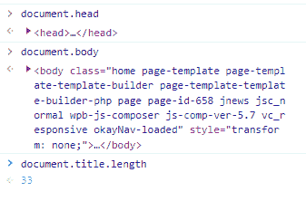
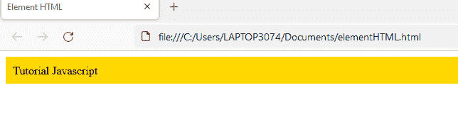

# JavaScript 中 BOM 和 DOM 的区别

> 原文：<https://medium.com/geekculture/difference-between-bom-and-dom-in-javascript-5c8317c5c1d2?source=collection_archive---------2----------------------->


你好，你们都好吗，我希望你们都永远健康和成功。这次我们将讨论 JavaScript 中经常使用的 BOM 和 DOM 之间的区别，但我们不知道这两者之间的区别。

BOM 和 DOM 看起来一样，但两者不同。我们讨论区别。

之前，您在此阅读了其他教程:

[基础 JavaScript 第 6 部分:If Else JavaScript](https://temanngoding.com/javascript-dasar-part-6-if-else-javascript/)

[基础 JavaScript 第 5 部分:JavaScript 运算符](https://temanngoding.com/javascript-dasar-part-5-operator-javascript/)

[基础 JavaScript 第 4 部分:JavaScript 数据类型](https://temanngoding.com/javascript-dasar-part-4-tipe-data-javascript/)

# 浏览器对象模型(BOM)

BOM 是一个浏览器对象模型，它是一个由所有浏览器支持的窗口对象，代表一个由导航器、历史、屏幕、位置和文档对象组成的浏览器窗口，这些对象是窗口的子对象。BOM 可以使用 window.addEventListener 检查来自 windows 的事件，并可以使用 window.innerHeight 和 window.innerWidth 执行操作

BOM 可以给浏览器特殊的命令，例如我们在浏览器中使用特殊的属性，你可以用浏览器来制作它。例如，如下所示:

添加命令 window . alert(“Hello Friends”)；



我们可以从 BOM 中使用几种方法，包括 alert() *、* prompt()和 objeckk 控制台。

**方法警报()**

alert()方法是用于显示警告或信息的 BOM 方法之一。我们可以用下面的例子:

```
window.alert("Hello World!");
```

或者

```
alert("Hello World!");
```

**方法提示()**

prompt()方法用于显示浏览器对话框，可以由用户填写。在 prompt()对话框中执行 sting 输入时，prompt()对话框将从用户返回一个字符串值。例如，如下所示:

```
let message = prompt('Your Name:');
```

或者

```
var name = prompt("Your Name?", "");
document.write("<p>Hello "+ name +"</p>");
```


我们可以在 Windows 提示符下提供输入，然后我们输入的字符串将显示在浏览器中。

**控制台方法**

控制台方法对于前端开发人员来说是一个非常有用的方法，因为控制台方法可以用来消除已经创建的代码中的错误。下面是控制台代码示例:

```
console.log('Pesan kamu');
```

我们可以使用几种控制台方法。

方法说明 *log()* 向*浏览器控制台*显示一般消息。 *info()* 向*浏览器控制台*显示包含重要信息的消息。 *warn()* 以警告的形式向*浏览器控制台显示包含信息的消息，error()* 以*错误*的形式向*浏览器控制台*显示包含信息的消息。

**Console.log()**

此方法用于向控制台选项卡显示消息或信息。例如:

```
console.log("this is console.log")
console.log(4+9)
```

**Console.warn()**

console.warn()方法的功能与 console.log()相同，但显示的消息是警告。例如:

```
console.warn("this is console.warm")
console.warn(4+9)
```

**console.error()**

方法 console.error()也具有与上面两个方法相同的功能，但是出现的消息是一个错误。例如:

```
console.warn("this is console.error")
console.warn(4+9)
```

**Console.info()**

该方法的功能与前一个方法相同，即显示消息。例如:

```
console.info("this is console.info")
console.info(4+9)
```

以及更多我们可以使用 javascript 的方法。

我们继续 DOM 载体。

# 文档对象模型(DOM)

DOM 是我们用来创建 JavaScript 程序的函数和属性/数据的集合，我们可以称之为 API*(应用编程接口)*。DOM 可以用在 HTML，XM 和 SVG 中。DOM 不仅用于 JavaScript 编程，也可以用于其他编程。

在 document 对象中，我们将找到可以用来操作 HTML 文档的函数和属性。

DOM 有一个树形结构，我们称之为 DOMtree。



看看这个 DOMtree 的结构，我们将知道我们将使用 DOM 操作的 HTML 代码的结构。例子如下:

```
document.head;document.body;document.title.length;
```

在浏览器中输入代码，结果将如下所示:



当我们通过 DOM 访问 HTML 元素时，我们只需添加文档代码。

有了对象**文档**、*、*我们就可以访问包含在根元素< html >中的 HTML 的全部内容。所以，如果你仔细看，它包含了其他元素如<头>和<身>。

我们可以通过使用下面的一些函数来访问更具体的 HTML 元素。

*   `getElementById()`根据属性选择元素的功能`id`。
*   `getElementByName()`根据属性选择元素的功能`name`。
*   `getElementByClassName()`根据属性选择元素的功能`class`。
*   `getElementByTagName()`通过标签名称选择元素的功能。
*   `getElementByTagNameNS()`通过标签名称选择元素的功能。
*   `querySelector()`基于查询选择元素的功能。
*   `querySelectorAll()`基于查询选择元素的功能。
*   和其他人。

在上面的方法中，HTML 元素只有一个返回值。此外，还有一些从 HTML 文件中返回多个元素的方法，通常称为 HTMLCollection。因为上面所有的*方法*都属于 document 对象，所以不要忘记用语法 document 给上面所有的调用*方法-方法*加前缀。< nama_method >。

我给出了一个如何在浏览器中使用 DOM 的例子。

```
<!DOCTYPE html>
<html>
<head>
    <title>Element HTML</title>
</head>
<body> <div id="tutorial"></div> <script type="text/javascript">
        var tutorial = document.getElementById("tutorial"); tutorial.innerText = "Tutorial Javascript"; tutorial.style.backgroundColor = "gold";
        tutorial.style.padding = "10px"; </script></body>
</html>
```



对于那些使用 JavaScript 构建前端的人来说，BOM 和 DOM 都非常有用。

因此，这次我做的教程，可能对你们所有人都有用。

***致谢。***