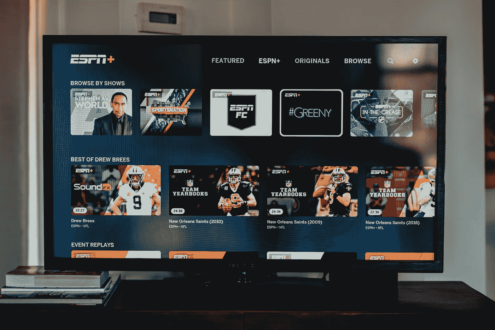

# IPTV 和 OTT 的区别-每个人都必须知道

> 原文：<https://medium.com/geekculture/difference-between-iptv-and-ott-everyone-must-know-93fa4d3e171d?source=collection_archive---------2----------------------->

全球内容消费已经开始被[最佳 ott 平台](https://blog.contus.com/ott-platforms/) 和顶级 IPTV 服务**所主导。**虽然 OTT/IPTV 平台都是常用的视频流选项，但在内容交付方式上各有独特之处。这种特殊的差异正是吸引企业和商业的原因，因为无论他们是 IPTV 用户还是 OTT 用户，他们的客户都可以使用它们。

OTT 和 IPTV 流媒体趋势:预计到 2027 年，OTT 视频领域的市场容量将达到 4766.0 亿美元，同期增长率为 11.60%。自 2018 年以来，IPTV 的用户稳步增长，到 2024 年可能会有多达 140 万用户(来源:Statista)

**什么是 IPTV？**

Source: [Apptha](https://www.apptha.com/blog/best-platforms-for-starting-an-iptv-business/)

IPTV 是互联网协议电视(IPTV)的常用术语，用于使用互联网协议(IP)传送视频和音频内容，该网络通过局域网或广域网的计算机网络进行管理。作为管理网络的优势在于，它用于多播流，使用单个视频源与同一网络上的用户共享，从而优化带宽利用。

**IPTV 是如何工作的？**

IPTV 不同于有线电视上的冲浪频道。不同之处在于使用 IP 来传送观众请求的视频。当用户点击一个电视节目时，不同的视频源或服务器被分开，以便它们成为数据包并可以通过互联网发送。视频服务器将使用光纤电缆通过互联网连接向家庭传输节目，以便发送请求。

**什么是 OTT？**

Source: [VPlayed](https://www.vplayed.com/blog/what-is-ott-over-the-top-explained/)

[OTT full form](https://www.vplayed.com/blog/what-is-ott-over-the-top-explained/) 是通过互联网传输到单个设备的高端内容，通常是视频。 [OTT 平台](https://www.vplayed.com/ott-video-platform.php)

**OTT 是如何工作的？**

它是组织与员工共享内部视频内容的理想解决方案。使用任何设备，如平板电脑、PC 或智能手机，网络带宽的波动水平通过 ABR 或自适应比特率进行匹配，以在具有不同视频质量水平的并行流之间动态切换。

**IPTV 与 OTT——利弊**

视频流媒体行业正在不断发展，IPTV 和 OTT 都在推动大部分改编。虽然两者的工作原理相同，都使用互联网来传送内容，但它们都有各自的优缺点。

**内容交付和网络**

*   OTT 使用公共网络或开放网络来传送其内容。但是安全和质量取决于使用中的互联网
*   IPTV 使用广域网和局域网或封闭的网络生态系统，提供流畅的内容传输，并且独立于互联网的带宽。

**所需部件**

*   OTT 不需要任何外部硬件来运行。他们需要专用的应用程序
*   IPTV 需要专用的机顶盒以及路由器。

**视频质量**

*   OTT 视频内容由互联网定义
*   IPTV 是一个流畅和更好的用户体验与视频质量和音频

**价格**

*   OTT 服务是免费的，可能需要附加支持计划
*   IPTV 的价格很高，平均每月 15-30 美元

**内容类型**

*   OTT 也提供免费或付费内容或混合内容
*   IPTV 提供与 SVOD 独家货币化

**IPTV 还是 OTT？什么适合你的服务？**

对 IPTV 和 OTT 的每一项功能进行的比较表明，OTT 在许多功能上都比 IPTV 有优势。但是 IPTV 能够完全基于它提供的内容的质量和它提供的控制水平来保持自己的优势。同时，OTT 性价比高但 IPTV 具有可扩展性和更好的内容质量。

因此，您应该根据您的最终需求在 OTT 和 IPTV 之间进行选择。如果你想在全球范围内推出经济实惠的流媒体服务，那么 OTT 平台就是你的解决方案。你只需要一个 OTT 应用来启动你的服务。

另一方面，如果你需要挖掘一个没有缓冲的高质量视频和音频内容的利基市场，那么 IPTV 就是你的解决方案。

**结论:IPTV vs OTT**

最大的收入细分市场之一是 OTT 视频广告细分市场，预计到 2022 年底市场规模将达到 1804.0 亿美元(来源:Statista)。到 2022 年底，OTT 视频领域的每用户平均收入(ARPU)可能会达到 84.39 美元。

对于每项业务，IPTV 和 OTT 都有一个解决方案，可以帮助您接触目标受众并与之互动。要了解这两项服务的更多信息，请立即联系我们！