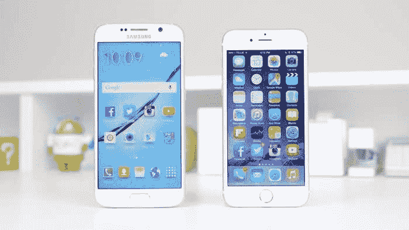
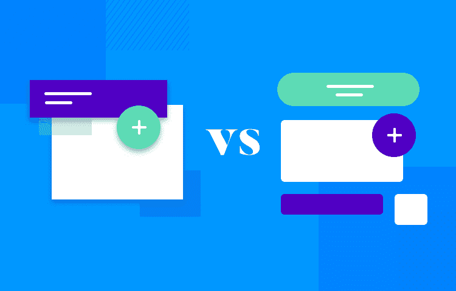
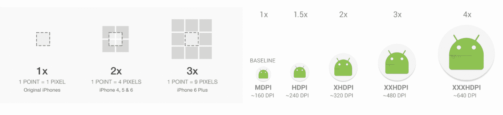
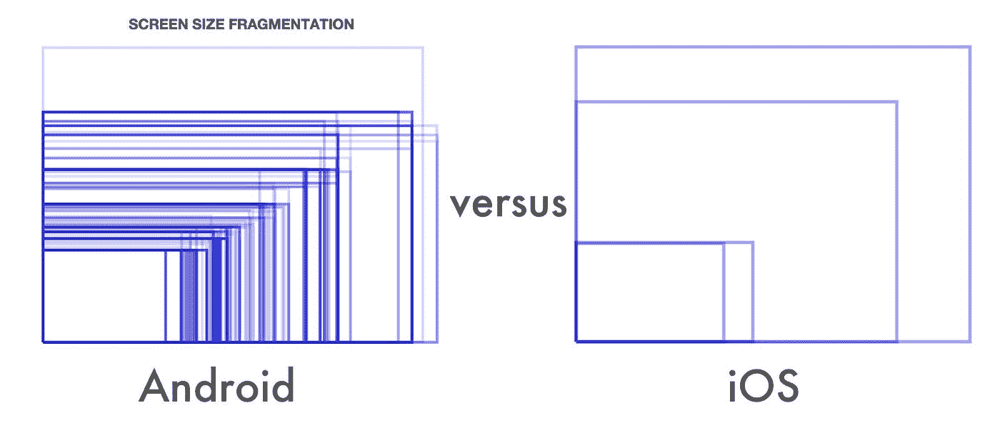
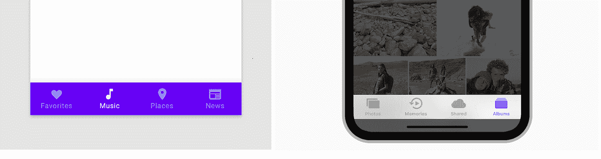
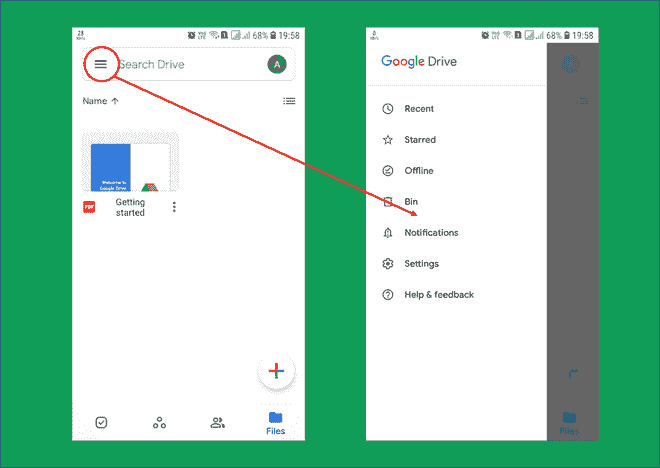
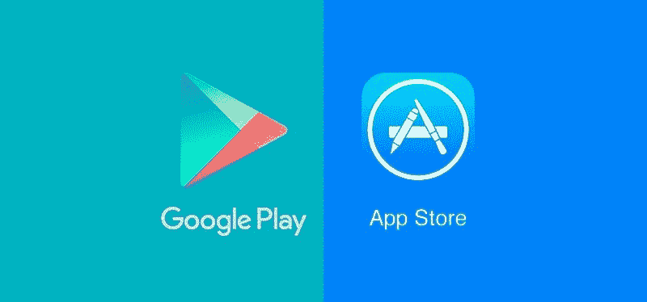

# 设计 Android 和 iOS 原生应用的区别

> 原文：<https://medium.com/geekculture/differences-between-designing-android-and-ios-native-apps-12a3a656453?source=collection_archive---------5----------------------->

## 找出在为 iOS 和 Android 设计应用程序时应该考虑的事情。

## 如果你打算在 Android 和 iOS 上设计原生应用，你必须知道这两个平台有着非常不同的设计准则。苹果效仿 HIG 的扁平化设计，安卓则是基于材质设计。阅读这篇博客，找出这些平台之间的差异。

Differences between designing Android and iOS native apps

图片来源:谷歌

在为 iOS 或 Android 开发移动应用程序时，有几件事需要考虑，即优化应用程序性能和用户体验的最佳实践是什么。这就是我们所说的 iOS 和 Android UI。智能手机市场分为两个主要平台:苹果的 iOS 和谷歌的 Android，它们有自己的设计风格，定义了应用程序应该如何工作和外观。让我们引导您了解 iOS 和 Android 的主要区别。

要恰当地裁剪一个 app 设计，需要遵循平台准则，即 iOS 的[人机界面准则(HIG)](https://developer.apple.com/design/human-interface-guidelines/) 和 Android 的[材质设计](https://material.io/design)。您还需要与开发人员沟通，最好尽早让他们参与到设计过程中，这样他们就可以马上设置技术约束。

但是 iOS 和 Android 的设计到底有什么不同呢？在本文中，我将讨论 iOS 和 Android 之间的一些具体设计差异。它们分为四组:基本差异、导航和模式差异(UX)、组件差异(UI)和其他差异。

# 基本差异

## 1)人机界面指南(HIG)与材料设计

Differences between designing Android and iOS native apps

图片来源:谷歌

在概念层面，我们可以将它们总结如下:HIG 是一个扁平、轻盈、友好的设计，来自于对[造型](https://www.interaction-design.org/literature/topics/skeuomorphism#:~:text=Skeuomorphism%20is%20a%20term%20most,icon%20used%20for%20discarding%20files.)的逐渐摒弃。材料有几个基本原则:作为隐喻的材料；大胆、生动、有思想；有意动画；灵活的基础和跨平台功能。如果您不熟悉这些指南，我建议您在继续阅读本文之前先阅读它们。

## 2)测量单位，差压与 pt

Differences between designing Android and iOS native apps

图片来源:谷歌

IOS 应用布局用 pt 开发，Android 应用布局用 dp 开发。作为一般的经验法则，我们用 1x(或 mdpi)开发布局，并将它们上传到 Zeplin。Zeplin 以 pt 显示 iOS 布局，并生成 2x 和 3x 图标和插图。对于 Android，布局以 dp 显示，图形以 hdpi、xhdpi、xxhdpi 和 xxxhdpi 输出。

## 3)屏幕尺寸

Differences between designing Android and iOS native apps

图片来源:谷歌

我更喜欢设计最小尺寸的 iOS 应用程序 320pt x 568pt 的 iPhone 5 SE 屏幕尺寸。我这样做是为了防止内容在小屏幕上显示不正确。有些人更喜欢为 iPhone 8 设计。

对于 Android 应用程序，我们通常采用 360dp x 640dp 的屏幕尺寸。

在 iOS 中，我有时会参考 iPhone X (375pt х 812 pt)来开发设计，这也是许多其他移动应用开发公司喜欢做的事情。这对于开发人员理解如何在这种尺寸的屏幕上正确设置边距是必要的。为 iPhone X 设计时，也要考虑安全区域。这是您应该放置内容的唯一区域。

# 命名差异

在命名方面有很多不同之处。这里我提到了其中的五个。

**а)标签栏对底部导航栏**

Differences between designing Android and iOS native apps

图片来源:谷歌

这是应用程序中的顶级导航栏。在两个平台上，它都静态地位于屏幕底部。除了命名之外，这些条的行为也各不相同。

**b)上部应用栏前面的导航栏**

这个栏在两个平台上的行为大致相同:它告诉用户他们在应用程序中的当前位置，允许他们返回到上一个屏幕，并建议一个或多个上下文操作。

**c)分段控件与选项卡**

除了命名，Android 标签还有许多不同的功能——你可以从一个标签滑动到另一个标签，Material 让我们可以使用它们进行顶级导航。

**d)针对对话的警报**

有趣的是，只描述了一个提醒用户 iOS 的工具。不管是在安卓系统上，我们都有三个:滚动条、横幅和对话框。小吃店是为低优先级邮件设计的，不需要任何附加操作。对话框阻止与界面的交互，并要求用户执行一个动作。介于这两者之间的横幅:它们不阻止交互，但要求用户采取行动。

**e) Touch IDs 与 Android 指纹**

这是这些平台上使用的技术的不同命名约定的一个例子。有必要了解它们，因为除了命名之外，它们在实现的技术特征方面还有一系列的区别。理解名称区别是理解技术区别的第一步。

# 导航模式的差异

**搜索行为的差异**

有趣的是，HIG 把搜索归到了酒吧，并称之为搜索吧。在“材料设计”中，我们发现搜索在导航部分，而不是在组件部分。换句话说，对于材料设计来说，搜索只是另一种导航方式。在 iOS 和 Android 上，搜索可以静态地显示在屏幕上，并且通常固定在导航栏/顶部应用程序栏上。

在这两个平台上，搜索可以以图标的形式出现；然而，在 iOS 上，搜索图标扩展为独立的搜索栏组件，而在 Android 上，图标在顶部应用栏内扩展。

iOS 上的搜索增加了一个功能，它可以“隐藏”在导航栏下面，通过“向下滑动”的手势来调用。相同的手势通常用于刷新(拉至刷新)，因此您不希望使用相同的动作来激活搜索和刷新。

# 组件差异

**iOS 缺少哪些组件**

**许多原生安卓组件在 iOS 上是没有的。我们来复习一下。**

**a)导航抽屉**

Differences between designing Android and iOS native apps

图片来源:谷歌

原则上，iOS 不识别汉堡菜单。iOS 只有通过标签栏的顶级导航。

**b)资金**

就我而言，背景是材料中最令人惊奇的组成部分。写的时候 Android 还在计划部署资金作为原生组件。一般来说，当检查材料的成分时，检查它们是否已经可供使用。

材料本身就爱这个成分。比如看看 2019 年材料设计奖的获奖者。

**c)横幅**

横幅不属于原生 iOS 组件。通过横幅，我们可以向用户传达重要的信息，并建议相关的行动。

**d)零食条**

和横幅一样，Snackbars 也不属于 iOS 的原生功能。小吃店用于向用户提供有关其行动结果的短信。

**e)芯片**

这些芯片也不是原生的 iOS 组件。它们用于输入信息、描述和操作。

**f)下部应用条**

这里我们可以论证 iOS 有一个类似工具栏的组件。但它们实际上是不同的，这就是为什么:Google bar 是一个上下文操作栏，即当编辑 messages 中的消息列表时，会出现一个带有“阅读全部”和“删除”操作的工具栏。另一方面，底部的应用程序栏本质上是一个顶部的应用程序栏，它已经随着相同的顶级操作一起下移，包括打开导航抽屉、调用搜索等。应用程序的底部栏。

**g) FAB**

没有，iOS 上也没有 FAB。FAB 是在屏幕上执行主要操作的按钮。例如，在电子邮件应用程序中，FAB 将编写新的电子邮件。

如果你在 Android 上使用 FAB 作为屏幕上的主要动作，在 iOS 上，主要动作应该位于顶部，在导航栏的右侧(例如，参见 iMessage)。

**h)下导航抽屉**

这是典型的 Android 导航抽屉的另一个版本。通过按下应用程序底部栏上的汉堡包菜单按钮打开它。

**i)侧页**

虽然 Material 也允许在移动应用中使用这个组件，但我建议用一个更熟悉的底层替换它。

**j)下折页**

这个非常好看的 Android 组件不是原生 iOS 组件之一。底部折叠页是附在页面底部的表面。如果用户触摸这个表面，它会扩展到一整页。

**k)标准底板**

此表是底部表的变体，不是 iOS 组件。

这些功能只能在 Android 中找到和内置。因此，如果你正在计划这些，那么最好[只雇佣专门的 Android 应用开发者](https://www.valuecoders.com/hire-developers/hire-android-developers)。

**安卓缺少哪些组件？**

**现在我们来看看 Android 库中没有的组件。**

**a)页面控制**

Differences between designing Android and iOS native apps

图片来源:谷歌

该组件显示用户所在的页面。它不是原生的 Android 组件。

**b)工具栏**

工具栏只在 iOS 上可见。

**с)步进器**

步进器是一个标准的 iOS 控件，在材料中没有描述。我们用它们来输入小数值，比如打印时的份数。

d)松饼

Popover 是一个弹出面板，主要用于 iPad。

iOS 上有一个 Popovers 的标准应用:在阅读器或浏览器中调整文本设置。

如果你想在预算有限的情况下在你的应用中寻找这些功能，你必须[在印度雇佣一家 iOS 应用开发公司](https://www.valuecoders.com/ios-application-development-company-india)。

# 其他差异

**对攻丝面积大小的不同要求**

根据指南，iOS 上的触摸区最小尺寸为 44x44pt，Android 上的最小尺寸为 48x48dp。

1.  **App Store vs. Google Play**

Differences between designing Android and iOS native apps

图片来源:谷歌

您的 iOS 应用程序将从 App Store 下载。您的 Android 应用程序将从 Google Play 下载。为了确保您的应用程序在这些商店中正确发布，您必须满足他们的要求。App Store 的需求可以在[这里](https://developer.apple.com/app-store/product-page/)找到，Google Play 的需求可以在[这里](https://support.google.com/googleplay/android-developer/answer/1078870?hl=ru)找到。那里有很多要求，所以我建议在它们推出之前研究一下。

2.**iOS 中的特殊模式:撤销和重做**

iOS 中有一个特殊的模式:如果用户晃动智能手机，应用程序会给他们取消或重做上一次操作的选项。一般来说，这个手势是用来撤销书写的。

# 结果

了解这些指导方针可以增强我们的意识。这有助于我们理解既定的用户模式，并构建有机适应用户习惯的应用程序。

指导方针激励我们尊重平台的本地解决方案。当在另一个平台上采用一个设计时，总是有不做任何修改就复制这个设计的诱惑。这损害了用户体验，并使开发变得困难。但是如果我们意识到本地解决方案之间的差异，我们可以正确地调整我们的设计。

如果我们想实现一个新的定制解决方案，了解指导方针有助于我们捍卫创新。

最后，了解指导原则及其差异是一个移动应用程序设计师必须具备的重要技能。