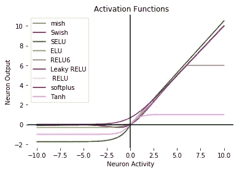

# 深度神经网络的不同激活函数你应该知道

> 原文：<https://medium.com/geekculture/different-activation-functions-for-deep-neural-networks-you-should-know-ea5e86f51e84?source=collection_archive---------2----------------------->

## 深度神经网络中使用的新的和流行的激活函数的快速快照

***了解深度神经网络常用的激活函数:Sigmoid、Softmax、tanh、ReLU、Softplus、PReLU、ReLU6、eLU、SELU、Swish、Mish***

## 深…的工作