# JavaScript 中有用的不同种类的控制台输出

> 原文：<https://medium.com/geekculture/different-kinds-of-console-output-that-are-useful-in-javascript-1abfc971fdda?source=collection_archive---------1----------------------->

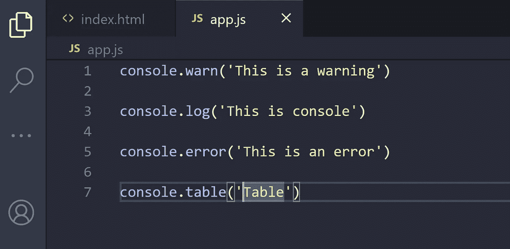

Different kinds of console output

嗨，我读到了 console.log，但是 console 还有其他非常有用的方法

# 清空控制台

是的，有一个方法可以清除控制台，如果你在 Chrome 浏览器中运行这个命令，你可以看到类似这样的东西

```
console.clear()
```

命令前


example console.clear()

命令后

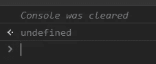

Finish example console clear

# 数一数被调用了多少次

使用 console.count，我们可以计算一个变量字符串被调用的次数

```
console.count()
```

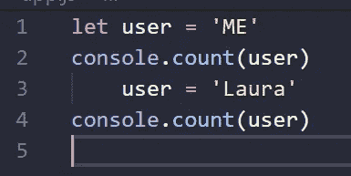

Code example of console.count()

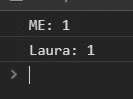

Example of console.count()

# 检查对象的所有数据

显示对象的所有信息

```
console.dir()
```

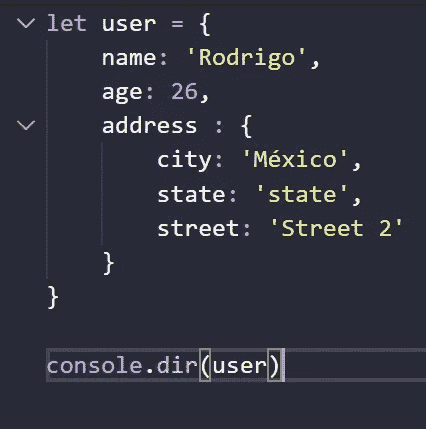

code of console.dir()

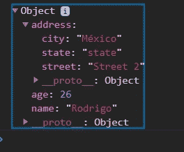

example of console.dir()

# 在控制台上打印错误

使用 console.error()可以打印这样的错误

```
console.error()
```

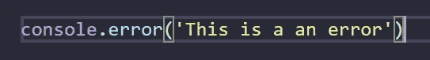

code of console.error()

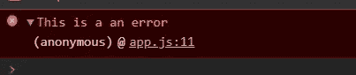

example of console.error()

# 用数据创建一个表

您可以控制数据输出并使用它们创建表格

```
console.table()
```

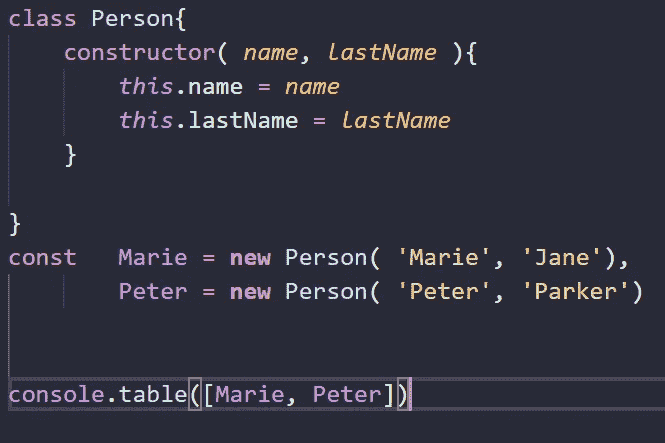

code of console.table()

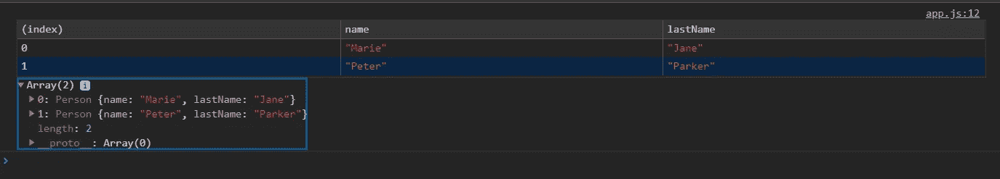

Example of console.table()

# 查看时间

使用这种方法，我们可以检查响应的时间，或者检查人们检查某物或者点击某个区域的时间

```
console.time(), console.timeLog(), console.timeEnd()
```

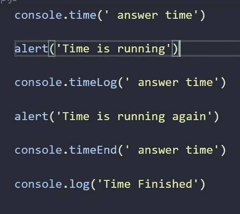

Code of console.time(), console.timeLog() and console.timeEnd()

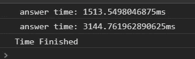

Example of console.time(), console.timeLog(), console.timeEnd()

# 打印警告

用这种方法很容易产生警告

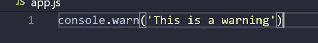

code of console.warn()

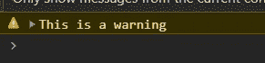

example of console.warn()

# 结论

还有其他一些方法，但这些对我来说是最有用的控制台方法，但在这种情况下，如果您想使用更多信息或错误或警告，可以使用 table，这些方法对 console.log 非常有用

# 来源

[https://developer.mozilla.org/en-US/docs/Web/API/console](https://developer.mozilla.org/en-US/docs/Web/API/console)