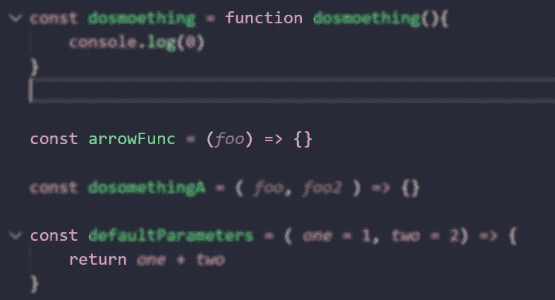

# JavaScript 中不同种类的函数

> 原文：<https://medium.com/geekculture/different-kinds-of-functions-in-javascript-204943470006?source=collection_archive---------0----------------------->



Different kind of Functions in JavaScript

JavaScript 中有太多的函数，它们有自己的能力，自己的规则，自己的结构，我们会看到一个简单的解释。

# 什么是函数？

函数是一段代码，你可以定义一个函数，我们可以调用它很多次，它可以接受参数，可以返回值，这是函数的一个简单含义。

# #1 函数，常规函数

旧的是正则函数，我们都知道，因为这是第一个

```
function hello(){}
```

# #2 函数，函数表达式

被赋给一个变量

```
const hello = function(){}
```

# #3 函数，命名函数表达式

这和函数表达式是一样的，但是如果你有一个错误，它们是有用的，它们包含了函数的名字

```
const hello = function hello(){}
```

# #4 功能，箭头功能

它们非常有用，您可以将它们用于内联代码

```
const hello = () => {}
```

# #5 功能，自动调用功能

当页面准备好常规功能时，这个函数可以自动调用它

```
( function(){ } () )
```

对于箭头功能

```
( () => {} )()
```

# #6 功能，发电机功能

这种功能可以随着收益率而暂停，并继续它们与承诺相结合，它们非常强大。

```
function* generator(i) {
  yield i;
  yield i + 10;
}
```

# 结论

这是一个简单的检查，JavaScript 中不同种类的函数，你可以在任何你想要的地方使用它们，它们有自己的优点和缺点，但它们在最后是有用的，如果你想搜索更多关于它们的信息，你可以使用这些资源，如果你想写你最喜欢的，你可以在评论区写。

# 来源

[https://developer . Mozilla . org/en-US/docs/Web/JavaScript/Reference/Functions](https://developer.mozilla.org/en-US/docs/Web/JavaScript/Reference/Functions)