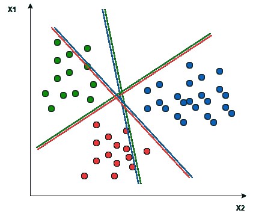
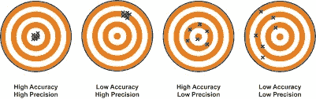
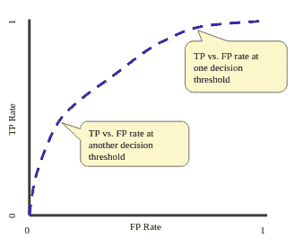
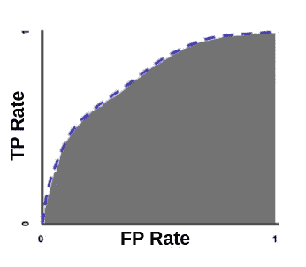
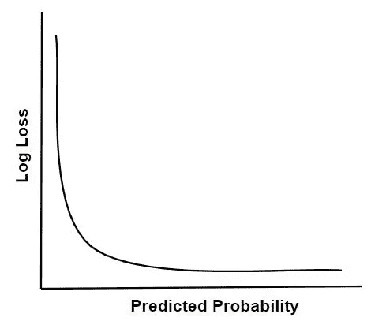

# 评估分类器的不同指标—已解释

> 原文：<https://medium.com/geekculture/different-metrics-to-evaluate-classifiers-explained-838063f015dc?source=collection_archive---------36----------------------->

自从我上次发布文章已经有一段时间了，所以我想回到我曾经为我的同事做了一整个会议的主题，从他们的反馈来看，我觉得我应该发布这篇文章来更新我的信息并记录下来！

classification decision boundary

因此，在这一部分，我将讨论分类器以及如何评估它们，以确保您的度量反映模型的实际性能。

# **1-什么是分类？**

分类是一种监督学习技术，其中目标变量是离散值，换句话说，模型预测的是标签，而不是连续值。例如，目标变量可以具有值 0 或 1，它们可以表示猫或狗。分类是最常见的 ML 任务之一。

分类器是执行分类的模型。

# **2-不平衡数据集**

这是一个出现在许多数据集中的问题，其中类的数量或比率不相等或接近相等，类 0 可能有 90 个实例，而类 1 只有 10 个实例，这个问题可以通过许多方法解决，如重采样、收集更多数据或选择正确的度量。

# **3-分类指标**

要评估任何 ML 模型，您需要设置一个指标，并根据它在测试或维持集上的值，重新训练模型并进行调整。

分类指标主要分为 3 种类型

1-阈值指标

两级指标

3-概率度量

# **3.1-阈值指标**

这些是量化分类器预测错误的指标，当我们希望模型尽量减少错误或错误分类项目的数量时，或者当我们的数据集平衡时，使用这些指标。为什么？因为您的模型可能表现不佳，而准确性或误差会欺骗您认为它表现良好> >记住我们的 90 到 10 数据集，该模型可能达到 90%的准确性，但它只适用于大多数类

**准确度** =正确预测/总预测

**误差** =不正确的预测/总预测

误差度量是准确度的补充> > 1-准确度

**敏感性-特异性指标**

这些度量让你对+ve 类的预测有多准确有一个直觉。

**敏感度/召回率=** 真阳性/(真阳性+假阴性)它被定义为真阳性率，它衡量真阳性的预测程度

**特异性** =真阴性/(假阳性+真阴性)它是灵敏度(真 ve 率)的补充，它给出了一个关于-ve 类预测得有多好的直觉。对于不平衡分类，它比敏感度更有帮助。

**精确召回指标**

我们知道回忆和敏感是一样的，

Precision = TP/(TP+FP)它被定义为正面预测的准确性或+ve 预测实际正确的比例

查全率和查准率通常被结合在一个指标中，以找到它们之间的平衡。这个指标被称为 F-score。

F1-得分=(2 *精度+召回)/(精度+召回)，F1 得分对精度和召回给出相等的权重。

F1 分数的一个抽象是 F-beta，其中在计算[调和平均值](https://machinelearningmastery.com/arithmetic-geometric-and-harmonic-means-for-machine-learning/)时精度和召回率的平衡由一个称为 *beta* 的系数控制。

**Fbeta-score**=((1+beta)* Precision * Recall)/(beta * Precision+Recall)

还有其他阈值指标，但这些是最受欢迎的。

关于这些指标的最后一件事是，它们假设完全了解分类器将被部署的条件。特别地，他们假设训练集中存在的类别不平衡是在分类器的整个操作寿命中会遇到的类别不平衡。这种情况并不常见，所以他们会误导你。

# **3.2 排名指标**

这些度量没有对数据集中的类分布做出任何假设，它们关注的是评估分类器分离数据类的有效性，并且它们仅与能够输出属于类的实例的概率分数的分类器一起使用，即:点 X 以 0.9 的概率属于类 A。

其中最广泛使用的度量是 ROC 曲线，它分析二元分类器的性能。它描绘了召回/TPR 与 FPR 的关系

TPR vs. FPR

为了评估模型，我们计算从点(0，0)到点(1，1)的 AUC(ROC 曲线下的面积)

AUC

AUC 的范围从 0 到 1，auc=1 意味着模型有 100%正确的预测

AUC 的优势:

1-尺度不变:它衡量预测的排名，而不是它们的绝对值。

2-分类-阈值-不变。它测量模型预测的质量，而不管选择什么分类阈值。

AUC 的局限性:

1 尺度不变性并不总是理想的。

2-分类阈值不变性并不总是理想的。

 [## 分类:ROC 曲线和 AUC |机器学习速成班

### " type": "thumb-down "，" id ":" missingtheinformationneed "，" label ":"缺少我需要的信息" }，{ "type"…

developers.google.com](https://developers.google.com/machine-learning/crash-course/classification/roc-and-auc) 

# **3.3 概率度量**

这些度量量化了分类器预测的不确定性

对于我们对不正确与正确的类预测不太感兴趣，而对模型在预测中的不确定性更感兴趣，并惩罚那些错误但高度自信的预测的问题，它们很有用。

这些指标还要求校准概率>>逻辑回归，其他未在概率设置下训练的模型要求在通过概率指标评估之前，根据数据集校准其概率> > SVM 和 KNN

最常见的度量是二进制分类的对数损失，也称为交叉熵

对于二元分类器:

*   **log loss**=-((1—y)* log(1—yhat)+y * log(yhat))其中 yhat 是模型的预测

为了概括

*   **log loss**=-(sum C in C y _ C * log(yhat _ C))其中 C 是类

完美的分类器具有 0.0 的对数损失，更差的值是正的直到无穷大。

log loss decreases when prob. increases

# **4-如何选择公制？**

选择指标取决于数据集、问题、您的假设和业务需求，因此没有放之四海而皆准的指标。特别是如果你有班级不平衡，你可以从机器学习大师开始，这里有一个很好的思维导图，它总结了一些东西

