# 对象检测的不同模型

> 原文：<https://medium.com/geekculture/different-models-for-object-detection-9c5cda7863c1?source=collection_archive---------7----------------------->

## 更快的 R-CNN、YOLOv5、RetinaNet 和 EfficientDet

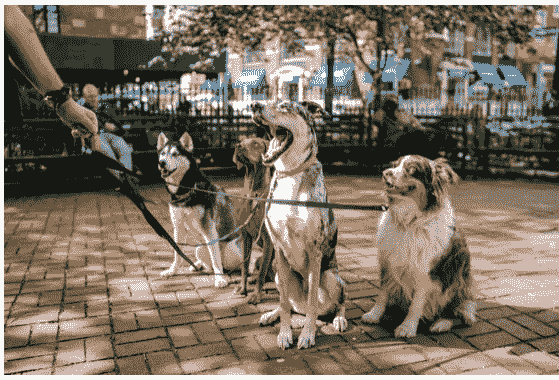

* Image courtesy of Unsplash/ Matt Nelson

深度学习在过去十年中经历了非常快速的改进。一些架构建立在旧版本的基础上，因此产生了一系列算法。我们将使用四个算法家族的代表来说明对象检测的建模:

1.  更快的 R-CNN (2 级检测器，相对较慢但准确)，
2.  YOLOv5 (1 级检测器，速度快，但精度较低)，
3.  RetinaNet(一级检测器，快速准确)，以及
4.  EfficientDet(主要是 1 级检测器设计，快速准确)。

***概要:***

A.设置

B.数据准备

C.系统模型化

C.1 .更快的 R-CNN

约洛夫 5

C.3\. RetinaNet

效率检测

D.最终建模

E.推理

*警告*:有趣的图片会让人分心！

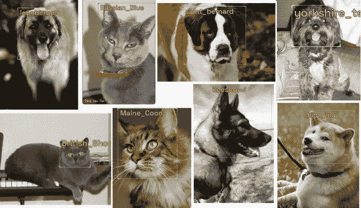

打开笔记本，我们开始吧！

**答:设置**

我用的是带 GPU 运行时和高 RAM 设置的 Colab Pro。

```
!wget [https://raw.githubusercontent.com/airctic/icevision/master/install_colab.sh](https://raw.githubusercontent.com/airctic/icevision/master/install_colab.sh)
!bash install_colab.sh
from icevision.all import *
import icedata
#import icevision
```

关于 IceVision 对象检测框架的介绍/复习，[请参考此处的](/@yrodriguezmd/object-detection-using-a-deep-neural-network-213ec8ac2da8)。

**B .数据准备**

IceVision 利用[牛津-IIIT Pet 数据集](https://www.robots.ox.ac.uk/~vgg/data/pets/)来促进学习。

```
path = icedata.pets.load_data()class_map = icedata.pets.class_map()data_splitter = RandomSplitter([0.8, 0.2])parser = icedata.pets.parser(data_dir=path)train_records, valid_records = parser.parse(data_splitter)
```

关于数据加载和准备的详细说明在[B 节和 C 节](/@yrodriguezmd/object-detection-using-a-deep-neural-network-213ec8ac2da8)中完成。

```
show_records(train_records[3:9], ncols=3, 
             class_map=class_map, show=True,
             label_color = '#ffff00', 
             font_size = 30, prettify = False)
```

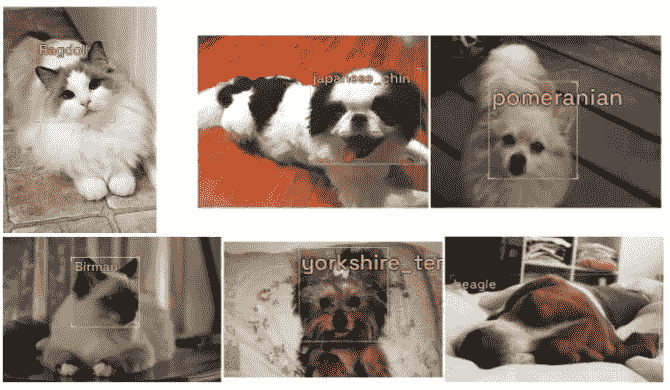

```
image_size = 384train_tfms = tfms.A.Adapter(           [*tfms.A.aug_tfms(size=image_size, presize=512),tfms.A.Normalize()])valid_tfms = tfms.A.Adapter(
           [*tfms.A.resize_and_pad(image_size), tfms.A.Normalize()])train_ds = Dataset(train_records, train_tfms)
valid_ds = Dataset(valid_records, valid_tfms)
```

**C .建模**

*C.1 .更快的基于区域的卷积神经网络(更快的 R-CNN):* 2 级检测器

```
model_type_frcnn = models.torchvision.faster_rcnn 
```

更快的 R-CNN 物体探测方法分两个主要阶段。在第一阶段，网络查看整个图像，然后生成锚框(提议框)。这些锚框具有作为/包括对象(“对象性”)相对于作为背景的相关概率。锚框的客观性使得模型能够将学习集中在局部区域。提案箱使用 CNN 生成，因此该阶段的名称为“区域提案网络”(RPN)。

第二阶段涉及分类过程(识别对象的标签)和回归过程(指定指示对象在图像中的位置的边界框)。

```
model_frcnn = model_type_frcnn.model( 
                      num_classes=len(parser.class_map))
train_dl_frcnn = model_type_frcnn.train_dl(train_ds, 
                      batch_size=16, num_workers=4, shuffle=True)
valid_dl_frcnn = model_type_frcnn.valid_dl(valid_ds, 
                      batch_size=16, num_workers=4, shuffle=False)metrics = [COCOMetric(metric_type=COCOMetricType.bbox)]
```

有关数据加载器和指标的详细信息，请参考[步骤 D2–3，此处为](/@yrodriguezmd/object-detection-using-a-deep-neural-network-213ec8ac2da8)。

```
learn_frcnn = model_type_frcnn.fastai.learner(
                 dls=[train_dl_frcnn, valid_dl_frcnn], 
                 model=model_frcnn, metrics=metrics)
```

[学习器](https://docs.fast.ai/learner.html#Learner)有助于训练模型、数据和度量的协调。

```
learn_frcnn.[lr_find()](https://docs.fast.ai/callback.schedule.html#Learner.lr_find)
```

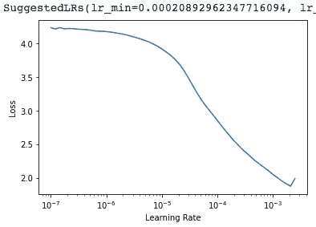

建议的 lr_min 对应于绝对最小值之前的一个数量级。这被认为是一个好建议，将被采用。

```
learn_frcnn.[fine_tune](/@yrodriguezmd/developing-a-taste-for-deep-learning-241cabb43277)(10, 0.00021, freeze_epochs=1) import matplotlib.pyplot as pltdef plot_metrics(learn, title, x, y):
  plt.plot(L(learn.recorder.values).itemgot())
  plt.xlabel('epoch')
  plt.ylabel('mAP (green), Loss (blue, orange)')
  plt.title(title)
  plt.text(x, y, 
         'Legend: mAP(green), train_loss(blue), valid_loss(orange');plot_metrics(learn_frcnn, 
       'Mean Average Precision and Losses for Faster_rcnn', 0,-0.05)
```

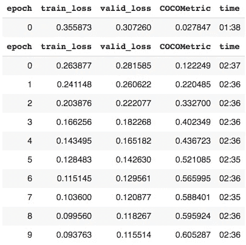

在学习率为 2.1e-4 的情况下，更快的 R-CNN 模型在 10 个时期的训练后达到了 0.605 的平均精度。验证损失显示出平稳的逐步改善。

*C.2\. YOLOv5* : 1 级检测器

```
model_type_yolo = models.ultralytics.yolov5 
backbone_yolo = model_type_yolo.backbones.small 
model_yolo = model_type_yolo.model(
                      backbone = backbone_yolo(pretrained=True), 
                      num_classes=len(parser.class_map),
                      img_size = image_size)
```

“你只看一次”( [YOLO](https://blog.roboflow.com/yolov5-improvements-and-evaluation/) )是一个在单一阶段执行检测的家族。该模型不使用 rpn。相反，它将图像分成网格框，每个网格框负责检测其边界内的对象。对于 bboxes 和类概率，信息被处理为一个[回归问题](https://arxiv.org/abs/1506.02640)。它保留空间关系，并能够编码和识别上下文信息。

可用的主干配置之一是“小型”，即 [YOLOv5s](https://github.com/ultralytics/yolov5/wiki/Train-Custom-Data) 。体积小，具有处理速度快的优点。

```
train_dl_yolo = model_type_yolo.train_dl(train_ds, 
                      batch_size=16, num_workers=4, shuffle=True)
valid_dl_yolo = model_type_yolo.valid_dl(valid_ds, 
                      batch_size=16, num_workers=4, shuffle=False)

learn_yolo = model_type_yolo.fastai.learner(
                          dls=[train_dl_yolo, valid_dl_yolo], 
                          model=model_yolo, metrics=metrics)
learn_yolo.lr_find()
```

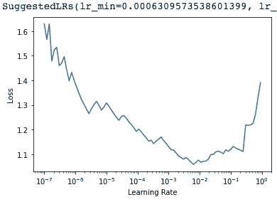

```
learn_yolo.fine_tune(10, 0.00063, freeze_epochs=1) plot_metrics(learn_yolo, 
           'Mean Average Precision and Losses for YOLOv5', 0,-0.12)
```

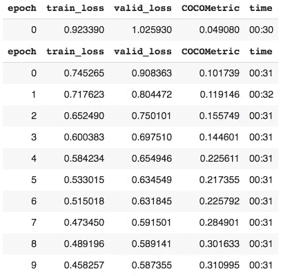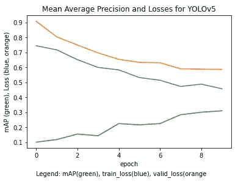

YOLOv5 在 10 个周期后达到 0.311 的 mAP，学习率为 6.3e-4。处理每个时期的时间(00:31)比更快的 R-CNN 处理时间(02:36)要快。

*C.3\. RetinaNet* : 1 级，快速准确

```
model_type_ret = models.mmdet.retinanet backbone_r50 = model_type_ret.backbones.resnet50_fpn_1x(pretrained=True)model_ret = model_type_ret.model(backbone=backbone_r50(pretrained=True), 
                      num_classes=len(parser.class_map))
```

[RetinaNet](https://arxiv.org/abs/1708.02002) 是一个 1 级检测器，有两个子网络用于分类和回归。它使用焦点损失来解决前景和背景之间的不平衡。简单的例子(如背景)权重较低。这使得模型能够将训练集中在较难的例子上。

RetinaNet 主干网配置之一是 resnet_50_fpn。在 [Resnet](https://pytorch.org/vision/0.8/_modules/torchvision/models/resnet.html) 设计中，身份函数的间歇同化使网络能够更深入，从而增加学习能力。

[特征金字塔网络](https://arxiv.org/abs/1612.03144) (FPN)设计连接架构中的不同阶段，使其能够检测不同比例的对象。

这些变化使得 RetinaNet/ Resnet_50/ FPN 组合模型既准确又快速。

```
train_dl_ret = model_type_ret.train_dl(
             train_ds, batch_size=16, num_workers=4, shuffle=True)
valid_dl_ret = model_type_ret.valid_dl(
             valid_ds, batch_size=16, num_workers=4, shuffle=False)learn_ret = model_type_ret.fastai.learner(
             dls=[train_dl_ret, valid_dl_ret], 
             model=model_ret, metrics=metrics)
learn_ret.lr_find()
```

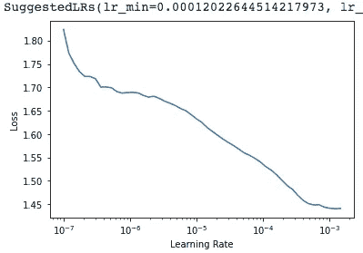

```
learn_ret.fine_tune(10, 0.00012, freeze_epochs=1) plot_metrics(learn_ret, 
'Mean Average Precision and Losses for Retinanet/Resnet50', 0, 0.01)
```

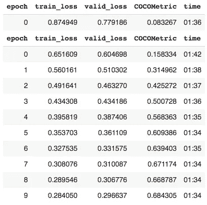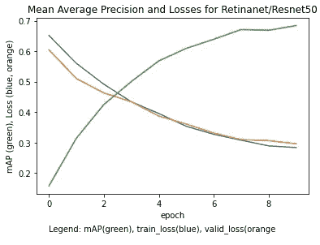

RetinaNet 模型在 lr 1.2e-4 下 10 个时期后达到 0.684 的 mAP。有效损失呈持续下降趋势。01:34 的时间介于“慢”快 R-CNN (02:36)和快 YOLOv5 (00:31)之间。

*C.4\. EfficientDet:* 1 级，可扩展

```
model_type_eff = models.ross.efficientdet 
backbone_eff = model_type_eff.backbones.tf_lite0model_eff = model_type_eff.model(
                      backbone = backbone_eff(pretrained=True), 
                      num_classes=len(parser.class_map),
                      img_size = image_size)
```

[EfficientDet](https://arxiv.org/abs/1911.09070) 主要是一个 1 阶段设计模型。它使用多个双向 fpn 来优化深度、宽度和分辨率特性的可扩展性。

它的配置之一是 [tf_lite0](https://github.com/yrodriguezmd/icevision/blob/master/icevision/models/ross/efficientdet/backbones.py) ，从 [tf_efficientdet_lite0](https://github.com/rwightman/efficientdet-pytorch) 派生而来，反过来又从 [efficientnet/lite0](https://tfhub.dev/tensorflow/lite-model/efficientnet/lite0/fp32/2) 派生而来。这些配置是为移动应用设计的。

```
train_dl_eff = model_type_eff.train_dl(train_ds,
                      batch_size=16, num_workers=4, shuffle=True)
valid_dl_eff = model_type_eff.valid_dl(valid_ds, 
                      batch_size=16, num_workers=4, shuffle=False)

learn_eff = model_type_eff.fastai.learner(
                      dls=[train_dl_eff, valid_dl_eff], 
                      model=model_eff, metrics=metrics)
learn_eff.lr_find()
```

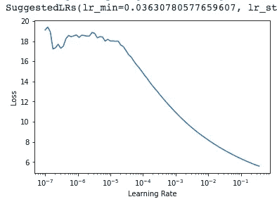

与之前学习率在 e-4 范围内的模型相比，efficientdet 的建议 LR 在 e-2 处高出 2 个数量级。

```
learn_eff.fine_tune(10, 0.036, freeze_epochs=1) plot_metrics(learn_eff, 
      'Mean Average Precision and Losses for EfficientDet',0,-0.9)
```

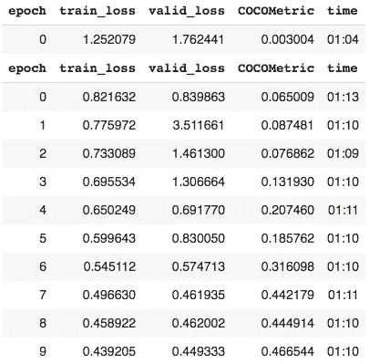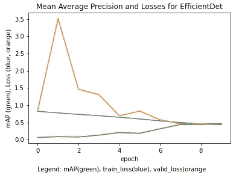

EfficientDet/ TF-Lite0 模型以 3.6e-2 的学习速率在 10 个时期后达到 0.467 的 mAP。valid_loss 在早期出现突然增加，然后逐渐下降。1:10 的时间比 RetinaNet 的 1:34 稍快。

**D .最终建模**

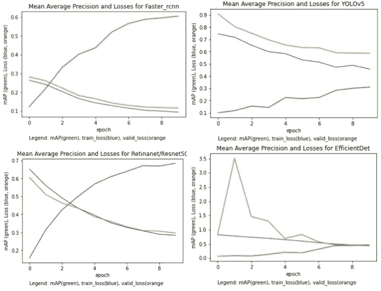

* Note: y-axes NOT to-scale

在这四个模型中，FPN retina net/resnet 50 提供了最好的地图和损失趋势。下一个最佳映射性能来自更快的 R-CNN，其次是 EfficientDet/TF_Lite0。YOLOv5 在这一盘表现不佳。

从最快到最慢的速度(在恒定的 n_epoch 和基于建议的 lr_min 变化的 LR)如下:YOLOv5，EfficientDet，RetinaNet，更快的 R-CNN。

可以观察到，稳定期开始于时期 8。

因此，对于最终的模型，我们将选择 RetinaNet(好图，中速)，保留建议的 LR，并将训练持续时间减少到 8 个历元。

```
model_type = models.mmdet.retinanet backbone = model_type.backbones.resnet50_fpn_1x(pretrained=True)model = model_type.model(
                      backbone=backbone(pretrained=True), 
                      num_classes=len(parser.class_map))train_dl = model_type.train_dl(train_ds, 
                     batch_size=16, num_workers=4, shuffle=True)
valid_dl = model_type.valid_dl(valid_ds, 
                     batch_size=16, num_workers=4, shuffle=False)learn = model_type.fastai.learner(
            dls=[train_dl, valid_dl], model=model, metrics=metrics)learn.fine_tune(8, 0.00012, freeze_epochs=1) 
```

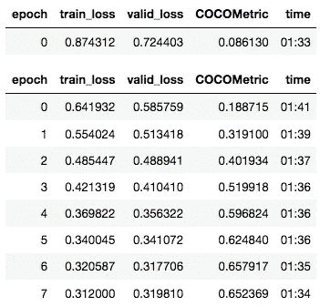

使用 n_epochs =8，在每个 epoch 的 01:34 训练时间获得的 mAP 是 0.652。对于检测猫和狗的品种来说，这是一个合理的模型。

**E .推论**

我们将通过使用不属于数据集的狗图像来测试该模型。

```
!pip install bing-image-downloader
from bing_image_downloader import downloader
query_string = 'wiki samoyed' #
samo = downloader.download(query_string, limit = 3, 
                            output_dir = 'dataset',
                            adult_filter_off=True,
                            force_replace=False,
                            timeout=60,
                            verbose=True)
samo
```

我们将使用上面代码中的一个 url 输出。

```
url = ['[https://upload.wikimedia.org/wikipedia/commons/c/c4/Samoyed-sweetjedysamoyeds.jpg'](https://upload.wikimedia.org/wikipedia/commons/c/c4/Samoyed-sweetjedysamoyeds.jpg')]
dest = 'Desktop'
download_url(url[0],dest) from PIL import Imageimage = Image.open(dest)
#image.to_thumb(128)img = np.array(image)infer_tfms = tfms.A.Adapter(
          [*tfms.A.resize_and_pad(size=384), tfms.A.Normalize()])infer = Dataset.from_images(
          [img], infer_tfms, class_map=class_map )preds = model_type.predict(model, infer, keep_images=True)show_preds(preds=preds, font_size=25, label_color = '#3050ff')
```

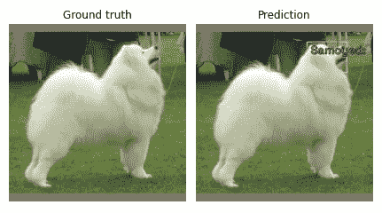

RetinaNet/Resnet50/ FPN 模型能够预测狗的分类(基于我们的字符串查询的“真相”)，以及它在图像中的位置。

***总结:***

不同的模式有不同的特点和优势。对于宠物数据集，以宠物识别和定位为目标，RetinaNet/Resnet_50/FPN 在合理的时间内提供了最佳的检测性能。

***未来打法:***

评估模型在其他数据集上的性能。

我希望你喜欢和我一起走代码！:)

玛利亚

此小型项目的 Github 资源库:[https://github . com/yrodriguezmd/ice vision _ mini projects/blob/main/IV _ OD _ faster rcnn % 2C _ yolo 5% 2C _ retina net % 2C _ eff det _ 2021 _ 8 _ 23 . ipynb](https://github.com/yrodriguezmd/IceVision_miniprojects/blob/main/IV_OD_fasterrcnn%2C_yolo5%2C_retinanet%2C_effdet_2021_8_23.ipynb)

领英:【https://www.linkedin.com/in/rodriguez-maria/ 

推特:【https://twitter.com/Maria_Rod_Data 


* Image courtesy of Unsplash/ Alvan Nee