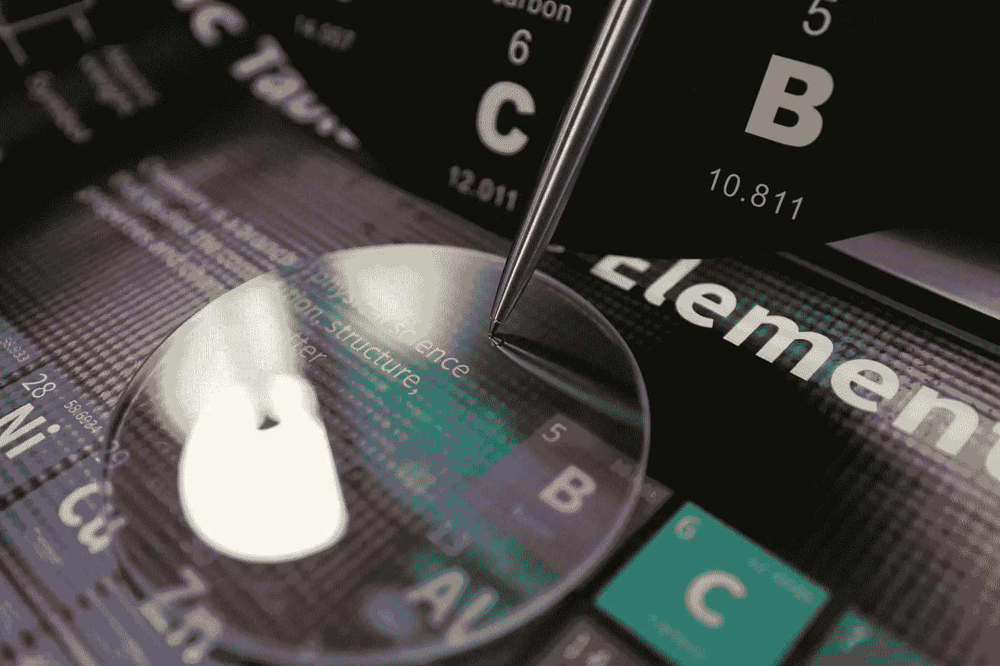
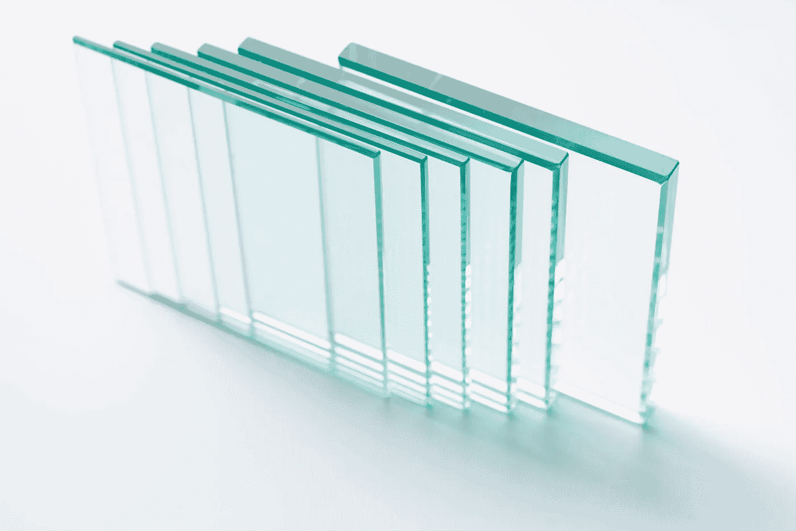
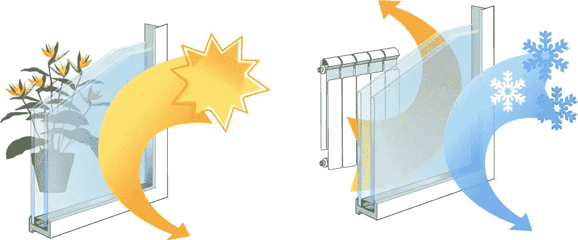
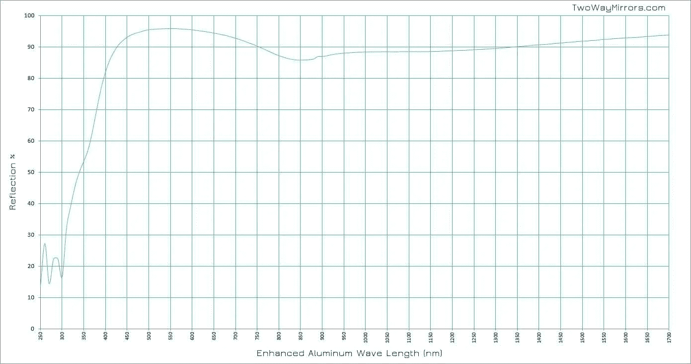
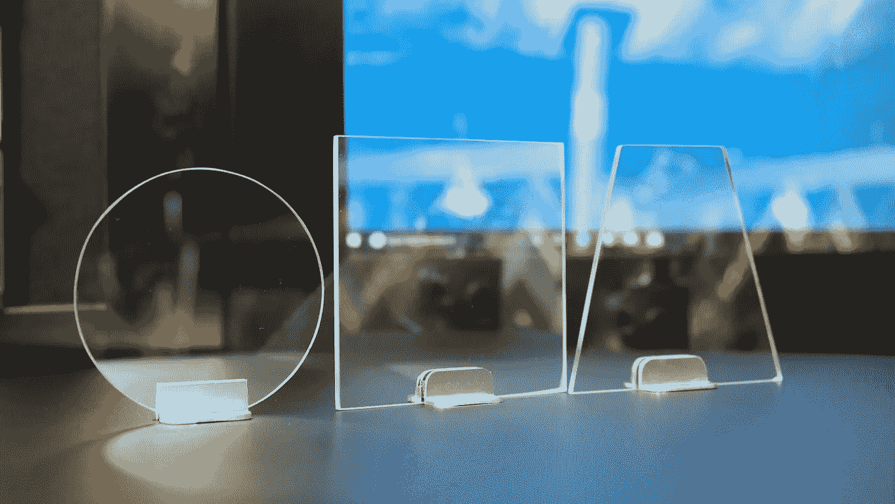

# 玻璃的不同特性

> 原文：<https://medium.com/geekculture/different-properties-of-glass-4b54190708f8?source=collection_archive---------8----------------------->

## 为您的项目提供 5 种不同的玻璃特性

玻璃有许多技术和物理特性。以下信息将讨论玻璃的热学、光学、化学、电学和机械性能。当你开始下一个项目时，了解玻璃的不同特性会很有效。

玻璃的五个主要特性:

*   热的
*   视觉的
*   化学的
*   与电有关的
*   机械的

# 热性质

为什么了解玻璃的温度很重要？当玻璃中的温度急剧变化时，玻璃很容易破碎和粉碎。此外，在制造玻璃时，温度也是一个重要因素。

热性能也被用来强化玻璃。例如，你可以通过热钢化来强化玻璃。

如果玻璃中的温度不均匀，它将具有不同水平的内部压力。这使得玻璃容易发生**碎裂**和**破碎**。这也被称为抗热震性。该应用显示了当温度变化时玻璃破碎的可能性。

## 应用:

哪些项目将受益于由热性能制成的玻璃？比你想象的要多。

温度较高的项目应考虑到这一点。例如，当安装或创建使用石英卤素灯泡的照明设备时，可以使用这种玻璃作为玻璃透镜。灯泡在高温下工作，因此散发出大量的热量。

玻璃制造商利用这一点来确保客户获得耐用、坚固的玻璃。强类的例子可以用于:桌子、橱柜、窗户等等。热性质创造了产生钢化玻璃的临界温度。

钢化玻璃对于安全和经常移动玻璃或在其上放置物品的项目至关重要。桌子、透明地板和装置上都有钢化玻璃。

玻璃的颜色也受到热性质的影响。红色和黄色等颜色是由加热过程产生的，在加热过程中，玻璃被重新加热，然后冷却。

玻璃(受热时)的膨胀量与其 CTE(热膨胀系数)成正比。

**CTE =热膨胀系数。**

CTE 用于安装的玻璃和材料的膨胀水平。

材料和玻璃必须具有匹配的热膨胀系数。如果材料和玻璃不匹配，这可能会导致玻璃破裂。

当你在研究玻璃时，制造商会说明你需要的信息。他们会列出最高温度和抗热震性。

## 抗热冲辉

抗热震性:玻璃能够承受并保持稳定的温度变化。

需要高抗热震性的玻璃的一个例子是温度会变化的玻璃。这意味着玻璃在白天变热，在晚上变冷/下雪。

# 光学特性

为了确定光穿过玻璃的速度，我们使用折射率。折射率意味着光穿过玻璃的速度较低。

光是一种电磁波。当光与玻璃相互作用时，工程师能够决定所使用的玻璃是否适合特定的应用。

根据[偶氮光学](https://www.azooptics.com/Article.aspx?ArticleID=1653)，

> *“玻璃的折射率是一个非常关键的概念，因为它不仅决定了多少光被反射和透射，还决定了它在玻璃中的折射角。折射率决定了光的入射角和透射率之间的差异，折射率越高，差异越大。”*

为了确定光是如何转化为热的，我们将使用吸收特性。

吸收是指颜色在物体或材料中的位置。它基于物理属性。例如反射、光吸收或发射光谱。

有趣的事实:这就是为什么有色眼镜在阳光下更好！它们吸收更多的光。它们通常还会阻挡大部分穿过眼镜的紫外线，因此它是保护眼睛免受有害阳光伤害的理想选择。

当镜面涂层应用到玻璃上时，你也可以测量不同范围的光的反射。

例如，[第一面镜](https://www.twowaymirrors.com/first-surface-mirror/)产品具有增强的铝镜面涂层，当测量反射百分比时。从 0 纳米到 1，700 纳米测试反射百分比。

在为专业设备订购玻璃和镜子时，这是一件大事。增强型铝具有超高的反射率。增强的铝具有 400 纳米——1700 纳米的反射。但是要知道从 250 纳米——350 纳米来说并不伟大。

这个范围也被称为紫外光谱。你需要一面光学平面镜，在相应的范围内具有高反射率。那么你会想要紫外线增强玻璃第一表面镜代替。

# 化学性质

当玻璃经历化学反应或化学变化时，它就具有化学性质。这是实际材料结构发生变化的时候。

有成千上万种化学成分可以用来制造玻璃。利用化学性质可以影响玻璃的电、机械、化学、热和光学性质。

玻璃有哪些特性？

大多数玻璃含有下列元素:助熔剂、形成剂和稳定剂。

根据[康宁玻璃博物馆](https://www.cmog.org/article/chemistry-glass#:~:text=There%20is%20no%20single%20chemical,in%20the%20form%20of%20sand.)，

> *“前者在待熔化的混合物中所占的比例最大。在典型的钠钙硅玻璃中，前者是砂状的二氧化硅。焊剂降低了前者熔化的温度。苏打(碳酸钠)和碳酸钾(碳酸钾)都是碱，是常见的熔剂。钾碱玻璃比苏打玻璃密度稍大。稳定剂使玻璃坚固和防水。碳酸钙，通常称为煅烧石灰石，是一种稳定剂。没有稳定剂，水和湿气会侵蚀并溶解玻璃。”*

玻璃经过化学处理后，更能抵抗水、酸、湿气和碱的影响。如果使用二氧化硅或其他地球氧化物，它们更耐腐蚀。

你现在身上甚至可能有一些化学强化玻璃！化学强化玻璃用于智能手机、平板电脑和大猩猩玻璃应用的触摸屏。

# 电特性

对于激光器、太阳能转换器和半导体等材料，玻璃的电特性通常是导电的。还有，电子设备。

在研究玻璃的电学性质时，有几个因素需要考虑。不同类型的玻璃可以具有不同的电阻率。比如成分的变化。各种因素都会影响玻璃的电性能，如交流电导率和 DC 电导率。还有介电常数、电模量和介电损耗。

处理电导率时，温度很重要。当与玻璃组成相关时，活化能增加。温度随金属的电阻率而升高，随半导体的电阻率而降低。

在不同的材料中，电流是不同的，这就是为什么在制作玻璃时会有各种各样的变体。

要测量玻璃能稳定储存的电能，你需要确定玻璃的介电常数。

这是通过收集电容器和作为电介质的玻璃中存储能量的比率来实现的。然后你会想把它和用空气作为冷凝器储存的能量进行比较。这是用于电气和电子设备。

由于透明玻璃传导电流的能力很小，所以它是电气设备的绝佳绝缘体。

例如，我们出售分光镜。它上面有一层半透明的涂层。现在，大多数人想知道镜子涂层中是否有金属，因为他们担心电子干扰。

在大多数应用中，涂层中的金属不会引起任何问题。只要设备能够根据玻璃的电导率调整其公差，最终设备将正常工作。

# 机械性能

机械性能用于硬度、强度、抗冲击性和耐磨性。为您的应用选择正确的材料时，机械性能和化学性能密切相关。

玻璃的耐冲击性用于承受和保持连续的应力和冲击，这是施加在材料上的较大的力。当材料坚固但不坚硬时，冲击可能会刮伤或擦伤材料，但不会使其断裂。

或者，可能发生相反的情况。如果材料很硬，但不够坚固或坚韧，它可能会在内部破裂，但不会伤害玻璃的表面。

对于周围环境恶劣的设备，需要考虑机械性能。例如:机场跑道上的跑道灯装置经常被石头和鹅卵石砸到。

总的来说，在为你的项目选择材料时，考虑玻璃的所有特性是很重要的。

*twowaymirrors.com 的原帖*