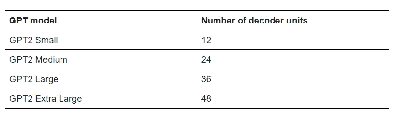
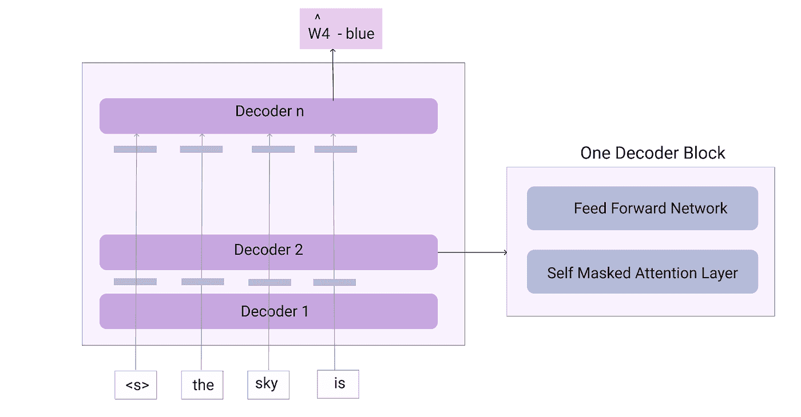
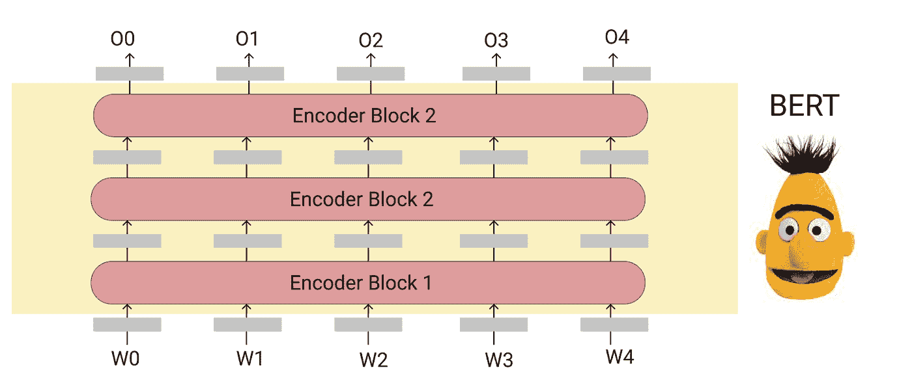
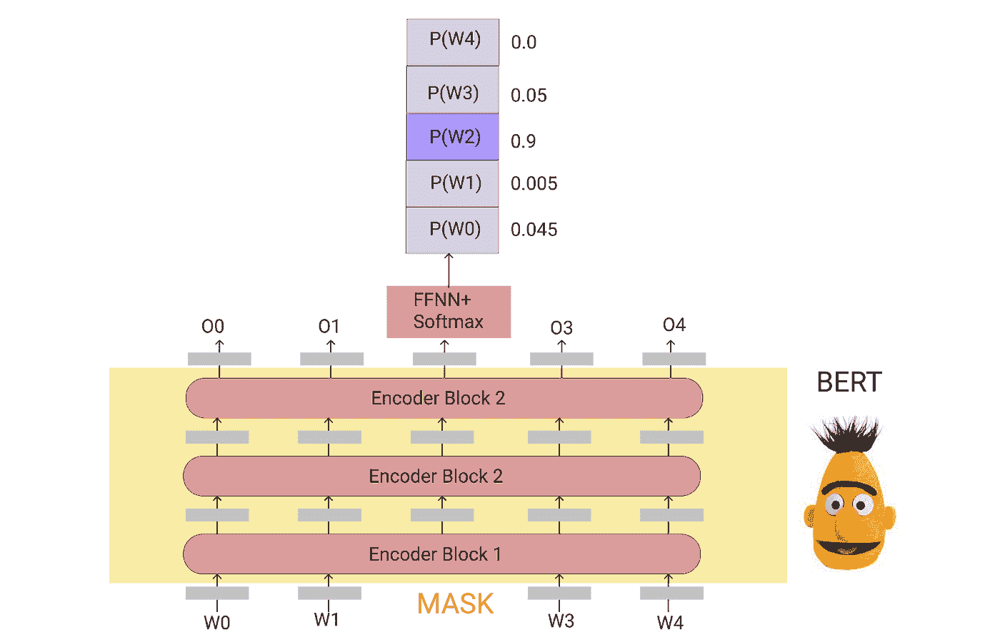
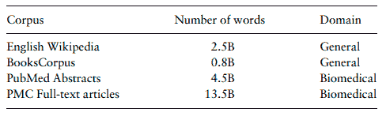
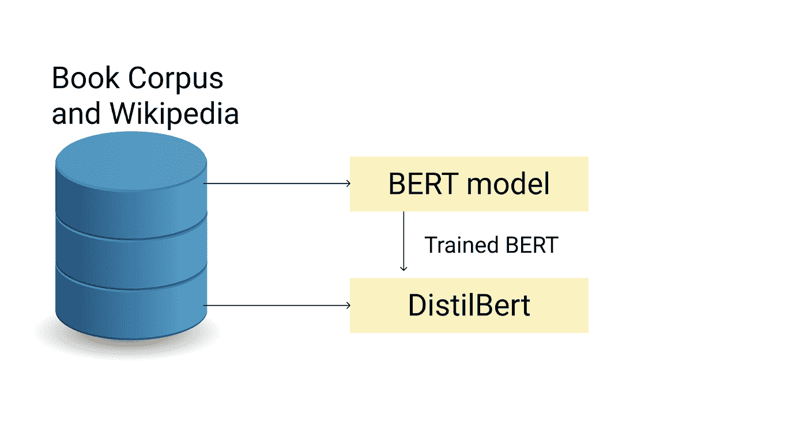
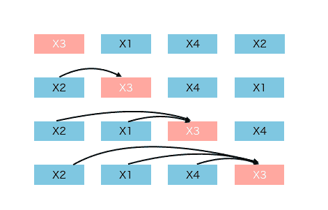

# 不同的变压器型号

> 原文：<https://medium.com/geekculture/different-transformer-models-f6f405999e4a?source=collection_archive---------5----------------------->

# 介绍

Transformer 模型在 NLP 领域实现了一个重要的里程碑。不仅在 NLP 领域，而且在计算机视觉领域，我们可以看到 Transformer 模型优于所有所谓的最先进的模型。变压器也被证明可以改善长期依赖性，并可用于利用称为迁移学习的技术，这在我们的数据量较少时非常有用。

如果你喜欢阅读更多关于变形金刚的内容，请参考我之前的博客。

 [## 变形金刚(电影名)

### Transformer 模型已经成为大多数 NLP 任务中的首选模型。许多基于变压器的模型，如伯特…

medium.com](/geekculture/transformers-231c4a430746) 

今天有如此多的模型可用，其灵感来自变压器架构。在这篇博客中，我们将讨论一些流行的基于变压器的模型。我们将看到每个模型的架构、组件、工作和培训过程。

# 通用终端

GPT 代表生成预训练变压器。

如果您记得变压器的架构，您可能知道变压器由编码器堆栈和解码器堆栈组成。GPT 本质上是变压器中的解码器堆栈。变压器中的解码器堆栈负责预测输出序列的下一个字。给定前面的单词，解码器被训练来预测序列中的当前单词。前一阶段输入与当前预测的单词一起形成用于预测下一个单词的输入。这种模型被称为自回归模型。因此，我们可以将 GPT 模型理解为一个*下一个单词预测*模型，它可以用于句子完成、自然语言生成等等。

## 体系结构

GPT 模型的架构将如下图所示。

根据解码器堆栈的数量，GPT 有不同的变体。

GPT 的主要目的是逐个符号地生成序列。输入单词通过嵌入层传递，嵌入层将把标记转换成嵌入或向量。这些向量进一步使用位置编码进行编码。位置编码是一种捕获序列中单词顺序的方法，是由 Transformer 架构本身引入的。然后，这些向量通过解码器堆栈中的第一层。一个解码器堆栈的输出作为输入传递到下一个单元，直到最后一级。来自最后一个解码器堆栈的输出将是一个概率分布，它指示词汇表中的每个单词成为序列中的下一个单词的概率。概率最高的单词将被认为是下一个单词。在每个时间戳，模型将使用所有前面的单词来生成下一个单词。这个过程将一直持续到序列结束。

GPT 模型使用一种叫做掩蔽自我注意的概念来训练下一个单词的预测。掩蔽自我注意是一种我们在预测当前单词时掩蔽当前标记和未来标记的方法。因此，在预测第 n 个单词时，我们将考虑所有之前的单词，直到时间戳 n-1，并屏蔽所有未来的单词。通过这种方式，模型将通过从过去的上下文中学习来预测任何单词。

## 培养

*   利用图书语料库数据对 GPT1 模型进行训练
*   使用大约 40 GB 的网络文本数据来训练 GPT 2 模型。这些文本数据是由研究人员从互联网上抓取的，它包含了大约 800 万个文档
*   GPT 3 是在混合语料库上训练的。总共有五个数据集，包括通用抓取、网络文本 2、图书 1、图书 2 和维基百科

# 伯特

BERT 代表来自变压器的双向编码器表示。

转换器模型由两部分组成—编码器堆栈(多个编码器单元)和解码器堆栈(多个解码器单元)。我们已经看到，GPT 模型不过是变压器的解码器堆栈。解码器堆栈主要用于预测句子中的未来单词，而编码器堆栈用于获得句子的有意义的编码表示，以便解码器单元可以更好地理解它。我们有没有办法也利用编码器堆栈？答案是肯定的。这就是伯特模型所做的。BERT 是一种语言模型，它可以通过考虑单词的语义和上下文来生成嵌入。

## 伯特建筑

如前所述，BERT 只不过是转换器的编码器堆栈

对 BERT 模型的输入将是被编码的单词(一位热编码或任何其他编码形式),并且来自 BERT 模型的输出将是固定维度的嵌入。在上图中，O0 是对应于第一个单词的嵌入，O2 是第二个单词的嵌入，依此类推。然后，这些嵌入可以用于任何下游任务，如句子分类、NER、相似性检查等等。BERT 模型的内部看起来像这样。

## 培养

BERT 模型的训练分两步完成

1.  屏蔽字预测
2.  下一句预测

屏蔽词预测是通过随机屏蔽每个输入句子中的一些标记或词来完成的。该模型被训练来预测被屏蔽的单词。这一步最好的地方在于，它不需要任何标记数据，并且是完全自我监督的。我们训练所需要的只是一些文本数据，屏蔽语言模型将在此基础上进行训练，优化其权重。在训练结束时，模型将能够理解对其进行训练的语言，并且训练的模型可以用于各种下游任务。

下一句预测用于理解两个句子之间是否有任何关系。该模型被训练来预测特定的句子是否跟随另一个句子。对于这个任务，我们将给出两个句子，用一个[SEP]标记分开。现在，将来自模型的第一输出 O0 给予分类器模型，以预测“*第二句跟随第一句吗？”。*

*第一个输入令牌总是一个特殊的分类【CLS】令牌。因此，对应于该令牌的最终状态被用作分类任务的聚集序列表示，并被用于下一句预测，其中它被馈送到预测标签“是下一个”或“不是下一个”的概率的 FFNN + SoftMax 层。*

BERT 是最先进的语言模型之一，可用于各种下游 NLP 任务。然而，由于该模型是基于非常通用的数据训练的，因此该模型可能不是特定于领域的任务的非常好的选择。有各种各样的模型受 BERT 的启发，并针对特定领域的数据进行了训练。医疗领域是广泛使用 BERT 模型的一个领域。有各种基于 BERT 的医学数据预处理模型，并广泛应用于各种下游任务，如 NER、关系提取等。研究还发现了更强大、更快速、更轻便的 BERT 版本。

# 比奥伯特

Biobert 是首个针对特定领域的模型，针对医疗领域进行了预先训练。该模型使用 PubMed 摘要和 PubMed central 全文文章在大规模医疗数据上进行训练。为了训练生物伯特模型，研究人员使用通用域伯特模型作为基础模型，并优化其权重，然后该模型再次根据医疗数据进行微调。这种类型的培训被称为混合领域方法。由于模型已经用最优的一般域权重初始化，预训练的成本更少。用于训练 BioBert 模型的语料库如下所示。

Image is taken from the original paper

该模型在医学数据的 NER、RE 和 QA 等下游任务中取得了很好的效果。

# 西伯特

Sci-Bert 是另一个特定领域的模型，经过预先训练，可以在 NLP 中执行科学任务。与 BioBert 类似，该模型也利用了 Transformer 模型的无监督训练策略，以解决高质量标记数据的短缺问题。该模型在语义学者的 114 万篇科学论文上进行训练。该数据是混合领域数据，其中 18%的论文来自计算机科学领域，82%来自生物医学领域。该语料库包含大约 30 亿个类似于 BERT 模型的单词。该模型在下游任务中进行评估，如 NER、PICO 抽取、句子分类、关系分类、依存句法分析等。

# 考研伯特

PubMed BERT 是另一个基于特定领域 BERT 的模型，基于生物医学数据进行训练。这个模型是由微软研究院在 2020 年开发的。与上面两个遵循混合领域训练的模型不同，PubMed 模型是在生物医学数据上从头开始训练的。这篇论文说，使用领域外文本(在这种情况下是维基百科和书籍语料库)进行训练是一种迁移学习，其中源数据是一般文本语料库，目标领域是医学。迁移学习是必需的，并且在目标数据较少以及源和目标数据几乎匹配时使用。在这种情况下，目标语料库非常大，并且与源数据非常不同。该论文证明了生物医学预训练不需要任何混合领域训练方法，并且可以从头开始进行。

用于训练的数据是包含大约 30 亿个单词的 PubMed 摘要。还有另一个版本的 PubMed 模型，它使用 PubMed central 上的完整文章进行训练，具有大约 168 亿个单词的训练语料库。

# 临床伯特

这是另一个基于 BERT 的模型，针对临床数据进行了预训练——通用临床文本和出院总结。根据临床数据训练两个模型

*   临床 BERT——使用在一般领域训练的 BERT 模型作为基础模型
*   临床 BioBERT——使用 BioBERT 模型作为基础模型

# 蒸馏啤酒

DistilBert 是 Bert 模型的提炼版本。这是 Bert 模型的一个更小、更快、更便宜的版本，比 BERT 基本模型少 40%的参数。该架构几乎与 Bert 模型相似，但层数减少了 1/2。DistillBert 通过动态屏蔽和删除下一句预测任务对大批量数据进行训练。该模型的性能与其他基准模型相当，并且该模型能够以更少的参数保留 BERT 基本模型 95%以上的性能。

# 罗贝尔特

Roberta 遵循稳健优化的 Bert 预训练方法。本文介绍了一些设计优化，并根据附加数据进一步训练模型。模型架构与 Bert 模型的架构相同，但有一些变化。

*   移除了下一句预测任务
*   使用来自 CC 新闻、开放网络文本和故事的附加数据进行训练
*   更大的训练批量，更大的学习率，以及更长序列的训练
*   动态改变掩蔽模式

# XLNET

BERT 是一个自动编码器语言模型，它在构造当前单词时会考虑过去和未来的单词。BERT 用于从使用“屏蔽”令牌破坏的数据中重建原始数据。然而，这种方法有一个缺点。这种类型的训练假设屏蔽的令牌是彼此独立的，并且忽略捕捉它们之间的关系(如果有的话)。

XLNET 是一个自回归语言模型。通常，自回归(AR)模型在预测下一个单词时可以考虑过去的单词或未来的单词，但它不能像 BERT 模型那样同时考虑两者。AR 回归模型的一个例子是 GPT，如上所述，它在训练过程中只在一个方向上学习。但是 XLNET 将通过让 AR 模型从双向上下文中学习来修改这个概念。XLNET 在预训练阶段引入了**置换语言建模**来实现这一点。这里，为了预测第 n 个位置的单词，我们将把该单词放在所有位置，并在目标单词之前使用其余单词的不同组合。这将从下面的例子中变得更加清楚。

假设，我们的序列长度是 4，我们想预测第三个字。

Image is taken from [XLNET](https://towardsdatascience.com/what-is-xlnet-and-why-it-outperforms-bert-8d8fce710335)

在这里，为了预测 X3，我们把这个词放在所有不同的位置。然后我们考虑所有剩余单词的组合，因此这实现了双向学习。经过训练后，一个特定的目标词将从两边学习它的上下文

# 最后的想法

在这篇博客中，我试图介绍不同变压器模型的一些基础知识。请注意，我在这里只包括了几个非常流行和广泛使用的模型。你也可以随时阅读其他型号的产品。

另外，请随时通过 [LinkedIn](https://www.linkedin.com/in/vinitha-v-n-5a0560179/) 或 [Twitter](https://twitter.com/Vinitha_vn) 联系我