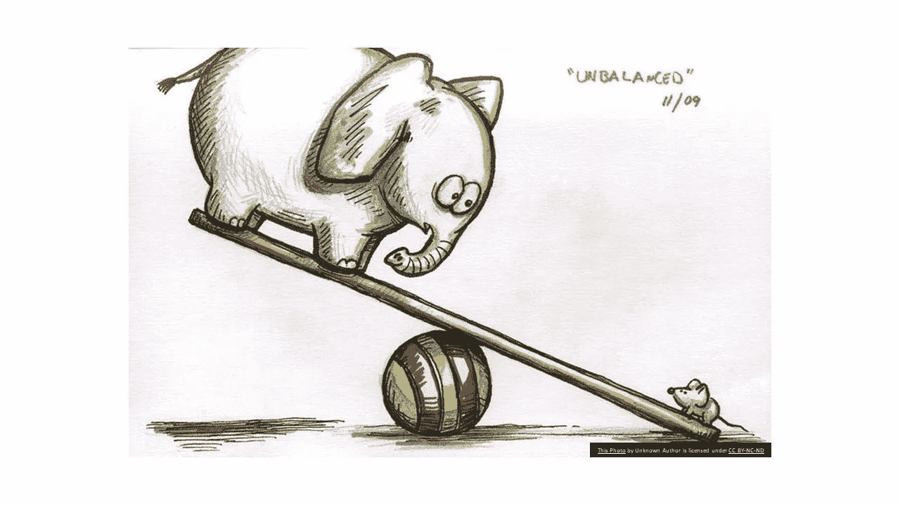
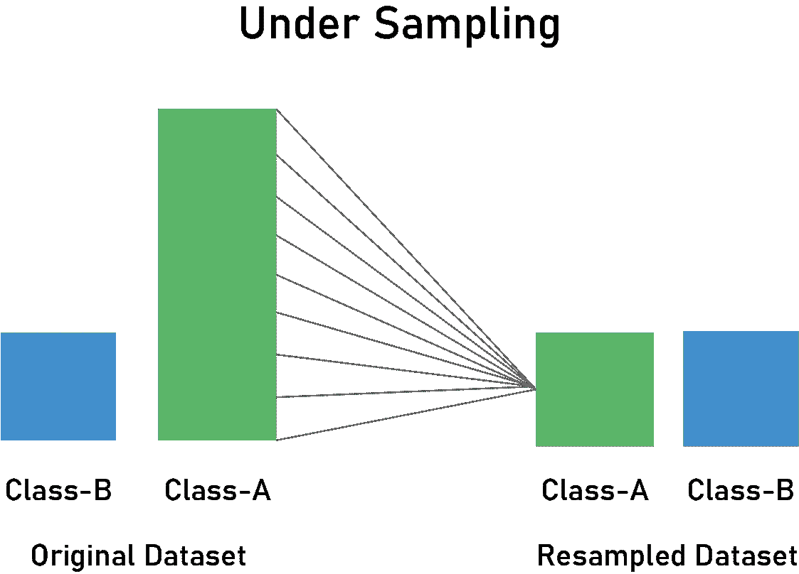
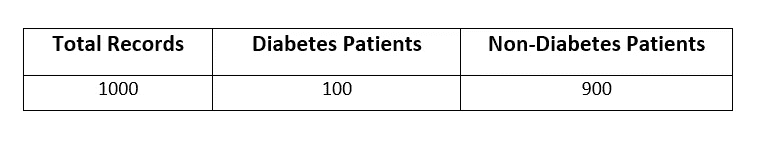
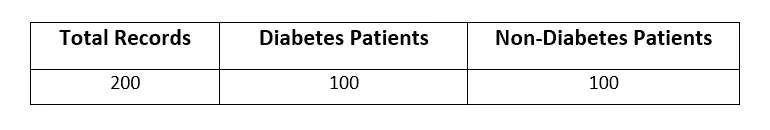
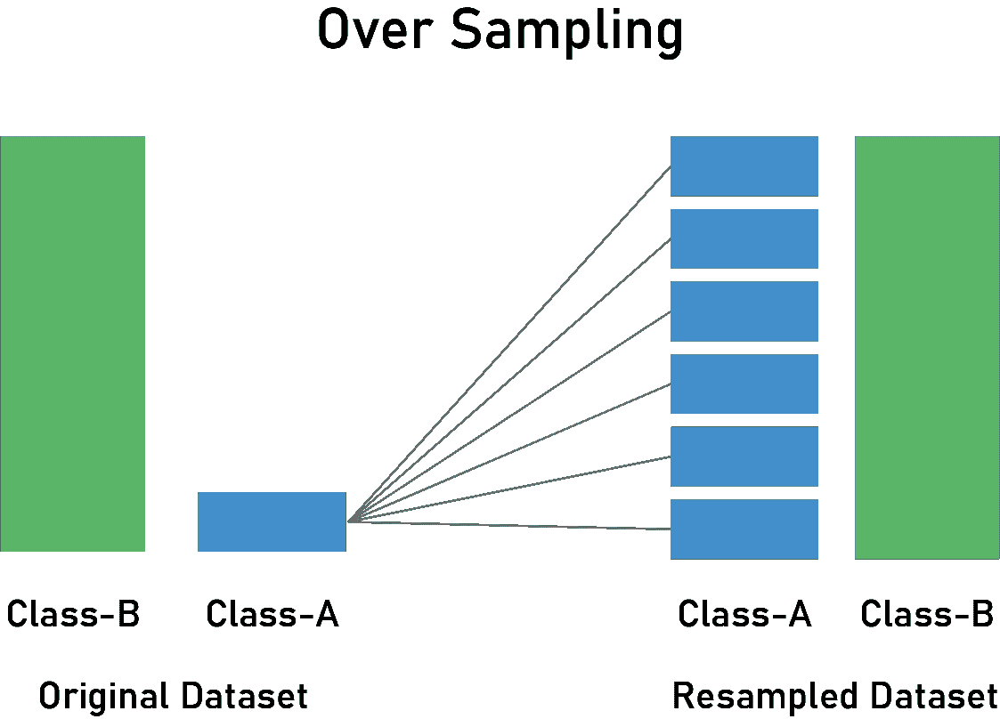
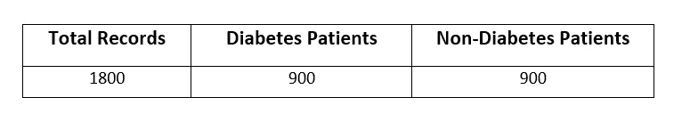

# 机器学习中处理不平衡数据集的不同方法

> 原文：<https://medium.com/geekculture/different-ways-to-handl-imbalanced-dataset-in-machine-learning-32c7bc350257?source=collection_archive---------9----------------------->



the picture was taken From the [link](https://malecodependence.com/2013/01/31/one-sided-relationships-part-2/)

在本文中，我们将了解什么是不平衡数据集以及如何处理它。

首先，我们将了解什么是不平衡数据集。

假设我们有一个糖尿病数据集，我们必须预测病人是否患有糖尿病。在这种情况下，我们的结果将是“是”或“否”。由于这是一个分类机器学习问题，我们将在数据集的目标或从属特征中看到两个类别“糖尿病”和“非糖尿病”。

假设我们有 1000 名患者的数据集，其中 900 名患者是健康的，没有糖尿病，100 名患者患有糖尿病。这里可以清楚地看到，多数群体(即没有糖尿病的患者)比少数群体(即糖尿病患者)多 9 倍。这样一种类型的数据集，其中一个类比另一个类占多数，称为**不平衡数据集。**

最常见的不平衡数据集的例子是，

1.  信用卡欺诈检测
2.  垃圾邮件
3.  医疗保健数据集

*   糖尿病数据集
*   心脏病数据集
*   癌症数据集
*   肝病数据集
*   乳腺癌数据集
*   中风预测数据集
*   慢性肾脏疾病数据集

还有更多…

当我们有一个不平衡的数据集时，如果我们在不平衡的数据上建立一个机器学习模型，那么很有可能会得到错误的分类，即不正确的分类。机器学习模型会有偏差，并给出不准确的结果。

现在让我们看看如何处理不平衡的数据集。

R**e 抽样**是处理不平衡数据集最流行的技术之一。重采样的主要目的是通过增加少数类的频率或减少多数类的频率来平衡数据集。

让我们看看一些重采样技术，

1.  **欠采样**

欠采样用于通过随机消除多数类来减少多数类。这样做，直到多数类实例和少数类实例达到平衡。



the picture was taken From the [link](https://heartbeat.fritz.ai/resampling-to-properly-handle-imbalanced-datasets-in-machine-learning-64d82c16ceaa)

让我们看看之前糖尿病患者的例子:



Original Dataset

为欠采样导入库 **NearMiss** ，然后拟合独立特征 X 和从属特征 y。

```
from imblearn.under_sampling import NearMissnm = NearMiss()X_us, y_us = nm.fit_resample(X,y)
```

在欠采样之后，我们会得到，



After Under Sampling

欠采样的主要缺点是，我们丢失了数据的信息。当我们有数百万条记录时，我们可以使用欠采样。

**2。过采样**

过采样用于通过随机复制它们来增加少数类。



the picture was taken From the [link](https://heartbeat.fritz.ai/resampling-to-properly-handle-imbalanced-datasets-in-machine-learning-64d82c16ceaa)

让我们再来看看之前糖尿病患者的例子:


Original Dataset

导入库 **RandomOverSampler** 进行过采样，然后拟合独立特征 X 和从属特征 y。

```
from imblearn.over_sampling import RandomOverSamplerros = RandomOverSampler()X_os, y_os = ros.fit_resample(X,y)
```

过采样后，我们会得到



After Over sampling

过采样的主要缺点是，它会导致**过拟合**机器学习模型，因为我们正在随机复制少数类的记录。

**3。重击**

**SMOTE** 是一种过采样技术，为少数类生成样本。这些不是现有少数民族类数据的复制品或复制。它为少数民族创造了新的点数。


Original Dataset

应用 SMOTE，

```
from imblearn.over_sampling import SMOTEsmote = SMOTE()X_smote, y_smote = smote.fit_resample(X,y)
```

击杀之后，我们会得到


**4。smetomek**

SMOTETomek 是使用 SMOTE 和 Tomek 链接的过采样和欠采样的组合。

```
from imblearn.combine import SMOTETomeksmotetomek = SMOTETomek()X_smotetomek, y_smotetomek = smotetomek.fit_resample(X,y)
```

## **资源**

有许多资源可以处理我们不平衡的数据集。这里有一些可以帮助你，

*   [不平衡学习的官方文档](https://imbalanced-learn.org/stable/references/index.html)

## 结论

在本文中，我们看到了什么是不平衡数据集和不同的重采样技术，它们允许您更改我们的数据集平衡，以便我们的模型可以更有效地学习。

请随时留下您的评论、建议或任何错误。😊

**帮我接通:**[**LinkedIn**](https://www.linkedin.com/in/sagar-dhandare-a401271a3/)**|**[**GitHub**](https://github.com/SagarDhandare)**|**[**邮箱**](mailto:%20sagardhandare3@gmail.com)

**快乐学习！！！❤🥀**