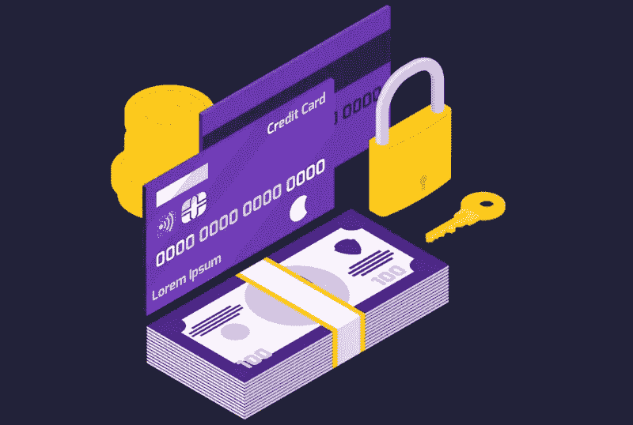

# 保护您在线隐私的不同方法-第 1 部分-

> 原文：<https://medium.com/geekculture/different-ways-to-protect-your-privacy-online-part1-702686ebab58?source=collection_archive---------24----------------------->

你们中的许多人担心自己的信息被坏人窃取；因此，使用这些数据来对付他们，但是只有坏人会寻找你的数据吗？

如果你认为只有黑客才关心你的数据，请三思，因为如今隐私已经成为坏人和公司的稀有商品。

许多合法公司使用这些数据，如电子邮件地址、电话号码和您访问过的网站，来提供广告服务，并从这些收集到的关于您和您的在线行为的数据中获利。然而，真正的威胁发生在这些公司被黑的时候。你所有的数据都可以在网上查到，比如你的电子邮件、密码和许多其他东西。

幸运的是，如果你被黑客攻击或者让这些公司出于商业目的使用你的个人和机密信息，每个人都可以采取许多措施来提高你的隐私并保护你不被窃取。

# 1.不要在社交媒体上填写你的所有细节。

不要与小偷或网络罪犯合作，通过在社交媒体上过度分享来窃取你的个人信息，你可能会问这是如何发生的，如果他们获得了我的生日、我妈妈的名字或我的住址等信息，他们会怎么做？

嗯，这些信息可以被你用作个人资料或银行账户中的安全问题，黑客可以利用它们来攻击你，登录你的账户。当你在脸书、推特、Instagram 等社交媒体平台上创建账户时，通过分享你的个人信息，你就融入了他们。

更好的决定是，当你在任何公司开设账户时，创造一个假的人，并在安全问题上撒谎，因为黑客可以从你的社交媒体档案中获取信息，并试图猜测正确的答案。

# 2.通过强密码保护您的帐户

如果你总是使用至少包含 8 个字符的健壮密码，而不是使用简单的密码，如“qwerty”或“1234”，这将是很好的，因为根据 [nordpass](https://nordpass.com/most-common-passwords-list/) 的说法，这些密码似乎是用户中使用最多的，并且永远不要使用包含你的名字和任何与你个人生活有关的内容的密码。

黑客可以使用许多可用的工具，根据你在社交媒体上发布的个人信息，如你的生日和宠物的名字，创建一个可能的单词列表，然后使用[暴力](https://en.wikipedia.org/wiki/Brute-force_attack)攻击来尝试你帐户上的每个可能的密码，同时使用一些可以非常快速和轻松地执行这一操作的工具。

# 3.不要忽视软件更新。

你们中的许多人正在使用过时的软件，突然得到一个弹出窗口，告诉你立即下载更新或取消。当然，大多数人会忽略这条消息，或者点击“取消”稍后再安装。不过，你可能会忘记或从来没有更新软件。

软件更新将提供许多好处，最重要的一个是修复安全漏洞，这些坏家伙，或者让我们称之为网络犯罪分子，将通过在 word 文档、PDF 或应用程序中放置一个小代码来利用这些漏洞，在您打开它时注入病毒，控制您的操作系统并窃取您的信息。

假设你用的是微软 office 2013 这样的老版本，有人给你发了一个 word 文件，里面有病毒。该病毒将利用在旧 Microsoft office 版本中发现的漏洞。不过，如果你可能正在使用一个更新的文件，即使文件包含病毒，你也不会被黑客攻击，因为它利用的是软件版本，而不是你在电脑上打开的实际文件。

# 4.请改用 Linux 操作系统

Windows 有很多安全问题，当 windows 告诉他们需要进行更新时，许多用户会感到厌烦，尤其是当你打算关闭机器时；这种情况发生在你们大多数人身上，但是如果我告诉你，你可以使用一个免费的操作系统，并且有非常低的安全性问题，那会怎么样呢？嗯，这个操作系统叫 Linux。

Linux 是一个开源的操作系统，专门为性能差的设备设计，在这些设备上运行非常完美。它是如此的安全，黑客通常不会瞄准 Linux 系统，因为与 Windows 或 macOS 相比，他们的用户只占很小的比例。此外，很难创建会感染所有 Linux 发行版的恶意软件，即使他们可以入侵它，他们也需要一个管理员级别来完全控制受害系统。

此外，它还有许多 windows 软件可供选择，如 LibreOffice，可以弥补微软 Office 的不足。此外，像谷歌 chrome 和 Adobe Acrobat Reader for PDF 这样的许多应用程序都可以在 Linux 下运行，所以你不会发现从 Windows 切换到 Linux 有什么困难。

# 5.警惕网络钓鱼攻击

有人认为用一个好的杀毒会保护自己不被黑，或者使用 Linux 这样的开源操作系统，但问题不在这里。问题是你需要知道你的机器并不是黑客唯一有价值的东西。你的证件也是。

在网络钓鱼中，骗子会向您发送一封看似来自银行或任何金融机构的电子邮件。常见的情况是试图说服您使用该链接登录并确认您的信息，否则您的银行帐户将被关闭(这只是一个可能发生的简单情况)。当您提交凭据时，您将被重定向到实际的银行帐户，但您实际上是在一个虚假的页面上提交了电子邮件和密码，现在黑客可以进入您的银行帐户并窃取您的资金。

永远不要点击暂停链接或提供您的信息。一个很好的方法是，当你收到这类电子邮件时，你必须进入官方网站并登录，然后你会看到那里是否有任何问题，或者你可以使用他们的官方电子邮件联系支持人员。