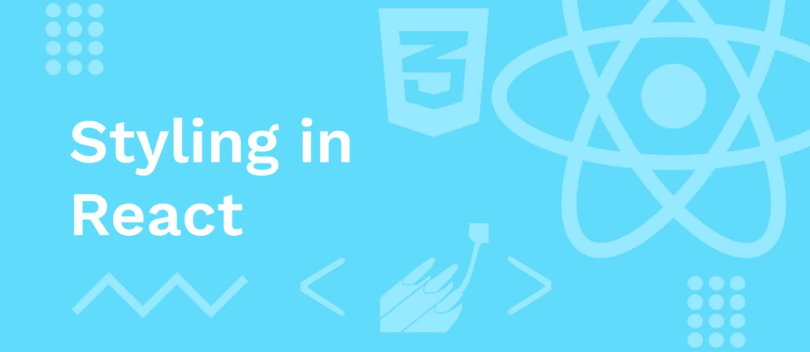
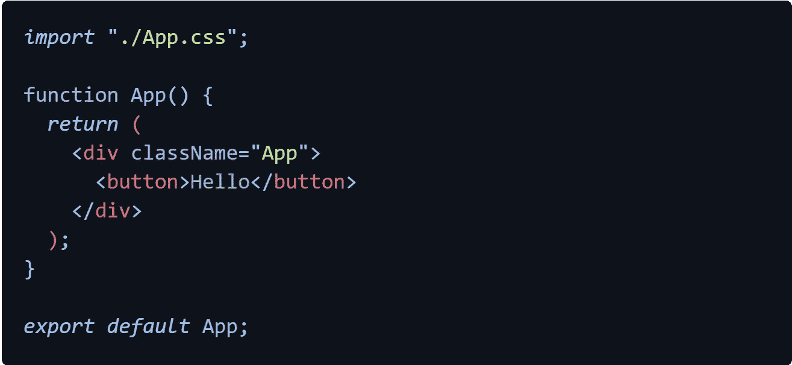
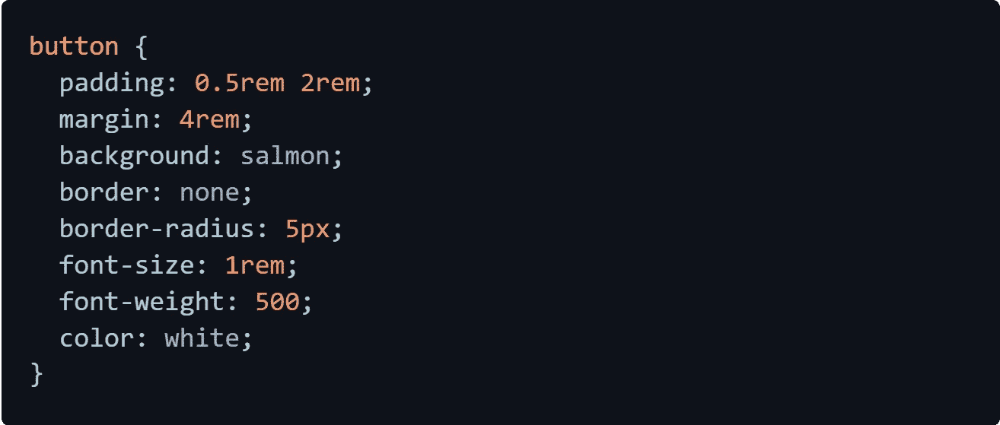
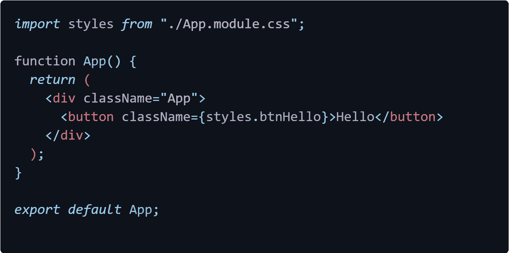
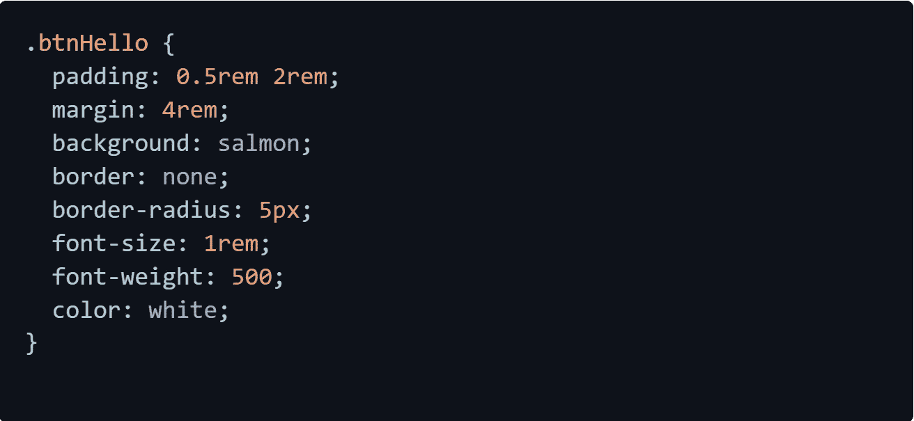
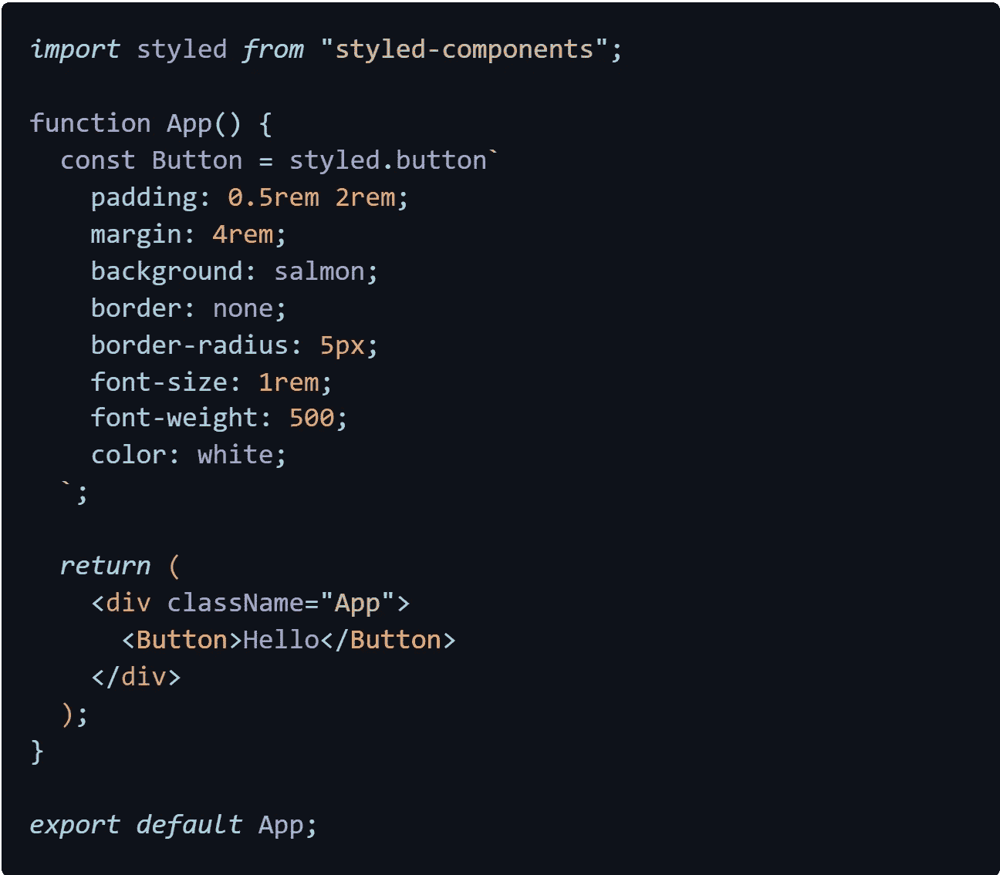

# React 中设置组件样式的不同方法

> 原文：<https://medium.com/geekculture/different-ways-to-style-components-in-react-a68f9f738d86?source=collection_archive---------29----------------------->

当谈到 react 应用程序中的样式组件时，我们有多种选择。在这里，我将讨论您可以在项目中使用的三种最流行的样式选项。

## 内嵌样式

这是对组件进行样式化的最基本的方式，通常在开始使用 react 时会以这种方式进行样式化。在内联样式中，样式对象将作为样式属性对象直接传递到 JSX 元素中，该元素具有 CSS 规则的键值对以及分配给这些 CSS 规则的值。此外，当我们在 JavaScript 对象中编写 CSS 规则时，我们必须用大写字母来处理规则。否则，我们可以用这些 CSS 样式创建一个对象，并将其传递给 style prop。此样式属性将被转换为内联样式，并将应用于按钮元素(请参考下面的示例)。这种方法有助于为一个元素添加一些样式来测试某些东西，或者为一个元素快速设置样式。这种方法根本不具备复用性。此外，这会弄乱代码，因为样式和 JavaScript 在同一个文件中，如果我们在所有元素中都有内联样式，调试起来也会更困难。这种样式方法面临的另一个问题是没有办法定义伪元素或类。我认为如果你打算在你的组件中使用大量的 CSS 规则，你应该避免这种方法。

## 外部 CSS 样式

当你想把你的 JavaScript 和 CSS 分开，在另一个文件中写纯 CSS 的时候，这种方法是很有用的。在这个方法中，CSS 将被注入到 index.html 中，如果不使用不同的类，样式将全局应用于相同的元素。为了更好的理解，请参考下面的图片。在这里，我创建了一个 App.css 文件，在那里编写了 css 规则，并将其导入到组件中。然后样式将被应用到所有的按钮上，因为我为按钮使用了一个全局选择器。

这个全局样式应用问题可以通过使用 CSS 模块来消除。我们只需将 App.css 重命名为 App.module.css，然后将其导入组件并将样式保存到一个变量中，然后使用该变量将样式应用到所需的元素中。参考下面的例子，让它更清楚。

## 第三方库

我们可以使用第三方包为我们的应用程序创建样式。我将讨论最流行的包之一，styled-components 库，它允许我们使用称为模板文字的 JavaScript 特性创建具有样式的 JSX 组件。

首先，我们必须通过键入“npm install styled-components”来使用 npm 安装样式化的组件。然后导入到组件中，开始创建组件，如下所示。如需更多参考，请阅读样式组件文档[这里](https://styled-components.com/docs)。

这种方法的缺点是所有的样式都混杂在组件中。我们应用的样式越多，组件的代码就会越来越大。我个人更喜欢通过使用单独的 CSS 文件来使用外部样式方法。这样我可以通过拆分代码来更有条理。现在，我希望您已经很好地理解了可以用来在 react 中对组件进行样式化的一些选项。希望这是有帮助的，下次再见👋。