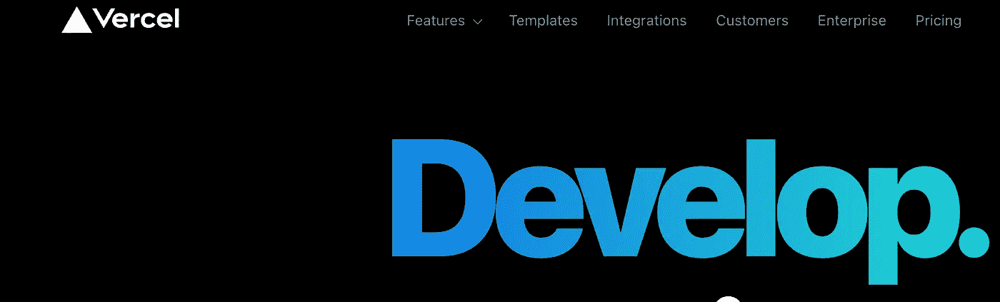
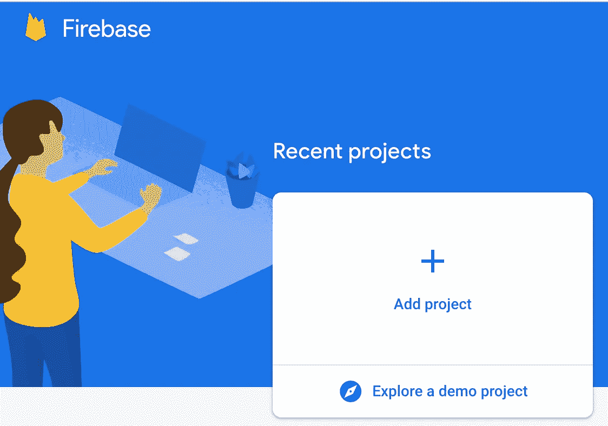
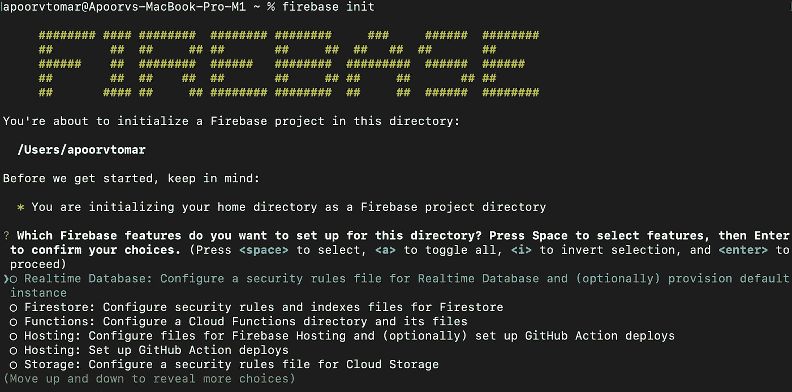

# 您必须知道的部署应用程序的不同方法|技术。

> 原文：<https://medium.com/geekculture/different-ways-you-must-know-to-deploy-your-application-technical-b3f2f320125a?source=collection_archive---------13----------------------->

## 从理论上理解您可以采用的部署应用程序的方法。

作为软件开发人员，我们总是想为观众开发一些有用的、富有成效的东西。新项目开发完成后，我们需要向潜在客户展示。

Photo by [Patrick Tomasso](https://unsplash.com/@impatrickt?utm_source=medium&utm_medium=referral) on [Unsplash](https://unsplash.com?utm_source=medium&utm_medium=referral)

现在，这些客户可能是其他团队成员、QA 团队、实际客户或最终用户。想想任何大型组织，无论是脸书、谷歌、优步等，如果他们的源代码将驻留在本地机器上，他们将永远无法看到现实世界的光芒。在那种情况下，他们的运气会如何？

因此，任何带着激情开发的应用程序总是需要被托管在某个地方。与过去不同，现在我们有多个云提供商，提供各种模式，如 PAAS(平台即服务)、SAAS(软件即服务)和 IAAS(基础设施即服务)。

教程中充满了信息，所以请仔细阅读，这样你就可以用一些新的信息来提高自己的技能。

# PAAS、SAAS 和 IAAS 的区别

这些主要是我们必须使用云服务的三种不同策略。主要是所有人都在做几乎相同的事情，但只是方法不同。

因为它们都不在另一个之上，这只是您想要遵循的用例。此外，一些方法可以为您提供简单的部署，如 firebase/vercel，它为您提供了一个命令部署的能力，而另一方面，您需要在设置部分做一些工作。服务器上的独立部署使您能够以自己的方式设计基础设施。

我们将主要非常简要地讨论所有三种模型之间的差异。主要是这三个模型并不特定于代码的部署，而是关于任何可用产品的通用指南，但是我们将讨论源代码的部署。

## PAAS(平台即服务)

PAAS 代表平台即服务，在这种类型的服务中，用户被提供一个平台，在这个平台上，他们可以在使用服务之前进行所有基本的初始化。

最终用户需要了解平台，架构的其余设置由平台提供商处理，这样就省去了设置每台服务器的麻烦。

Netlify、Firebase 等属于平台的范畴，因为它们给你一个 web 接口来引导你的应用程序。在这里，您可以向他们提供关于可伸缩性、实例等信息。将您从搭建整个基础设施的忙乱中解救出来。

## IAAS(基础设施即服务)

简单来说，基础架构即服务可以定义为通过设置整个基础架构来为用户提供杠杆作用。基础架构即服务面向那些愿意设计其整个基础架构并希望一切按照自己的方式运行，并且拥有进行所有引导的技术知识的用户。

最终用户可以自由选择操作系统、ram、服务器内存、负载平衡器类型等。假设您习惯使用 Linux 而不是 windows 服务器，您可以为您的服务器选择基于 Linux 的操作系统。

同样，SAAS 操作系统和其他细节是你无法选择的，但是你可以部署软件，你可以在其中托管你的应用，大部分是静态的。比如从 Google Drive 为你服务申请。虽然这不是一个非常值得推荐的方式，但我会建议你。

# 可以遵循策略进行部署

下面是我在云上部署应用程序时遵循的不同策略。这些并不是可用于部署应用程序的策略的详尽列表。让我们从每一个开始。

1.  独立服务器
2.  像 Firebase/Vercel 这样的服务

## 独立服务器

独立服务器分为两类，即基础设施即服务或各种组织尝试建立自己的内部服务器。

Photo by [İsmail Enes Ayhan](https://unsplash.com/@ismailenesayhan?utm_source=medium&utm_medium=referral) on [Unsplash](https://unsplash.com?utm_source=medium&utm_medium=referral)

尽管大多数组织都在使用云提供商的服务，而不是建立自己的服务器。因为这是公司需要维持的开销。不考虑这个事实，我们更关心图片的部署部分。

主要是我们将考虑我们有一个独立的服务器提供给我们。现在，我们可以选择我们想要的 10 Gb 内存和 80 GB 存储的 Linux 服务器或其他任何东西。这些配置我们可以根据我们的应用需求来选择，无论是需要更多的处理还是存储。

在这个实例中，我们已经准备好了一个 Linux 虚拟机，可以用来部署应用程序。它的工作方式几乎与您的本地机器类似。

您应该知道的额外知识是您需要在后台运行服务的方式。对于 node js 应用程序，我主要使用 pm2 进程管理器。我们也可以将它作为服务来运行。这些都需要配置。

市场上的一些主要参与者有亚马逊网络服务、谷歌云平台、微软 Azure 等。你可以尝试这些服务中的任何一种，只要你有一张有效的借记卡/信用卡，几乎每个平台都会给你一些免费的信用额度。

免责声明:该平台为您提供限时免费积分，因此在进行实验时要小心，因为如果操作不当，可能会产生巨额费用。所以在使用他们的任何服务之前都要做研究。

## **Firebase/Vercel 等服务**

现在，我们已经讨论了部署应用程序的一种方法，即使用独立服务器。在服务器的情况下，我们有一个映射到 DNS 的 IP 地址。

DNS(域名系统)提供给最终用户用于访问系统，因为 IP 地址是字母数字，很难记住。如果你想了解[当你在浏览器中输入一个网址时会发生什么？请务必阅读这篇文章，它会给你一个大致相同的良好背景。](https://betterprogramming.pub/what-happens-whenever-you-type-a-website-url-in-the-browser-72e66f87769b)

Vercel (Image by author)

现在，我们将讨论的另一种方式是使用诸如 vercel、firebase 等服务。该服务为您提供了一个用户界面，您可以在其中配置您的应用程序。在这些服务中，您还可以设置 CI/CD 管道，这将有助于您简化部署工作。

Firebase Platform (Image by author)

您将获得可以在终端上配置的 CLI 工具。例如，在 firebase 中，您可以简单地安装 CLI 工具。安装后，我们只需使用 **firebase 登录**命令登录我们的帐户。这将给你力量去推动，并且直接从你的终端部署。

Firebase CLI tool (Image by author)

现在，您也可以将您的 DNS 映射到这些平台。所有这些东西的设置非常简单，并且在各自的平台上都有很好的文档记录。基本的小型应用程序/项目在几乎所有的应用程序上都是免费的，但是当你的负载增加时，他们会向你收费，这是很公平的。

# 基础

因为我假设您正在尝试探索不同的方法来部署项目，所以您必须了解成功部署的基本信息。

但是为了重温这些事实，我将非常简要地讨论它们。

## 操作系统

操作系统是连接用户和硬件的系统。基本上，Mac OS、Windows XP、10 或 Linux 都属于操作系统。操作系统的主要目的是在用户工作时为他们提供最佳的用户体验。

Photo by [Dmitry Chernyshov](https://unsplash.com/@oneor0?utm_source=medium&utm_medium=referral) on [Unsplash](https://unsplash.com?utm_source=medium&utm_medium=referral)

一个操作系统不仅仅是一个简单的用户界面，它背后还有很多东西，比如内存管理、垃圾管理、上下文切换、用户行为到实际任务的转换等等。

所以大多数人对其中一个操作系统都很满意。因此，作为一名开发人员，如果我们选择独立服务器，我们可以选择操作系统的数量，因为我们需要使用终端连接到服务器。

对于操作系统，我们习惯使用命令，使用服务器变得更容易。

## 自动扩展和负载平衡

因此，一旦我们需要扩展我们的应用程序，对负载平衡和自动扩展的需求就开始生效。至于可伸缩的应用程序，我们需要在多台服务器上部署我们的代码。

Photo by [Austin Neill](https://unsplash.com/@arstyy?utm_source=medium&utm_medium=referral) on [Unsplash](https://unsplash.com?utm_source=medium&utm_medium=referral)

一旦代码被部署在多个服务器上，最终用户需要获得一个 DNS。如何将请求重定向到相应的服务器？简单的答案是使用负载平衡器。

我们给出了基于不同策略的负载均衡器的一些配置，如循环调度、先来先服务、优先级调度等。基于这些，负载被分配。如果我们想在特定的服务器上做额外的负载，我们也可以手动给不同的服务器分配权重。

**例如**，让我向你解释一个需要自动缩放的例子，考虑到你有一个购物网站，突然你的网站负载随着可能的销售额增加而成倍增加。

现在，您没有足够的服务器来处理这些负载。你完了。为此，需要自动扩展，以便您的系统能够通过即时添加更多服务器来应对新的流量负载。希望你直奔主题。

## CAP 定理。

CAP 定理代表一致性、可用性和分区容差。基本上，上限定理表明我们不能一次完成这三件事。

如果我们有分布式系统，并将数据存储在两个不同的分区中，并且数据被写入两个分区中的任何一个。可用数据要么不一致，要么系统无法一直可用。

例如，您在一个分区上更新了您的名字，而其他用户从另一个分区上询问您的名字。在这种情况下，另一个分区将返回旧名称，除非在两个分区中都更新了新修改的名称。因此，同步需要一些时间，我们可以通过让系统不可用一段时间来实现。或者在请求中增加等待时间。

只有当系统中存在延迟时，系统才能最终保持一致，这将有助于实现数据同步。因此，CAP 定理在分布式系统领域非常有效。

# 最后的想法

作为软件开发人员，您应该知道部署应用程序的方法。通常在组织中，这项工作由 DevOps 团队处理。

软件开发人员的工作仅限于在本地开发代码并将其推送到存储库。通过使用 docker 和利用 Kubernetes 和 Open Shift 了解不同的集装箱化策略，您可以使您的部署流畅。

希望这篇文章能给你关于不同部署方式的理论知识。

**关于作者**

Apoorv Tomar 是一名软件开发人员，是[**mind bake**](https://mindroast.com/)的一部分。你可以在[**Twitter**](https://twitter.com/apoorvtomar_)[**Linkedin**](https://www.linkedin.com/in/apoorvtomar/)[**Telegram**](https://t.me/ApoorvTomar)[**insta gram**](https://www.instagram.com/apoorvsinghtomar/)上和他联系。订阅 [**简讯**](https://www.mindroast.com/newsletter) 获取最新策划内容。不要犹豫在任何平台上说“嗨”,只要说明你是在哪里找到我的资料的。