# 室内设计美学辨析

> 原文：<https://medium.com/geekculture/differentiating-interior-design-aesthetics-f3520403911f?source=collection_archive---------50----------------------->

image credit: [Arch Daily](https://www.archdaily.com/945290/interior-design-trends-that-will-shape-the-next-decade)

了解客户对任何企业都至关重要；包括了解客户在访问网站时的兴趣和期望。当处理像设计美学这样没有明确界限的搜索词时，这就变得复杂了。一个人对审美的感知可能与另一个人完全不同 Etsy 或 Pinterest 这样的公司应该如何解释这些感知并返回足够的搜索结果？

首先，重要的是要了解顾客的认知是从哪里形成的。也许他们在 Instagram 上看到了一个标签为#BohoChic 的帖子，或者读到了他们最喜欢的博客作者的一篇文章，这位博客作者刚刚为他们的卧室添加了一个农舍风格的 shiplap。聚集这些接触点来创建一个真实的来源，是创建一个模型的第一步，该模型理解人们在搜索设计美学时期望看到什么关键词。

在创造了这个事实的来源之后，设定当前绩效的基线是很重要的。当前的搜索结果与我们的真实来源相符吗？

# 数据概述

最初的谷歌趋势分析显示，三种顶级室内设计美学最近上升到了受欢迎的顶峰。在刚刚达到顶峰的美学比已经存在了一段时间的美学更少被理解的假设下，这个项目关注这些美学。

1.  世纪中期现代

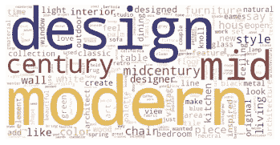

1.  波西米亚风格

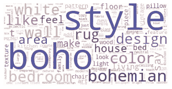

1.  农舍

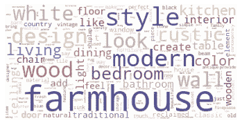

通过网络搜集流行的设计博客和出版物来收集这三种设计美学的文本数据。这些文章然后被分成段落进行分析。

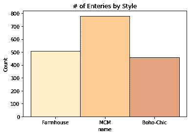

# 方法和结果

在对数据进行初步清理后，只有名词和形容词被保留用于最终模型，因为这些词被证明在训练模型以识别设计美学方面更重要。这也应该有助于弥合使用文章创建真实来源和使用零售网站的产品描述呈现模型之间的差距。

正如我们在下面的图表中看到的，简单的字数统计对这个项目没有帮助。像“房间”和“空间”这样的词没有太多的描述性影响。

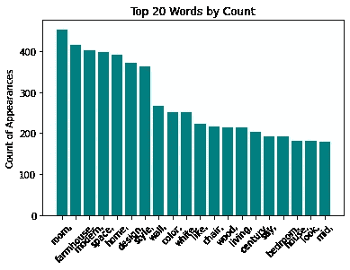

使用 TF-IDF 矢量器提供了文本的优先排序，有助于训练分类模型，而不必收集更多数据。此时，除了名词和形容词之外的所有单词也被从语料库中删除。下面的条形图是在建模后使用特征重要性制作的，它清楚地显示了最重要的单词与最高计数的单词是不同的。

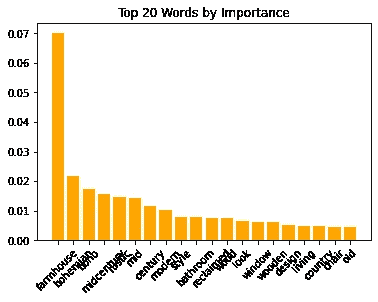

本项目使用了多项朴素贝叶斯分类模型，并对召回进行了优先排序，因为不符合客户标准的搜索结果要比因搜索中未包含产品而导致的销售损失要好。下面我们将讨论模型迭代以及每个类的性能。

首先，文章被视为一个整体，并作为一个单独的文档使用，然而这导致了跨类的扭曲性能，因为 TF-IDF 矢量器没有返回有价值的重要性值。(这是因为逆文档频率与术语频率不成比例，因为文档很少但很长。)下面的混淆矩阵显示了这三个类别之间的不平衡表现。接下来，我们将讨论这是如何改进的。

按类别回忆:MCM: 100% |波西米亚风格:29% |农舍:57%

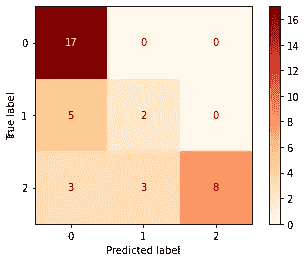

将文章分解成段落极大地提高了农舍美学的表现，同时对其他两个类有一点相反的影响。这个模型是对总回忆分数(从 62%到 70%)的一个改进，很明显 Boho-Chic 的潜在数据需要被关注。

按类别回忆:MCM: 98% |波西米亚风格:27% |农舍:83%

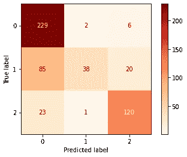

如上所述，Boho-Chic 在任何模型中的表现都不如其他两个类别。事实上，它的表现往往比随机猜测差。为了理解为什么该模型难以对波西米亚风格进行分类，我查看了语料库中具有最高特征重要性的 20 个单词及其在每个类别中的分布。很明显，Boho-Chic 具有最少的高重要性单词，这使得模型很难正确地对这些文档进行分类。

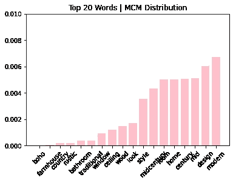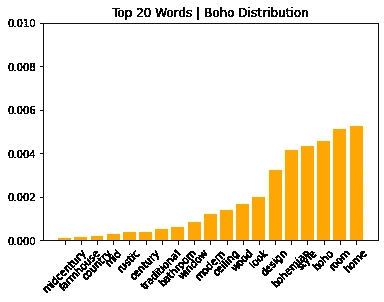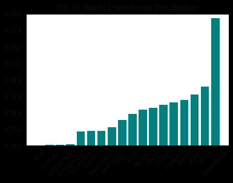

在创建真实来源并使用它训练分类模型之后，Etsy 产品数据被传递以获得 Etsy 产品描述与真实来源匹配程度的总体概念。因为我们的模型需要更多的 Boho-Chic 培训，只有标有 MCM 或农舍的产品被引入到模型中。世纪中期的现代产品表现良好，92%的产品被认为是正确的类别，而只有 28%的农产品被正确分类。这可能意味着农家乐产品描述可能需要做一些工作，才能被客户识别为农家乐。

感谢您的阅读，如有任何建议，请联系我们！