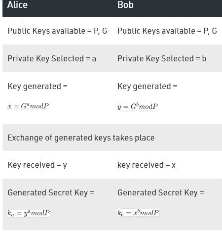
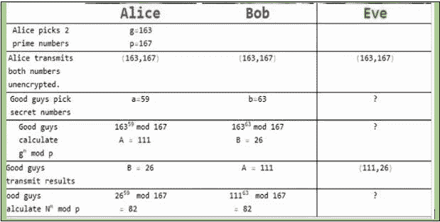

# Diffie-Hellman:一种加密密钥交换算法

> 原文：<https://medium.com/geekculture/diffie-hellman-a-key-exchange-algorithm-for-encryption-799c78a09467?source=collection_archive---------9----------------------->

在对称加密中，只有一个密钥用于加密和解密网络上的数据。在这种情况下，发送方使用这个密钥加密数据，并将其发送给接收方。接收器接收加密的数据，并使用用于加密的相同密钥解密数据。在网络上传输的数据是加密的，但是我们需要某种算法来安全地在网络上传输密钥。为此，Whitfield Diffie 和 Martin Hellman 想出了一种方法，发送者和接收者通过使用模运算和指数运算在显而易见的地方传输数字来生成他们的共享秘密。这些数字以明文形式传输，发送方和接收方依次使用这些明文来生成密钥。

Diffie 和 Hellman 提出了一种密钥交换算法。后来，它被称为 Diffie-Hellman 密钥交换算法。步骤如下:

Steps of Diffie-Hellman Key exchange Algorithm

我们可以从数学上证明 ka = kb。

举例说明了算法的工作原理

Working on Diffie-Hellman Algorithm

最终结果是双方都可以用来执行加密和解密的密钥。在本文中，我们发现了 Diffie- Hellman 算法是如何用于密钥交换的。