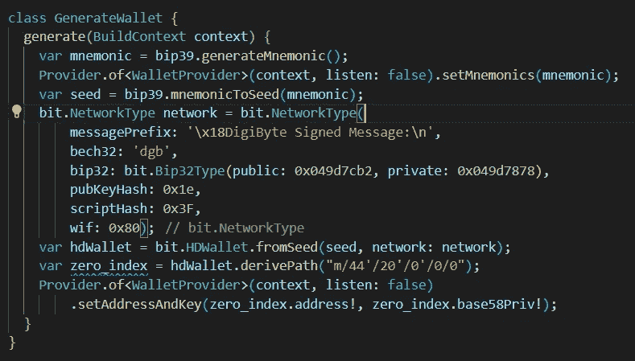
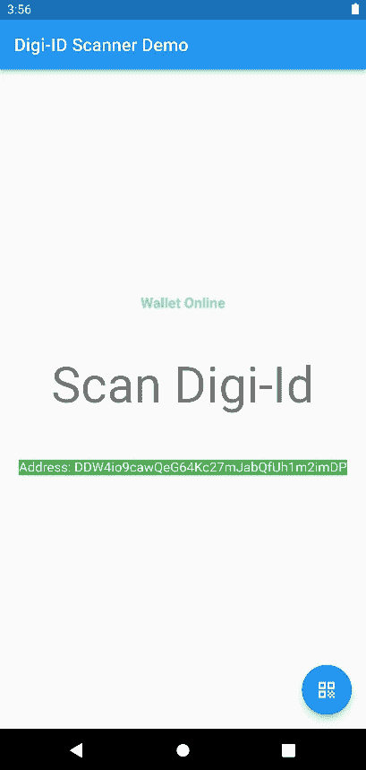
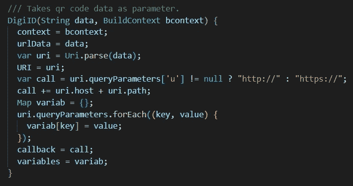
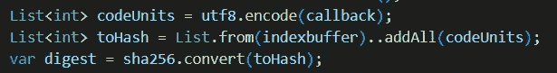
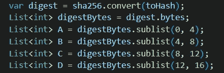
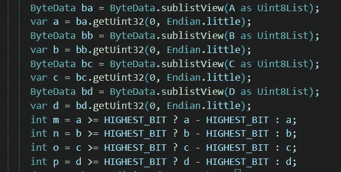
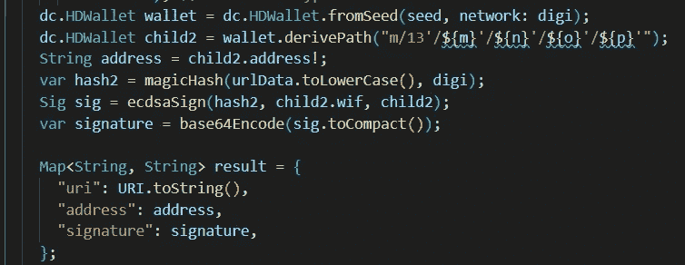
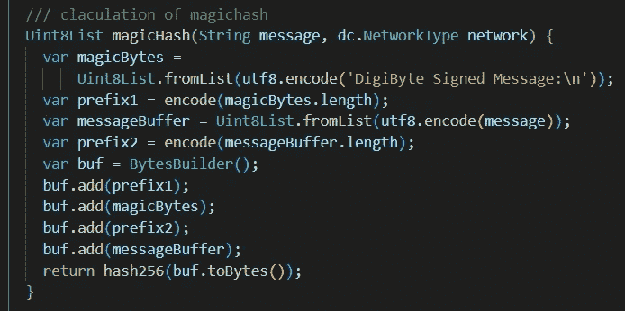
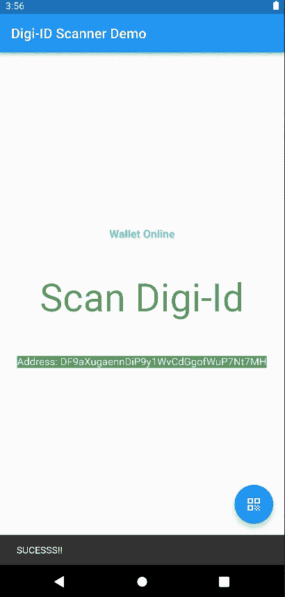

# Digi-ID:一种基于区块链的开放认证协议

> 原文：<https://medium.com/geekculture/digi-id-a-blockchain-based-open-authentication-protocol-14f60446e39e?source=collection_archive---------5----------------------->

Digi-ID 是一种基于**数字字节**区块链安全性的认证方法。其灵感来源于一份名为**的比特币改进提案草案，比特币地址认证协议(BitID)。**

 [## 比特标识/BIP _ 草稿. md 在主比特标识/比特标识

### BIP: TBD 标题:比特币地址认证协议(BitID)作者:Eric Larcheveque，@ EricLarch 状态:预稿…

github.com](https://github.com/bitid/bitid/blob/master/BIP_draft.md) 

> *在本文中，我将讨论 Digi-ID 的基础知识，并最终使用 Flutter 框架* *在 android 应用程序中实现 Digi-ID。*

# 什么是 Digi-ID？

虽然 **Bit-ID** 是基于比特币区块链的安全性而提出的认证方法，但 Digi-ID 是基于 **DigiByte 区块链**。身份验证过程完全依赖于区块链技术和公钥加密提供的安全性。

# 为什么要用 Digi-ID？

Digi-ID 允许用户快速、轻松地注册和登录。Digi-ID 消除了认证的旧用户名和密码要求。

> 使用 Digi-ID 可以解决传统用户名-口令系统的大部分缺点。

1.  传统的密码可能**不安全地存储**并可能被黑客攻击。
2.  当**在**中输入密码时，键盘记录器可以拦截密码。
3.  大多数用户重复使用不同网站的密码。如果其中一个网站被黑客攻击，那么所有使用相同密码的网站都会受到威胁。
4.  传统密码容易受到**暴力破解**和**字典攻击**。

利用区块链技术的力量，Digi-ID 可以消除所有这些缺点。

# Digi-ID 是如何工作的？

带有登录表单的网站将在您每次访问时为您生成一个唯一的**二维码代码**。这个二维码为您的 Digi-ID 验证器提供了一串字母和数字，以及将登录信息发送到何处的详细信息。

 [## Digi-ID -区块链开放认证

### 为什么不从阅读我们的一页暗纸开始呢？如果你想了解这些，这是一份很好的文件

www.digi-id.io](https://www.digi-id.io/index.html) 

使用与保证区块链安全相同的加密安全，Digi-ID 认证器然后**加密 QR 码**中的信息。这条消息然后被发送回网站。

然后，网站能够接收您的信息，以及您提供给网站的唯一公共地址，**验证您就是您自己**，而不是试图模仿您的其他人。

> 现在，让我们建立自己的集成了 Digi-ID 的 DigiByte 钱包！

# 让我们打造钱包！

我们将使用 flutter 来构建 android 的钱包应用程序，然后将 Digi-ID 集成到我们的最终应用程序中。我们将根据 BIP-44 建立 Digibyte 钱包地址。要了解更多关于 BIP-44 的信息，请查看我以前的文章。

 [## 使用比特币改进提案生成比特币钱包地址 44

### 比特币改进提案 44 或 BIP-44 基于一种算法为确定性钱包定义了一种逻辑层次结构…

medium.com](/geekculture/generate-bitcoin-wallet-address-using-bitcoin-improvement-proposal-44-4672e5057bb) 

对于 dart，我们将使用 **flutter_bitcoin** 库来生成基于 BIP-39 的助记符和基于 BIP-44 的 Digibyte 钱包地址。

 [## flutter _ 比特币|飞镖包

### Flutter 的 dart 比特币库。根据麻省理工学院许可条款发布。灵感来自 bitcoinjs 不然拉…

公共开发](https://pub.dev/packages/flutter_bitcoin) 

我们将定义一个 **GenerateWallet()** 类，其中我们将首先根据比特币改进提案 39 生成随机助记符。

Generate Wallet Class

然后使用 **PBKDF 2** ( **基于密码的密钥派生函数 2)** 函数将生成的助记符转换成它的种子。要了解更多关于记忆生成的知识，请查看我以前的文章。

 [## 什么是比特币改进提案 39 (BIP-39)？

### 比特币改进提案或 BIP 是一个设计文件，为比特币社区提供信息或描述一个…

medium.com](/geekculture/what-is-bitcoin-improvement-proposal-39-bip-39-9a95ed07cb03)  [## 什么是比特币改进提案 32 (BIP-32)？

### 比特币改进提案-32 或 BIP-32 是一种信息 BIP，描述了等级确定性…

medium.com](/geekculture/what-is-bitcoin-improvement-proposal-32-bip-32-586a3f36a95c) 

为了导出 Digibyte 的**分层确定的**钱包地址(适用于所有 BIP-44 兼容钱包)，我们传递路径 **m/44'/20'/0'/0/0，**其中 20 是 Digibyte 的 BIP-44 硬币 id。要了解更多关于路径是如何得到的，请查看关于 BIP-32 和 BIP-44 的文章。

> 传递 DigiByte 网络参数也很重要，以便准确地导出地址及其私钥。

网络参数包括:-

**消息前缀—** 又名魔术前缀，是 bitID 协议中描述的钱包实现要求。

**bech32 —** 该参数接收各个硬币的 bech32 地址前缀字符串。在我们的例子中，“dgb”代表数字字节。

**bip32 —** 该参数接受**‘xpub’**和**‘xprv’**密钥的公钥和私钥 HD(分层确定)版本字节。

**pubkey hash**—该参数取 P2PKH(Pay-to-PubKeyHash)地址前缀。

**scriptHash** —该参数取 P2SH(Pay-to-ScriptHash)地址前缀。

**wif —** 该参数取钱包导入格式前缀。

App Demo

我们已经成功创建了 DigiByte 钱包地址及其私钥。现在我们将 Digi-Id 模块集成到钱包中。

# 集成数字身份证

我们将使用 AntumID 的 MyDigiPassword 平台来测试我们的集成 Digi-ID 客户端身份验证。平台提供包含回拨 URL 的 QR 码。

 [## AntumID MyDigiPassword 平台 2.0

### 目前在互联网上广泛使用登录和密码的组合。这不是最安全的识别方式…

www.mydigipassword.com](https://www.mydigipassword.com/) 

服务器端用 Digi-ID 完全取代了用户名-密码验证，为用户提供了一个 Digi-ID QR 码来确认他们的身份。

## 二维码

服务器端实现 Digi-ID 生成的 QR 包含一个回调 URL。

> digi id://www . website . com/callback？x =随机数

**digiid** 是协议方案，【www.website.com/callback】T2 是回调 URL，**x =随机数**是随机数，该随机数必须始终是唯一的，并且将被链接到用户会话 id。

我们将在另一篇文章中讨论 Digi-ID 在服务器端的完整后端实现，但目前我们的重点是 Digi-ID 的客户端，以及我们如何登录到实现 Digi-ID 协议的网站。

Digi-ID constructor

我们将 QR 数据传递给我们的 **DigiID** 类，在构造函数中，数据被处理以提取我们将需要进一步处理的细节。

首先我们检查 URL 是否包含参数 **' & u=1 '，**如果存在，那么回调接受 **http** 连接，如果不包含，那么它将只接受到回调 URL 的 **https** 连接。我们还分离了 URL 查询参数和回调 URL。

现在我们必须对发送到回调 URL 的消息进行签名，以便由实现 Digi-ID 的服务器进行验证。

## 签署邮件

我们需要将包含 URI、从 QR 数据生成的地址和签名的 json 对象发布到回调 URL。

Sign() function

为了从 QR 数据中导出要发送的地址，首先我们需要将索引**的**小端表示**与 URI 连接起来。 **Index** 是一个 32 位的无符号 int，用来生成更多的键对应同一个 URI。如果未设置，则应假设为“0”。**

SHA256 Hash

然后计算结果索引缓冲区的散列。

Splitting Digest

得到的散列的第一个 **128 位**被取出并分成四个 **32 位**数 A、B、C 和 d。

Highest bit to 1

每个数字 A、B、C 和 D 都被转换成小的**端序符号。**注意，在代码中， **HIGHEST_BIT = 0x80000000。**

> **0x80000000** 的十进制表示是 **2147483647** ，这是使用“二进制补码”符号时 32 位所能容纳的最大正数。

由于我们稍后需要导出**硬化派生**，我们根据 2^31 和 2^32–1 之间的**bip 32**(**0x 80000000**到 **0xFFFFFFFF** )来确保每个数字的范围小于硬化密钥的范围。

Address Derivation

我们现在根据 BIP32 根据**m/13’/A’/B’/C’/D’**导出层次确定性节点。导出地址后，我们计算**魔术散列**，然后使用导出地址的私钥对散列签名。

magicHash calculation

魔术散列是通过将'**数字字节签名消息'**的长度附加到魔术字节以及附加到消息本身的消息长度来计算的。然后使用 **HASH256 对结果字节进行哈希运算。**

使用 **ECDSA 签名算法**对魔术散列进行签名。

# 结论

我们的客户端 Digi-ID 模块集成到钱包应用程序中。该应用程序现在能够成功登录到任何实施 Digi-ID 协议的网站。

我们将在我们的应用程序端和网站端获得一个成功的零食条，在成功验证后，您将被重定向到一个成功页面。

## 源代码

完整的 flutter 应用程序源代码可以在我的 Github 页面上找到。

 [## GitHub-tion x3na/Digi-ID _ client:Digi-ID 的 Flutter 实现，基于区块链的开放…

### Digi-ID 是一种基于数字字节区块链安全性的身份验证方法。它的灵感来自一枚比特币…

github.com](https://github.com/tionx3na/Digi-ID_client) 

## 参考

 [## Digi-ID -区块链开放认证

### 为什么不从阅读我们的一页暗纸开始呢？如果你想了解这些，这是一份很好的文件

www.digi-id.io](https://www.digi-id.io/)  [## GitHub - bitid/bitid:比特币认证开放协议

### 纯比特币网站和应用不应该依赖于用户名和密码等人工识别方法

github.com](https://github.com/bitid/bitid)  [## 掌握比特币

### 第四章。钥匙、地址、钱包比特币的所有权是通过数字钥匙、比特币地址和…

www.oreilly.com](https://www.oreilly.com/library/view/mastering-bitcoin/9781491902639/ch04.html)  [## GitHub - RenzoDD/digibyte-js:一个纯粹而强大的 JavaScript DigiByte 库

### 从 Bitpay 的 Bitcore Lib 库分叉出来的一个纯粹而强大的 JavaScript DigiByte 库。DigiByte 是一个强大的…

github.com](https://github.com/RenzoDD/digibyte-js)