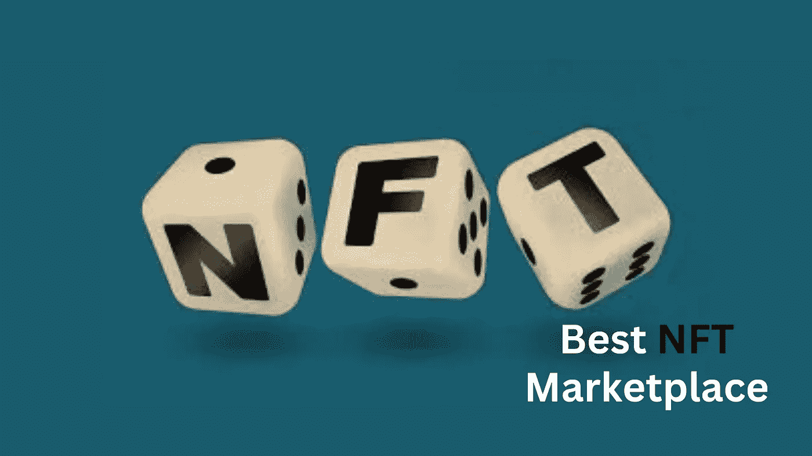

# 数字艺术 NFT 市场仍可能是一个有利可图的前景。祝您身体健康

> 原文：<https://medium.com/geekculture/digital-art-nft-marketplace-could-still-be-a-remunerative-prospect-heres-how-234e31cdcc96?source=collection_archive---------14----------------------->

NFT Marketplace

最近不可替代令牌(NFT)的增长表明了世界对新一代技术的青睐。由 [**区块链**](https://en.wikipedia.org/wiki/Blockchain)**提供动力，这些代币为数字和实物资产提供了独一无二的所有权证明，并已经创造了一个价值数十亿美元的专属市场。NFT 市场的很大一部分属于 NFT 艺术市场平台，它为全世界的艺术创作者打开了闸门。这些平台的如此突出意味着 NFT 艺术家市场仍被视为一个有利可图的风险投资选择。我们将在这个博客中看到更多关于如何创建 NFT 艺术市场的内容。**

# **数字艺术 NFT 市场:解说者**

**数字艺术 NFT 市场是一个平台，艺术家可以在这里展示他们的艺术创作，由 NFTs 支持销售。这些平台是 Web3 在公众中日益流行的主要原因之一。NFT 艺术家市场可以是数字版的美术馆，有或没有沉浸式功能。基金会、**俏皮之门**、**超级稀有**、**魔法伊甸园**和**索拉纳特**是 NFT 艺术市场的一些例子。这些平台已经帮助许多艺术家(尤其是那些擅长数字艺术的艺术家)获得了认可和金钱利益。尽管在更新的用例中有所增加，但是这个领域的范围将会增加。**

# **需要一个艺术家的 NFT 市场**

*   **数字艺术 NFT 市场为本世纪的艺术家创造了前所未有的机会，因为艺术形式已经超越了传统的帆布油画和皇家举办的拍卖。**
*   **一个面向艺术家的 NFT 市场也将为艺术收藏家提供拥有新型现代数字艺术的机会，而不必担心所有权问题。**
*   **这样一个平台还将为那些由于经济和社会限制而无法得到自己喜爱的艺术品的非精英人士提供艺术收藏。**
*   **此外，由于能够将艺术品细分为区块链支持的众多数字代币，这样的 NFT 市场风险将有助于出售更昂贵的艺术品。**

# **通过艺术 NFT 市场为各种用户带来的收入流**

*   **艺术家的 NFT 市场可以在创作者通过拍卖出售他们的作品时为他们提供金钱利益，因为他们的价值是基于观众的感知。**
*   **此外，NFT 数字艺术市场的版税给艺术家提供了丰厚的被动收入，即使是在多年之后，这在 NFT 艺术出现之前是不可想象的**
*   **对艺术品感兴趣的投资者可以通过在各种金融平台上押注艺术品 NFT，甚至将其作为加密贷款的抵押品来获利。**
*   **在这样一个 NFT 艺术市场上，数字艺术的细分可以为艺术家带来快速销售和赚钱的机会，他们甚至可以使用他们的作品进行秘密筹款活动。**

# **创建 NFT 艺术市场的步骤**

*   **为你的 NFT 艺术市场项目收集创意，并制作官方文件。**
*   **将用户体验和用户界面功能创建为原型，并对其进行测试。**
*   **根据建议，将数字 NFT 艺术市场的前端功能集成到原型中。**
*   **现在是开发平台后端的时候了，在这里执行区块链集成、智能合约编程和加密开发。**
*   **应该使用各种测试案例对 NFT 艺术市场进行严格的缺陷测试，并及时解决错误。**
*   **现在， [**你可以启动数字艺术 NFT 市场进行公开交易**](https://www.blockchainappfactory.com/nft-art-marketplace-development?utm_source=srinivasan&utm_medium=medium&utm_campaign=25oct2022) 。确保获得有用的建议，并在未来的升级过程中将其纳入平台。**

**值得注意的是，NFT 艺术市场可以从零开始启动，也可以使用现成的解决方案，这些解决方案决定了开发该平台所需的时间和成本。**

# **最后的想法**

**因此，我们可以说 NFT 艺术家市场是一个有利可图的商业选择，尽管围绕着新形式的非传统艺术的炒作。这样一个平台可以带来看不见的互动，因为艺术将暴露给更多独特的目标观众。要创建一个 NFT 艺术市场，你最好去找一家领先的 NFT 艺术市场开发公司。这样一家公司可以在咨询、设计、端到端开发、测试甚至促销等所有开发阶段为您提供专家团队的帮助。所以，追随你的梦想，在 NFT 这个充满活力的领域获得认可。**