# 数字逻辑系列 1——布尔代数与逻辑门

> 原文：<https://medium.com/geekculture/digital-logic-series-1-boolean-algebra-and-logic-gates-5e81b4c0142b?source=collection_archive---------19----------------------->

Photo by [Michael Dziedzic](https://unsplash.com/@lazycreekimages?utm_source=medium&utm_medium=referral) on [Unsplash](https://unsplash.com?utm_source=medium&utm_medium=referral)

在我们生活的某个阶段，我们都听说过、见过电子电路。电子电路大致分为**模拟**和**数字**电路。在这一系列中，我们将专注于数字电路的基础知识。数字电路已经成为人类文明的一个非常重要的组成部分，以至于第三次工业革命被称为“数字革命”，这是 20 世纪下半叶从机械和模拟技术向数字技术的大规模转变，数字计算机是这场革命的旗手之一。

# 数字电子学

数字电子学涉及的电路和系统只有两种可能的状态，高和低。这两种状态可以用电流电平、比特等来表示。在计算机系统中，这些状态用 1 和 0 来表示。这种双态数字系统称为二进制数。通常在二进制中，1 代表高，0 代表低。

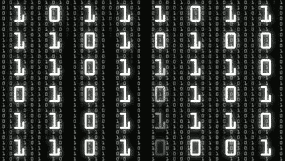

用来表示 1 和 0 的电压电平被称为**逻辑电平**。理想情况下，该电平应为 1 和 0 电压电平，但实际上，高电平可以是指定最大值和最小值之间的任何电压电平。同样，低也可以是指定的最小值和最大值之间的任何电压电平。

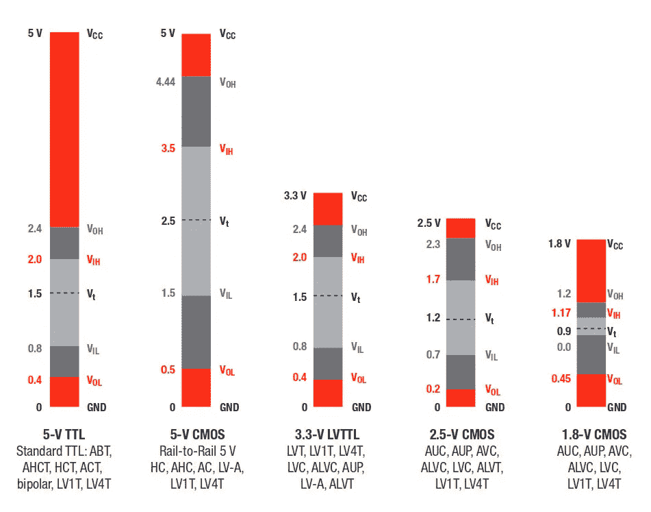

Logic level ranges of voltages for various digital circuits.

数字信号波形由在高电平和低电平之间来回变化的电压电平组成。这些来回的脉冲序列组成了数字波形。

A digital waveform.

在上面的波形图中我们可以看到，正半部分代表 **1** ，负半部分代表 **0** 。数字系统处理的二进制信息表现为代表比特序列的波形。序列中的每个位占用一个定义的时间间隔，称为**位时间**。

既然我们已经触及了数字电子学的基础，我们就要看看什么是数字逻辑或布尔逻辑。

# 数字逻辑

逻辑的基本形式告诉我们，如果某些条件为真，则某个命题为真。这些命题可以是真的，也可以是假的。数字或布尔逻辑是支撑所有现代计算机系统的基础。正是规则系统帮助我们基于简单的是/否问题做出复杂的决定。

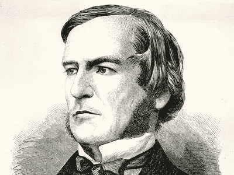

在 19 世纪 50 年代，数学家乔治·布尔开发了一个数学系统，用于用符号来表述逻辑语句，以便可以用类似于普通代数的方式来书写和解决问题。今天所知的布尔代数被应用于数字系统的设计和分析。

# 布尔代数

布尔代数，像任何其他演绎数学系统一样，可以用一组元素、一组运算符和一些未经证明的公理或公设来定义。

Photo by [Magnus Engø](https://unsplash.com/@magnusengo?utm_source=medium&utm_medium=referral) on [Unsplash](https://unsplash.com?utm_source=medium&utm_medium=referral)

> "布尔代数是数学的一个分支，它处理逻辑值的运算并包含二进制变量. "

# 布尔代数的规则和定律

正确应用布尔代数需要遵循一定的规律。

## 交换律

该定律指出，变量相加(布尔加法)或相乘(布尔乘法)的顺序没有任何区别。

> A + B = B + A，加法交换律。
> 
> 答。B = B . A，乘法交换律。

## 结合律

该定律指出，当两个以上的变量相加或相乘时，无论变量的分组如何，结果都是相同的。

> A + (B + C) = (A + B) + C，加法结合律
> 
> A.(公元前)=(公元前)。c、乘法结合律

## 分布率

该定律指出，将两个或更多变量相加，然后将结果与单个变量相乘，相当于将单个变量与两个或更多变量中的每一个相乘，然后将乘积相加。

> A.(B + C) = A . B + A .C

## 规则 1:

一个变量与零相加(布尔加法)时给出变量本身。如果我们把 1 和 0 相加，我们得到 1，如果我们把 0 和 0 相加，我们得到 0 本身。这个规则叫做**恒等式规则**。

> A + 0 = A

## 规则二:

如果我们加上一个变量，我们得到的结果是 1。在布尔加法中，一加一得一，零加一得一。这条规则被称为**无效规则**。

> A + 1 = 1

## 规则三:

如果我们与 0 相乘(布尔乘法)得到 0 本身。该规则也是**婚姻无效规则**的一部分。

> 答。0 = 0

## 规则 4:

如果我们用 1 乘(布尔乘法)给出变量本身。该规则也是**身份规则**的一部分。

> 答。1 = A

## 规则五:

如果我们在同一个变量上加一个变量，那么结果就是变量本身。这个规律叫做**幂等定律**。

> A + A =A

## 规则 6:

如果我们把一个变量加到同一个变量的补数上，那么我们得到的结果是 1。该规则是**补码规则**的一部分

> A + ~A =1

## 规则 7:

如果我们把一个变量和同一个变量相乘，那么我们得到的是变量本身的乘积。这个规律也是**幂等定律**的一部分。

> 答。A = A

## 规则 8:

如果我们把一个变量和它本身的补数相乘，那么我们得到的结果是 0。这个规则叫做**补码规则**。

> 答。~A = 0

## 规则 9:

如果我们取一个变量的补码的补码，我们就得到了变量本身。这个规律叫做**双重否定**。

> ~(~A) = A

## 规则 10:

这个规则被称为**吸收定律**。

> A + AB = A

## 规则 11:

这条规则也是**吸收法**的一部分。

> A + ~A . B =A + B

## 德摩根定理

德摩根定理指出，变量乘积的补数等于变量补数的和。

> ~(A . B) = ~A + ~B

德摩根第二定理指出，变量和的补数等于变量补数的乘积。

> ~(A + B) = ~A . ~B

# 逻辑门

逻辑系统是任何数字系统的基本构件。它是实现布尔函数的计算或物理电子设备的理想化模型。我们将看到各种类型的逻辑门，这对理解数字系统的基本原理是必要的。

## 非门

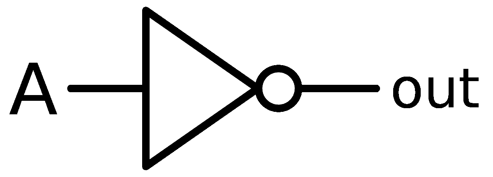

该门执行称为**反转**或**互补**的操作。非门或反相器门将一个逻辑电平变为相反的电平。如果输入为 1，则该门将输入转换为输出 0，反之亦然。这可以用如下的真值表来表示。

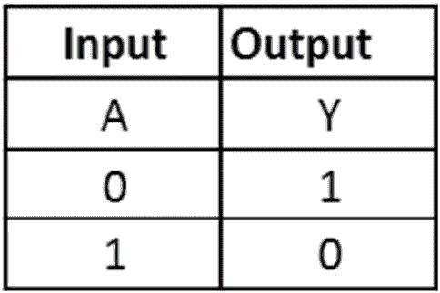

下面的时序图显示了非门的输入信号如何转换为最终的输出信号。

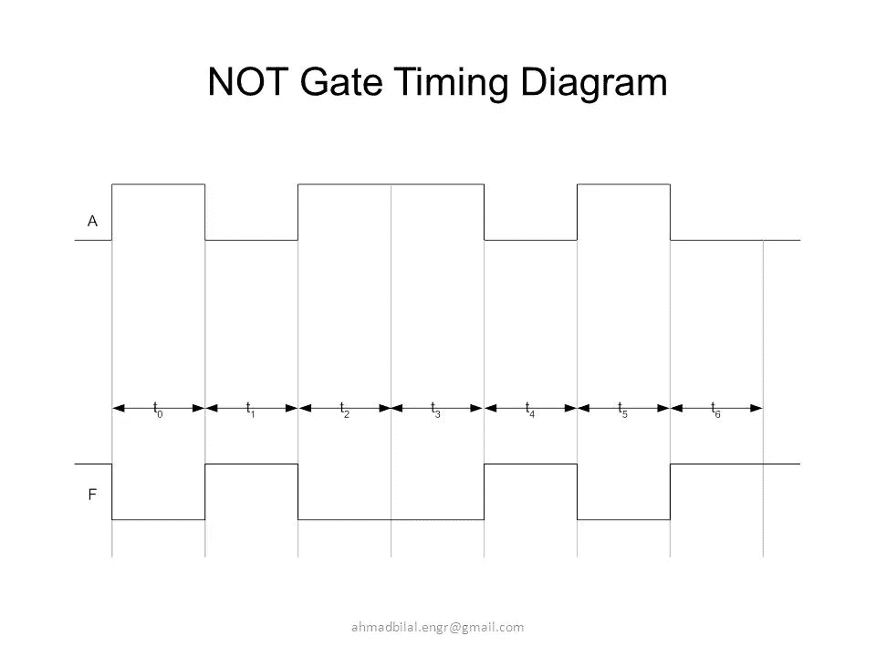

“非”门的一个应用是实现 8 位二进制数的 1 的补码。

## 与门

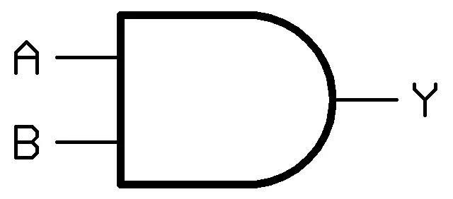

一个与门可以有两个或更多的输入，并执行所谓的**逻辑乘法**。它是组合输入的基本门之一。只有当该门的所有输入都为高时，该门的输出才为高。

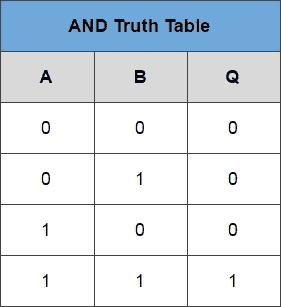

下面的时序图显示了与门的输入信号如何转换为最终的输出信号。

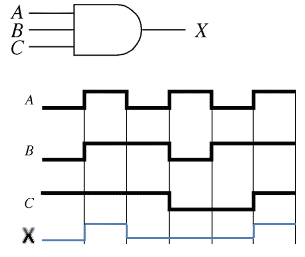

3- input AND Gate

与门的应用包括启用/禁止装置、安全带报警系统等。

## 或门

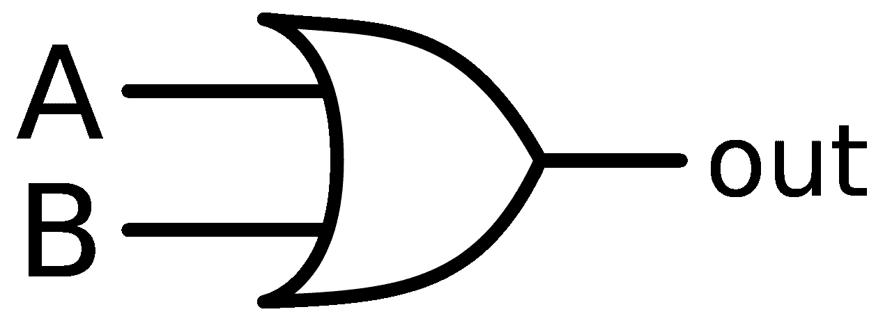

“或”门可以有两个或更多输入，并执行所谓的**逻辑加法**。当两个变量都为高时，这个门的输出也为高。只有当两个变量都低时，输出才会低。

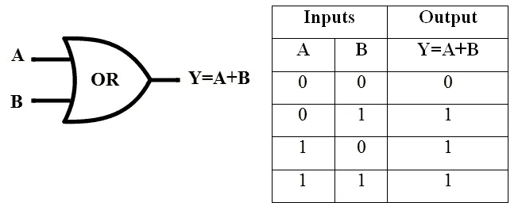

下面的时序图显示了“或”门的输入信号如何转换为最终的输出信号。

“或”门的应用包括入侵检测、报警系统等的简化部分。

## 与非门

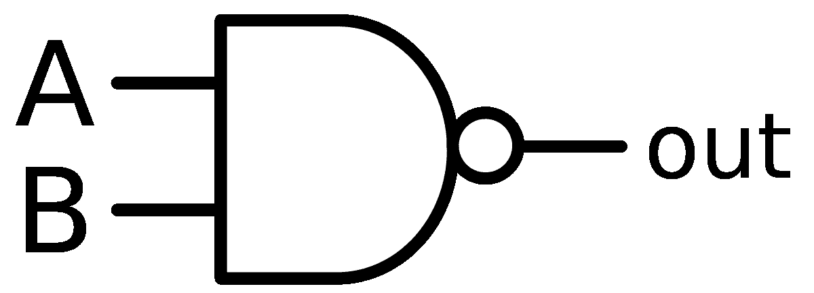

与非门也被称为通用门，因为其他的门也可以用与非门来构造。只有当所有输入都为高电平时，与非门才产生低电平输出。

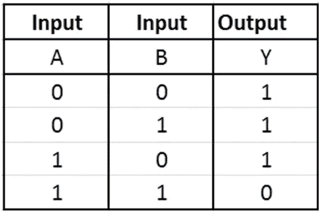

下面的时序图显示了与非门的输入信号如何转换为最终的输出信号。

## 或非门

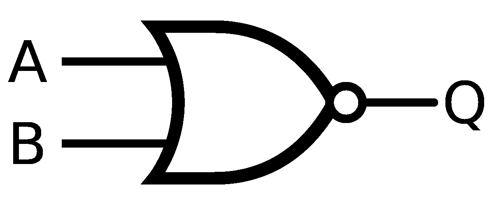

像与非门一样，或非门也是一种通用门，这意味着它可以组合使用来执行与、或和反相器操作。在或非门中，只有当两个输入都是低电平时，输出才是高电平，否则输出总是低电平。

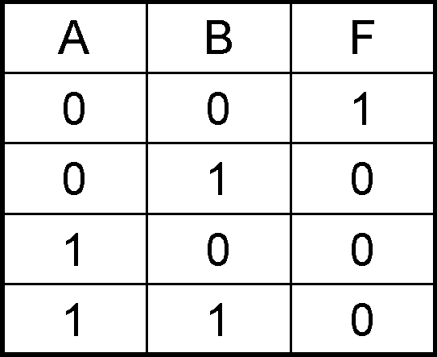

下面的时序图显示了或非门的输入信号如何转换为最终的输出信号。

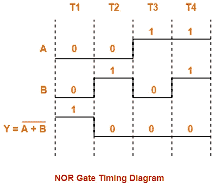

## 异或门

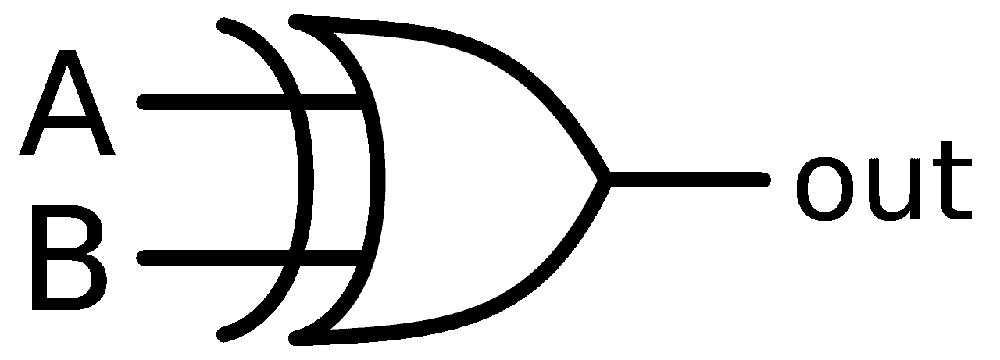

简而言之，异或运算执行模 2 加法。只有当两个输入处于相反的逻辑电平时，异或门的输出才为高。当输入变量具有相同的逻辑电平时，输出为低。

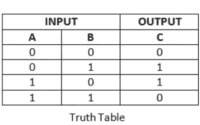

下面的时序图显示了 XOR 门的输入信号如何转换为最终的输出信号。

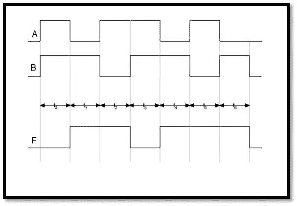

## 异或门

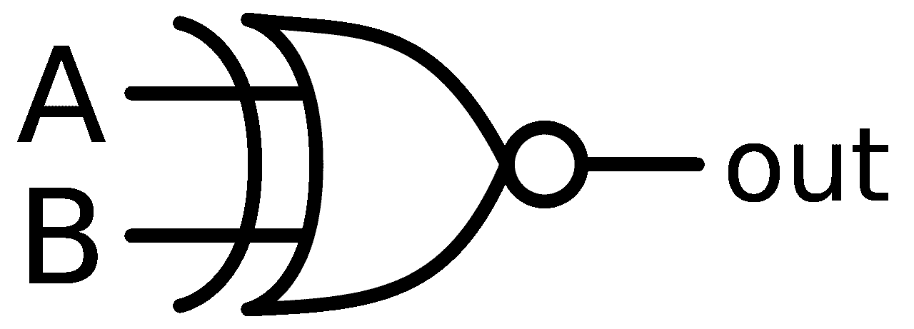

异或 XNOR 是通过取异或门的补码得到的。XNOR 门的输出仅在输入的逻辑电平相同时为高，在输入的逻辑电平相反时为低。

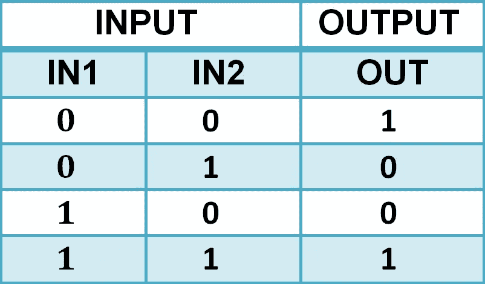

下面的时序图显示了 XNOR 门的输入信号如何转换为最终的输出信号。

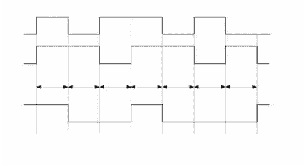

Timing Diagram for XNOR Gate

参考，

数字基础(第 10 版)——托马斯·弗洛伊德