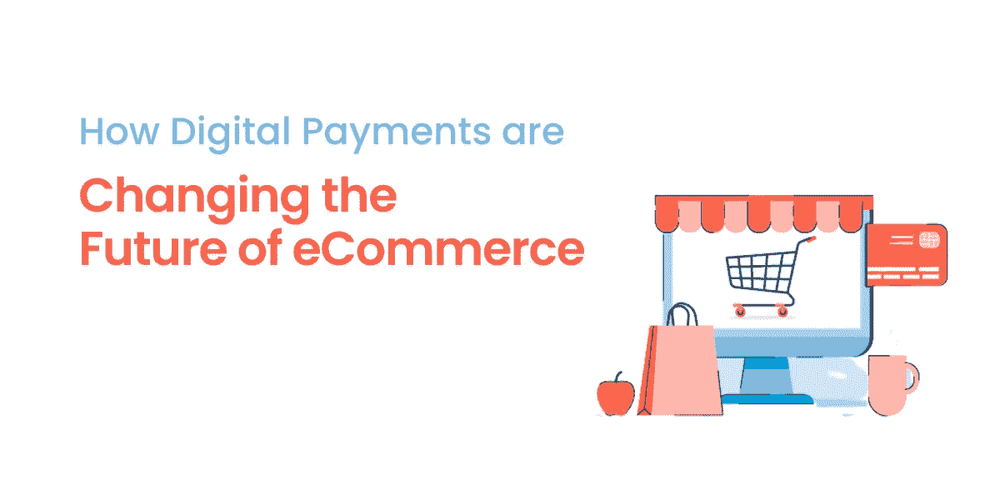
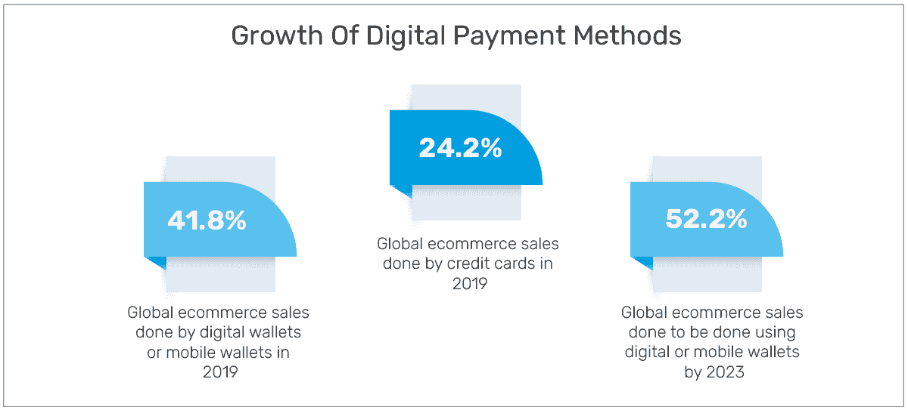

# 数字支付:改变电子商务的未来

> 原文：<https://medium.com/geekculture/digital-payments-changing-the-future-of-ecommerce-businesses-536dc5abe45d?source=collection_archive---------23----------------------->

近年来，电子商务的普及程度急剧上升。不可否认，如今，疫情通过数字支付推动了相当大一部分电子商务交易。

甚至在更早的时候，电子商务网站就开始加速并挑战线下商店，但在实施封锁后，在线企业似乎占据了上风。

> 一项研究表明，大约 30%的消费者现在热衷于网上购物，作为安全和健康协议的一部分。为了迎合网上投注者，电子商务商家正在考虑数字 [***支付处理解决方案***](https://www.gettrx.com/) 进行无麻烦的交易。

在这篇博客中，我们将探索更多关于电子商务和 [*在线支付处理*](https://www.gettrx.com/payment-processing-basics/) 以及数字支付如何改变电子商务的未来。

# **将业务与新机遇交织在一起**

数字化创造了广泛的新前景，也推动了电子商务的发展。金融科技领域通过选择快速发展的技术迅速进入市场。它通过减少线下或现金交易的旧障碍，赋予了几个行业权力。

一些金融科技公司通过帮助电子商务行业简化流程、降低成本和优化消费者服务来鼓励电子商务行业。

银行业革命性的电子支付方式让更多的消费者可以使用数字支付。

利用不同的数字 [*支付方式可以增加收入*](https://www.techsling.com/how-small-businesses-now-increase-their-revenue-and-save-on-payment-processing/) 并让您的消费者用电子支付方式支付购物账单。

# **为什么电子商务蓬勃发展？**

电子商务行业在过去几年中一直在显著增长，可以预见的是，增长率在未来将会增加。当然，电子商务和在线支付是并行不悖的。数字支付技术的进步正在推动电子商务生态系统，显示出在未来一段时间内的高增长。

> 根据一份报告，今年全球数字支付的总交易额约为 8.5 万亿美元，其中很大一部分，约 5.5 万亿美元的交易额来自电子商务领域。

数字支付的增长极大地推动了电子商务网站的发展，因为它们一直在使用在线方法进行交易。据调查，几年前，超过 70%的交易是通过数字支付方式完成的。

## **以下是数字支付如何推动电子商务业务的总结:**

*   **支付变得更容易了:**自动取款机前排起长队取钱现在让每个人都兴奋不已。电子商务和数字支付方式极大地提高了便利性。它让消费者轻松地进行交易，而不用担心口袋里有足够的现金。简而言之，通过电子转账进行网上购物节省了时间成本，也丰富了顾客的购物体验。
*   **降低运营成本:**数字支付方式降低了运营成本，这是企业增长的一个乐观因素。在电子商务业务中选择数字支付有助于避免支付转账或支票清算中断。这节省了时间，增加了现金流，减少了人工操作。
*   **企业增加收购的篮子规模:**大多数传统行业提供有限的产品或服务，因为它们展示产品的空间有限。

然而，电子商务网站没有空间限制，因为产品是在线分类的。

因此，企业可以通过由数字支付方法、优惠券管理选择和流畅的结账页面支持的在线平台来追加销售和交叉销售其产品。

*   **提高安全性:**电子商务网站容易受到网络安全威胁，如拒绝服务(DoS)攻击、e-skimming 攻击和试图使用窃取的信用卡号码完成交易的计算机化机器人。然而，一些金融公司提供了 PCI DSS 默认的解决方案。它有助于接收客户的付款，并安全地处理所有交易。

# **电子商务平台中数字支付的增长**

个人不需要现金或支票来进行数字支付交易。它鼓励在电子商务平台上使用非接触式支付、信用卡、借记卡和移动钱包。逐渐地，由数字支付支持的电子商务越来越受欢迎。

*Digital payments in the country will grow to 71.7% of all payment transactions by 2025.*

# **让我们来了解一些推动电子商务发展的流行支付方式！**

在研究和学习了大量的支付处理网关后，我们目前提出了市场上的最佳选择。

无论您是现有的电子商务企业还是白手起家建立企业，在这里您都将获得推动电子商务发展的最佳支付方式:

## **1。GETTRX:**

使用 GETTRX，您可以处理所有类型的商业支付。它为你的软件提供在线支付、面对面交易和账户分割交易。

对于商家，它提供特殊的 API、电子商务插件、POS 和终端。它提供个人开始在线销售商品和服务所需的一切。此外，它还提供订阅、发票和更快的审批。

## **2。Shopify:**

Shopify 是支付处理商、在线零售商和电子商务营销的一体化解决方案。

一旦商人注册了账户，Shopify 支付就开始了。启用信用卡和其他数字支付已经刻不容缓。

此前，Shopify 支持 Authorize.net 在美国收款。但是，最近，您不得不在支付中选择第三方提供商来添加[授权(dot)网络支付网关](https://www.gettrx.com/shopify-and-authorize-net-compatibility-issues/)。

## **3。支付仓库:**

因其基于会员费的定价模式和完全半透明的定价，被称为信用卡处理的 Costco。这种支付方式只收取一次会员费，而不是每次交易都向个人收费。你可以根据个人每年的交易量来选择会员套餐。

# **结论**

数字支付为顾客提供了一种无忧无虑的购物体验。这导致了电子商务在全国各地的非凡发展。然而，数字支付的兴起也加速了网络安全威胁。

因此，选择一个可靠的电子商务支付网关并跟踪各种[支付行业趋势](https://www.gettrx.com/payment-industry-trends/)对于安全交易和提高消费者参与度至关重要。