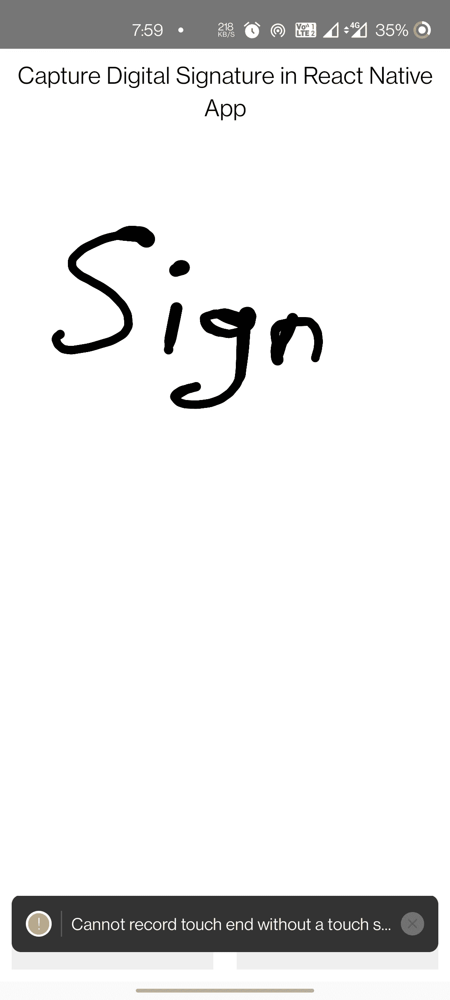

# 数字签名—本地反应

> 原文：<https://medium.com/geekculture/digital-signature-react-native-a87f3d8daecb?source=collection_archive---------4----------------------->

数字签名已经存在一段时间了。在撰写本文时，如果不创建和使用数字签名来接受用户确认，您几乎不可能成为一名移动开发人员。

Signature Screen

数字签名听起来就像是用纸和笔签署文件的现代替代物。它使用先进的数学技术来检查**数字**消息和文档的真实性和完整性。

# 装置

你必须安装`[react-native-signature-capture](https://github.com/RepairShopr/react-native-signature-capture)` 包。如果您使用 Expo，还需要运行`expo install`命令来安装它的依赖项！

# App.js

上述代码代表了签名板和保存并重置的实际代码。

# 保存并重置标志

在我们的 App.js 中，我们将像往常一样创建函数 App 和`export default App;`

上面有几点说明:

*   首先，我们使用 createRef()函数创建一个引用变量来跟踪我们的签名 ref。
*   我们正在创建保存签名和重置签名的两种方法。
*   `saveSign()`使用`sign.current.saveImage()`功能在运行时将图像保存在本地。
*   `resetSign()`使用`sign.current.resetImage()`功能在运行时本地重置图像。

# 事件捕获

代码只是生成一个响应`__onSaveEvent`来捕获手势移动，生成`__onDragEvent`来记录拖动事件。

# 代码参考

**Github 链接**——[https://github.com/LuffyAnshul/RNDigitalSignature](https://github.com/LuffyAnshul/RNDigitalSignature)