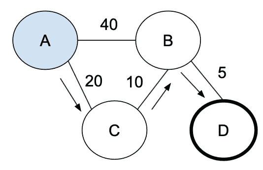

# 迪克斯特拉

> 原文：<https://medium.com/geekculture/dijkstra-62356e584680?source=collection_archive---------5----------------------->

## Dijkstra 是定义(正)加权图中两个节点之间最短路径的标准算法。

这里最重要的是使用优先级队列对最短路径进行排序。如果当前节点是目的地，我们返回当前路径(最短的一个)；否则，对于当前节点的所有邻居，我们将一条新路径排入队列。我们浏览图表…