# 降维与主成分分析

> 原文：<https://medium.com/geekculture/dimensionality-reduction-and-principal-component-analysis-6e4d8ec6a312?source=collection_archive---------27----------------------->

Photo by [Misael Moreno](https://unsplash.com/@moreno303?utm_source=medium&utm_medium=referral) on [Unsplash](https://unsplash.com?utm_source=medium&utm_medium=referral)

这是我正在从事的系列文章的第九部分，其中我们将讨论和定义介绍性的机器学习算法和概念。在这篇文章的最后，你会找到这个系列的所有前几篇文章。我建议你按顺序读这些。原因很简单，因为我在那里介绍了一些概念，这些概念对于理解本文中讨论的概念至关重要，我将在许多场合引用它们。

今天我们来看看降维的重要性，以及最广泛使用的降维算法——主成分分析(PCA)算法。

让我们开始吧。

# 降维

降维是指从一个复杂的多维数据集到一个更简单的更少维度的数据集。例如，从三维数据集到二维数据集。重要的是，我们这样做是为了保持原始数据的有意义的属性。

这可能是有用的，原因有二。

## 原因一:数据压缩

第一个原因是数据压缩。很多时候，我们将要处理的数据有许多冗余特征。例如，如果我们希望使用线性回归来预测波士顿房子的价格，我们可能会使用以两种不同的度量单位(比如米和英尺)来表示房子大小的数据。我们真的需要所有这些信息吗？房子的项目经理可能会，但你的机器学习模型肯定会很好。我们可以通过将这些信息压缩到一个单元而不是两个单元来减小数据集的大小。这不仅会产生更小的数据集，还能更快地从算法中学习。考虑下面的二维图形，其中`x^(i)`表示由特征`x_1`和`x_2`定义的训练点:

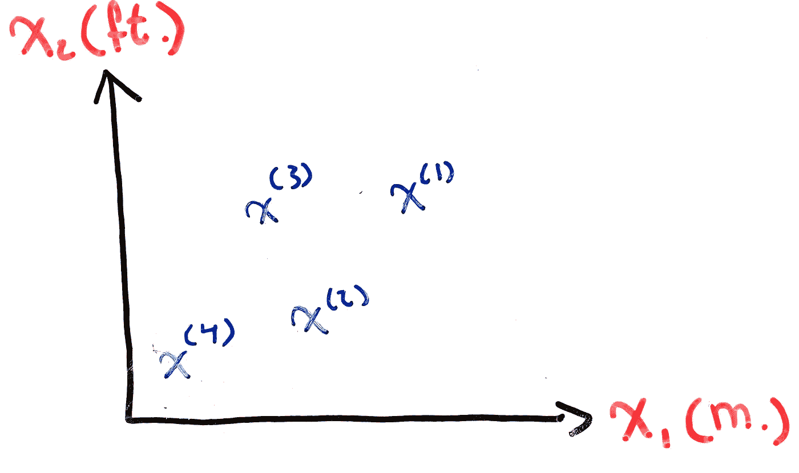

**Figure 1:** Random Training Points on a Graph

我们希望把它简化成一维图。为此，我们将通过我们的点拟合一条线:

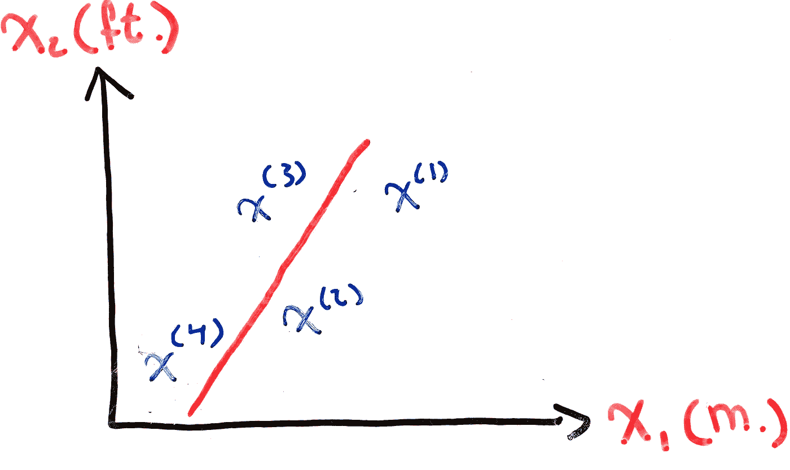

**Figure 2:** Line Fitted Through Random Training Points

然后计算从我们的点到拟合线的**正交距离**:

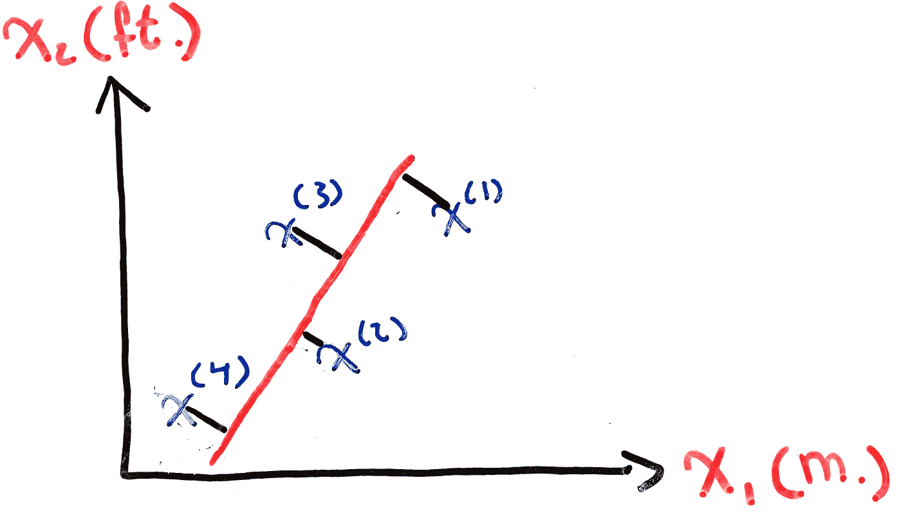

**Figure 3:** Orthogonal Distance from Training Points to Fitted Line

你可能会认为上图与我们使用普通最小二乘法进行线性回归时看到的一样(参见[第二部分](https://ali-h-khanafer.medium.com/linear-regression-using-gradient-descent-intuition-and-implementation-522d43453fc3))，但是我们稍后会解释它们之间是如何没有关系的。

通过计算正交距离，我们可以将我们的点投影到拟合线上。训练点在直线上的值就是它在一维平面上的值。这就是它的样子:

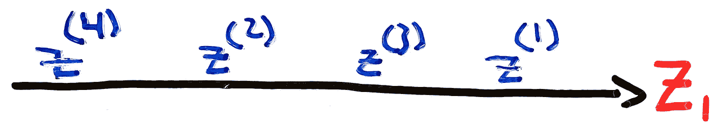

**Figure 3:** Training Points After Dimensionality Reduction

其中`{z^(1),z^(2),z^(3),z^(4)}`是将`{x^(1),x^(2),x^(3),x^(4)}`投影到我们拟合的线上后的新值，`z_1`是描述我们训练点的新特征。

## 正交与平方距离

在**图 3** 中，我们看到了一个图表，该图表可能与我们在线性回归中计算训练点和拟合线之间的距离时看到的典型图表相混淆。

虽然它们在视觉上很相似，但两者传达的是完全不同的信息。让我们并排比较一下:

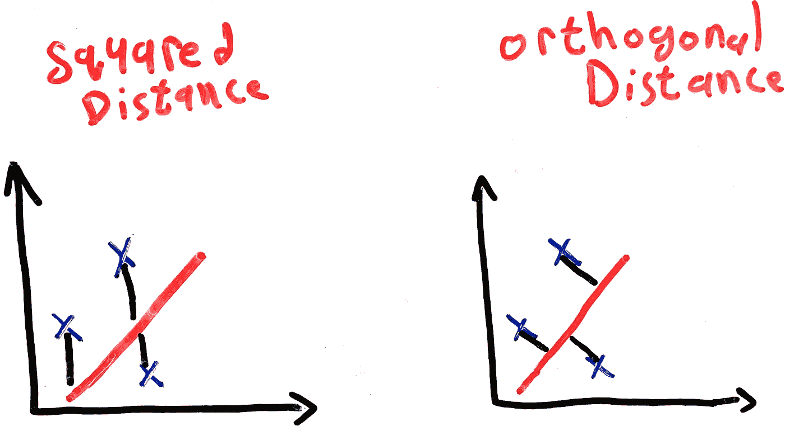

**Figure 4:** Squared vs Orthogonal Distance

我们看到正交距离垂直于拟合线。这具有假设因变量(x 轴)和自变量(y 轴)中有误差的影响。我们可以通过训练点和直线之间的距离同时具有`x`和`y`分量这一事实看出这一点:

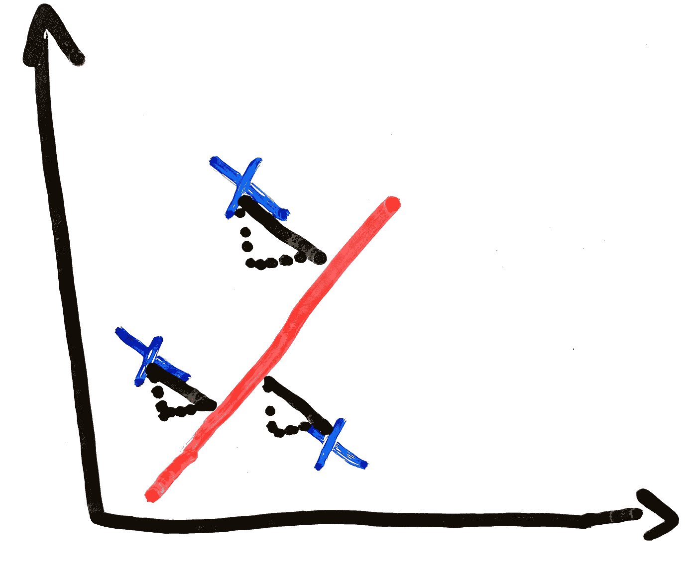

**Figure 5:** X and Y Components in Orthogonal Distances

在为线性回归计算的平方距离中，假设因变量没有错误。因此，我们只计算从训练点到拟合线的`y`距离。

## 原因之二:可视化

当我们的数据集是二维或三维的时候，它更容易被可视化。当处理具有数千个特征的数据集时，降维可以通过缩小数据所在的空间来帮助我们更容易地可视化数据。

# 线性代数评论

在描述 PCA 算法之前，我们需要回顾一些线性代数和统计概念。

## 方差、协方差和协方差矩阵

1.  **方差:**描述数据集分散程度的度量。它描述了数据点和数据集均值之间的分布:

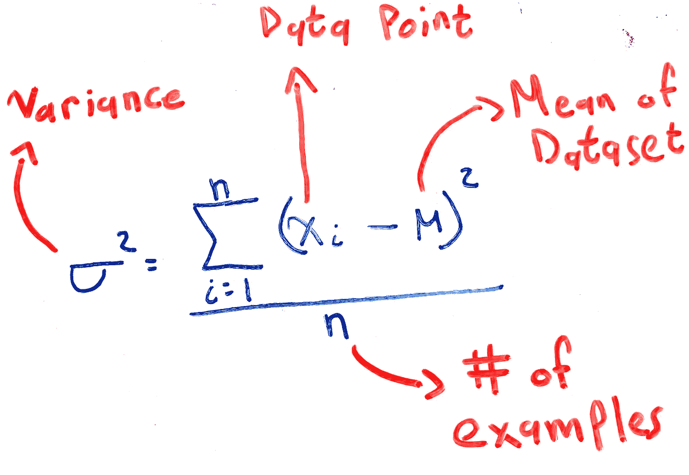

**Equation 1:** Variance of a Population

2.**协方差:**描述两个随机变量如何对彼此的变化做出反应的度量。你可能会认为这个定义等于两个变量之间相关性的定义。你没有完全错。两者的区别在于相关性是标准化的，而协方差不是。也就是说，两个变量之间的相关性是一个介于-1 和+1 之间的值。**变量与其自身的协方差等于该变量的方差**。

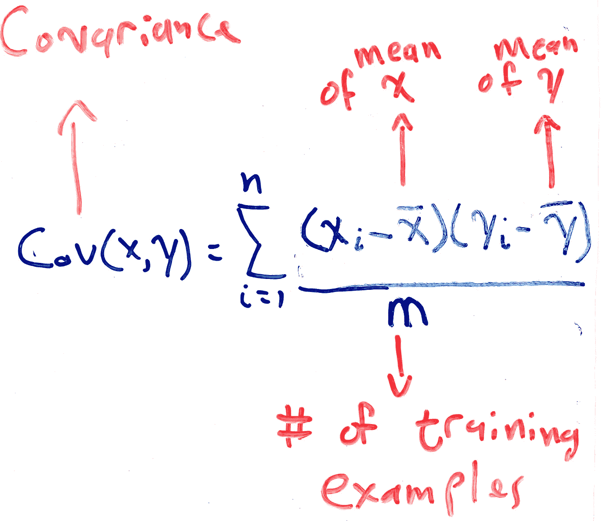

**Equation 2:** Covariance of a Population

3.**协方差矩阵:**描述所有特征组合对之间协方差的方形对称矩阵。考虑描述两个特征`A`和`B`之间的协方差的简单 2x2 矩阵。协方差矩阵看起来像这样:

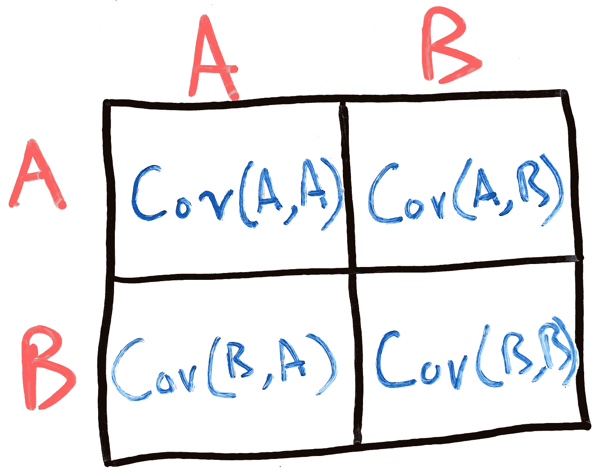

**Figure 7:** Covariance Matrix Example

请注意，对角线由特征集的所有方差组成。还要注意`Cov(A,B) = Cov(B,A)`，使我们的矩阵对称。

# 主成分分析

主成分分析(PCA)是处理降维时最广泛使用的算法。

在我们将训练集的维度从二维问题降低到一维问题的示例中，我们的目标是找到一条最小化投影误差的线。也就是说，我们希望找到一条直线，在这条直线上，训练点和直线之间的平均正交距离最小。更正式地说，我们希望找到一个二维单位向量`u^(1)`(或`-u^(1)`)，我们可以将训练数据投影到这个向量上，以便最小化投影误差:

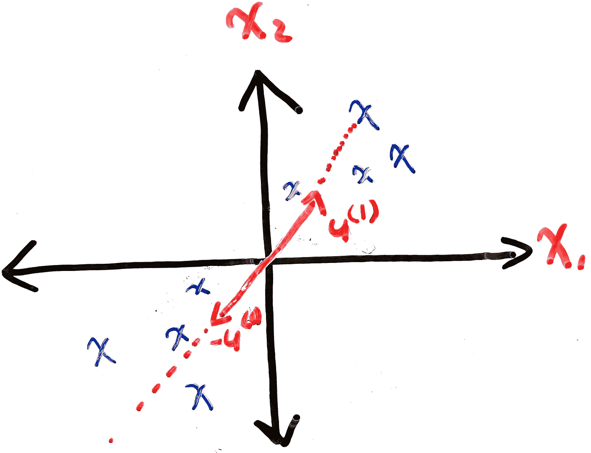

**Figure 8:** Unit Vector That Minimizes Projection Error

但是很明显，我们的数据并不总是二维的。因此，陈述我们的问题的一种更一般化的方式是:找到将数据投影到的`k`向量`{u^(1),u^(2),...,u^(k)}`，以便最小化投影误差。

让我们看看 PCA 是如何找到这些向量的。

## 直觉

我们要做的第一件事是使用**均值归一化**来归一化我们的数据。如果您不知道这是什么意思，请参考本系列的第一部分，[数据预处理](https://ali-h-khanafer.medium.com/data-pre-processing-ee81bbe5cc77)。要记住的最重要的事情是，标准化将改变我们的数据，使其平均值为零。

第二步是要素缩放，但前提是您的数据需要。同样，如果你不知道那是什么意思，我建议你参考第一部分。

一旦我们完成了所有的数据预处理，我们就剩下一个均值为零的数据集，并准备好用于我们的 PCA 算法。首先，我们计算训练数据的协方差矩阵。你可能想知道*为什么*我们要计算协方差矩阵。请这样想:我们说过协方差类似于相关性，因为它计算任何两个变量之间变化的相似性。那么，如果 PCA 的目标是通过找到冗余特征来减少我们的训练数据的维度，那么确定相似特征的更好方法是确定它们是否以相似的方式变化。下面是我们构建协方差矩阵的方法:

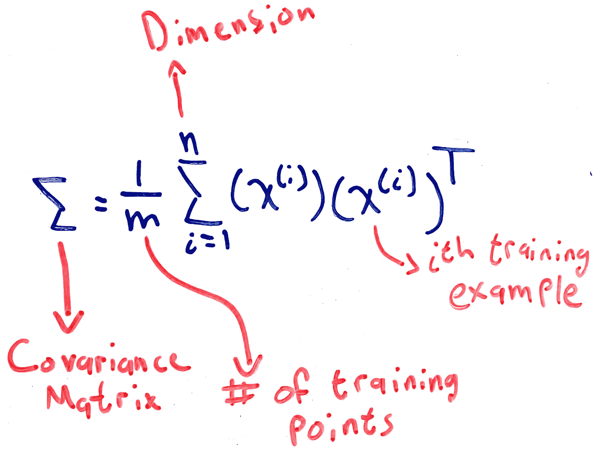

**Equation 3:** Covariance Matrix

这个等式可能会带来一些混乱:

1.  不要将协方差符号 sigma 误认为求和符号。相同的符号，不同的意义。
2.  如果您将此与我们在**等式 2** 中看到的协方差等式进行比较，您会注意到我们没有从训练示例中减去平均值。为什么？因为我们对数据进行了标准化，所以数据的平均值为零，所以我们省略了等式的这一部分。
3.  我建议你运行一个例子，看看如何成功地计算协方差矩阵。给自己两个`3x1`训练矩阵，然后应用协方差矩阵方程。

接下来，我们对协方差矩阵执行**奇异值分解(SVD)** 。SVD 背后的理论远远超出了本文的范围，所以我们将快速描述一下*它如何给我们带来好处。SVD 是一种矩阵分解算法。给定一个矩阵`M`，SVD 会把它分解成三个独立的矩阵`U`、`S`和`V`。这三个矩阵都有重要的意义。在我们的例子中，我们最关心的矩阵是`U`矩阵。这些矩阵的列描述了我们的单位向量`{u^(1),u^(2),...,u^(n)}`。注意这个向量是一个`n x n`矩阵。我们需要做的就是选择第一个`k`向量。例如，如果我们希望将数据集从三维减少到二维，`U`将是一个`3 x 3`矩阵，但是我们将选择前两列。*

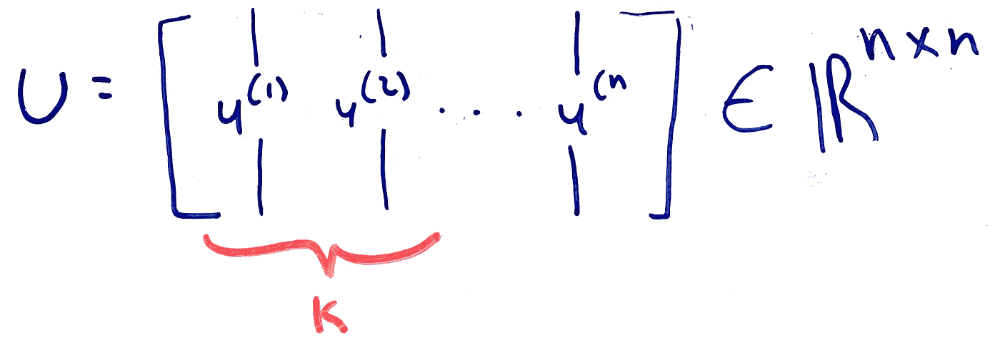

**Figure 9:** Unit Vector Matrix

最后，剩下要做的就是将我们的训练示例乘以`U`单位向量，我们最终得到所有`x^(i)`训练示例的投影值:

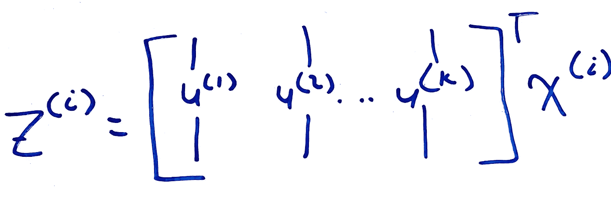

**Figure 10:** Projected Training Data

# 结论

在本文中，我们研究了降维的概念和最广泛使用的降维算法，主成分分析(PSA)。我们还快速复习了重要的线性代数和统计概念。

在下一篇文章中，我们将研究异常检测。在此之前，我们让您思考以下几点:

*   所有的数据维度都是可约的吗？如果不是，在什么情况下不是？
*   扩展我们在将数据集从二维缩减为一维时所做的工作，但这一次，将三维数据集扩展为二维数据集。

# 过去的文章

1.  **第一部分:**数据预处理
2.  **第二部分:** [使用梯度下降的线性回归:直觉和实现](https://ali-h-khanafer.medium.com/linear-regression-using-gradient-descent-intuition-and-implementation-522d43453fc3)
3.  **第三部分:** [使用梯度下降的逻辑回归:直觉和实现](/geekculture/logistic-regression-using-gradient-descent-intuition-and-implementation-36a8498afdcb)
4.  **第四部分— 1:** [神经网络第一部分:术语、动机和直觉](/geekculture/neural-networks-part-1-terminology-motivation-and-intuition-73675fc43947)
5.  **第四部分— 2:** [神经网络第二部分:反向传播和梯度检测](/geekculture/neural-networks-part-2-backpropagation-and-gradient-checking-4f8d1350fb0b)
6.  **第六部分:** [评估你的假设，理解偏差与方差](/geekculture/evaluating-your-hypothesis-and-understanding-bias-vs-variance-86512cce4253)
7.  **第七部分:** [支持向量机和核](/geekculture/support-vector-machines-and-kernels-8b064ee53fc3)
8.  **第八部分:** [无监督学习和 K-Means 聚类背后的直觉](/geekculture/unsupervised-learning-and-the-intuition-behind-k-means-clustering-9805ed89fa0)

# 无耻的插头

*   **推特:**twitter.com/ali_khanafer2

# 参考

1.  [吴恩达的机器学习 Coursera 课程](https://www.coursera.org/learn/machine-learning?page=1)
2.  [Scipy 正交距离回归](https://docs.scipy.org/doc/scipy/reference/odr.html)
3.  [人口方差|描述统计|概率统计|可汗学院](https://www.youtube.com/watch?v=dvoHB9djouc&ab_channel=KhanAcademy)
4.  [Investopedia 的理解方差 vs 协方差:有什么区别？](https://www.investopedia.com/ask/answers/041515/what-difference-between-variance-and-covariance.asp)
5.  [协方差矩阵](https://en.wikipedia.org/wiki/Covariance_matrix)