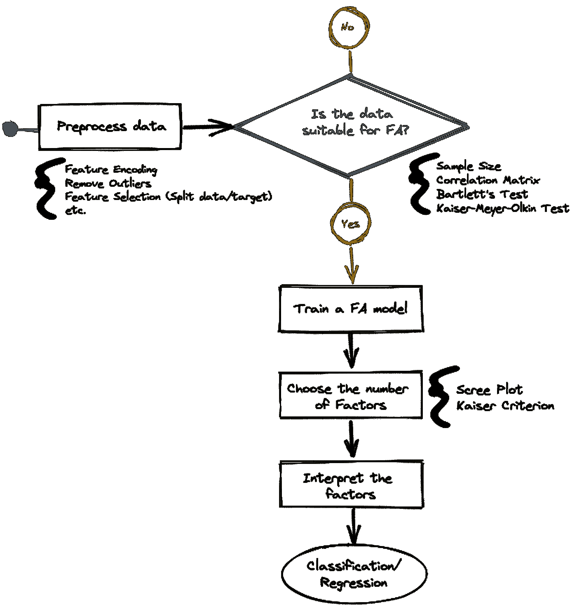
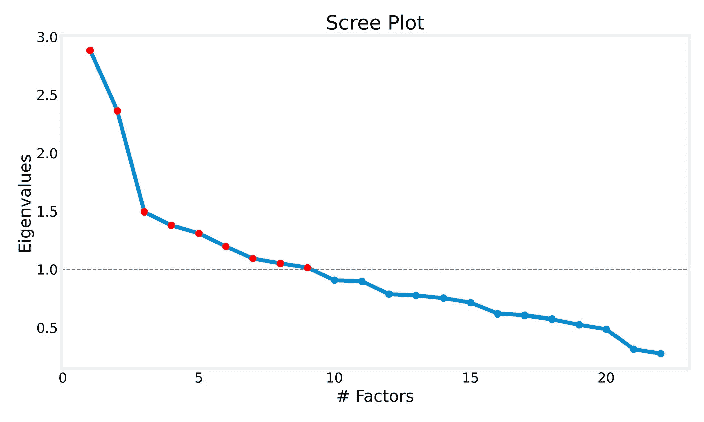
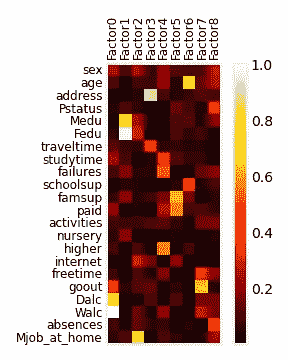
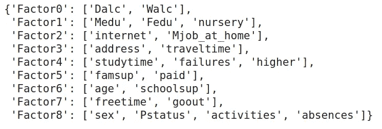
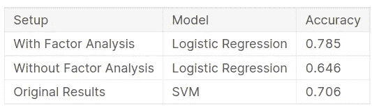
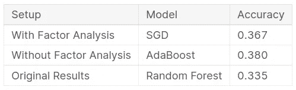

# 基于因子分析的学生成绩数据降维

> 原文：<https://medium.com/geekculture/dimensionality-reduction-with-factor-analysis-on-student-performance-data-fd4ca7082f63?source=collection_archive---------4----------------------->

## 一种具有可解释输出的降维技术


Photo by [NeONBRAND](https://unsplash.com/@neonbrand?utm_source=unsplash&utm_medium=referral&utm_content=creditCopyText) on [Unsplash](https://unsplash.com/s/photos/students?utm_source=unsplash&utm_medium=referral&utm_content=creditCopyText)

通常，我们用于数据分析和机器学习任务的数据集有几个变量。使用这样的数据集可能会破坏模型性能，并显著增加训练时间，或者使分析数据并从中获得洞察力变得极其困难。探索性因子分析(FA)是一种降维技术，它试图将相互关联的变量组合在一起，并产生可解释的输出。

在这篇文章中，我们将谈论因素分析背后的一般思想，并通过使用[学生表现数据集](https://archive.ics.uci.edu/ml/datasets/student+performance)的实践方法来理解它，以对学生是否会在数学课上取得成功进行分类。

# 术语和一般概念

为了应用因子分析，我们必须确保我们拥有的数据适合它。最简单的方法是查看特征的**相关矩阵**，并识别相关变量组。如果有一些相关度大于 0.3 的相关特征，使用因子分析可能会很有意思。高度相关的多组特征将被合并成一个变量潜势，称为**因子**。

因此，获得的因子创建了一个新的维度来“解释”组成它的一组特征。一个变量的得分在一个因子上的投影称为**因子得分**，一个变量与一个因子的相关性称为**因子加载**。如果我们对变量的因子负载的平方求和，我们会得到一个称为**公度**的量，其范围从 0 到 1，并测量变量的方差在多大程度上由因子解释。

因此，因子分数可以在回归和分类任务中用作具有更少维度的空间的新特征。另一方面，因子载荷对于测量特定变量对因子的重要性特别有用。

## 程序

下图显示了如何执行因子分析的逐步过程。正如您肯定期望的那样，起点是通过进行特征编码、特征选择、去除异常值(FA 模型对异常值非常敏感)以及您认为可以做的其他事情来预处理数据。

然后，我们进入检查数据是否适合 FA 的阶段。我之前提到过，你可以简单地看特征的相关矩阵。然而，这是相当简单的，如果你是认真的，你也应该检查样本大小是否足够，并进行一些统计测试。

在评估数据质量之后，现在我们真正期待做的是:拟合 FA 模型。与主成分分析(PCA)的情况一样，我们事先不知道需要多少个维度来精简数据集，以便保留相当数量的特征方差。因此，我们需要一个为数据集选择因子(维度)数量的标准，稍后我们将讨论 Scree 图和 Kaiser 标准。

使用 FA 而不是 PCA 的主要优点是输出更容易解释。因此，自然地，FA 的最后一步是利用每个因素试图解释的变量的信息来解释这些因素。



Factor Analysis Step-by-Step diagram

# 预测学生表现

例如，我们将把上图中描述的过程应用于[学生成绩数据集](https://archive.ics.uci.edu/ml/datasets/student+performance)，解释输出因素，并在分类任务中使用它们来预测学生成绩。关于数据集的详细信息和完整的源代码可以在这个 [Kaggle 笔记本](https://www.kaggle.com/alexandrehsd/binary-multiclass-classification-factor-analysis)中找到。

该数据集最初有 33 个变量和来自两所葡萄牙学校的大约 395 名学生的数学课。这些功能包括学生成绩、人口统计、社会和学校相关信息。我们有关于一年级(G1)、二年级(G2)和三年级(G3)的信息，但是我们将尝试不使用 G1 和 G2 来预测 G3，因为这些变量与 G3 高度相关，并且使用 G1 和 G2 是没有用的，因为我们想要专门掌握其他变量与 G3 的关系。

```
# Load the dataset
DATASET = "student-mat.csv"
data = pd.read_csv(DATASET, sep=",")#-------- perform feature encoding -------#
# ...
#-------- end of feature encoding -------## split X and y
X = data.drop(labels=["G1", "G2", "G3"], axis=1)
y = data[["G3"]]
```

## 假设—评估数据适用性

为了适合因子分析，数据集必须满足几个假设:

1.  正态性:具有正态分布的特征大大改善了统计检验的结果。此外，这使得有可能将分析结果推广到所收集的样本之外。
2.  线性关系:变量对之间不能有**完美的**相关性，如果有，从每对中去掉一个变量。
3.  可分解性:检查数据集的至少一些变量是否相关，它们是否可以变成连贯的因子。
4.  样本量:应该足够大，以产生可靠的估计。理想情况下，数据集的每个变量必须至少有 20 条记录。

有关该主题的详细信息，请访问本页。

## 可分解性

可分解性是 FA 最重要的假设之一。有 3 种评估可分解性的方法:

> **相关矩阵**

要验证数据是否适合 FA，可以验证是否至少有一些相关性> 0.3。如果是这样的话，FA 的算法将能够找到相互关联的变量组。这种方法的一个局限性是，随着数据集中变量数量的增加，实际上不可能跟踪变量之间的关系。

> **球度的巴特利特检验**T2

Bartlett 的球形度检验表明相关矩阵是否是一个恒等式，相应地，检验的 p 值应该是显著的( *p < 0.05* )。学生成绩数据集的 p 值为 0。

```
chi_square_value, p_value = calculate_bartlett_sphericity(X)
chi_square_value, p_value
# (3375.41, 0.0)
```

> **凯泽-迈耶-奥尔金(KMO)试验**

KMO 检验衡量数据的抽样充分性。它有助于确定整个数据集以及每个变量的适当程度。KMO 值介于 0 和 1 之间。在这个问题上没有普遍的一致意见，但是许多人认为小于 0.5 的 KMO 值是不够的。

数据集的总体 KMO 值为 0.489，这并不好。然而，在去除所有变量后，KMO < 0.5, the overall KMO was 0.639:

```
# Compute KMO for the original dataset
kmo_all, kmo_model = calculate_kmo(X)print("Overall KMO = {:.3f}".format(kmo_model))
# Overall KMO = 0.489# Select only adequate variables and recompute KMO
kmo_passed = list(X.columns[kmo_all >= 0.5])
X_kmo = X[kmo_passed]
kmo_all, kmo_model = calculate_kmo(X_kmo)print("Overall KMO = {:.3f}".format(kmo_model))
# Overall KMO = 0.639X = X_kmo.copy() # overwrite the dataset
```

## Choosing the number of factors

Now we have a suitable dataset, it is time to fit a model. The [因子分析器](https://factor-analyzer.readthedocs.io/en/latest/factor_analyzer.html#factor-analyzer-analyze-module)包可能是你的最佳选择。它的接口基于 Scikit-Learn 估算器。因此，代码遵循相同的逻辑。

拟合模型后，您将获得因子相关矩阵的特征值。根据 Kaiser 标准，您的模型将具有的因子数量由大于 1 的特征值数量决定。

在这种情况下，您首先拟合一个因子数量等于变量数量的模型:

```
**n_variables = len(X.columns)**
factor_model = FactorAnalyzer(**n_factors=n_variables**, rotation="promax")factor_model.fit(X)
```

然后，您将检查有多少特征值大于 1:

```
eigenvalues, _ = factor_model.get_eigenvalues()# count eigenvalues > 1
**number_of_factors = sum(eigenvalues > 1)**
```

并且重新训练模型来指示这些因素的数量:

```
factor_model = FactorAnalyzer(**n_factors=number_of_factors**, rotation="promax")factor_model.fit(X)
```

另一种广泛使用的选择因子数量的方法是 Scree 图分析。这是一个选择许多因素的可视化工具。你也可以像我上面所做的那样通过编程来实现。绘制特征值与因子数量的关系图，并计算有多少特征值大于 1。



Scree Plot

变量编码后的原始数据集有 38 个特征。然后，在除去那些被 KMO 测试认为不充分的特征后，我们剩下了 22 个特征。最后，使用 Kaiser 标准，我们将特征的数量(在本例中是因子)减少到 9。

## 因素解释

一旦我们有了新的模型，我们必须解释这些因素。事实上(*我想强调这一点*)，这就是使用因子分析进行降维的全部意义:拥有一个具有更少特征的可解释数据集。



Factor loadings heatmap

在左图中，您可以看到因子加载热图。每个变量与每个因素的关系强度由因素负荷决定。

因子载荷的范围从-1 到 1，可以解释为变量与因子的相关性。因此，我们将每个变量分配给绝对值最相关的因子。通过这样做，我们可以:



Variables grouped into factors

这些变量组多少有些意义。看看每个因子表示下都分组了哪些变量:

*   ***Factor0*** :工作日和周末饮酒量。
*   ***Factor1*** :父母学历，是否上过幼儿园。
*   ***Factor2*** :家中已上网或母亲在家工作。
*   ***Factor3*** :学生地址和家到学校的乘车时间。
*   ***Factor4*** :每周学习时间，以往上课失败次数，学生是否想接受高等教育。
*   ***因素 5*** :家庭教育支持和学生是否参加额外付费课程。
*   ***因素 6*** :学生的年龄以及学生是否有额外的教育学校支持。
*   ***Factor7*** :放学后的自由时间以及学生与朋友外出的频率。
*   ***Factor8*** :学生性别、父母同居状况、学生是否参加课外活动、缺课次数。

一旦我们对因子解释感到满意，我们就可以通过对原始数据集应用变换来获得新的数据集:

```
X.shape
# (395, 22)X_latent = factor_model.transform(X)
X_latent.shape
# (395, 9)
```

# 二元和多元分类结果

最后，有了新的数据集，我们可以执行监督学习任务。我们可以完成 3 种类型的任务:

1.  二元分类法:试着预测一个学生是否会成功。
2.  多级分类:尝试根据基于 Erasmus 等级转换系统的 5 级分类对学生表现进行分类:不及格、足够、满意、良好和非常好。
3.  回归:尝试预测学生的最终成绩。

在这项研究中，我只做了前两个分类任务，并将它们与[原始论文](http://www3.dsi.uminho.pt/pcortez/student.pdf)中报告的结果以及使用数据集获得的结果进行了比较。



Binary classification results

正如我们所看到的，在二元分类设置中使用因子分析被证明是更有价值的。与原始论文的结果相比，我们成功地将性能提高了 11.2%。



Multiclass classification results

同时，在多类分类设置中，我们还设法提高了分类器的准确性，尽管它并不比使用数据集而不应用因子分析更好。然而，您必须记住，带有 FA 的数据集的要素要少得多。因此，训练时间和 CPU 资源消耗要低得多。

感谢您的时间，我将感谢您的反馈。带注释的源代码和完整的探索性因素分析可从[这里](https://www.kaggle.com/alexandrehsd/binary-multiclass-classification-factor-analysis)获得。编码快乐！