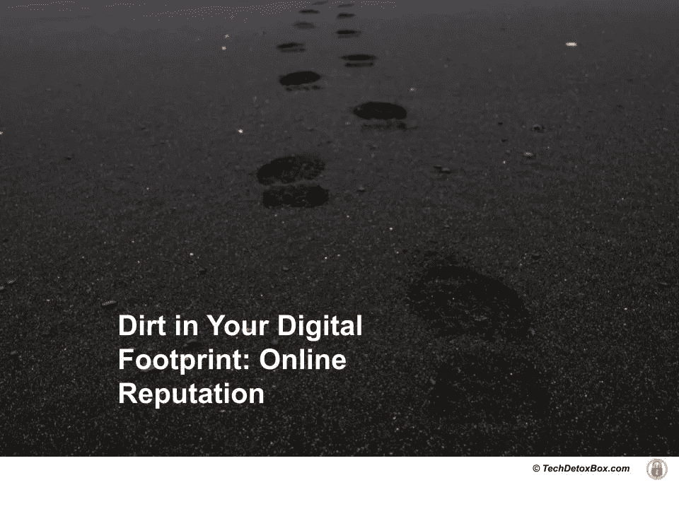

# 你数字足迹中的污垢:在线声誉

> 原文：<https://medium.com/geekculture/dirt-in-your-digital-footprint-15cfbaaedeb9?source=collection_archive---------34----------------------->

Image by Jack Millard on Unsplash

一天，我女儿放学回家，惊叫道:“妈妈，你不会相信今天发生了什么！”

她所在年级的一些男生想出了一个应对抖音挑战的好主意，他们故意破坏学校财产，并彻底捣毁了一个男生浴室。他们把过程记录下来，让全世界都看到，并热切地等待着他们的喜欢和追随者。

*猜猜几分钟后谁发现了。*校长。扩音器里传来通知，让男孩们到办公室来，不幸的抖音明星们受到了沉重的打击:

*   *休学*
*   *当众羞辱*
*   *几千块钱的赔偿金让父母支付*

男孩们才 12 岁。希望他们能从这次经历中吸取教训，不再做那种蠢事。问题是:世界会忘记他们年轻时的过错吗？

> 被永远记录在网上的不良行为的长期后果是什么？
> 
> 当你的数字足迹中有灰尘时会发生什么？

网络声誉一旦毁了，会导致灾难性的后果。算法歧视的边界正在扩大:从被拒绝接受教育和就业到被全人类永远羞辱。

# “我不是故意的！”不是借口

在数字世界里很容易犯错。尤其是如果你很年轻，而且“*不是故意的*”。

青少年不会再考虑他们在网上发布的任何东西都是永久的，而不是私人的。他们与青少年冲动分享的大量内容使得错误不可避免——仅仅是大数法则。有些人会被他们认为无伤大雅的玩笑所冒犯。然后对罪犯来说一切都乱套了。

一旦某样东西出来了，它就会夺走自己的生命。删除一张有罪的图片或帖子已经太晚了——它已经被转发了数百次。人们被激怒了。当局介入了。*“我没在想！*“不是借口。他们不能收回，记录是永久的。

> 孩子们在网上犯的错误是违法的。

不是否认他们做错了什么。但如今他们付出的代价太高了:一次失足可能毁掉他们的余生。他们被贴上网络欺凌者的标签，并被学校开除。发送给迷恋对象的裸照最终会出现在公开的互联网上，并给他们留下性侵犯记录。关于武器的笑话导致了一场真正的逮捕。

由于他们不成熟的大脑和冲动的行为——青春期发展的正常特征——青少年把事情搞砸了。很多。那是青少年总是做的。我们年轻时，他们的父母就是这么做的，我非常感激网上没有我 15 岁时的记录。我的孩子们就没有这么幸运了——对他们这一代人来说，他们在网上做的一切都可能被用来对付他们。作为一个妈妈，我对自己频繁给孩子上课的行为很偏执:“*不要在网上分享任何关于自己的事情！*“只要在我力所能及的范围内，我鼓励他们远离社交媒体。

大学和雇主会定期检查我们孩子的网络历史。如果他们在青少年社交媒体聊天中发现任何“*与我们的政策*不一致”，我们的孩子将不会被录取或雇用。

> 没有什么会被遗忘，没有什么会被原谅。以你 13 岁时的表现来评判你 26 岁时的表现有多公平？

# 保持沉默为时已晚

****你有权保持沉默。你所说的一切都将成为对你不利的证据。它意在保护个人的权利——在被证明有罪之前被假定为无罪。这是美国民主的基础。该规则是基于宪法第五修正案，旨在防止一个人意外地证明自己有罪。每个律师都会告诉你，保持沉默是最明智的做法。****

> *除非违法行为发生在网上，否则保持沉默为时已晚。你已经被定罪了。*

*你已经说出了所有会被用来对付你的证据。*

# *毫不留情*

*凯瑟琳·斯坦纳-王茂林在她的书《大分离》中写道，7 岁的孩子因为使用暴力语言而被学校开除，这些语言是他们从媒体上学来的，显然他们并没有完全理解。这些孩子需要大人的帮助，筛选时间界限——而不是严厉的惩罚！甚至耶稣在十字架上也说:*“赦免他们，因为他们不知道自己在做什么！”但是社会拒绝原谅那些幼小脆弱的大脑被数字媒体损害的孩子，这些媒体利用他们来牟利。**

*美国的监禁年龄是 18 岁，许多州对青少年犯罪的起诉限制很宽松，这是基于儿童发展的常识——孩子越小，越不能控制自己的行为。国家宽恕实际犯罪的儿童。但是学校可以因为他们简单的网络恶作剧而开除他们。这张照片有问题。*

*年轻人和无能的人是没有怜悯的。*

# *驱逐*

*几名学生因分享不恰当的模因而被取消哈佛入学资格。一篇 Snapchap 帖子[让一名高中运动员失去了康乃尔大学的入场券](https://www.nytimes.com/2020/07/02/us/racism-social-media-college-admissions.html)。*

*[查看社交媒体是大学招生委员会的公平游戏。他们在那里发现的东西可以抵消学生在官方申请中提交的所有好成绩、运动成绩和志愿者工作。](https://www.ivywise.com/blog/yes-college-admissions-officers-are-looking-at-social-media/)*

*一旦进入大学，在网上自由表达自己是一个最好不要涉足的雷区:[失去奖学金](https://www.azfamily.com/news/young-woman-loses-scholarship-to-acu-in-glendale-after-online-post/article_277f4b98-a6b0-11ea-aa79-e740f6383462.html)和因粗心的网上帖子被开除[经常发生。](https://thecollegepost.com/tennessee-student-lawsuit-sexual-posts/)*

# *解雇*

*大学毕业后情况并没有好转。有一长串的人因为社交媒体帖子而被解雇。在政治正确的氛围中，即使是最中立的观点也可能被曲解。不可能一直让每个人都满意。让我们面对现实吧:年轻员工缺乏高度的自制力，在一种即时满足的文化中成长为数字原住民。*

*一旦他们缺乏自制力，在网上留下永久记录，他们的名声就毁了。*

# *羞愧*

*随着日常活动越来越多地被记录，你甚至不必自己发布任何东西就可以陷入大量的麻烦。我想起了最近的一桩丑闻:三名年轻女子侮辱一名优步司机，因为他要求她们戴口罩。行为是丑陋的。司机受到了精神创伤，正义需要得到伸张。但是让我们花一分钟想想这些年轻女性和她们的未来。这一次被记录下来的愚蠢行为将会永远影响他们。这是人力资源经理在对他们进行尽职调查时会看到的，因为他们是潜在的雇员，不会有工作机会。可能成为他们未来丈夫的年轻男人会谷歌这些女孩臭名昭著的“成名要求”——也不会有求婚。没有未来的孩子。*

***后果可能会改变一生。***

*[TechDetox 妈妈](https://www.techdetoxbox.com/mission-screentime-children-wellbeing/)发现自己的孩子处于上瘾技术的[接收端，决定反击。](https://www.techdetoxbox.com/screen-time-problems/)*

*她对技术和心理之间关系的研究试图揭示数字行为操纵是如何影响人类福祉的。*

*她在她的博客[TechDetoxBox.com](https://www.techdetoxbox.com/)上写道，要找到[解决方案](https://www.techdetoxbox.com/digital-wellbeing/)来保护我们的家庭，恢复我们的人性。*