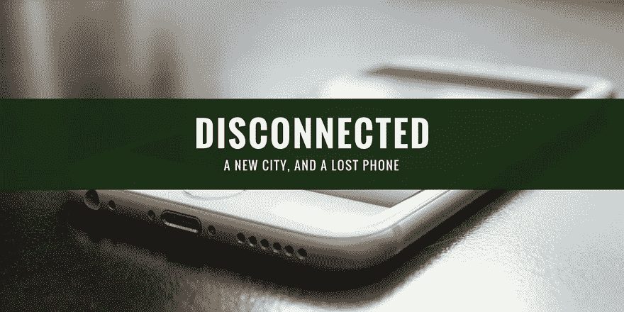

# 失联:一座新城市，一部丢失的手机

> 原文：<https://medium.com/geekculture/disconnected-a-new-city-and-a-lost-phone-2d190603c160?source=collection_archive---------45----------------------->

我们是不是太依赖手机了？我从潜在灾难中获得的 5 点经验…

回到 2015 年 8 月，我进行了很长时间以来的第一次商务旅行——去巴尔的摩市。

我以前去过巴尔的摩出差，我喜欢这个城市。它非常有活力，在费尔斯角有一个很棒的码头，里面装满了美味的海鲜。