# 使用 DailoGPT 和 HuggingFace API 的 Discord bot。

> 原文：<https://medium.com/geekculture/discord-bot-using-dailogpt-and-huggingface-api-c71983422701?source=collection_archive---------6----------------------->

## 使用 Hugging face API 设计自己的 Rick bot，并将其部署在 Replit 服务器上。


Photo by [Michael Marais](https://unsplash.com/@michael_marais?utm_source=medium&utm_medium=referral) on [Unsplash](https://unsplash.com?utm_source=medium&utm_medium=referral)

# 介绍

如果你想知道 Discord bot 是如何工作的，以及如何创建自己的机器人，像你最喜欢的漫画中的某个名人或某个角色那样说话，这表明你处于最佳起点。我们将学习如何使用 HuggingFace API，并把它作为一个不和谐的机器人。我们还将学习 Replit、Kaggle CLI 和 **uptimerobot** 来保持你的机器人运行。我们不会深入调整我们的 **DailoGPT** 模型，你可以查看这个[博客](https://towardsdatascience.com/make-your-own-rick-sanchez-bot-with-transformers-and-dialogpt-fine-tuning-f85e6d1f4e30)。

# 资料组

我们将使用一个 **Kaggle CLI** 来下载公开发布的 [Rick & Morty 脚本| Kaggle](https://www.kaggle.com/andradaolteanu/rickmorty-scripts) 。如果你想学习如何获得你的 Kaggle API 和如何使用 Kaggle CLI，请点击这个[链接](https://github.com/Kaggle/kaggle-api)。

```
!kaggle datasets download andradaolteanu/rickmorty-scripts -f RickAndMortyScripts.csv
```

如你所见，我们有几列:*索引，第几季，第几集，第几集名字，角色名字，和第 15 行。我们将关注名称和行列。*

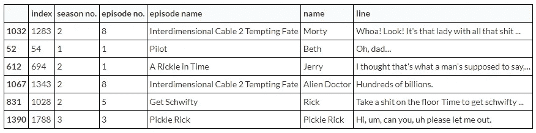

我们将转换这个数据集，每个响应行将包含 **n** 个以前的响应作为上下文。

```
CHARACTER_NAME = 'Rick'contexted = []

*# context window of size 7*
n = 7

**for** i **in** data[data.name == CHARACTER_NAME].index:
  **if** i < n:
    **continue**
  row = []
  prev = i - 1 - n *# we additionally substract 1, so row will contain current responce and 7 previous responces* 
  **for** j **in** range(i, prev, -1):
    row.append(data.line[j])
  contexted.append(row)

columns = ['response', 'context'] 
columns = columns + ['context/' + str(i) **for** i **in** range(n - 1)]

df = pd.DataFrame.from_records(contexted, columns=columns)
```

正如您在下面看到的，我们有响应列和 6 个上下文列。这将帮助我们微调我们的生成模型。之后，我们将从拥抱脸下载模型，并开始训练我们的模型。你可以在这里查看完整代码。

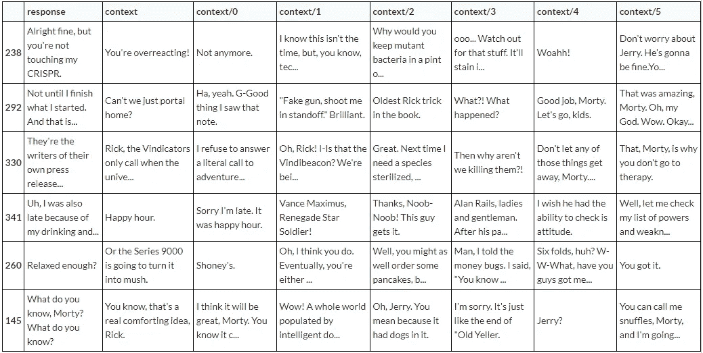

# 展开至拥抱脸

在对你的模型进行微调后，你可以简单地将你的模型部署到拥抱脸云，但在此之前，你需要创建一个 HF ( [拥抱脸](https://huggingface.co/))账户，并创建如下所示的模型。

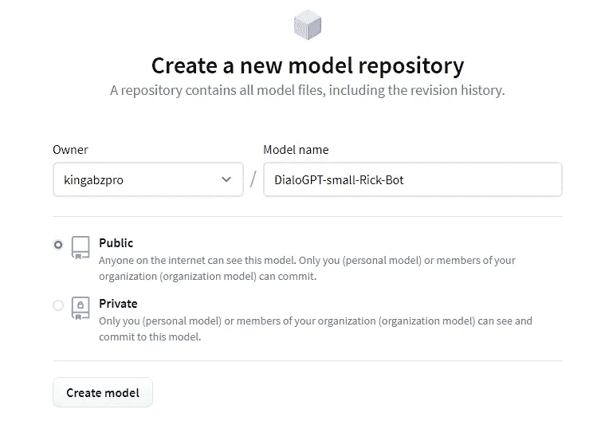

你将需要 HF API 来上传你的模式，你可以从设置中得到它。

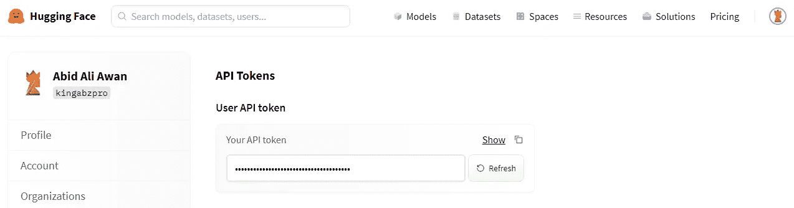

*   安装 git-lfs: git 扩展来上传更大的文件
*   配置 git 电子邮件和用户邮件
*   使用名为的 HF API 密钥和模型来上传标记化器和模型。

```
!sudo apt-get install git-lfsReading package lists... Done
Building dependency tree       
Reading state information... Done
git-lfs is already the newest version (2.3.4-1).
The following package was automatically installed and is no longer required:
  libnvidia-common-460
Use 'sudo apt autoremove' to remove it.
0 upgraded, 0 newly installed, 0 to remove and 40 not upgraded.!git config --**global** user.email "abidaliawan@rocketmail.com"
*# Tip: using the same email as your huggingface.co account will link your commits to your profile*
!git config --**global** user.name "kingabzpro"MY_MODEL_NAME = 'DialoGPT-small-Rick-Bot'
**with** open('/content/HuggingFace_API.txt', 'rt') **as** f:
  HUGGINGFACE_API_KEY = f.read().strip()model.push_to_hub(MY_MODEL_NAME, use_auth_token=HUGGINGFACE_API_KEY)
tokenizer.push_to_hub(MY_MODEL_NAME, use_auth_token=HUGGINGFACE_API_KEY)
```

您可以通过编辑您的型号卡来添加诸如 conversational、gpt2 等标签。你可以在这里查看我的型号。

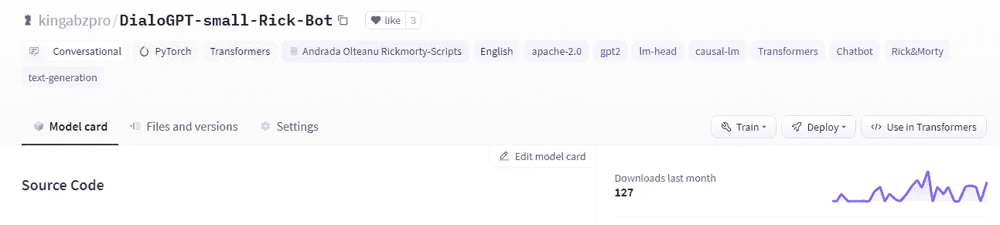

Image by Author

# 测试您的模型

部署之后，让我们使用 transformers 在 python 脚本中测试它。

*   使用 transformer 下载 tokenizer 和 model。
*   运行 4 个输入的循环
*   用户输入用于生成文本

```
tokenizer = AutoTokenizer.from_pretrained('kingabzpro/DialoGPT-small-Rick-Bot')
model = AutoModelWithLMHead.from_pretrained('kingabzpro/DialoGPT-small-Rick-Bot')
*# Let's chat for 4 lines*
**for** step **in** range(4):
    *# encode the new user input, add the eos_token and return a tensor in Pytorch*
    new_user_input_ids = tokenizer.encode(input(">> User:") + tokenizer.eos_token, return_tensors='pt')
    *# print(new_user_input_ids)*

    *# append the new user input tokens to the chat history*
    bot_input_ids = torch.cat([chat_history_ids, new_user_input_ids], dim=-1) **if** step > 0 **else** new_user_input_ids

    *# generated a response while limiting the total chat history to 1000 tokens,* 
    chat_history_ids = model.generate(
        bot_input_ids, max_length=200,
        pad_token_id=tokenizer.eos_token_id,  
        no_repeat_ngram_size=3,       
        do_sample=True, 
        top_k=100, 
        top_p=0.7,
        temperature=0.8
    )

    *# pretty print last ouput tokens from bot*
    print("RickBot: {}".format(tokenizer.decode(chat_history_ids[:, bot_input_ids.shape[-1]:][0], skip_special_tokens=True)))
```

如你所见，我们的模型运行良好。对于每个用户输入，Rick 都会有一个响应。

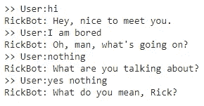

# 不和谐机器人

为了创建[不和谐](https://discord.com/developers/applications)机器人，首先，你需要进入门户[不和谐开发者门户](https://discord.com/developers/applications)。点击新的应用程序并开始。

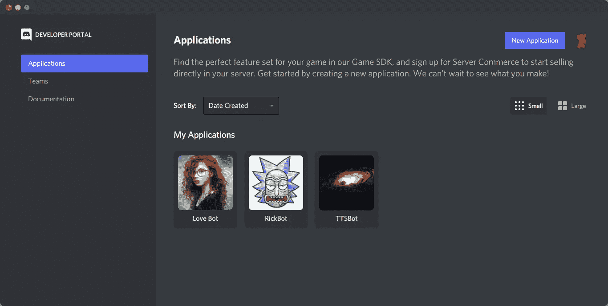

写下应用程序名称。

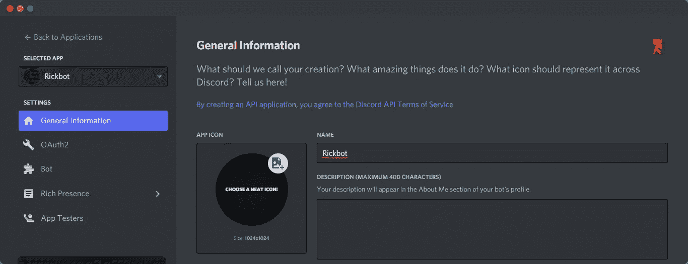

现在点击 Bot 选项卡，然后添加 Bot。它会把你带到一个新窗口，要求你写下机器人的名字，并给机器人添加一个图像。

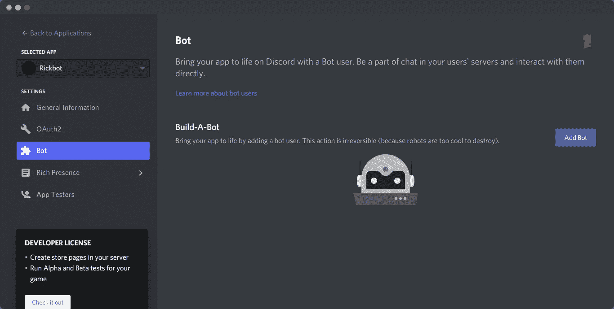

单击 OAuth2 选项卡并选中标记机器人和机器人权限:发送消息。稍后复制链接并粘贴到一个新的标签。


在新标签页粘贴链接后，它会让你选择服务器，就这样。

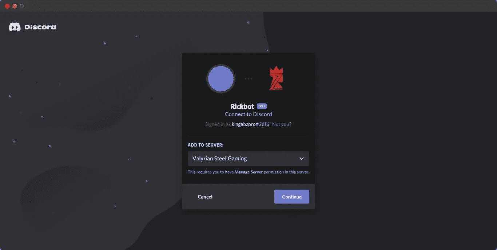

# 雷普利特

您可以在[https://replit.com/](https://replit.com/)上创建您的账户。我们将使用这个平台作为我们的不和谐机器人的服务器。创建帐户后，只需创建一个新的 python repl 或导入我的 GitHub [repo](https://github.com/kingabzpro/DailoGPT-RickBot) 。这个平台是初学者友好的，它不会花超过 5 分钟来理解如何使用编辑器。

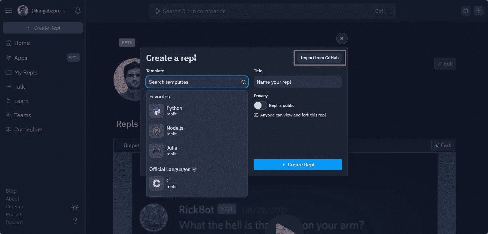

# 测试 API

在我们需要使用 replit secret 特性来添加我们的 HF API 和 Discord API 之前，如下所示。您的 Discord API 密钥在开发人员门户:Bot 选项卡中。

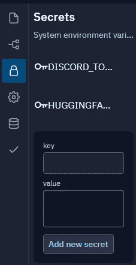

*   创建测试 python 文件来测试 HF API
*   创建使用模型 id 和 HF API 令牌使用`requests`发送和接收信息的函数。
*   打印生成的响应。

该功能现在运行良好，我们需要将该功能添加到 bot.py 中。

```
import requestsdef query(payload, model_id, api_token): headers = {"Authorization": f"Bearer {api_token}"} API_URL = f"https://api-inference.huggingface.co/models/{model_id}" response = requests.post(API_URL, headers=headers, json=payload) return response.json() model_id = "kingabzpro/DialoGPT-small-Rick-Bot"api_token = "api_XXXXXXXXXXXXXXXXXXXXXX" # get yours at hf.co/settings/tokendata = query('What you think about mom', model_id, api_token)print(data['generated_text'])
```

# Replit 的正常运行时间

我们将使用[https://uptimerobot.com](https://uptimerobot.com/)来保持我们的机器人永远运行。正如您在下面看到的，我们可以添加 Monitor 并添加我们将使用 flask 创建的 URL。它将在 5 分钟后 ping 我们的 bot 应用程序，这将欺骗 Replit 服务器永远运行。


## Flask WebApp

下面的代码是一个简单的 Flash web 应用程序，它将在运行时显示“我还活着”。web 应用程序将在 Replit 中生成链接，就像这样:[https://DailoGPT-RickBot.kingabzpro.repl.co](https://DailoGPT-RickBot.kingabzpro.repl.co)。你要将此链接粘贴到 uptimerobot 中，这将在 5 分钟后触发此应用程序。

```
from flask import Flaskfrom threading import Threadapp = Flask('') @app.route('/')def home(): return "I am Alive" def run(): app.run(host='0.0.0.0',port=8080)def keep_alive(): t=Thread(target=run) t.start()
```

# Bot 代码

这段代码包含了我们的 Discord bot 的主干，以及 HF API 和 Flask web app 的集成。

*   我们正在使用刚刚创建的`web_app`文件中的`keep_alive`函数。
*   使用 discord python 客户端。
*   函数发送和接收来自 HF API 的响应，该响应由 API 密钥保护。
*   `on_ready`通过发送“Hello”消息来预热 HF API。预热服务器大约需要 20 秒钟。
*   `on_message`检查消息是来自机器人还是用户，然后获取用户消息并发送给 HF API，然后在 discord 聊天机器人上显示响应。额外的错误检查或不响应服务被添加，以确保我们可以轻松地调试。

要了解更多信息，您可以查看下面的代码并阅读注释。

```
import os# these modules are for querying the Hugging Face model
import json
import requests
from web_app import keep_alive# the Discord Python API
import discord# this is my Hugging Face profile link
API_URL = ‘[https://api-inference.huggingface.co/models/'](https://api-inference.huggingface.co/models/')class MyClient(discord.Client):
 def __init__(self, model_name):
 super().__init__()
 self.api_endpoint = API_URL + model_name
 # retrieve the secret API token from the system environment
 huggingface_token = os.environ[‘HUGGINGFACE_TOKEN’]
 # format the header in our request to Hugging Face
 self.request_headers = {
 ‘Authorization’: ‘Bearer {}’.format(huggingface_token)
 }def query(self, payload):
 “””
 make request to the Hugging Face model API
 “””
 data = json.dumps(payload)
 response = requests.post(
 self.api_endpoint,
 headers=self.request_headers,
 data=data)
 ret = json.loads(response.content.decode(‘utf-8’))
 return retasync def on_ready(self):
 # print out information when the bot wakes up
 print(‘Logged in as’)
 print(self.user.name)
 print(self.user.id)
 print(‘ — — — ‘)
 # send a request to the model without caring about the response
 # just so that the model wakes up and starts loading
 self.query({‘inputs’: {‘text’: ‘Hello!’}})async def on_message(self, message):
 “””
 this function is called whenever the bot sees a message in a channel
 “””
 # ignore the message if it comes from the bot itself
 if message.author.id == self.user.id:
  return # form query payload with the content of the message
 payload = message.content # while the bot is waiting on a response from the model
 # set the its status as typing for user-friendliness
 async with message.channel.typing():
 response = self.query(payload)
 bot_response = response[‘generated_text’]

 # we may get ill-formed response if the model hasn’t fully loaded
 # or has timed out
 if not bot_response:
  if ‘error’ in response:
   bot_response = ‘`Error: {}`’.format(response[‘error’])
  else:
   bot_response = ‘Hmm… something is not right.’ # send the model’s response to the Discord channel
  await message.channel.send(bot_response)def main():
 # DialoGPT
 client = MyClient(‘kingabzpro/DialoGPT-small-Rick-Bot’)
 keep_alive()
 client.run(os.environ[‘DISCORD_TOKEN’])if __name__ == ‘__main__’:
 main()
```

如你所见，我们的机器人发球运行良好。

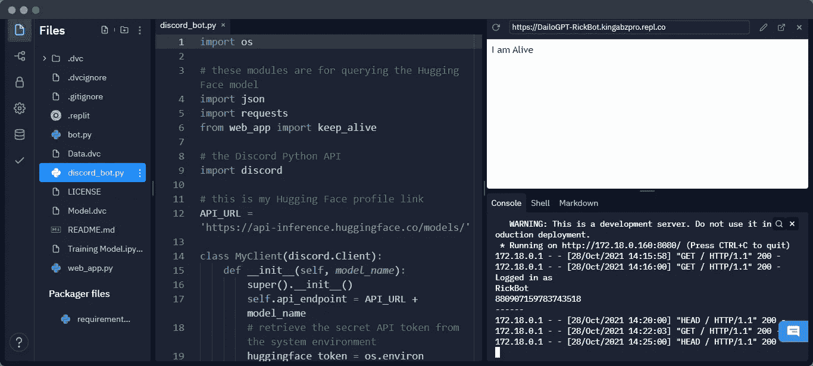

Image by Author

现在让我们检查我们的不和谐服务器。如你所见，RickBot 在线。

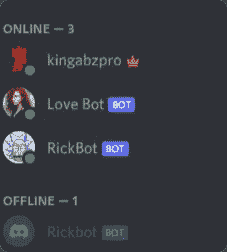

Image by Author

玩你训练和部署的机器人玩得开心。

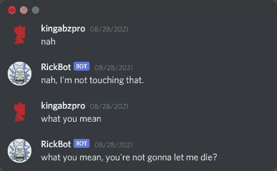

Image by Author

您也可以在 Replit 上导入我的存储库，然后添加您的 HF API 和 Discord API 密钥，几分钟后就可以开始使用了。

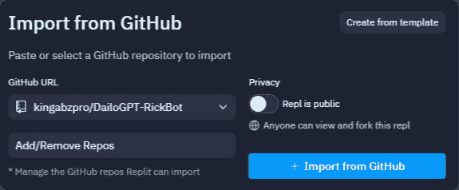

Image by Author

# 密码

你可以在 [GitHub](https://github.com/kingabzpro/DailoGPT-RickBot) 和 [DAGsHub](https://dagshub.com/kingabzpro/DailoGPT-RickBot) 上找到代码。你也可以查看我的拥抱脸模型[这里](https://huggingface.co/kingabzpro/DialoGPT-small-Rick-Bot)。

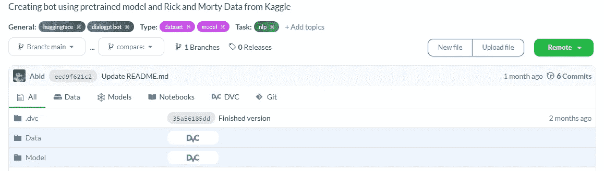

Image by Author

# 结论

我从视频教程中学习和训练自己的机器人的经历非常棒。当我开始摆弄 discord 库和服务器时，情况变得更好了。在本指南中，我们学习了拥抱脸 API、变形金刚、不和谐服务器、正常运行时间机器人、Kaggle API 和 Replit 平台。我迫不及待地想看你接下来选择了什么角色，和我分享你的经历。

> 机器学习很简单，做起来很难，要一直寻找技巧和窍门来改善你的工作空间。

# 参考

*   代码受 freeCodeCamp 教程影响很大:[编写一个不和谐的聊天机器人，说话像你最喜欢的角色](https://www.youtube.com/watch?v=UjDpW_SOrlw)
*   微调模型来自[媒体博客](https://towardsdatascience.com/make-your-own-rick-sanchez-bot-with-transformers-and-dialogpt-fine-tuning-f85e6d1f4e30)。
*   Kaggle 数据集来自 [Rick & Morty 脚本](https://www.kaggle.com/andradaolteanu/rickmorty-scripts)。

# 关于作者

[阿比德·阿里·阿万](https://www.polywork.com/kingabzpro) ( [@1abidaliawan](https://twitter.com/1abidaliawan) )是一名认证数据科学家专业人士，热爱构建机器学习模型。目前，他专注于内容创作，并撰写关于机器学习和数据科学技术的技术博客。Abid 拥有技术管理硕士学位和电信工程学士学位。他的愿景是为患有精神疾病的学生建立一个使用图形神经网络的人工智能产品。

*原载于 2021 年 11 月 1 日*[*https://www.analyticsvidhya.com*](https://www.analyticsvidhya.com/blog/2021/11/learn-how-to-build-your-discord-bot/)*。*