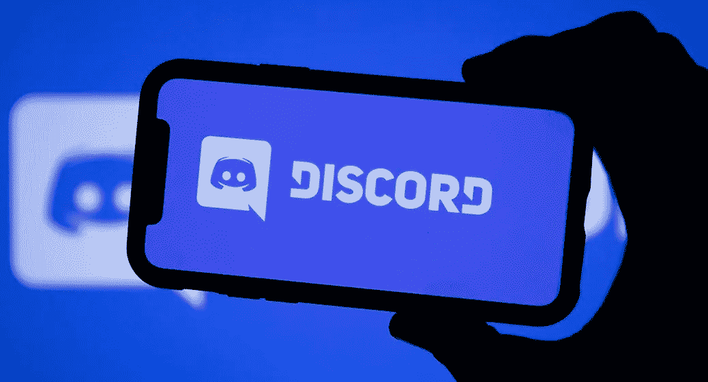

# 不和谐品牌营销——推广密码项目的理想策略

> 原文：<https://medium.com/geekculture/discord-brand-marketing-an-ideal-strategy-to-carry-out-for-promoting-crypto-projects-71539132b0a0?source=collection_archive---------15----------------------->

为创业打下第一块基石是最值得考虑的事情。此外，这还不够，因为营销将为扩大其范围铺平有效的道路。最终，这将防止业务下滑。为此，一个坚实的存在是非常必要的，这可以通过不和谐的社区建设来实现。任何希望通过创建一个忠诚的社区来吸引目标受众注意力的创业公司或项目都可以继续进行 Discord 品牌营销。

**不和谐——社区建设的完美平台**

你可能会听到不和谐的声音。如果不是，那么让我们简要地看看这一节是关于什么的。Discord 是一个即时消息和数字分发平台，使用户能够通过语音呼叫、视频呼叫、文本消息进行通信，创建并成为社区的一部分，被命名为服务器。

最近，与其他社交媒体渠道相比，Discord 变得更受欢迎，活跃用户增加了 20%。然而，它拥有超过 3 亿的注册用户。即使它是个人使用的首选，也有许多公司或机构将它用于社区建设的专业目的，以推广品牌。

**如何利用不和谐营销品牌？**

虽然 Discord 是一个聊天平台，但它允许用户自己创建和管理服务器。两种常见的服务器类型包括私有不一致服务器和公共不一致服务器。通过这种方式，人们可以在目标受众中更广泛地推广品牌。为了吸引全球观众的注意力，挑选公共不和谐服务器将是理想的选择。下面的建议会让你知道如何利用不和来达到商业目的。看一眼这些。

*   **商务人士之间引人入胜的对话**

自从 2015 年 Discord 出现以来，随着活跃用户数量的增加，它在 2021 年变得如此受欢迎。其用于专业目的是其增长的重要原因之一。很大程度上，通过这种方式，人们可以开始商业对话，因为视频/语音聊天和文本消息等功能将缓解这些问题。不和谐硝基是一个先进的功能，是选择付费会员时。然而，有了这个平台，他们可以进行引人入胜的商业目的对话，这将最终导致创造品牌知名度。

*   **用不和谐的服务器吸引目标受众的注意力**

传统营销在当今这一代似乎没那么有效，因为选择数字营销方式会带来各种好处。在这种接触到正确的品牌受众的情况下，Discord 服务器营销将发挥突出的作用。毫无疑问，不和谐服务器纯粹是为了营销目的。

**以下是创建 Discord 服务器的步骤:看看这些**

*   第一步是通过指定所需的详细信息来创建帐户。这包括电子邮件地址、密码、用户名和出生日期。
*   随后，用户或个人必须通过点击已经发送到他们的注册电子邮件的验证消息来继续验证。
*   之后，单击 Create A Server 按钮会将他们带到一个新窗口，他们必须在那里提供必要的信息。

**社区建设是成功的关键:以下是如何通过不和谐来实现的**

除了内部交流，Discord 的主要目的是建立一个营销社区。从而在更广泛的社区中获得更好的品牌知名度。以下几点将引导你了解如何在不和谐中构建社区。看看这些。

*   **可以通过邀请链接添加成员**

在个性化选项不一致的情况下，人们可以决定谁将被添加到 [**不一致品牌营销**](https://www.inoru.com/discord-brand-marketing) 的组中。该功能与脸书组非常相似，但具有高级选项。可以通过邀请链接添加群组中的成员，邀请链接是通过文本消息或电子邮件以及社交媒体共享发送的。或者通过网页上的可点击链接。

*   **可以创建多个组**

与其他社交网站不同，在 Discord 中，用户将能够创建多个服务器。毫无疑问，他们可以建立不同的语音和文字频道。然而，成员对于不同的聊天组具有不同的访问级别。此外，这也将提供一个选项，为具有特定利基的活跃成员创建特定和特殊的群体。

*   **密码相关的创业公司是不和谐营销的先锋**

与其他企业和公司不同，那些经营加密相关业务的人拥有额外的优势，因为 Discord 充满了区块链、NFT 和基于加密的项目，这些项目将得到有效的推广。

*   **有求必应的客户服务让不和谐更受青睐**

用户会选择社交媒体平台来尽快解决他们的问题。然而，自从 Discord 出现并逐渐流行以来，它已经成为客户服务的首选平台。专注于解决客户问题的目标最终会让他们在寻求澄清时回到同一个平台。

**为加密项目打造不和谐品牌营销的策略**

**了解品牌的目的**——最重要的是，需要更多地了解品牌，以便拥有独特的卖点来吸引正确受众的注意力。

**创建一个带有相关名称&标志**的服务器——一旦确定了品牌的目的，就必须创建服务器。创建时，服务器的名称和徽标必须与品牌一致。

**发布&分享内容** —这在分享与品牌相关的精选内容以达到目标受众的过程中起着至关重要的作用。

**与其他渠道合作** —除了为特定目的创建特定渠道，与其他渠道合作还会带来额外的好处。寻找同领域或同品牌的渠道，从促销活动入手。

**机器人可以用于促销**——在不和谐的情况下，这是一个相当有吸引力的选择。在这种情况下，可以安装一个机器人，然后通过输入“BUMP ”,后跟消息来激活它。这将显示在您链接的其他服务器/频道上。

**赠品/奖励** —为了给加密项目做不和谐营销，让赠品变得更有趣&。当在有大量成员的服务器中实现它时，这无疑是一个非常吸引人的方法。

**总结**

无论推广什么类型的项目，Discord 似乎都是开展营销活动的理想选择。你是支持你的项目还是扩大你的品牌范围？利用不和谐品牌营销服务。