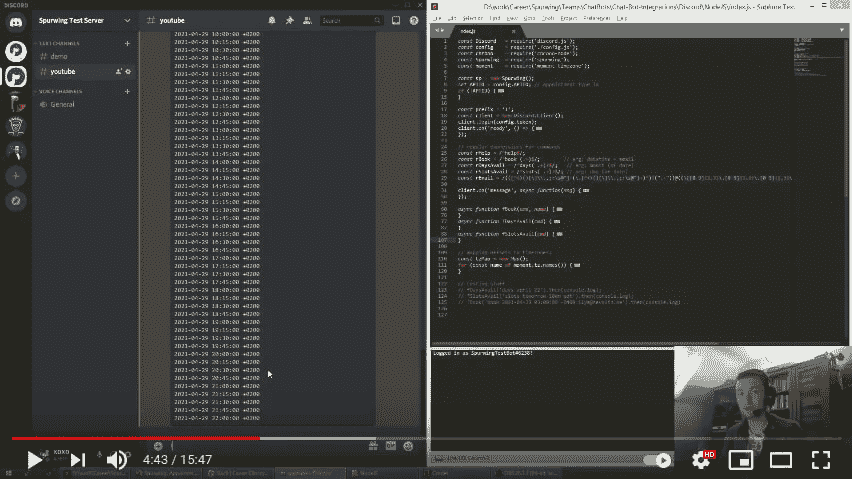
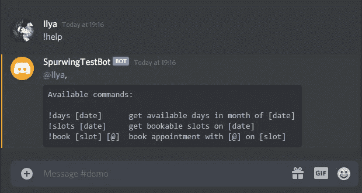
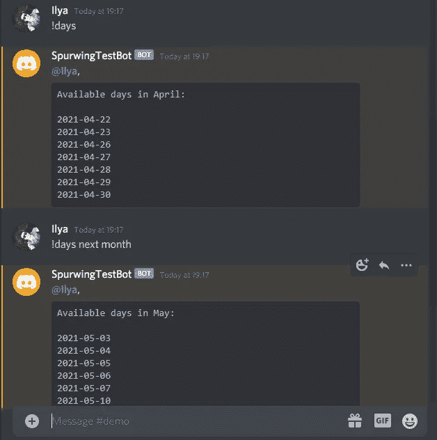
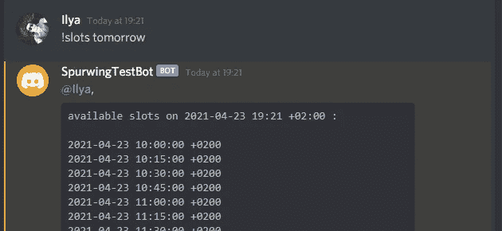
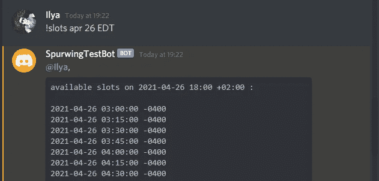
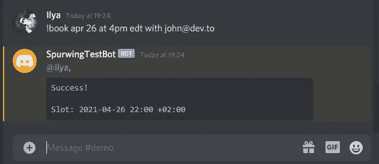
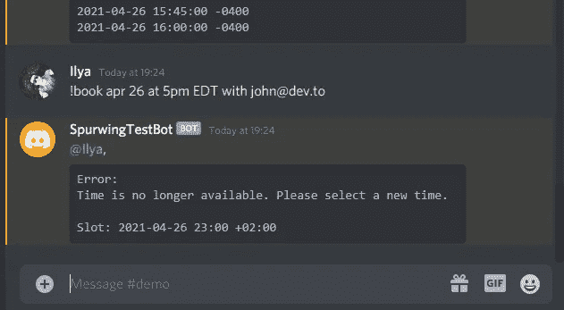
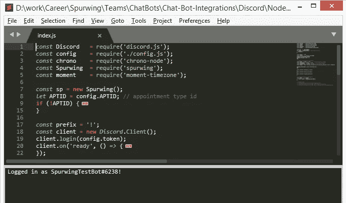
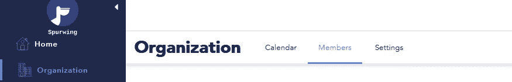

# 企业不和谐调度机器人

> 原文：<https://medium.com/geekculture/discord-scheduling-bot-for-business-3926018d9956?source=collection_archive---------6----------------------->


多年来，不和谐在游戏社区一直很流行。但是由于**远程工作**和**在家工作**机会的激增，它在**商业**世界中与 Slack、Google 和 Zoom 等工具激烈竞争。

**YouTube 演示**:[https://www.youtube.com/watch?v=e5SpHXVMlKw](https://www.youtube.com/watch?v=e5SpHXVMlKw)



你可以加入我们的不和谐服务器，自己试试这个机器人:[https://discord.gg/j3gd5Qk5uW](https://discord.gg/j3gd5Qk5uW)

# 介绍

我们喜欢 Spurwing 的 Discord，它免费提供我们需要的所有功能:文本和语音频道、视频通话、视频会议、屏幕共享，最近还增加了舞台频道。你可以通过这些渠道模仿 T21 的办公室体验，这是保守的经理们的理想解决方案。

最重要的是，它为构建机器人和自动化解决方案提供了一流的 API、开发人员社区和资源。安排约会和管理日历是一件复杂的事情，幸运的是，鞭策有助于简化和提高效率。

在这篇文章中，我将分享我们简单的解决方案来安排不和谐的约会。完整的代码可以在我们的 [GitHub 库](https://github.com/Spurwingio/Chat-Bots/tree/main/Discord/NodeJS)上找到。这个不和谐机器人连接到我们的 Spurwing API，用于安排约会和管理我们的日历。

# Bot 摘要

不和谐机器人是一段代码，它可以监听文本(或语音)数据，然后根据你的编程做出反应。调用/使用机器人最简单的方法是使用前缀字符，如`!`或`*`。要查看所有可用的命令，我们可以输入`!help`:



我们遇到的第一个命令是`!days [date]`，它将给出`[date]`月份中所有可用的天数。省略此参数将使用当前月份。也可以用`today`、`next month`、`March 2021`等关键词。我们使用一个很棒的 NLP 库 [chrono](https://github.com/wanasit/chrono) ，它能够将随意的文本解释成 JavaScript DateTime 对象:



我们可以使用的第二个命令是`!slots [date]`。这将返回我们日历上可预订时段的列表:



请注意，这些槽包含一个时区偏移量`+0200`，这意味着 GMT+2。这个时区取决于你的机器人所在机器的当地时间。但是我们也可以提供一个自定义时区或偏移量来查看相对于您所在位置的时间:



如果某个日期没有可预订的空位，您将会收到一条错误消息:


既然我们能够找到可预订的时间段，我们可以使用第三个命令`!book [slot] [@email]`开始安排预约。您可以使用其中一个时段作为`[slot]`参数，或者提供一个自定义的日期和时间，只要它将评估为有效和可预订的时段:



同样，如果预订失败，您将看到一条错误消息:



这三个简单的命令允许 Discord 用户与您安排简单的一对一约会。在接下来的部分中，我们将解释如何安装和配置这个机器人，以及如何为一对多约会定制它并合并多个日历。

# 要求

*   强烈推荐 NodeJS v12.x 或 v14.x
*   如果你还没有一个 Discord 机器人，按照这个[教程](https://www.digitalocean.com/community/tutorials/how-to-build-a-discord-bot-with-node-js)的步骤 1 获得你的机器人的令牌，并将机器人添加到你的 Discord 服务器。

# 装置

1.克隆、派生或下载我们的库:[https://github.com/Spurwingio/Chat-Bots/](https://github.com/Spurwingio/Chat-Bots/)

2.导航到`/Discord/NodeJS/`并执行`npm install`

3.将文件`config.sample.js`复制到`config.js`并进行编辑

*   提供你的不和谐机器人令牌
*   提供您的 Spurwing 提供商 Id
*   可以选择提供一个拒绝的约会类型 Id

4.运行 bot: `node index.js`

*   可以选择使用 PM2 或 nodemon 来保持机器人全天候运行

成功连接后，您应该会看到如下消息:



如果您没有提供约会类型 Id，代码将从您的 Spurwing 帐户中随机获取一个 Id。每种约会类型都有相关的持续时间(15 分钟、30 分钟、45 分钟等等)。我们的 API 使用它来生成可预订的位置。

# 开发商

这个机器人仅仅是一个用于**演示目的**的基本实现。我们可以通过更多高级功能来扩展它，以方便日历管理、团体预订、提醒、发送电子邮件、语音命令等。


# 状态管理

Spurwing 提供者 ID ( **PID** )代表一个单独的日历。您可以扩展 bot 来保存 Discord 成员及其 PID 的映射。如果你的 Spurwing 帐户有组织特权，那么你可以为你的所有成员创建多个帐户(以及 PID)。每个日历还可以与提供的任何第三方电子邮件双向同步(Gmail、Outlook、Apple)。



# 团体预订

我们的演示机器人只允许 1 对 1 预订，因此对于`!book`命令只有一个`[@email]`参数。您可以扩展该命令以允许电子邮件地址列表。

或者，您可以创建 Discord 成员及其电子邮件地址的映射。现在你可以使用`@username`符号，而不是明确地提供他们的电子邮件给指挥部。

# 提醒

要合并自动提醒，无论是公共公告还是私人消息，您可以对所有日历事件进行 bot 轮询(大约每分钟一次)。并根据您的喜好，让它发送提醒给所有参与者。


# 发送电子邮件

我们已经有了一个使用 SMTP 协议发送电子邮件的 Spurwing 库。我们的 [iCalendar 库储存库](https://github.com/Spurwingio/iCalendar-Integrations/)包含了你在`index.js`中需要的所有逻辑，尤其是你可以使用的`sendMail`函数。

# 语音命令

我最喜欢 Discord 的一点是它的声音通道。这只是一个虚拟的地方，你可以加入并与频道内的每个人交谈。没有恼人的会议链接需要立即跳转到与某人通话。

Discord Bot 还可以加入语音通道，单独监听所有扬声器(但也可以发送音频数据)。我个人的一个开源项目 [DiscordEarsBot](https://github.com/inevolin/DiscordEarsBot) 使用 NLP 和机器学习来转录和解释所说的内容。这个解决方案非常准确，支持 32 种语言。您可以使用该解决方案添加语音命令或根据对话内容生成建议:

```
You: maybe we should meet again next week?Bot: Would you like to schedule for next week this time?
```

# 结论

另一个酷 UX 对`!book [slot] ...`命令的改进是，如果它不能为你提供的`[slot]`安排时间，返回几个可预订的位置。

不和谐机器人是神奇的工具，可以帮助我们自动化任务，并在日常工作中变得更有效率。如果您喜欢我们的内容，请确保在 GitHub 上给我们一颗星，并关注我们了解更多内容。访问[spur ing](https://www.spurwing.io/)，今天就安排一次免费演示。祝您愉快！