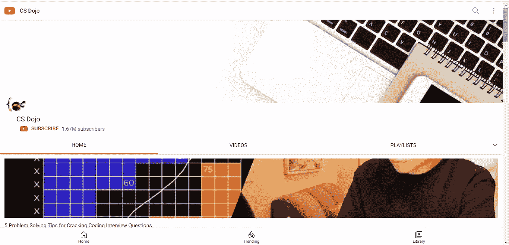
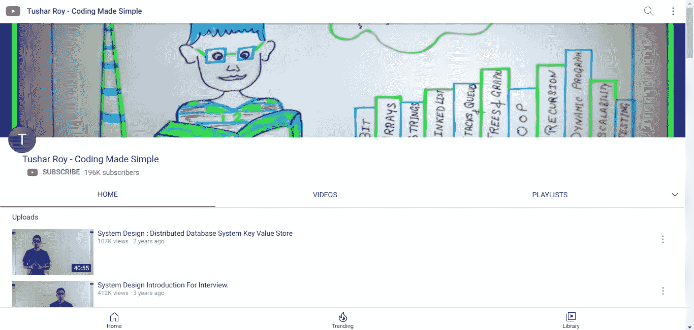

# 发现 3 个受欢迎的 YouTube 频道，帮助你今天就完成下一次编码面试

> 原文：<https://medium.com/geekculture/discover-3-popular-youtube-channels-to-help-you-crush-your-next-coding-interview-today-e6c4ff09f82?source=collection_archive---------33----------------------->

## 嘿朋友，你已经找到你的神奇 3。

Photo by [Rodolfo Clix](https://www.pexels.com/@rodolfoclix?utm_content=attributionCopyText&utm_medium=referral&utm_source=pexels) from [Pexels](https://www.pexels.com/photo/five-bulb-lights-1036936/?utm_content=attributionCopyText&utm_medium=referral&utm_source=pexels)

参加面试时，你会感到不知所措，害怕会发生什么。是的，尤其是当你计划去参加你的第一次工作面试的时候。

*如何在面试中停止严重的焦虑？我很害怕，我明天就要面试了。有帮助吗？*

上谷歌！成千上万的人在问同样的问题以及更多相关的问题。这表明你并不孤单。

采访。尽管这可能会令人紧张，但你必须随时准备推销自己——你的技能和能力。做好准备的理想方式是从你能得到的*最好的*资源中学习。

你可能会想:

> “这话我已经听了十亿遍了！他们都是这么说的"

*但是你真的发现了最佳策略或资源吗？*

继续前进，你会发现 3 个顶级 YouTube 频道，有优秀的导师帮助你掌握那些算法、数据结构和面试概念，以粉碎你的下一次编码面试。

# Cs 道场

Screenshot by author/[Credit to Cs dojo](https://m.youtube.com/channel/UCxX9wt5FWQUAAz4UrysqK9A)

寻找有经验的导师？Yk sugi 是一名软件开发人员，拥有谷歌和微软等顶级科技公司的工作经验。他也是编程和计算机科学之家 [CS 道场](https://m.youtube.com/channel/UCxX9wt5FWQUAAz4UrysqK9A)的创建者。

## 他的渠道会给你带来什么？

Yk 给你提供了大量的视频，从回答面试问题的技巧到剖析不同科技公司面试问题的教程，再加上对数据结构和算法给出明确解释的视频。

大多数时候，我们在面试中对某些问题没有最佳答案。先睹为快，看看他在编码面试中找到最佳答案的 [4 招。](https://m.youtube.com/watch?v=pnzZzbQ3ZAY)

# 图沙尔·罗伊

*图沙尔是谁，他适合做我的导师吗？*

Screenshot by author/[Credit to Tushar Roy](https://m.youtube.com/user/tusharroy2525)

Tushar 是一名软件开发人员，拥有多种编程语言和概念的经验，如 C++、C#、PHP、数据库系统、工作流引擎、分布式系统等。

考虑到他作为一名软件开发工程师在亚马逊和苹果等顶级科技公司工作了至少十年，你知道他有多棒。

在谷歌、亚马逊、脸书、苹果面试过之后，我们知道我们在谈论的是一个专家。

*你想向最优秀的人学习对吗？*

他是 Youtube 上[Tushar Roy](https://m.youtube.com/user/tusharroy2525)的创建者，在他的 Github 上有惊人的[面试问题，所以请随意将该资源加入书签。](https://github.com/mission-peace/interview/wiki)

## 他的渠道会给你带来什么？

从图沙尔，你会掌握每一个你能想到的面试概念。动态编程，后缀前缀，Leetcode 解，二叉树，说吧。

> “我想制作 YouTube 视频，这样我就可以分享我的面试经历，并激励其他人也去寻找他们梦想中的工作”——图沙尔·罗伊

有了所有这些资格，你会认为他是书呆子，他的视频渗出无聊。

**抓那个朋友！**在他的视频中，他充满了活力，加上他对教授代码的热情，消除了无聊，让你全神贯注。

# Simplilearn

Screenshot by author/[Credit to Simplilearn](https://m.youtube.com/user/Simplilearn)

[Simplilearn](https://www.simplilearn.com/) 是由 Krishna Kumar 创立的全球顶尖数字技能培训提供商之一，旨在帮助企业和专业人士在这个快速变化的数字世界中茁壮成长。

他们创建了一个 YouTube 频道， [Simplilearn](https://m.youtube.com/user/Simplilearn) 。

## 他们免费提供给你的东西

Simplilearn 已经为每个有问题的编码领域设计了面试问题，因此，从数据科学到网络安全到 SQL 到 Python 等等，都有面试问题。

先来看看这些[面试问题](https://m.youtube.com/watch?v=owtO0cKwtk4)吧。

# 最后的想法

最后，图沙尔是**对**！

> “无论你在这里学到什么，都只是准备工作的 2%，剩下的 98%你必须在家里完成。请不要认为参加这些课程就能得到这份工作。”图沙尔·罗伊

他在自己的一次面试预备班上说了这句话。

获得最好的资源和学习是好事。但是实践会让你得到想要的结果。

你找到你的 YouTube 采访伙伴了吗？

*享受这个？* [*订阅我的简讯获取更多此类*](https://favour-thoughts.ck.page/40a6f097f4)