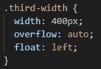
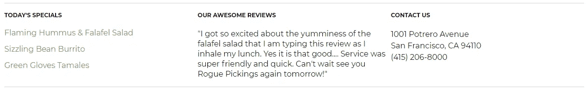
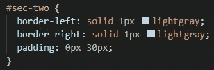
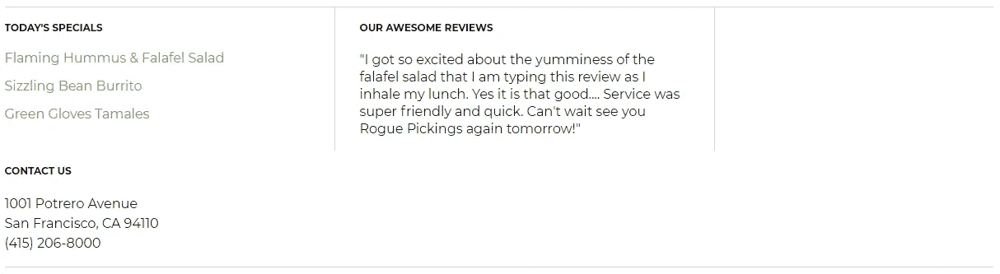
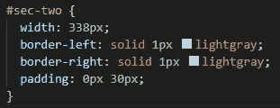
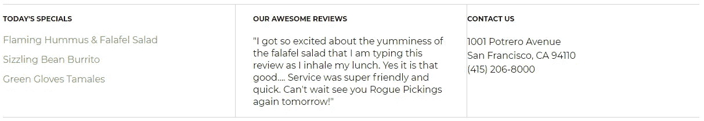
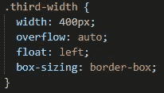
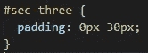
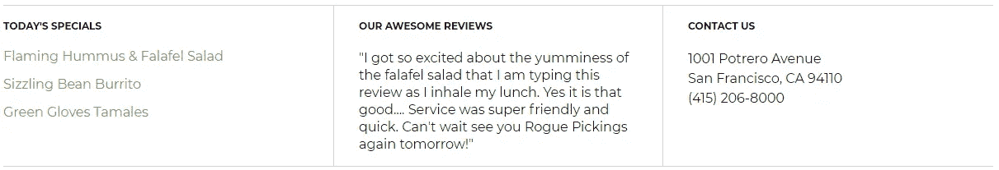

# 发现“框大小”CSS 属性

> 原文：<https://medium.com/geekculture/discover-the-box-sizing-css-property-665da2623410?source=collection_archive---------71----------------------->

Photo by [Erda Estremera](https://unsplash.com/@erdaest?utm_source=medium&utm_medium=referral) on [Unsplash](https://unsplash.com?utm_source=medium&utm_medium=referral)

我以为我已经掌握了 CSS 中填充和边距的窍门。填充在内部元素/内容和外部边框之间增加空间；在“盒子”内。边距增加了外部边框和周围所有内容之间的空间；在“盒子”之外。

最近，我在一个 1200 像素宽的容器中设置了一个 400 像素宽的三等分区域。数学加起来刚刚好。

class-level CSS of each third section to be 400px wide

而且，它工作得非常完美。

row split into thirds

为了打破这些，我添加了更多的边界和填充中间的三分之一。

mid-third CSS for border and padding

当它没有像预期的那样工作时，我有点吃惊。

formation screwed up after adding border and padding

我认为“盒子”将保持 400 像素宽，填充将包含在这个盒子里。

嗯，根据我的设置，**整个**中间三分之一部分是“盒子”，它保持 400 像素宽，而**在左右两边添加了 30 像素的填充和 1 像素的边框。**

## 从左到右相加

1px(左侧边框)+ 30px(左侧填充)+ 400px(中间三分之一部分)+ 30px(右侧填充)+ 1px(右侧边框)=总共 462px

如果容器只有 1200 像素宽，我的 3 个部分将无法在这种设置下全部放在一行中，因为它超过了 62 像素。(400 像素+462 像素+400 像素= 1262 像素)

## 解决方案 A

将内部内容放在它们自己的 div 中。这将允许父 div 保持 400px 宽，而新子 div 可以在其自身和外部父 div 之间添加 30px 的填充。

缺点是它增加了更多“不必要的”div 标签来增大 HTML 文件。

## 解决方案 B

做点数学。耶！如果我们希望中间三分之一的宽度总计为 400 像素，只需从中减去添加的边框和填充宽度，就可以得到一个新的宽度大小。

400 像素-62 像素(边框/填充)= 338 像素

change width of section to 338px

the newly adjusted mid-section looks perfect

一个主要的缺点是宽度被“硬编码”,因此，如果有任何变化，如它的兄弟部分的宽度，边框，填充等。然后，需要重新计算宽度，使其完全对齐。

另一个轻微的缺点是宽度被重新分配，而我个人更希望宽度在前面的类级 CSS 中只被声明一次。

## 解决方案 C

我的新宠解决方案！向 CSS 类添加一个将影响所有预期部分的框大小属性。

> "要保持宽度为(无论大小)px，无论填充多少，您都可以使用 box-sizing 属性。这导致元素保持其宽度；如果增加填充，可用的内容空间将会减少"
> 
> -w3 学校

add box-sizing property to class-level css

在右边的第三部分添加一些填充后…

added padding to left and right side of the third section

…我得到了我想要的一切。

final format with borders, padding and box-sizing properties

附加源

 [## CSS 填充

### 填充用于在任何已定义的边框内创建围绕元素内容的空间。此元素有一个填充…

www.w3schools.com](https://www.w3schools.com/css/css_padding.asp)