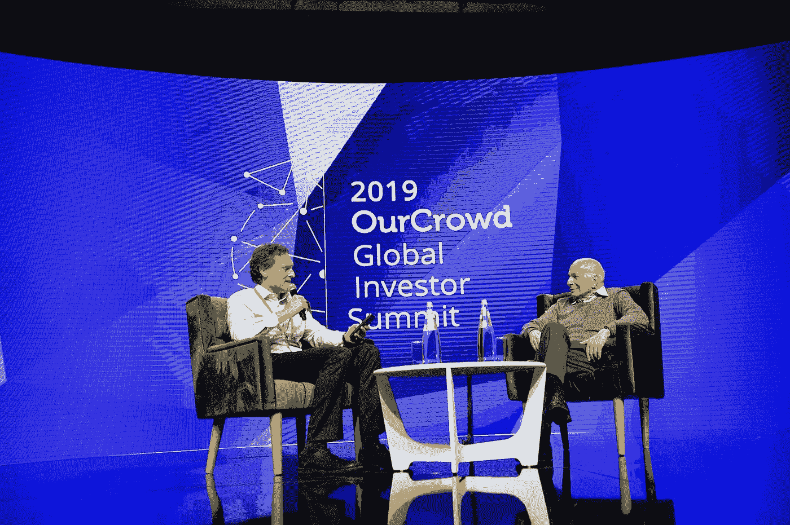

# 认知偏见和政治偏见:哪个更重要？

> 原文：<https://medium.com/geekculture/discussions-with-kahneman-cognitive-or-political-bias-which-is-it-be70dddde035?source=collection_archive---------7----------------------->

## 行为经济学家强调认知偏差。但这只是故事的一半，作者在与诺贝尔奖获得者丹尼尔·卡内曼的讨论中认为

Daniel Kahneman in discussion (source: [Wikimedia Commons](https://commons.wikimedia.org/wiki/File:Daniel_Kahneman_at_2019_OurCrowd_Global_Investor_Summit.jpg))

> “那么，这两种解释哪一种是正确的呢?”HBR 编辑问道:“认知还是……