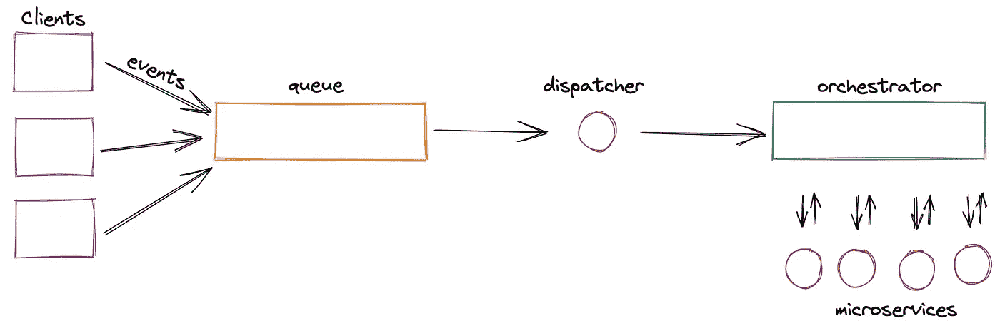
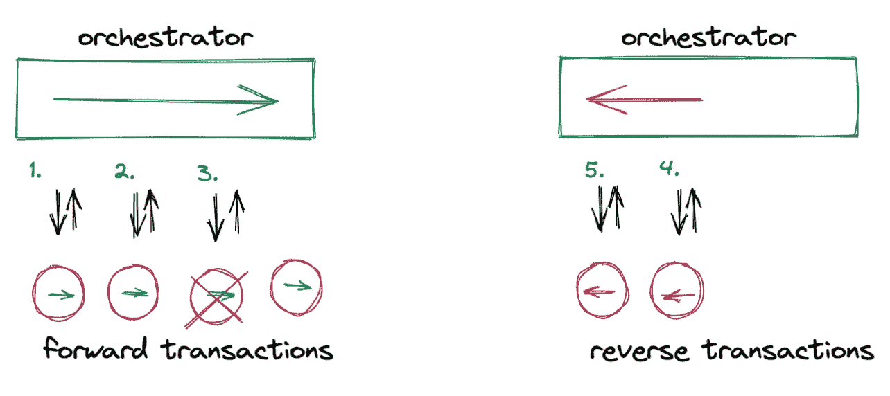
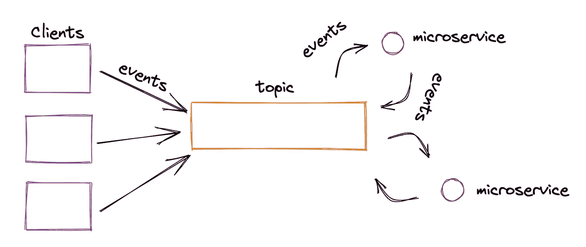
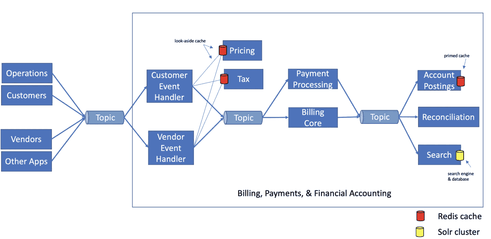

# 拆除分布式整体——我们的微服务从编排到编排之旅

> 原文：<https://medium.com/geekculture/dismantling-the-distributed-monolith-b24b4211966a?source=collection_archive---------7----------------------->

> 服务是一种有目的的软件功能，不同的客户可以使用

# 背景

几年前，当我们开始为公司进军欧亚大陆构建一个计费和财务系统时，我们选择了团队已经熟悉的工具和技术。

当时，我们已经使用 Spring Boot 和网飞操作系统堆栈建立了几个共享微服务(T1)——发送通知、安全存储文档等服务。这些服务由不同的客户端应用程序使用，从而消除了代码和工作的重复。他们在公司里大受欢迎。

此外，当时我们有几项服务被公司外部的合作伙伴和客户访问。我们使用 WSO2 作为这些外部可用服务的 API 网关。用他们自己的话来说，WSO2 还通过他们的企业集成能力提供了“低代码微服务集成方法”。

这些现有的工具以及我们被要求在不到 10 个月的时间内构建这个系统的事实，塑造了我们对新的计费和财务系统应该如何构建的看法。

# 版本 1 —编排

Microservices orchestration

比方说，其中一个客户在队列中丢弃了一个事件，表明已经下了一个订单。计费和财务系统应记录费用，生成发票，并在总分类账中做分录。我们使用 WSO2 为每个任务调用不同的服务(即编排)。如果这些任务中的任何一个失败，WSO2 orchestrator 将负责一个“*回滚”*。

每个微服务都是一个提供 REST 服务的 Spring Boot web 应用。它们通过 HTTP 请求被调用，并通过相同的 HTTP 连接同步提供响应。

## 利弊

这种架构的主要优点是它利用了团队已经非常熟悉的工具和技术。

另一个优势是 orchestrator 使得在运行时出现故障时保持数据一致性成为可能。微服务中的每个事务都有一个对应的*反向*(也称为补偿)事务。因此，如果 WSO2 orchestrator 在调用第 n 个微服务时遇到错误，它可以通过调用前 n-1 个微服务上的反向事务来执行“*回滚*”。

Performing a rollback

这种架构的主要缺点是紧密耦合导致的团队间依赖性。分布式架构的目标之一是允许快速并行开发。然而，基于编排的微服务架构导致了一个分布式的整体。在很多方面，它们都像一个整体一样存在相互依赖的问题。实际上，每个变更都需要多个团队来协调发布。

脆弱是这种设置的下一个突出缺点。如果单个服务出现故障，甚至短时间内表现不佳，整个端到端流程都会失败。

此外，必须优先解决性能问题，因为这种同步请求-响应设置不能容忍运行缓慢的事务。

# 版本 2 —编排

Choreography

> 贫瘠的土地上长不出水稻~中国古谚

对我们来说幸运的是，我们又有机会构建相同的系统——这一次，取代公司现有的传统计费和财务平台。在这一年中，我们已经脱离了网飞的 OSS 堆栈，转而采用了面向微服务的 Kubernetes。Kafka 在公司内部被用于数据传输，已经成为公司 DNA 的一部分。

## 作为一等公民的事件

在版本 1 中，我们的微服务不支持事件感知。它们是通过 WSO2 orchestrator 同步调用的简单 REST web 服务。这导致了服务之间非常紧密的耦合。在新的架构中，重要的是要放松耦合，这样团队可以更加独立，开发可以进行得更快。

我们不得不重建我们的微服务来收听 Kafka 事件主题，并发布一些他们自己的主题。我们必须重新划分服务边界，以确保事务不会在微服务之间分割。我们不得不拆除管弦乐队。

在版本 1 中，我们的微服务是基于请求-响应的 REST web 服务。在版本 2 中，它们是事件驱动的组件。

The New Billing & Finance System

# 参考

 [## 如何向你的曾祖父解释事件驱动架构

### 事件、命令和不变性

medium.com](/interviewnoodle/how-to-explain-an-event-driven-architecture-to-your-great-grandpa-10f19063d393)  [## 必然的建筑

### 计费和财务系统的目标和原则

medium.com](/@apratim.shaw/an-architecture-of-necessity-8339edf5e560)  [## 蚂蚁，走开！这里没有食物

### 错误处理不应该是事后的想法

bootcamp.uxdesign.cc](https://bootcamp.uxdesign.cc/ants-go-away-there-is-no-food-here-4ca964e3b2f3)  [## 网飞 OSS，春云，还是 Kubernetes？全部怎么样！

### 我在 2016 年 6 月 O'Reilly 出版的《面向 Java 开发人员的微服务》一书中谈到了其中的一些内容(即将发布！)，但是我想…

blog.christianposta.com](https://blog.christianposta.com/microservices/netflix-oss-or-kubernetes-how-about-both/)