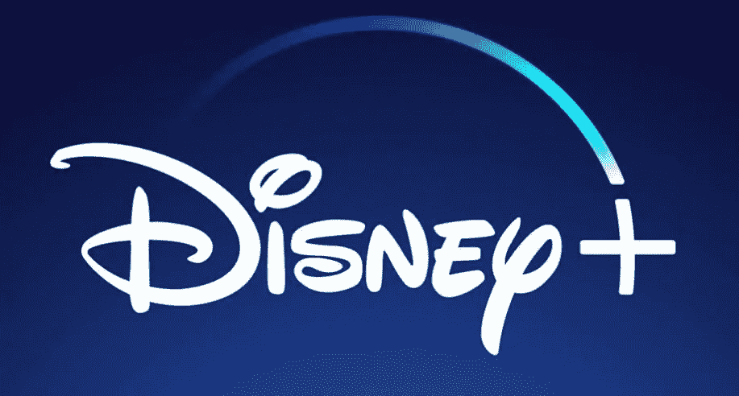
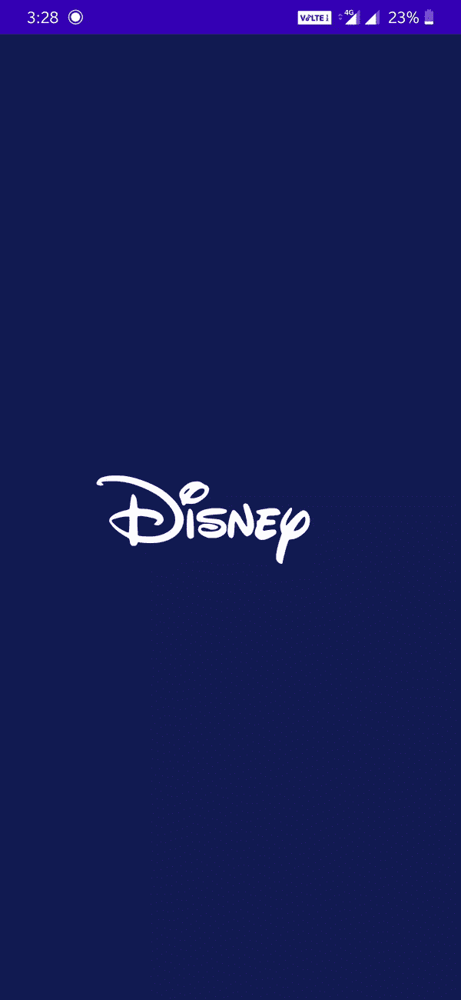
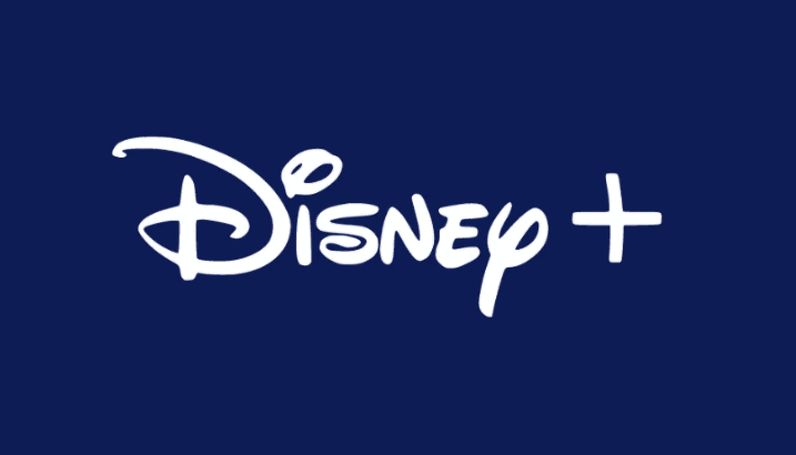
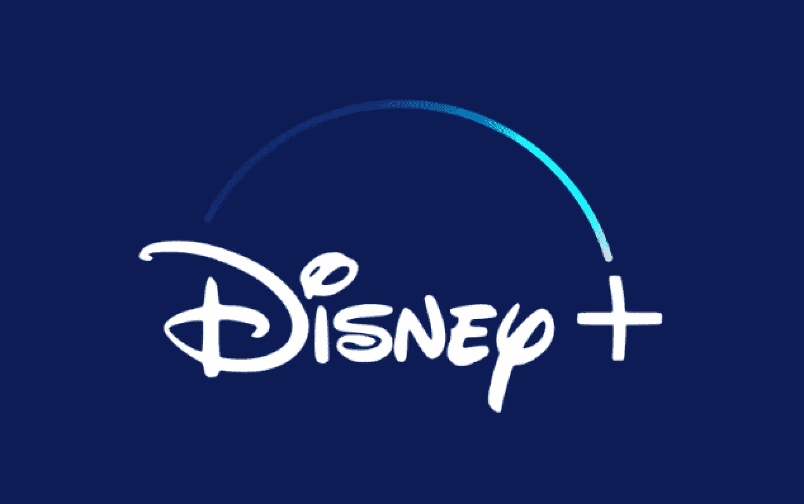

# 迪士尼 Plus 标志动画— Jetpack 合成

> 原文：<https://medium.com/geekculture/disney-plus-logo-animation-jetpack-compose-d8fb9bda3de7?source=collection_archive---------30----------------------->

Jetpack Compose 将动画的标准从“波兰，如果我们有时间”提高到“如此简单，没有理由不做”，其中很大一部分是`animate*AsState()`动画对象。

# **创作动画**

Jetpack Compose 已经走过了漫长的道路，对视图系统的主要改进之一是动画和过渡。甚至一些低级的动画 API 比如`animateTo()`、`animate*AsState()`也是极其强大和好用的。

# 动画预览

# **入门**

如果我们仔细观察，这个动画有三个组成部分

*   迪士尼文本
*   弧形动画
*   +弧线动画结束时符号展开。

首先，我们将建立标志的用户界面，稍后，我们可以给组件的动画效果。

我们将使用的颜色

GradientColor 用于为徽标中的圆弧提供渐变效果。

为了绘制弧线，我们可以使用`drawBehind`修饰符，它有助于在可组合组件的画布上绘制 UI。

`drawArc`可以用来画一个弧线，缩放到适合给定的矩形(这里我们用的是方框)。它围绕椭圆从 startAngle 度开始到 start angle+swepangle 度，零度是 x 轴的正侧。

这里，我们选择了框的大小、起始角度和扫掠角度，以使弧线与徽标中的+图像重合。

我们没有给出纯色，而是用提供的颜色和给定的起点和终点坐标给弧线一个线性渐变。颜色分散在由颜色停止对定义的提供的偏移处。

现在 UI 已经完成，我们可以期待制作 UI 组件的动画了。

`animationPlayed`、`plusAnimationPlayed`是状态变量，记录动画是否已经播放，通过改变它们的值，我们可以触发动画。

`currentPercent`是一个状态对象，跟踪弧的扫描。

`scalePercent`使用缩放效果帮助制作+图像动画。

我们必须调用`LaunchedEffect`中的`animationPlayed = true`,因为我们只希望它运行一次，而 LaunchedEffect 在一个可组合函数中只运行一次，因为它的键是常量，不会改变。

一旦动画代码完成，我们必须用状态对象变量改变硬编码的值，这将有助于动画视图。

完整的代码示例可以在这里找到[。](https://github.com/pundirAbhishek/DisneyLogoAnimation)

 [## GitHub-pundirAbhishek/Disney logo animation

### 在 GitHub 上创建一个帐户，为 pundirAbhishek/Disney logo animation 的开发做出贡献。

github.com](https://github.com/pundirAbhishek/DisneyLogoAnimation)