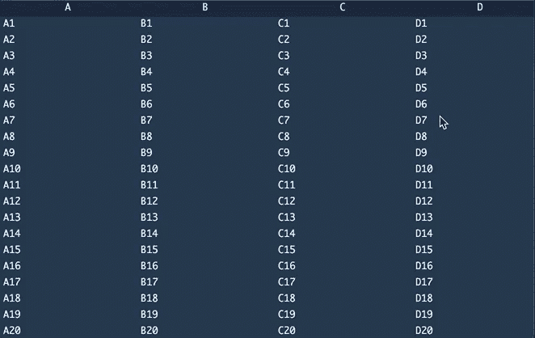
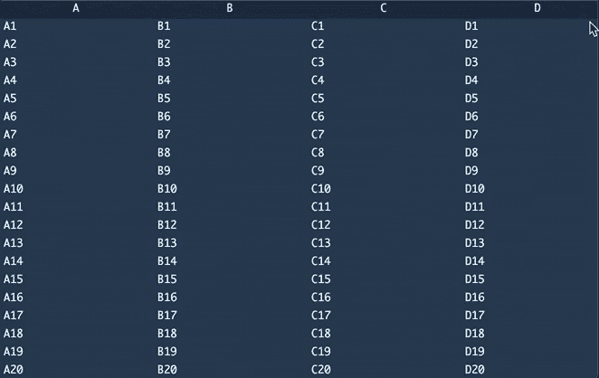
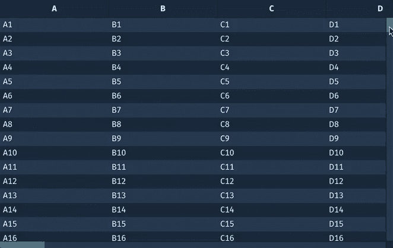

# 在浏览器中显示千万亿行数据

> 原文：<https://medium.com/geekculture/display-a-quadrillion-rows-of-data-in-your-browser-4e8159e3426a?source=collection_archive---------1----------------------->

## 使用 canvas 避开基于 DOM 的数据网格的限制

## 迈克·本德

Photo by [Julia Sabiniarz](https://unsplash.com/@julczed?utm_source=medium&utm_medium=referral) on [Unsplash](https://unsplash.com?utm_source=medium&utm_medium=referral)

今天的数据集比以往任何时候都大，经常达到超过[十亿行数据](https://github.com/toddwschneider/nyc-taxi-data)。在浏览器中显示它们使得许多用户可以检查大型数据集，而无需安装应用程序。浏览器非常强大，但不幸的是，我们不能在浏览器文档对象模型(DOM)中放入十亿行数据，否则[浏览器性能会受到严重影响](https://web.dev/dom-size/)。

理想情况下，用户可以探索和处理任何大小的数据，随意转换数据，并在需要时返回。当在 Jupyter 等熟悉的工具中使用较小的数据框时，这是可能的，但是一旦数据超过几百万行，这种体验在典型的数据网格渲染解决方案中就开始出错了。在这篇文章中，我们重点关注渲染数据的挑战——在另一篇文章中，我们将关注从服务器传输数据的管道。

我们确定了开发人员在试图呈现大型数据集时面临的三个挑战:

1.  在滚动动作和 DOM 更新之间观察到的滞后是破坏性的。
2.  最大大小限制防止用户看到表格的底部。
3.  技术限制导致光标跳到错误的位置。

那么，我们如何克服这些问题呢？有可能在浏览器中高效地显示十亿行数据并与之交互吗？我们能否瞄准更高的目标，显示千万亿行数据？让我们探讨一下基于 DOM 的数据网格所观察到的一些问题，以及我们如何使用基于画布的解决方案来解决这些问题，比如 npm 上可用的 [@deephaven/grid](https://www.npmjs.com/package/@deephaven/grid) 包。

# 问题 1:在滚动动作和 DOM 更新之间观察到滞后

首先，让我们通过只显示当前视口中的数据来减少 DOM。如果在您的视口中只能看到 20 行数据，那么您只需要向 DOM 添加 20 行。这很简单，有一个大的可滚动元素，它的大小相当于您所拥有的数据表的大小，然后只显示/定位当前视窗中可见的单元格。这当然提高了性能，但是您需要在用户滚动时更新哪些单元格是可见的。为此，您需要添加一个 scroll 监听器，它必须是一个[被动监听器](https://developers.google.com/web/updates/2016/06/passive-event-listeners)以防止 scroll jank。

对于被动侦听器，浏览器将更新元素的滚动位置，而不需要[等待我们的侦听器完成](https://github.com/WICG/EventListenerOptions/blob/gh-pages/explainer.md#solution-the-passive-option)。在浏览器呈现滚动位置之前，我们无法更新元素的位置。这导致当浏览器“追赶”到新的滚动位置时，一些东西突然出现在视图中。

Problem 1 — pop-ins! Source: Image by the author.

# 问题 2:大小限制阻止滚动到表格底部

即使我们愿意接受在滚动动作发生之后，数据被正确定位之前有一段时间，但当我们开始进入数百万行时，事情就会变得一团糟。根据浏览器的不同，[元素](https://stackoverflow.com/questions/16637530/whats-the-maximum-pixel-value-of-css-width-and-height-properties)的最大尺寸限制在 33，554，400 像素左右。因此，如果我们尝试处理十亿行，当我们试图滚动到底部时，就会停止。我们甚至看不到四百万行:

Problem 2 — getting stuck! Source: Image by the author.

# 问题 3:光标跳到错误的位置

也许我们可以解决这个限制——如果我们将自己限制在浏览器限制范围内的最大尺寸，并以某种方式虚拟化滚动，会怎么样？我们需要跟踪用户是否正在使用鼠标滚轮/触摸板手势平滑地滚动视窗，或者他们是否正在拖动滚动条以将视窗跳转到桌子的另一部分。

除了无法以编程方式确定滚动操作是由鼠标滚轮触发还是由拖动滚动条触发的技术限制之外，使用这种启发式方法还会出现偏差——如果使用滚轮足够长的时间来平滑向下滚动，那么滚动条的滚动位置将出现在错误的位置，而不是它在列表中实际应该出现的位置。然后，如果您尝试拖动该条，您将跳转到数据中的其他位置:

Problem 3 — jumping around! Source: Image by the author.

现在，如果我们拖动滚动条，它会跳过数万亿行；如果我们回到顶端，它会卡住。我们可以花很多时间来尝试改进这种启发式，但它永远不会让人感觉自然。我们仍然没有解决 DOM 滞后问题。这些问题在[许多](https://github.com/jpmorganchase/regular-table/issues/15) [其他](https://github.com/bvaughn/react-virtualized/issues/73) [网格](https://plnkr.co/edit/bTmy924FwcUPnihJXPiA?p=preview&preview) [库](https://datatables.net/forums/discussion/15860/scroller-broken-for-huge-ajax-data-sets-on-ff-and-ie)声称与“大数据”一起工作中显而易见。如果我们采取完全不同的方法呢？

# 帆布救援！

如果我们完全避免浏览器 DOM 的限制，而是使用画布来呈现网格，会怎么样？跟踪每件事需要更多的工作，但是我们可以立即提供更好的数据呈现交互性(没有 DOM 延迟)，并且我们只有一个与我们的视口大小相同的画布元素。让我们用一千万亿行来试试:

Success! Thanks, [@deephaven/grid](https://www.npmjs.com/package/@deephaven/grid) Source: Image by the author.

成功！滚动时数据立即可见，拖动滚动条可以像预期的那样工作，我们可以很容易地查看第千万亿行数据。通过避免浏览器 DOM 的限制，我们能够不折不扣地显示超大数据集并与之交互。一千万亿行对任何人来说都足够了！

使用 canvas 来呈现大型数据网格并不是一个独特的想法——最值得注意的是， [fin-hypergrid](https://github.com/fin-hypergrid/core) 也是一个基于 canvas 的解决方案，但它不再被维护。

试试下面的网格。这个基于画布的网格可以在 npm 上以包名 [@deephaven/grid](https://www.npmjs.com/package/@deephaven/grid) 获得(Apache-2.0 许可，更多文档即将发布)。我们在我们的 Deephaven web 控制台中扩展了这个包的过滤、排序、分组等功能。你可以[在线试用深海天堂的演示应用](https://demo.deephaven.app/)。将它与您的数据集联系起来，开始探索吧！