# 使用 Python 显示所有保存的 Wi-Fi 密码

> 原文：<https://medium.com/geekculture/display-all-saved-password-of-wi-fi-using-python-9707b77c0cd?source=collection_archive---------9----------------------->

## 一个简单的 Python 技巧来收集任何 Wi-Fi 的所有密码。


Photo by [Bernard Hermant](https://unsplash.com/@bernardhermant?utm_source=unsplash&utm_medium=referral&utm_content=creditCopyText) on [Unsplash](https://unsplash.com/s/photos/wifi?utm_source=unsplash&utm_medium=referral&utm_content=creditCopyText)

现在的 Wi-Fi 是人类离不开的东西之一。每天，我们的大多数设备都连接到 Wi-Fi。IEEE 802.11 提出了保护 Wi-Fi 免受任何攻击者攻击的标准。但是你知道 Python 有一个简单的技巧可以从任何 Wi-Fi 上收集所有密码吗？这篇文章会多讲讲这个东西。

# 工作流程

本节描述了该程序的工作流程。

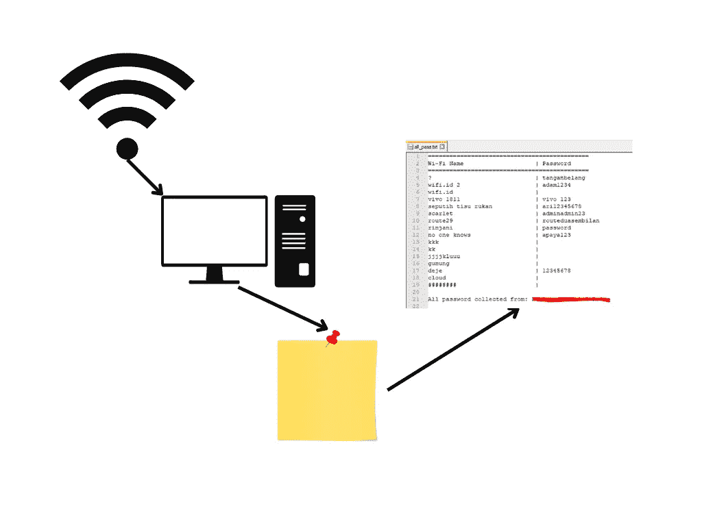

简单地说，这个程序将从已经连接到设备的保存的 Wi-Fi 密码中获取信息。之后，它会将数据保存到一个文件中。

# 这个概念

每个连接的 Wi-Fi 设备都会在系统中创建一个缓存。在访问缓存数据时，我更喜欢使用 CLI 而不是 GUI，因为它只需要几个命令。该程序将显示所有已经连接到设备的 Wi-Fi 的密码。你知道命令吗？

要列出所有连接的 Wi-Fi，您可以编写以下命令

```
netsh wlan show profiles
```

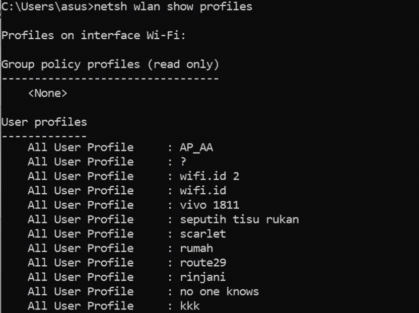

例如，在这种情况下，我将显示来自 Wi-fi ' scarlet '的密码

```
netsh wlan show profiles name=”scarlet” key=clear
```

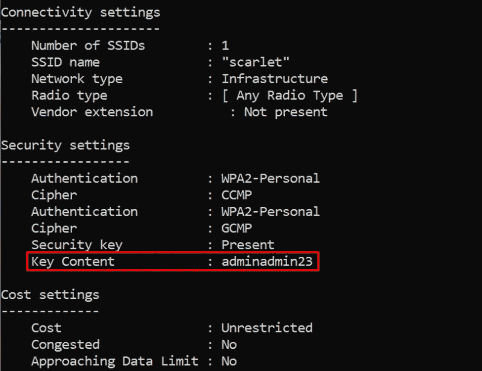

但是如你所见，显示所有的 Wi-Fi 密码需要更长的时间。从这个问题出发，我写了一篇关于抓取所有曾经使用 Python 连接的 Wi-Fi 密码的文章，以跳过这个繁琐的命令。

# 该计划

Oke，我用`jupyter notebook`来解释程序。

1.导入一个控制这个程序的模块。

在这个程序中，我们将使用 Python 来访问 windows 命令行。为了完成这项工作，我们可以很容易地导入“子流程”模块。

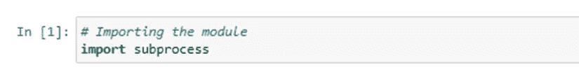

2.编写命令，以“子进程”模块格式显示连接到设备的所有 Wi-Fi。


3.之前显示命令的输出。

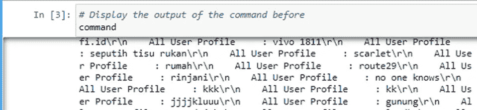

4.之前检查输出的类型。

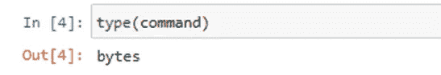

5.如你所知，我们不能在 Python 中处理“字节”文件，所以我们应该使用这个命令将它们解码成“字符串”。

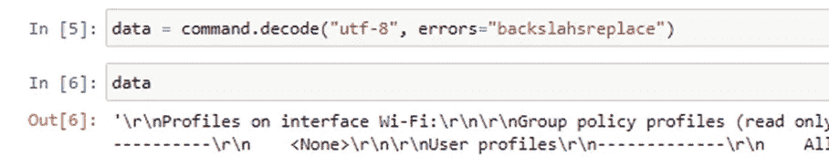

6.重新检查输出类型。

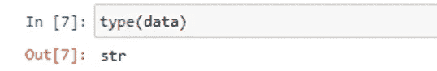

7.如果您更仔细地阅读输出，您会看到每个 Wi-Fi 都被`\n '文本分割。要删除它，您可以拆分数据。

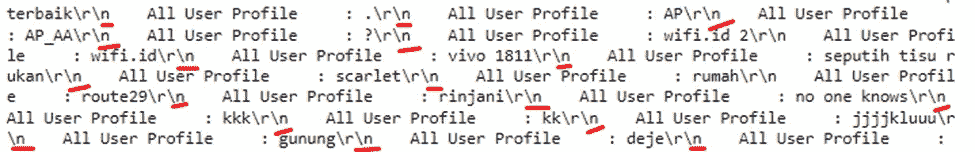

8.重新检查输出。

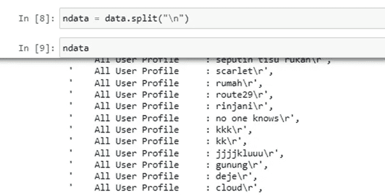

现在，你可以获得所有的 Wi-Fi 数据，但还没有完成。如果你只知道无线网络的真实名称会有所帮助。这可能有点混乱，但它只迭代所有的“所有用户配置文件”输出并收集 Wi-Fi 名称。

9.创建没有值的列表变量。为了方便起见，我将把它命名为“轮廓”。此变量将保存所有 Wi-Fi 名称。


10.迭代结束后，您可以通过`:`拆分数据，然后获取 Wi-Fi 的名称。

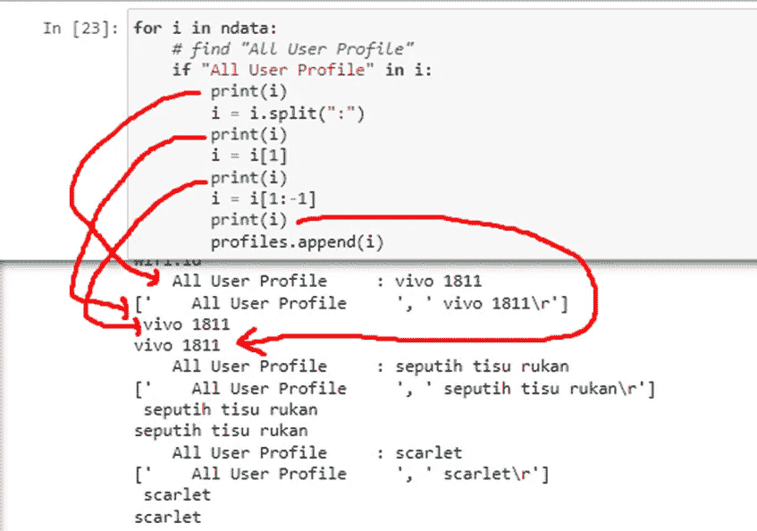

之后，我们将输出附加到已经声明的概要文件中。为了简单起见，您可以使用以下代码。

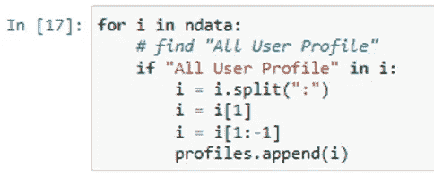

11.检查命令的输出。

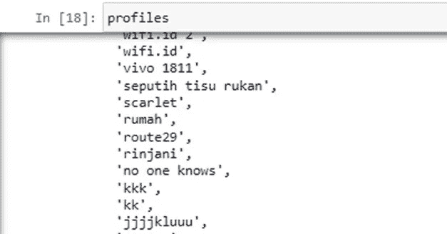

得到用户名后，你可以像以前得到‘scarlet .’密码一样得到所有的密码。概念是相同的，密码保存在“密钥内容”部分，它将是字节类型的密码。我们可以把它转换成一个字符串，然后打印结果。Tadaaa。

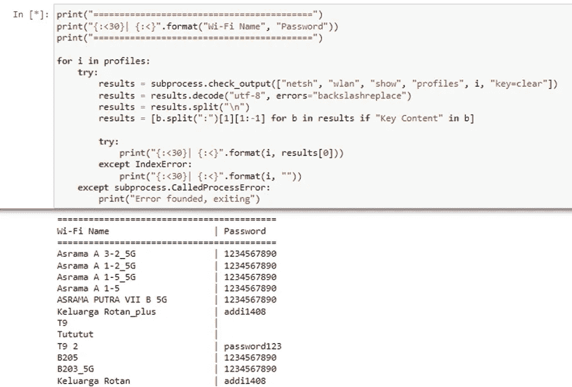

# 奖金脚本

嗯，为了让它更强大，我们不需要打印它，对不对？我们需要的只是保存数据。因此，我改进了最后一部分，并添加了这个脚本来将所有输出保存到记事本中。

```
import sys…sys.stdout = open(“all_pass.txt”, “w”)
print(“=============================================”)…hostnames = subprocess.check_output(“hostname”)
nhostname = hostnames.decode(“utf-8”, errors=”backslashreplace”)print(f”\nAll password collected from: {nhostname}”)
sys.stdout.close()
```

它会将所有的密码保存到 all_pass.txt 中，便于移动到其他设备中。

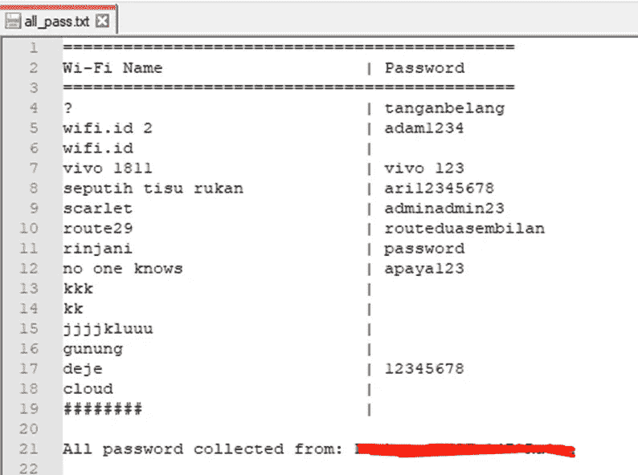

# 结论

嗯，我认为这就是你从你面前的设备获取 Wi-Fi 密码所需的所有解释。如果你问你能改进什么，那就太多了。例如，你可以把密码发到你的邮箱里。嗯，可能有点恶作剧，但是为了知识分享，何乐而不为呢？

感谢阅读，有一个很好的代码。🤝

# 资源

假设您对完整的源代码感兴趣。在这种情况下，你可以访问这个知识库，不要忘记给星星，因为它是免费的。

 [## python-hack-script/911 主服务器上的 WiFi 密码抓取器/python-hack-script

### 这个知识库致力于使生活更容易，仅用于教育目的，而不是暴力…

github.com](https://github.com/theDreamer911/python-hack-script/tree/main/WiFi-Password-Grabber)