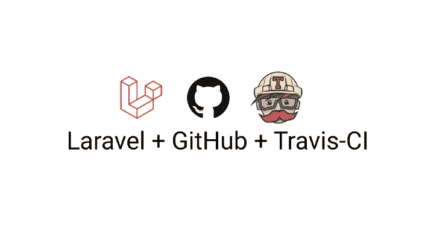
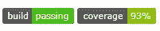

# 显示 Laravel 项目的构建状态和测试覆盖徽章

> 原文：<https://medium.com/geekculture/display-build-status-and-test-coverage-badges-for-a-laravel-project-c93467b591ac?source=collection_archive---------0----------------------->

## 我希望我有一个向导



为了寻找一个新的开发人员角色，我发现自己通过多次面试构建了各种项目。其中一个是 Laravel 项目，它包含了一个特殊的指令，在我的 readme.md 文件中显示**构建状态和代码覆盖报告**作为徽章。

我在网上搜索帮助，但没有找到任何给出解决这个问题的完整指南，大多数只提供了构建状态的解决方案，而忽略了代码覆盖方面。我必须解决这个问题，时间不多了。

以下是我想要达到的目标，我将展示我是如何实现的



# 安排 Travis CI 和工作服的报告

如果您还没有，那么您需要做的第一件事就是转到 Travis，使用您的 GitHub 帐户登录。登录后，点击“添加新的存储库”按钮来激活您的回购。在工作服上重复此程序。

# 配置 PHPUnit 和工作服

幸运的是，Laravel 附带了 PHPUnit。本教程假设您已经编写了一些测试。如果没有，就像检查 Laravel 文档来编写测试一样简单。

我们还将安装连体工作服，我们将使用它来存放覆盖报告，只需要求它:

```
composer require php-coveralls/php-coveralls
```

或者通过将以下行添加到 composer.json 文件的 require 块中。

```
"php-coveralls/php-coveralls": "^1.1"
```

这将把它作为依赖项添加到我们的 composer.json 文件中。

# 创建一个. travis.yml 和. workalls . yml。

现在，我们将在 Laravel 项目的根目录下创建一个 Travis 配置文件(. travis.yml ),以设置 Travis CI。此外，我们将创建一个. coveralls.yml，用于设置 clover.xml 的路径

下面是我的. travis.yml 的样子:我正在设置语言，php 的版本，并告诉它运行哪个附加脚本。

我的. workalls . yml 是这样的:我假设 phpunit.xml 将 clover.xml 保存在 build/logs 路径下。

```
coverage_clover: build/logs/clover.xml
json_path: build/logs/coveralls-upload.json
service_name: travis-ci
```

为了避免疑问，我的 phpunit.xml 和. env.example 文件如下所示:

# 部署代码并显示徽章

下面是我在 readme.md 文件中使用的两个徽章的代码。特拉维斯和工作服将提供这些嵌入链接。

Travis CI 构建徽章

```
[](https://travis-ci.com/chyke007/credible)
```

工作服代码覆盖徽章

```
[](https://coveralls.io/github/chyke007/credible?branch=master)
```

现在，一旦我们使用这个设置将代码推送到 GitHub，它应该会将构建发送给 Travis，Travis 应该会将覆盖范围发送给工作服。

这就是全部，总的来说这是一次令人兴奋的冒险，希望这能成为某人的向导，一个我希望拥有的向导！