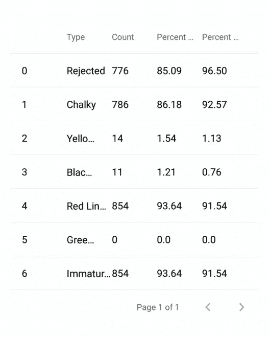

# 用分页显示 React 本机表中的 CSV 数据

> 原文：<https://medium.com/geekculture/display-csv-data-in-a-react-native-table-with-pagination-39c1df4fba2f?source=collection_archive---------3----------------------->

Display CSV data in React Native

最近，在进行 React 原生移动项目时，需要在表格组件中显示 CSV 数据。在本文中，我将带您完成从远程 URL 获取 CSV 数据并在启用分页的 React 原生表组件中显示它的过程。我们将构建一个可重用的 React 组件，它接受 CSV URL 和要在