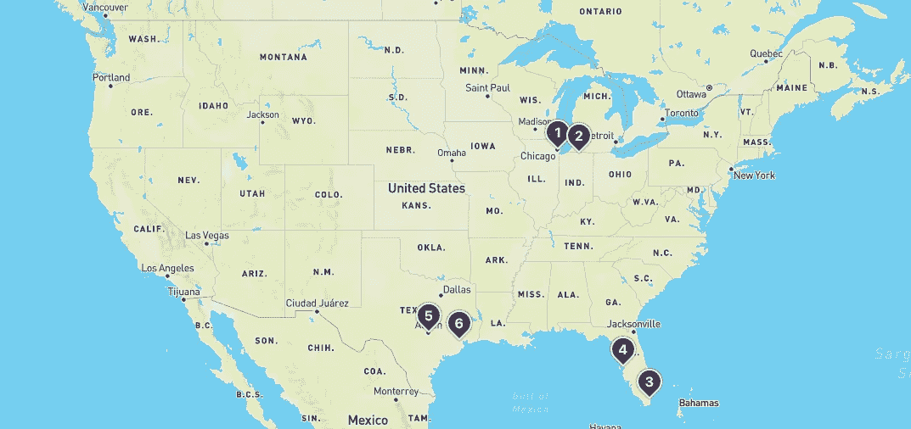

# 使用地图框显示地理位置

> 原文：<https://medium.com/geekculture/display-geolocations-using-mapbox-5c10b723ca14?source=collection_archive---------19----------------------->

用于映射任何东西的基于 JavaScript 的库！



[https://github.com/laurencun/react-mapbox-geocoder](https://github.com/laurencun/react-mapbox-geocoder)

## 入门指南

地理定位功能在现代应用中有许多用途。用户可能会寻找附近的企业，计划旅行或跟踪他们的锻炼路线。有大量的用例需要在地图上显示和更新位置。

GoogleMaps API 是一个受欢迎的选择，但是我强烈推荐另一个叫做 Mapbox 的工具。它有一个广泛的属性列表，允许你自定义你的视图，还有一些奇妙的内置样式功能。Mapbox GL JS 是基于 JavaScript 的，你可能已经从它的名字猜到了。它的魔力来自于 WebGL API 的集成，它允许我们显示用户可以与之交互的 2D 和 3D 图形。

React 开发者可以通过 React-Map-GL 访问一套与 Mapbox 兼容的组件。只需安装 react-map-gl 并在要渲染的文件中导入 ReactMapGL。在 ReactMapGL 组件中，您可以添加宽度和高度、地图框 API 访问令牌和其他有用的属性，例如 onViewPortChange，它可以调整地图覆盖的区域。

## 绘制地图

首先，您需要确保已经下载了 mapbox-gl-js 库，并将其导入到将要渲染地图的文件的顶部。

```
import mapboxgl from 'mapbox-gl'
```

接下来，您需要通过在 [Mapbox 站点](https://account.mapbox.com/auth/signup/?route-to=%22https://account.mapbox.com/%22)上创建一个帐户来请求一个 API 访问令牌。别担心，没什么痛苦的。注册后，您会在您的帐户页面上看到一个蓝色的“创建令牌”按钮。这将为您提供一个访问令牌，您可以使用它从您的应用程序到达 API 端点。将令牌添加到变量中。

```
mapboxgl.accessToken = 'your-access-token-here'
```

您最不需要的就是一个样式 URL。这对于确保地图按照您指定的方式显示至关重要。有几种方法可以定义样式源。您可以将此链接标记包含在 HTML 文件的头中:

```
<link href='[https://api.mapbox.com/mapbox-gl-js/v2.2.0/mapbox-gl.css'](https://api.mapbox.com/mapbox-gl-js/v2.2.0/mapbox-gl.css') rel='stylesheet' />
```

或者，您可以在地图对象中定义样式属性，如下所示:

```
const map = new mapboxgl.Map({container: 'map', // container ID
style: 'mapbox://styles/mapbox/streets-v11', // style URL
center: [-74.5, 40], // starting position [lng, lat]
zoom: 9 // starting zoom});
```

如您所见，容器指向一个 id 为“map”的元素，该元素将包含地图对象。有许多不同风格的 URL 可供我们选择。你可以在文档[这里](https://docs.mapbox.com/help/glossary/style-url/)找到它们。此 URL 指向包含街道的地图样式。还有明暗模式，卫星视图，导航设置和[更多](https://docs.mapbox.com/api/maps/styles/#mapbox-styles)。你甚至可以用 [Mapbox Studio](https://docs.mapbox.com/help/glossary/mapbox-studio/) 创建你自己的风格 URL！

## 添加标记

可以在 mapboxgl 上调用 Marker 方法来实例化新的标记。创建标记后，可以使用 setLngLat 方法包含位置坐标。addTo 方法将 map 对象作为参数，并在其上显示标记。

```
var marker = new mapboxgl.Marker({
  color: "#FFFFFF",
  draggable: true
}).setLngLat([30.5, 50.5]).addTo(map);
```

这是一个很好的开始，但是不要期望看到一个标记出现。我们需要给标记一些样式属性。在你的 CSS 文件中，你可以引用 marker 类并添加宽度、高度、背景颜色等。这里有一个例子可以帮助你开始:

```
.marker{
display:flex;
justify-content:center;
align-items:center;
box-sizing:border-box;
width: 30px;
height: 30px;
color:#fff;
background: #4D2D73;
border:solid 2px;
border-radius: 0 70% 70%;
box-shadow:0 0 2px #000;
cursor: pointer;
transform-origin:0 0;
transform: rotateZ(-135deg);
}
```

## 地图数据

假设您想要表示地图视口中所有星巴克位置的数据。您有实体店的地址，但需要准确的坐标来显示标记。这就是 Mapbox 的地理编码 API 派上用场的地方。前向地理编码允许我们发出一个提供位置名称的 get 请求，比如地址或城市名称，并获得一个包含该位置的纬度和经度的 JSON 对象。我们还可以通过发出一个提供特定坐标的 get 请求来查找地址。

为了熟悉这个过程和可能产生的请求的变化，您可以使用 [Mapbox 地理编码 API Playground](https://docs.mapbox.com/search-playground/#{%22url%22:%22%22,%22index%22:%22mapbox.places%22,%22approx%22:true,%22staging%22:false,%22onCountry%22:true,%22onWorldview%22:true,%22onType%22:true,%22onProximity%22:true,%22onBBOX%22:true,%22onLimit%22:true,%22onLanguage%22:true,%22countries%22:[],%22worldviews%22:[],%22proximity%22:%22%22,%22typeToggle%22:{%22country%22:false,%22region%22:false,%22district%22:false,%22postcode%22:false,%22locality%22:false,%22place%22:false,%22neighborhood%22:false,%22address%22:false,%22poi%22:false},%22types%22:[],%22bbox%22:%22%22,%22limit%22:%22%22,%22autocomplete%22:true,%22languages%22:[],%22languageStrict%22:false,%22onDebug%22:false,%22selectedLayer%22:%22%22,%22debugClick%22:{},%22localsearch%22:false,%22query%22:%22%22}) 。在 Starbucks 示例中，我们可以迭代 Starbuck 位置列表，并向前向地理编码端点发出请求，然后将接收到的坐标映射到一个标记。

## 创建弹出窗口

太好了，现在我们的用户可以看到所有星巴克的位置…但是我们仍然可以做更多的事情来使我们的地图更加用户友好和互动。当用户需要一个特定位置的更多信息时，他们应该能够点击一个标记来查看联系信息，地址和商店营业时间等细节。

我们可以通过将 Starbucks store 对象映射到一个具有指向特定商店的唯一键和指向函数的 openPopup 属性的标记，向标记添加一个弹出窗口。openPopup 函数需要将 store 对象保存在 selectedLocation(或者 state，如果使用 React 的话)这样的变量中。该变量将被映射到一个弹出元素(或 React 中的组件)来显示我们想要显示的信息。

当然，我们还需要能够关闭弹出窗口。我们的弹出元素需要一个 closePopup 属性，该属性指向一个函数，该函数将从状态中删除该商店位置，这样做实际上关闭了弹出窗口。

这听起来可能需要做很多工作，但幸运的是 React-Mapbox-GL 附带了一个弹出组件，其中包含了我们需要的所有基本样式。您所要做的就是从 react-map-gl 导入 popup，在 ReactMapGL 组件中添加 Popup 组件，赋予它一个 closePopup 属性，该属性指向一个从状态中删除该存储的函数，瞧！

## 更多资源

你可以用 Mapbox 做更多的事情。这篇文章只是触及了皮毛。我鼓励您深入研究并尝试自己的地图样式、地理编码和其他 API 请求。您可以获取当前用户的位置，显示用户位置和标记之间的距离，或者允许用户执行搜索并添加新的标记。

Mapbox 的文档相当详细，包括示例代码和教程。请记住，React-Map-GL 是 Map-GL 的包装器，确实有一些限制。如果您的组件没有按预期显示，请尝试使用 getMap 函数来访问 Map-GL API 及其属性。

我将留下一些文档和我的 github repo 的链接，下面是搜索、添加标记和映射现有数据的示例。尽情享受吧！

[Mapbox GL JS](https://docs.mapbox.com/mapbox-gl-js/api/)

[反应-地图-GL](https://www.npmjs.com/package/react-map-gl)

[GitHub 回购链接](https://github.com/laurencun/react-mapbox-geocoder)