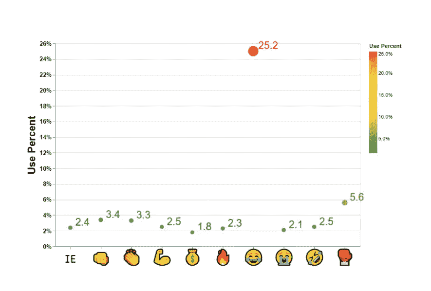
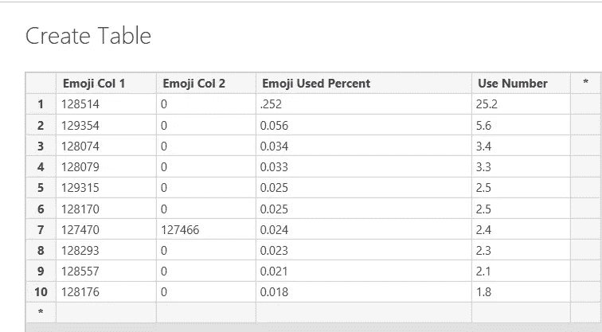
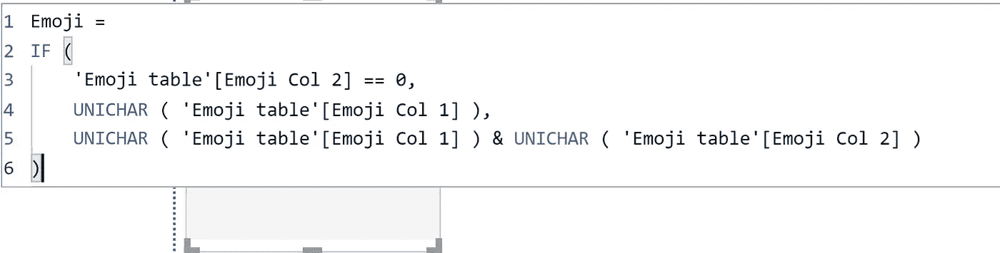
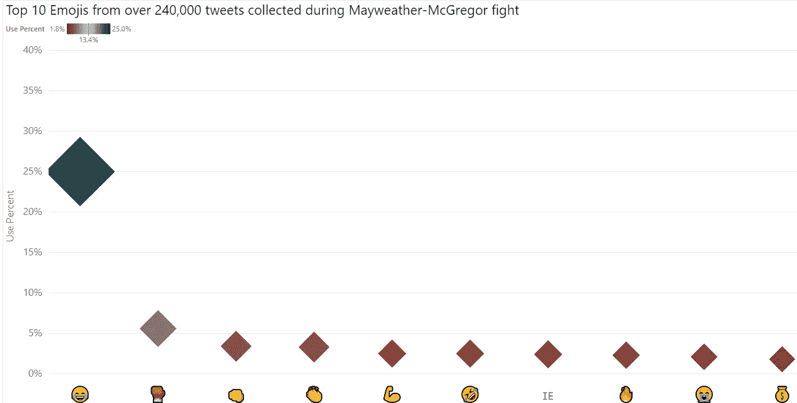
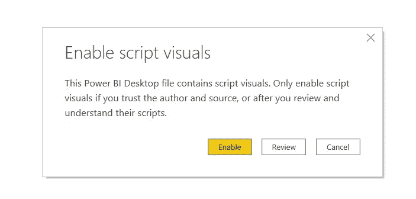
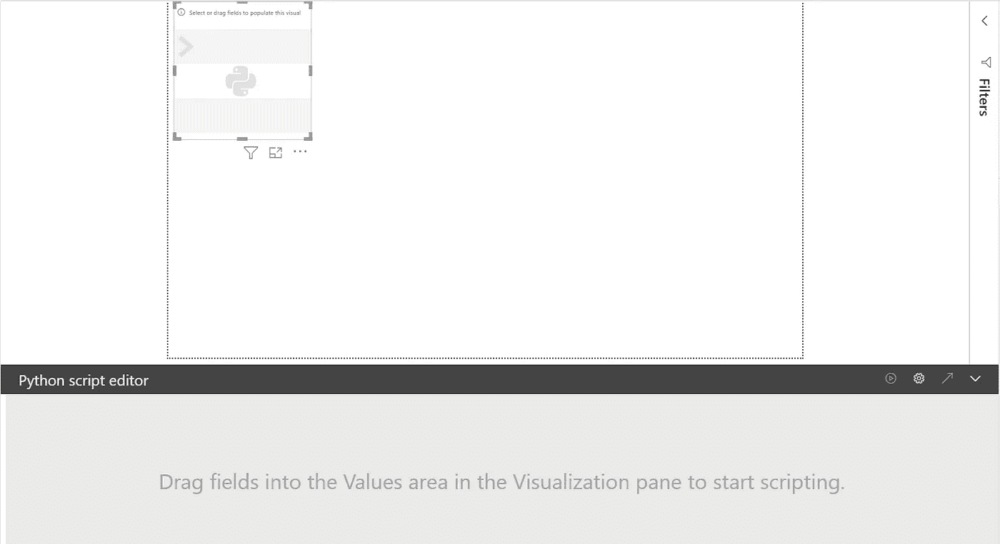
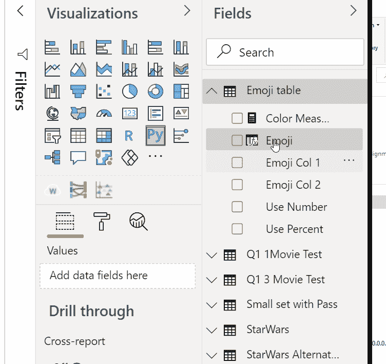
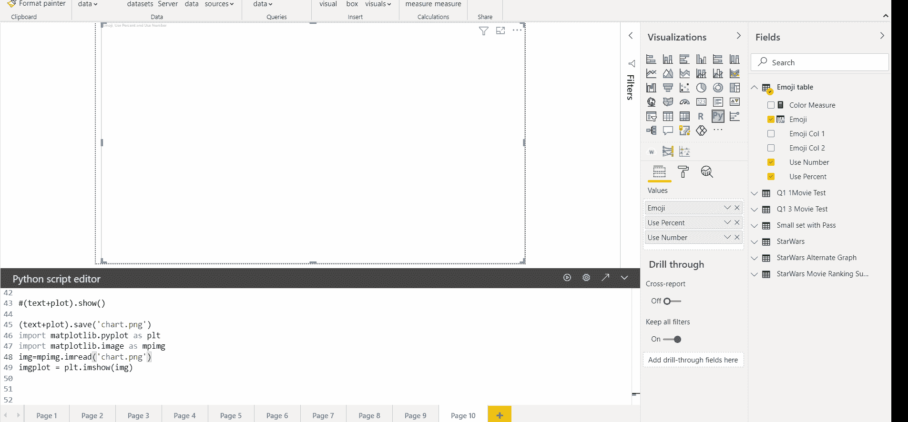

# 在 Power BI 中显示牛郎星图表

> 原文：<https://medium.com/geekculture/displaying-altair-charts-in-power-bi-4673e0f80291?source=collection_archive---------3----------------------->

## 可视化与 DAX 的破折号和 Python 牛郎星胡椒

## 方案

创建一个散点图，显示电视转播活动期间从观众推文中收集的表情符号的使用百分比。该数据集由表情符号(十进制表示)以及收集的推文中前十个表情符号的使用百分比组成。大多数表情符号只有一个 Unicode 和十进制表示，然而有一个是爱尔兰国旗表情符号，它是两个 Unicode 字符的串联。

为什么我没有在 Power BI 中使用标准或自定义散点图？我在 Power BI 中到处寻找散点图，该散点图将显示定量变量的值(作为文本)与分类变量(如这些表情符号)的关系，但找不到，因此决定在 Power BI 中使用 Python 库。如果你，作为读者，知道一个定制的可视化提供了这个功能，请评论。

## **安装**

**Python 库及其依赖**
Matplotlib
[牛郎星](https://altair-viz.github.io/getting_started/installation.html)
[牛郎星 _ 保存](https://pypi.org/project/altair-saver/)

**镀铬驱动
1。**此处从 [**下载 Chromedriver。**](https://chromedriver.chromium.org/downloads/version-selection)我下载了一个与我的 Chrome 浏览器版本兼容的版本。
2。将可执行文件存储在一个目录中，比如 C:\chromedriver_win32
3。在系统环境 PATH 变量中设置 Chrome 驱动程序可执行文件的目录。

您也可以在这里找到驱动程序和安装说明以及设置 [**。**](https://github.com/mohaali/PowerBIExamples/tree/master/Python%20blog%20post%201%20-%20A%20new%20hope) 报告的入门页面包含有关驱动程序和路径设置的必要信息。

## **数据集**

1.  该数据集是使用 Create table 使用表情符号第 1 列中表情符号的十进制值创建的。那么，表情符号 Col 2 是怎么回事呢？嗯，有一些表情符号，如爱尔兰国旗表情符号“IE”，它由两个 unicode 字符组成，其十进制表示可以在下面的第七行看到。该查询被命名为“表情表”

2.使用 DAX 函数创建计算列，将十进制表示转换为表情符号，以便在轴上显示。使用 UNICHAR(DAX 函数)将十进制表情值转换为表情图像。当您有两个十进制表示时，使用&来连接 unicode。这将从爱尔兰表情符号中的 I 和 E 创建一个单一的表情符号。

## 双原生散点图

Power BI 的散点图确实支持表情符号和使用百分比的显示，但它似乎不支持标记旁边的值的显示(根据 Power BI 社区回复)。定制的视觉效果并没有表现出我所尝试的任务的本质。

## Python 可视化

1.  要在 Power BI 中启用 Python 可视化，请在窗格中选择 Py 可视化。您还将“启用”脚本可视化，以允许执行 Python 脚本。

**Py visualization**

这将在屏幕底部弹出一个窗口，提示如下:

2.将用于可视化的字段放入值池中。这些查询列现在可以在我们接下来要编写的 Python 脚本中使用了。

## **代码**

现在我们有了中的值，Python 脚本编辑器将在 Power BI 称为“数据集”的数据帧中包含表情表查询。在下面的代码块中，您将看到注释掉的行，这些行是对开发人员开始编写代码的初始提示。

Altair 支持使用图形语法构建可视化。因此，编码时的思维过程遵循数据集中数据的定义。例如，我们将使用位置沿着 x 轴展开分类的“名义”值表情图像，然后沿着 Y 轴指定数量值。

**MARK_CIRCLE** 我们在本文中选择的“MARK”用于描绘使用率百分比的值是圆圈。

**X 轴**
为了理顺图像，我们将 labelAngle 设置为 0。
要控制表情符号的大小，将 labelFontSize 设置为 30。

**Y 轴** 在 alt.Axis 内用一个十进制数字和一个百分号格式化刻度标签。
用 titleFontSize 和 labelFontSize 控制标题和标签大小。

**我们将用三种编码尺寸、颜色和文本来表示使用百分比值。**

**尺寸**
当我们在编码中使用尺寸参数时，域和范围将使用百分比的值映射到标记最小和最大尺寸的比例范围。
**注**:为了进一步了解尺度，[这篇文章](https://www.d3indepth.com/scales/)将会有所帮助

**颜色** 为了给使用百分比值添加另一种编码，我们使用了一种色标，这种色标类似于尺寸色标，将使用百分比值转换成范围颜色的色标。

**Text (mark_text)** 最后我们给圆圈标记添加一个显式文本。因为我们提供的调整圆大小的比例也会调整它们旁边的文本，所以我们将覆盖此行为，用 alt 保持不变的文本大小。SizeValue(20)。
该文本将在散点图上“分层”, Altair 中的“+”操作符用于分层。

**在 Power BI 内部显示牛郎星图表** 牛郎星图表可以被捕获到一个变量中，如(plot+text)，然后可以通过调用 show()
(plot + text)来显示。show()
这将打开一个新的浏览器窗口，其中显示可视化效果。

但是我们希望在 Power BI 中显示 Altair 生成的 HTML。为此，我们将该图像保存为。PNG 文件，并使用 matplotlib 的图像库来读取。PNG 并展示出来。
HTML 将在 Chrome 驱动程序的帮助下显示在 Power BI 中。一定要确保在你的 PATH 变量(系统环境)中设置 chrome 驱动可执行文件的文件夹。

## 运行代码

**注意**:点击执行后，可能需要几秒钟才能渲染图像。

## 限制

失去互动性。由于图像是作为静态文件存储并加载显示的，Altair 的交互能力不能传递给用户。

**最后:** 你可以通过沿 X 轴排列表情符号来提高可视化效果。网格线怎么样？你能想到其他的改进吗？

评论和反馈在这里表达你的想法…