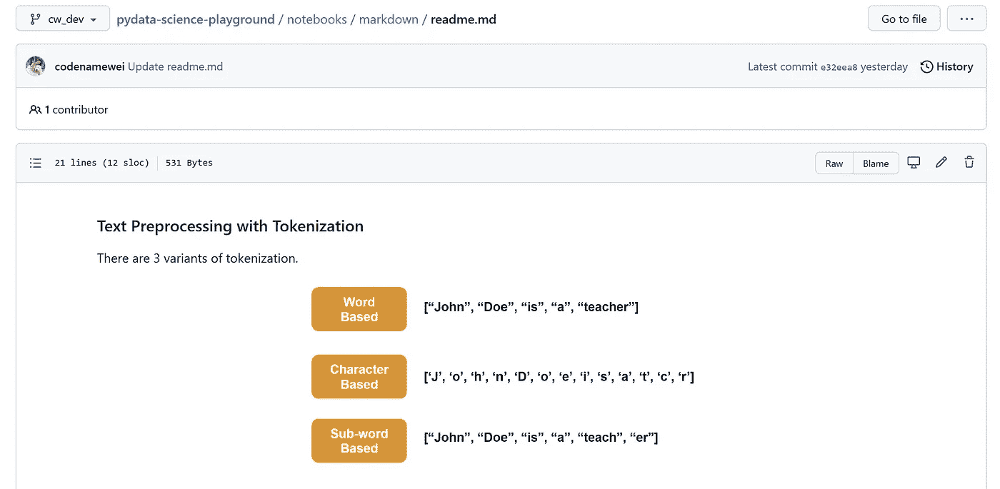
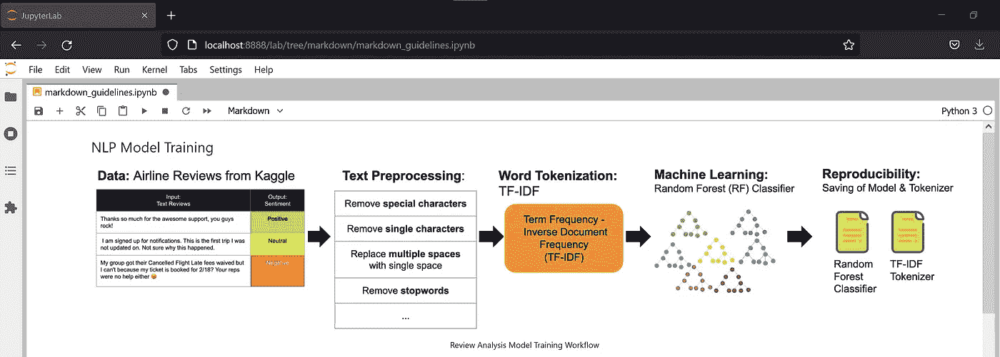
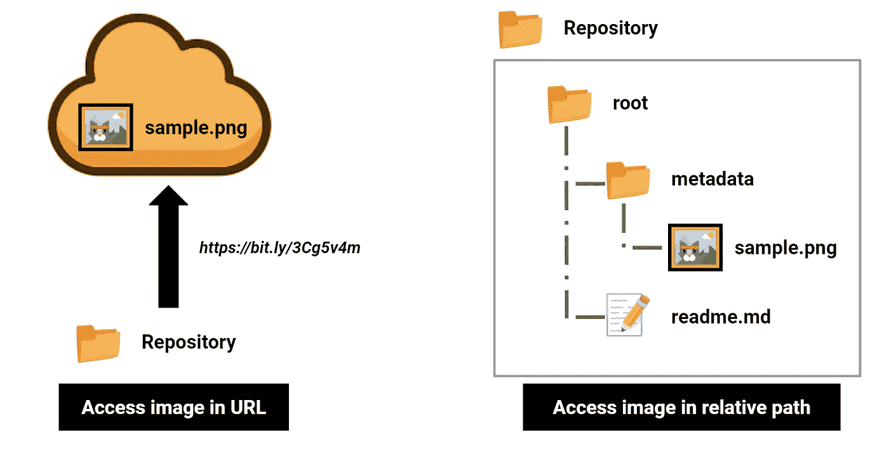
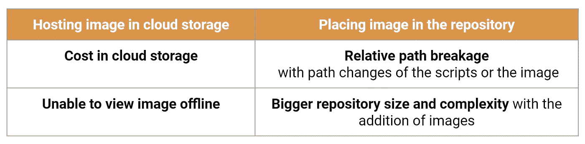
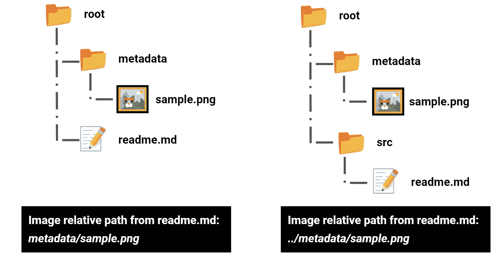

# 通过降价显示视觉效果

> 原文：<https://medium.com/geekculture/displaying-visuals-with-markdown-c39f2495e146?source=collection_archive---------10----------------------->

## 详细说明如何以降价形式最好地呈现视觉效果


Photo by the author

*最后更新时间:2022 年 2 月 19 日*

在探索 Github 资源库时，最能吸引开发人员注意力的一个方面是信息丰富且简洁的自述文件，通常还辅以信息丰富的视觉辅助工具。

视觉辅助在最直接地传达任何内容方面都很棒。如果使用得当，它允许更快地试用、采用具有开箱即用指导原则的脚本。这里有一些如何使用它的例子。

*   [概念说明](https://github.com/codenamewei/pydata-science-playground/blob/main/notebooks/markdown/readme.md)



Photo by the author

*   [工作流程显示](https://github.com/codenamewei/pydata-science-playground/blob/main/notebooks/markdown/markdown_guidelines.ipynb)



Photo by the author

## 外卖:

这篇文章关注的是如何在 markdown 文件中有效地显示图片。

## 内容:

*   方法来显示图像
*   在何处托管映像的权衡
*   吸引人的元素——Gif
*   它对视频有效吗？

## 方法来显示图像

显示图像的首选方法如下所示。

```
<div align="center">
  <br>
  <sup>This it the caption of the image<sup>
</div>
```

如果你熟悉 HTML，你会意识到代码片段是 HTML 格式的。

有 5 个参数需要修改:

*   **对齐:**图像向左、居中或向右对齐
*   **src** :指向图像的相对路径或 URL
*   **alt** :图像区域的文本，当没有找到图像时显示
*   **宽度**:图像的宽度，以像素为单位
*   **高度**:图像的高度，以像素为单位

*注意:这些参数中的每一个都必须用双引号括起来。*

**示例:**

特别是，通过定义图像尺寸(宽度/高度)中的一个，图像的尺寸调整效果最好。另一边会随着变化自适应调整，保持图像的长宽比。这使得图像很容易以新的分辨率呈现，没有失真。

或者，将图像插入降价文件的最简单格式如下所示

```

```

虽然它工作得非常好，但它不允许粒度控制，如改变方向或调整图像的大小。

**例子:**

实际上，这两种格式可以互换使用，后者是一种快速解决方案。

## 在何处托管映像的权衡

当在降价文件中添加图像时，下一个问题是在哪里保存图像。

有两种选择:

*   将图像上传到云存储，并将其作为公共 URL 公开
*   将图像添加到存储库中的子位置



Photo by the author

这两种选择都有利弊，下面提到了缺点。



Photo by the author

将图像放在同一个存储库中，获得正确的相对路径非常重要。指向图像的相对路径应该总是从引用它的 markdown 文件开始。

示例如下所示:



Photo by the author

## 吸引人的元素——Gif

Gif 图像也可以以上述格式显示。动画 Gif 在说明步骤或程序时很有用。

考虑到互联网带宽和要嵌入的 gif 的大小，适度使用 gif 将提高读者的参与度。

Photo source: [https://giphy.com/gifs/90s-80s-illustration-l0HlNaQ6gWfllcjDO](https://giphy.com/gifs/90s-80s-illustration-l0HlNaQ6gWfllcjDO)

## 它对视频有效吗？

在极少数情况下，有些人可能有意在降价文件中包含视频。

一种有效的方法是在嵌入视频 URL 时有一个好的图像表示。

选项 1:

```
<div align="center">
    <a href="video_[u](https://www.youtube.com/watch?v=wSmRMRFmWeU)rl"></a>
</div>
```

选项 2:

```
[mage_url)](video_[u](https://www.youtube.com/watch?v=wSmRMRFmWeU)rl)
```

下次见！