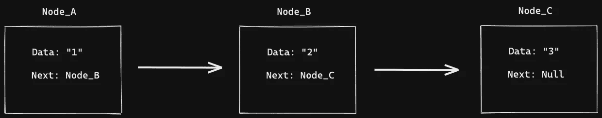
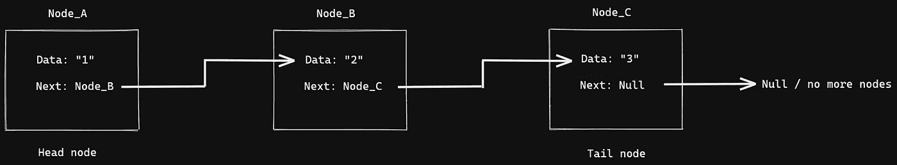
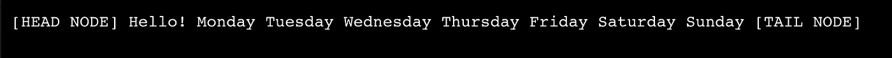
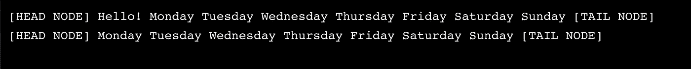
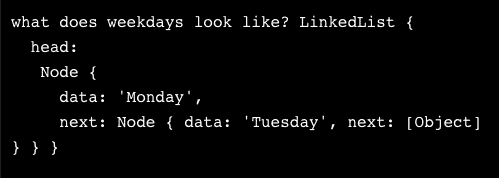

# 剖析链表

> 原文：<https://medium.com/geekculture/dissecting-linked-lists-490b47198dbe?source=collection_archive---------15----------------------->


Photo by [James Orr](https://unsplash.com/@orrbarone?utm_source=medium&utm_medium=referral) on [Unsplash](https://unsplash.com?utm_source=medium&utm_medium=referral)

为了理解这种数据结构，我认为我们需要把它分解开来。因为这是我个人学得最好的方法。只是把东西拆开，然后从头开始组装！我决定把它分成三个不同的部分来更好地理解它，节点，链表，和一个我们将把它放在一起的部分！

# 结节

什么是节点？

我们可以把节点比作原子，它们是一些数据结构的组成部分。节点是数据结构的基本单位，它们包含的信息也可能链接到其他节点，节点之间的链接通常由指针实现。它们通常出现在链表和树中，使用这些指针可以从一个节点遍历到另一个节点。

我们可以看看如何用 Javascript 构建它:

```
class Node {
  constructor(data) {
    this.data = data;
    this.next = null;
  }
}
```

一旦一个节点的链接是`**null**`,这通常意味着我们已经到了我们正在穿越的路径的终点。



Visual representation of Nodes being linked together

另一件要注意的事情是，节点可能是“孤立的”，这意味着没有到它们的现有链接。


Visual representation of an orphaned node

在上图中，`Node_B`现在是一个孤立节点，`Node_A`之间的链接从`Node_B`变成了`Node_C`。它现在存在，但是没有链接到它，孤立节点可以被重新分配或完全删除。

# 链表

什么是链表？

链表是一种线性数据结构，其中的元素不存储在连续的位置，这意味着元素彼此不相邻或不接触。相反，这些元素是通过使用指针来链接的。我们还可以查看类似于节点的链表，它们被用作其他数据结构的基础。如果我们试图以线性方式存储信息，它们也是数组的一种替代方式。两者有相似之处，但也有巨大差异。(我现在不讨论这个问题，因为这不是本文的目的！)

链表的数据存储在节点中，每个节点都链接到下一个节点，这就是所谓的**单链表**，但是它们也可以链接到前一个节点，这就是所谓的**双链表**。现在，我们将重点关注**单链表**。

链表中的每个节点由以下内容组成:

*   数据
*   指向下一个节点的指针
*   (双向链表):指向前一个节点的指针

链表的结构包括以下内容:

*   首节点作为链表的第一个节点，如果链表为空，首节点的值为`**null**`。这是我们通常开始列表和遍历的地方。
*   中间的节点
*   尾节点，它是列表中的最后一个节点。我们通常说它是尾节点是因为指针总是指向或链接到一个`null`值，这表示列表的结尾。



Visual representation of a linked list

# 把它放在一起

让我们把它放在一起！

从节点开始:

```
class Node {
  constructor(data) {
    this.data = data;
    this.next = null;
  }

  setNextNode(node) {
    if (node instanceof Node || node === null) {
      this.next = node;
    } else {
      throw new Error('Next node must be a member of the Node class.');
    }
  }

  getNextNode() {
    return this.next;
  }
}
```

在这段代码中，我们用两种不同的方法设置了节点，这两种方法的设置方式允许我们稍后遍历节点！

让我们现在构造我们的链表！我们将从创建构造函数和添加到 head 方法开始。作为复习，节点由信息/数据和到下一个节点的链接组成。

我们将利用我们创建的`Node`类以及其中的方法！

```
class LinkedList {
  constructor(){
    this.head = null
  }
  addToHead(data){
    const newHead = new Node(data)
    const currentHead = this.head
    this.head = newHeadif(currentHead){
      this.head.setNextNode(currentHead)
    }
  } 
}
```

接下来，因为我们创建了添加到链表的头部，所以让我们创建一个添加到尾部的方法。

我们需要创建一个临时的尾部变量，我们将设置为等于列表的头部。如果没有头，那就意味着列表是空的，我们需要使用我们的`addToHead`方法来代替。如果有一个头，那么我们将遍历列表，直到找到最后一个节点，一旦找到，我们将添加一个从该节点指向我们新的尾部的指针！

```
class LinkedList {
  constructor(){
    this.head = null
  }addToHead(data){
    const newHead = new Node(data)
    const currentHead = this.head
    this.head = newHeadif(currentHead){
       this.head.setNextNode(currentHead)
    }
  }addToTail(data) {
    let tail = this.head;
    if (!tail) {
      this.head = new Node(data);
    } else {
      while (tail.getNextNode() !== null) {
        tail = tail.getNextNode();
      }
      tail.setNextNode(new Node(data));
    }
  }}
```

现在我们已经设置了添加到链表头部和尾部的方法，我们需要一个方法来允许我们从头部移除它。我们需要先检查列表是否有头，如果没有，那么就没有什么可返回的。虽然如果有，我们需要通过设置头等于原始头的下一个节点来删除它，然后返回原始头。

```
class LinkedList {
  constructor(){
    this.head = null
  }addToHead(data){
    const newHead = new Node(data)
    const currentHead = this.head
    this.head = newHeadif(currentHead){
       this.head.setNextNode(currentHead)
    }
  }addToTail(data) {
    let tail = this.head;
    if (!tail) {
      this.head = new Node(data);
    } else {
      while (tail.getNextNode() !== null) {
        tail = tail.getNextNode();
      }
      tail.setNextNode(new Node(data));
    }
  } removeHead() {
    const removedHead = this.head;
    if (!removedHead) {
      return;
    }
    this.head = removedHead.getNextNode();
    return removedHead.data;
  }}
```

魔术来了！

我们将添加一个允许我们记录列表的方法。

我们需要创建一个等于字符串的变量来保存列表中每个节点的数据。首先，我们将从列表的头部开始遍历，并迭代列表，我们将添加到我们的字符串变量。

```
class LinkedList {
  constructor(){
    this.head = null
  }addToHead(data){
    const newHead = new Node(data)
    const currentHead = this.head
    this.head = newHeadif(currentHead){
       this.head.setNextNode(currentHead)
    }
  }addToTail(data) {
    let tail = this.head;
    if (!tail) {
      this.head = new Node(data);
    } else {
      while (tail.getNextNode() !== null) {
        tail = tail.getNextNode();
      }
      tail.setNextNode(new Node(data));
    }
  } removeHead() {
    const removedHead = this.head;
    if (!removedHead) {
      return;
    }
    this.head = removedHead.getNextNode();
    return removedHead.data;
  }showList() {
    let currentNode = this.head;
    let output = '[HEAD NODE] ';
    while (currentNode !== null) {
      output += currentNode.data + ' ';
      currentNode = currentNode.getNextNode();
    }
    output += '[TAIL NODE]';
    console.log(output);
  }}
```

现在我们已经写好了所有的内容…让我们试着做一个我们自己的链表吧！

在我的例子中，我们将把一周中的每一天作为一天，因为它只适合学前教师。

```
const weekdays = new LinkedList()
```

现在让我们使用我们创造的方法。

我们还需要使用我们的`showList`方法来查看列表的外观。你能猜到它会是什么样子吗？

```
const weekdays = new LinkedList()weekdays.addToTail("Saturday")
weekdays.addToTail("Sunday")
weekdays.addToHead("Friday")
weekdays.addToHead("Thursday")
weekdays.addToHead("Wednesday")
weekdays.addToHead("Tuesday")
weekdays.addToHead("Monday")
weekdays.addToHead("Hello!")weekdays.showList()
```



Our days of the week linked list! Wait a minute…

啊哦！“你好！”不属于链表，它不是我们一周中的一天！

好在我们发明了一种方法，可以帮助我们移除那个节点。

```
const weekdays = new LinkedList()weekdays.addToTail("Saturday")
weekdays.addToTail("Sunday")
weekdays.addToHead("Friday")
weekdays.addToHead("Thursday")
weekdays.addToHead("Wednesday")
weekdays.addToHead("Tuesday")
weekdays.addToHead("Monday")
weekdays.addToHead("Hello!")weekdays.showList()weekdays.removeHead()
weekdays.showList()
```

现在我想知道，这解决了我们的问题吗？



Phew! All fixed

是的，修好了！

现在，如果你和我一样好奇，让我们看看我们的`weekdays`会向我们展示什么

```
console.log('what does weekdays look like?', weekdays)
```



Neat!

感谢你花时间和我一起学习链表！

如果我错过了什么或误解了什么，请联系我！

[领英](https://www.linkedin.com/in/matthew-leng/)

[推特](https://twitter.com/matthewleng)