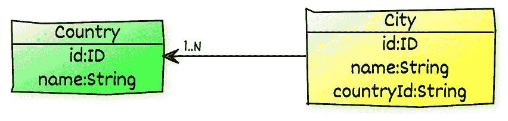
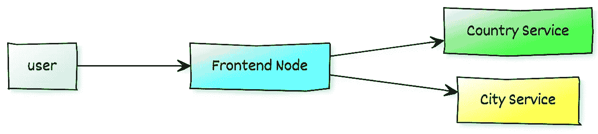
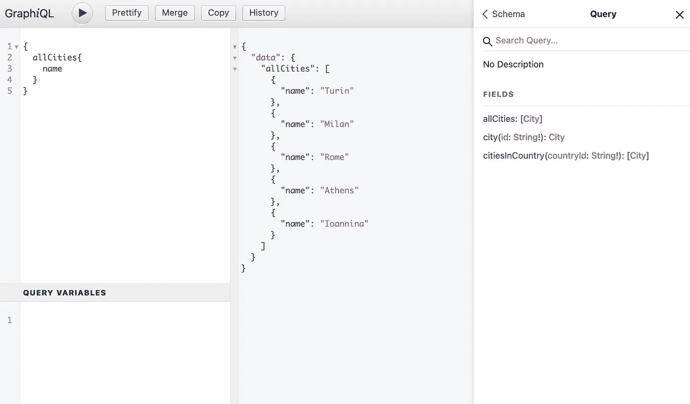

# 分布式应用程序和 GraphQL

> 原文：<https://medium.com/geekculture/distributed-application-and-graphql-e3f913e2fbb0?source=collection_archive---------37----------------------->

## 如何用多个微服务编写一个分布式应用，并用 GraphQL 把它们全部连接起来。


Photo by [贝莉儿 DANIST](https://unsplash.com/@danist07?utm_source=unsplash&utm_medium=referral&utm_content=creditCopyText) on [Unsplash](https://unsplash.com/s/photos/architecture?utm_source=unsplash&utm_medium=referral&utm_content=creditCopyText)

在研究 GraphQL 的实现时，我意识到可以使用该技术将业务模型扩展到多个微服务中，并让 API 承担集成的重任。

我构建了一个简单的演示应用程序来将理论付诸实践。用例当然非常简单:有国家，国家包含城市。作为一个用户，我想搜索国家，城市，从一个国家搜索城市，从一个城市搜索一个国家。



In a SQL database my model would be two tables with a foreign key in City pointing to the primary id of Country.

下一步是定义我的服务。我选择了三个节点:城市服务、国家服务和集成它们的前端节点。城市服务和国家服务从不相互作用，并且前端节点是唯一知道完整模型的节点。



User doesn’t know anything about the complexity behind the frontend node

所有的代码都可以在[https://github.com/alros/distributed-graphql](https://github.com/alros/distributed-graphql)中找到，这里我只关注其中的几个部分。

# 首次数据服务

我先从乡村服务说起。第一步是用这两个模块创建一个基本的 Spring Boot 应用程序:

```
<dependency>
 <groupId>org.springframework.boot</groupId>
 <artifactId>spring-boot-starter</artifactId>
</dependency>
<dependency>
 <groupId>org.springframework.boot</groupId>
 <artifactId>spring-boot-starter-web</artifactId>
</dependency>
```

spring-boot-starter-web 对于通过 HTTP 公开 API 是必不可少的。下一步是添加 GraphQL 的依赖项:

```
<dependency>
  <groupId>com.graphql-java-kickstart</groupId>
  <artifactId>graphiql-spring-boot-starter</artifactId>
  <version>11.1.0</version>
</dependency>
<dependency>
  <groupId>com.graphql-java-kickstart</groupId>
  <artifactId>graphql-spring-boot-starter</artifactId>
  <version>11.1.0</version>
</dependency>
```

请注意，我的 API 定义策略是契约优先，因为我觉得这样更容易。代码优先工作总是可能的。

默认情况下，应用程序将在 resources/graphql 中查找描述符。我用以下定义创建了 schema.graphqls:

```
type City {
    id:ID!
    name:String!
    countryId:String!
}

type Query {
    allCities:[City]
    city(id:String!):City
    citiesInCountry(countryId:String!):[City]
}
```

如果您不熟悉这种语言，它定义了数据的类型 City 和包含已接受查询的特殊类型 Query。

*   allCities 返回一个城市数组(城市在[..])
*   city 接受一个参数 id(强制的，因为有一个“！”)并返回一个城市
*   citiesInCountry 接受参数 countryId 并返回一个城市数组。

编码约定强烈支持代码部分，以自动将模式连接到代码。该框架将寻找一个名为“City”的 pojo 来映射类型，并寻找一个实现 GraphQLQueryResolver 的类查询来映射所有查询。

```
@Component
public class Query implements GraphQLQueryResolver {

    private static final Logger LOG = LoggerFactory.getLogger(Query.class);

    @Autowired
    private CityRepository countryRepository;

    public List<City> allCities() {
        LOG.info("allCities");
        return countryRepository.getAllCities();
    }

    public City city(String id) {
        LOG.info("city {}", id);
        return countryRepository.getCity(id);
    }

    public List<City> citiesInCountry(String countryId) {
        LOG.info("citiesInCountry {}", countryId);
        return countryRepository.citiesInCountry(countryId);
    }

}
```

所有方法都是已定义查询的 Java 翻译。这个查询组件是城市服务的入口点，从这里，可以实现公开数据所需的任何逻辑。在我的例子中，我只是在存储库中硬编码了一些东西。

还有…就是这样！现在可以启动应用程序并通过[http://localhost:8080/graphiql](http://localhost:8080/graphiql)与服务交互



This is the console exposed automatically by the application

使用 GraphQL，用户描述预期的模型。例如:

```
{
  city(id:"1"){
    name
  }
}
```

会回来的

```
{
  "data": {
    "city": {
      "name": "Turin"
    }
  }
}
```

在…期间

```
{
  city(id:"1"){
    id
    name
    countryId
  }
}
```

会回来的

```
{
  "data": {
    "city": {
      "id": "1",
      "name": "Turin",
      "countryId": "1"
    }
  }
}
```

都是框架处理的，以后会很重要。

# 第二数据服务

下一步是编码国家服务。我将跳过这里的描述，因为它就像一个不同模型的城市服务。一张纸条。默认情况下，Spring Boot 在 8080 上启动，所以我在 8090 和 8091 上配置了两个数据服务。例如，这对于处理容器来说可能并不重要。

# 前端节点— API

当数据服务启动并运行时，就到了前端节点的时代。该节点提出了与数据服务公开的 GraphQL API 进行交互的额外挑战。

在前端的 pom 中，Spring Boot 和 GraphQL 就像数据服务一样:

```
<dependency>
  <groupId>org.springframework.boot</groupId>
  <artifactId>spring-boot-starter</artifactId>
</dependency>
<dependency>
  <groupId>org.springframework.boot</groupId>
  <artifactId>spring-boot-starter-web</artifactId>
</dependency>
<dependency>
  <groupId>com.graphql-java-kickstart</groupId>
  <artifactId>graphiql-spring-boot-starter</artifactId>
  <version>11.1.0</version>
</dependency>
<dependency>
  <groupId>com.graphql-java-kickstart</groupId>
  <artifactId>graphql-spring-boot-starter</artifactId>
  <version>11.1.0</version>
</dependency>
```

下一步是定义向用户公开的 API 的模式。

```
type City {
    id:ID!
    name:String!
    country:Country!
}type Country {
    id:ID!
    name:String!
    cities:[City]
}type Query {
    allCountries:[Country]
    allCities:[City]
    city(id:String!):City
    country(id:String!):Country
}
```

这个定义是两种数据服务的一种合并，但是有两个巨大的不同:在城市中，country 是 Country 类型，而在乡村城市中是 City 类型的数组。

用户将能够执行如下查询:

```
query{
  country(id:"1"){
    name
    cities{
      name
    }
  }
}
```

它将返回一个混合了这两种数据模型的更丰富的数据模型。

```
{
  "data": {
    "country": {
      "name": "Italy",
      "cities": [
        {
          "name": "Turin"
        },
        {
          "name": "Milan"
        },
        {
          "name": "Rome"
        }
      ]
    }
  }
}
```

让我们探索映射。

就像在 City 服务中一样，将有 City 和 Country 类来对类型进行建模，但是 Java 实现仍将使用主键-外键方法:

```
public class City {
    private String id;
    private String name;
    private String countryId;
    ...
}
```

和

```
public class Country {
    private String id;
    private String name;
    ...
}
```

有一个常见的类查询来映射查询:

```
@Component
public class Query implements GraphQLQueryResolver {

    private static final Logger LOG = LoggerFactory.getLogger(Query.class);

    @Autowired
    private CountryService countryService;

    @Autowired
    private CityService cityService;

    public List<Country> allCountries() {
        LOG.info("allCountries");
        return countryService.getAllCountries();
    }

    public List<City> allCities() {
        LOG.info("allCities");
        return cityService.getAllCities();
    }

    public Country country(String id) {
        LOG.info("country {}", id);
        return countryService.getCountry(id);
    }

    public City city(String id) {
        LOG.info("city {}", id);
        return cityService.getCity(id);
    }
}
```

到目前为止，它与数据服务是一样的，对于像下面这样的简单查询，它可能已经足够了。

```
query{
  country(id:"1"){
    name
  }
}
```

然而，如果用户查询一个国家的所有城市，GraphQL 需要一种方法来解决这种关系。要引入的新组件是 GraphQLResolver。

```
@Component
public class CitiesResolver implements GraphQLResolver<Country> {

    private static final Logger LOG = LoggerFactory.getLogger(CitiesResolver.class);

    @Autowired
    private CityService cityService;

    public List<City> cities(Country country) {
        LOG.info("cities {}", country);
        return cityService.getCitiesInCountry(country.getId());
    }
}
```

解析器使用一个名为“cities”的方法映射关系，该方法接受一个国家。当用户请求字段“城市”时，框架会自动调用该方法。

当用户请求给定城市的国家时，该机制以相同的方式工作:

```
query{
  city(id:"1"){
    name
    country{
      name
    }
  }
}
```

GraphQL 将搜索一个 GraphQLResolver，返回给定城市的国家:

```
@Component
public class CountryResolver implements GraphQLResolver<City> {

    private static final Logger LOG = LoggerFactory.getLogger(CountryResolver.class);

    @Autowired
    private CountryService countryService;

    public Country country(City city) {
        LOG.info("country {}", city);
        return countryService.getCountry(city.getCountryId());
    }
}
```

此时，交互用户/前端准备就绪。缺少的是集成前端/数据服务。

# 前端节点—与数据服务集成

从 Java 应用程序调用 GraphQL 服务器有几种不同的选择，但都有一些缺点。我选择了 Apollo Android，尽管它的名字并不是专门针对 Android 的。它似乎是最完整的框架之一，并且由于提供类型安全 API 的优势而受到支持，但是它并不是最容易使用的框架。

依赖性是:

```
<dependency>
  <groupId>com.apollographql.apollo</groupId>
  <artifactId>apollo-runtime</artifactId>
  <version>2.5.9</version>
</dependency>
```

Apollo 还需要一个插件:

```
<plugin>
  <groupId>com.github.aoudiamoncef</groupId>
  <artifactId>apollo-client-maven-plugin</artifactId>
  <version>4.0.1</version>
  <executions>
    <execution>
      <goals>
        <goal>generate</goal>
      </goals>
      <configuration>
        <skip>false</skip>
        <services>
          <countryService>
            <introspection>
              <enabled>true</enabled>
              <endpointUrl>http://localhost:8090/graphql</endpointUrl>
              <prettyPrint>true</prettyPrint>
            </introspection>
            <sourceFolder>${project.basedir}/src/main/graphql/countryService</sourceFolder>
            <compilationUnit>
              <name>countryService</name>
              <outputDirectory>${project.build.directory}/generated-sources/countryService</outputDirectory>
            </compilationUnit>
          </countryService>
          <cityService>
            <introspection>
              <enabled>true</enabled>
              <endpointUrl>http://localhost:8091/graphql</endpointUrl>
              <prettyPrint>true</prettyPrint>
            </introspection>
            <sourceFolder>${project.basedir}/src/main/graphql/cityService</sourceFolder>
            <compilationUnit>
              <name>cityService</name>
              <outputDirectory>${project.build.directory}/generated-sources/cityService</outputDirectory>
            </compilationUnit>
          </cityService>
        </services>
      </configuration>
    </execution>
  </executions>
</plugin>
```

这个插件是什么？熟悉 SOAP Webservices 的人可能会猜测，Apollo 解析服务的 graphql 模式来生成代码，并向远程服务公开类型安全 API。我不太喜欢这样，但是一旦设置就绪，它就能很好地工作。

pom.xml 中的插件将寻找项目必须集成的查询描述符。描述符必须位于 src/main/graphql/serviceName 中，因此，在本例中，位于 src/main/graphql/cityService 和 src/main/graph QL/country service 中。

CityService.graphql 将如下所示:

```
fragment CityFragment on City {
    id
    name
    countryId
}

query GetAllCities {
    allCities{
        ...CityFragment
    }
}

query GetCity($id:String!) {
    city(id:$id) {
        ...CityFragment
    }
}

query GetCitiesInCountry($countryId:String!) {
    citiesInCountry(countryId:$countryId) {
        ...CityFragment
    }
}
```

CityFragment 是一种可重用的类型。定义片段很有用，因为它减少了生成代码中的重复。每个查询将在一个类中被翻译，参数将成为构造函数的签名。

在前端，Query 使用 CityService 和 CountryService 来检索数据，这两个类负责与数据服务进行交互。让我们探索一下城市服务。

首先，该类需要一个 Apollo 客户端:

```
@PostConstruct
public void init() {
  apolloClient = 
    ApolloClient.builder().serverUrl(serverUrl).build();
}
```

然后是检索数据的方法，不幸的是，这是它变得复杂的地方。

```
public City getCity(String id) {
  RemoteServerCallback<GetCityQuery.Data, City> callback;
  Function<Data, City> mapper = data -> 
    map(data.city().fragments().cityFragment());
  callback = new RemoteServerCallback<>(mapper);
  return performQuery(callback, new GetCityQuery(id));
}
```

最后一行的“new GetCityQuery(id)”来自生成的代码。剩下的大部分是我的代码，包装 Apollo 的代码来执行查询并解析回调中的响应。Apollo 使用回调，RemoteServerCallback 是我对 ApolloCall.Callback 的扩展。

```
public class RemoteServerCallback<D extends Operation.Data, T> extends ApolloCall.Callback<D> {

    private static final Logger LOG = LoggerFactory.getLogger(RemoteServerCallback.class);

    private final CompletableFuture<T> value = new CompletableFuture<>();
    private final Function<D, T> mapper;

    public RemoteServerCallback(Function<D, T> mapper) {
        this.mapper = mapper;
    }

    @Override
    public void onResponse(@NotNull Response<D> response) {
        value.complete(mapper.apply(response.getData()));
    }

    @Override
    public void onFailure(@NotNull ApolloException e) {
        value.cancel(true);
        LOG.error("error in server callback", e);
    }

    public Future<T> getResult() {
        return value;
    }

}
```

没有必要遵循我在这方面的实现，但是我发现这种解决方案更容易避免用异步回调处理 API 调用。

缺少的部分是方法“performQuery ”,我把它藏在地毯下面，因为泛型的数量太多，使它不可读。

```
protected <R, D extends Operation.Data, V extends Operation.Variables, Q extends Query<D, D, V>> R performQuery(
  RemoteServerCallback<D, R> callback, Q query) {
  apolloClient.query(query).enqueue(callback);
  return getResult(callback);
}private <R, D extends Operation.Data> R getResult(RemoteServerCallback<D, R> callback) {
  try {
    return callback.getResult().get();
  } catch (InterruptedException e) {
    Thread.currentThread().interrupt();
    throw new RuntimeException(e);
  } catch (ExecutionException e) {
    throw new RuntimeException(e);
  }
}
```

# 试验

最后，是时候测试前端节点了，看看会发生什么。

```
query{
  allCountries{
    name
  }
}
```

它返回以下内容:

```
{
  "data": {
    "allCountries": [
      {
        "name": "Italy"
      },
      {
        "name": "Greece"
      }
    ]
  }
}
```

这将导致日志记录:

```
frontend:
Query: allCountriescountry:
Query: allCountries
```

前端呼叫国家服务一次。不涉及市政服务。

另一个案子。像上面一样，但是我也想要城市:

```
query{
  allCountries{
    name
    cities{
      name
    }
  }
}
```

它返回以下内容:

```
{
  "data": {
    "allCountries": [
      {
        "name": "Italy",
        "cities": [
          {
            "name": "Turin"
          },
          {
            "name": "Milan"
          },
          {
            "name": "Rome"
          }
        ]
      },
      {
        "name": "Greece",
        "cities": [
          {
            "name": "Athens"
          },
          {
            "name": "Ioannina"
          }
        ]
      }
    ]
  }
}
```

这将导致日志记录:

```
frontend:
Query: allCountries
CitiesResolver: cities Country [id=1, name=Italy]
CitiesResolver: cities Country [id=2, name=Greece]country:
Query: allCountriescity:
Query: citiesInCountry 1
Query: citiesInCountry 2
```

前端调用国家服务来检索所有国家，然后，对于每个国家，它调用城市服务来检索给定国家的所有城市

最后一个案子。给定一个城市的 id，我需要该城市的名称及其国家的名称:

```
query{
  city(id:"1"){
    name
    country{
      name
    }
  }
}
```

这将返回:

```
{
  "data": {
    "city": {
      "name": "Turin",
      "country": {
        "name": "Italy"
      }
    }
  }
}
```

使用日志记录:

```
frontend:
Query: city 1
CountryResolver: country City [id=1, name=Turin, countryId=1]city:
Query: city 1country:
Query: country 1
```

前端调用城市服务检索 id 为 1 的城市，然后通过 CountryResolver 调用国家服务将城市的 countryId 转换为国家。

# 最终考虑

GraphQL 和这种设计看起来像是一种可行的解决方案，可以集成一个复杂的模型，同时保持单个服务的分离和集中。

GraphQL 极大地减少了用户调用的次数，因为一个查询可以返回相当于许多 REST 调用的结果。然而，多个查询只是隐藏在系统内部。从这个例子中可以清楚地看出，如果没有控制措施来防止内部调用，内部调用的数量可能会激增。

用于公开 API 的 GraphQL 框架易于使用，并且需要最少的工作。另一方面，Apollo 是对几乎被遗忘的过去的回忆，它编写 ant 任务，从 WSDL 生成代码，并将命名不当的类集成到应用程序中。

# 链接

*   我的代号:[https://github.com/alros/distributed-graphql](https://github.com/alros/distributed-graphql)
*   https://graphql.org/learn/schema/
*   graph QL Kickstart:[https://www.graphql-java-kickstart.com/](https://www.graphql-java-kickstart.com/)
*   阿波罗:[https://www . apollographql . com/docs/Android/essentials/get-started-Java](https://www.apollographql.com/docs/android/essentials/get-started-java)
*   阿波罗的 maven 插件:【https://github.com/aoudiamoncef/apollo-client-maven-plugin】T4
*   用[https://yuml.me/](https://yuml.me/)制作的图表