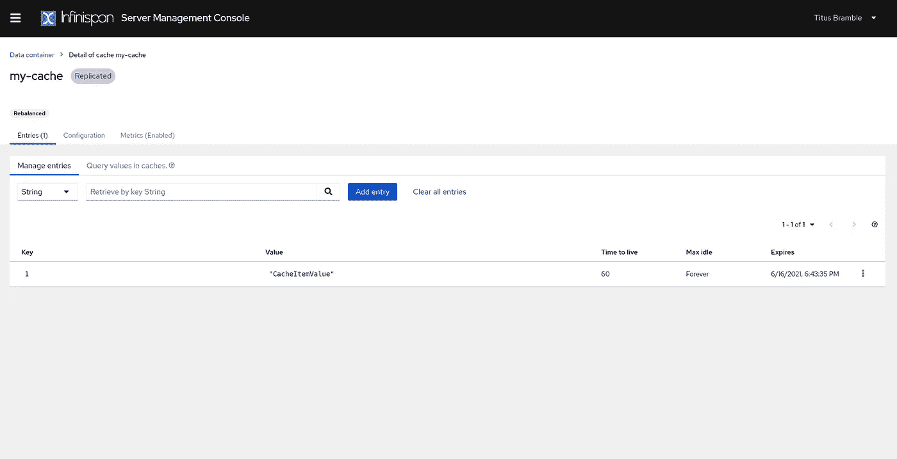

# 使用 Infinispan 和 Quarkus 的分布式缓存分层

> 原文：<https://medium.com/geekculture/distributed-cache-layering-with-infinispan-and-quarkus-d8df4188efd4?source=collection_archive---------9----------------------->


有几种方法可以在 Quarkus 中缓存应用程序数据，OOTB 的解决方案通常依赖于本地应用程序缓存。如何通过抽象该层并拥有一个分布式缓存来进行交互，就像它是本地配置的缓存一样？我们将使用 **Infinispan** 作为**分布式缓存，CDI 拦截器**bean 和 **Infinispan** 客户端**来展示一种方法。**

# 先决条件

*   Java 8+
*   龙目岛≥ 1.18.18
*   Maven ≥ 3.6.2
*   码头工人

# 前言

目前，在社区的眼中，这个应用程序缓存部分被认为是预览版。

> 这项技术被认为是预览版。
> 
> 在*预览版*中，不保证向后兼容性和在生态系统中的存在。具体的改进可能需要改变配置或 API，并且使变得稳定的计划正在进行中。欢迎在我们的[邮件列表](https://groups.google.com/d/forum/quarkus-dev)中或在我们的 [GitHub 问题跟踪器](https://github.com/quarkusio/quarkus/issues)中提出反馈。
> 
> 有关可能的扩展状态的完整列表，请查看我们的[常见问题条目](https://quarkus.io/faq/#extension-status)。

# Quarkus 应用程序缓存设置

通常，这是设置本地缓存时要遵循的程序。

来自指南 [QUARKUS —应用数据缓存](https://quarkus.io/guides/cache)

添加适当的依赖项。

```
./mvnw quarkus:add-extension -Dextensions="cache"
```

或者

```
<dependency>
    <groupId>io.quarkus</groupId>
    <artifactId>quarkus-cache</artifactId>
</dependency>
```

# API 资源

用 **Quarkus 缓存**注释定义 API 资源。

```
@Path("/v1/service")
public class Service {

    @CacheResult(cacheName = "some-cache") 
    public String getValue(String key) {
        // return some cache value
    }

}
```

# `@CacheResult`

这将尽可能从缓存中加载方法结果，而不执行方法体。

> 当一个用`@CacheResult`标注的方法被调用时，Quarkus 将计算一个缓存键，并使用它在缓存中检查该方法是否已经被调用。如果这个方法有一个或多个参数，那么如果没有一个参数用`@CacheKey`标注，那么就从所有的方法参数中进行密钥计算，否则所有的参数都用`@CacheKey`标注。作为键一部分的每个非原语方法参数必须正确实现`equals()`和`hashCode()`，这样缓存才能按预期工作。

这个注释也可以用在没有参数的方法上，在这种情况下使用从缓存名派生的缺省键。如果在缓存中找到一个值，它将被返回，而带注释的方法永远不会被实际执行。如果没有找到值，则调用带注释的方法，并使用计算出的键将返回值存储在缓存中。

然而，目前底层的缓存提供者是 caffeine，并且是应用程序本身的本地提供者。也许我们可以利用上面提到的主题，为像 **Infinispan** 这样的分布式缓存提供相同的功能。让我们试一试。

# 运行分布式缓存

出于我们的目的，在这种情况下，我们将使用 **Infinispan** 缓存和相关的扩展。有两种运行模式 **Infinispan** ，infinispan **嵌入式**或者 infinispan **远程**。嵌入式侧重于位于或嵌入到 Java 应用程序中的 infinispan 缓存。远程是集成到独立的 **Infinispan** 服务器的模式。我们将关注后者。

> 什么是 Infinispan？
> 
> Infinispan 是一个开源的**内存数据网格**，为存储、管理和处理数据提供了灵活的部署选项和强大的功能。Infinispan 提供了一个键/值数据存储，可以保存所有类型的数据，从 Java 对象到纯文本。Infinispan 将您的数据分布在可弹性扩展的集群中，以保证高可用性和容错能力，无论您是将 Infinispan 用作易失性缓存还是持久性数据存储。

Infinispan 提供了一个所谓的 HotRod 客户端，这是一个位于 TCP 之上的二进制客户端，提供了高可伸缩性、有用的查询和其他丰富的功能。

```
./mvnw quarkus:add-extension -Dextensions="quarkus-infinispan-client"
```

或者

```
<dependency>
  <groupId>io.quarkus</groupId>
  <artifactId>quarkus-infinispan-client</artifactId>
</dependency>
```

[https://infinispan.org/](https://infinispan.org/)


下面是我们如何运行 **Infinispan 服务器。**

```
docker run -p 11222:11222 -e USER="Titus Bramble" -e PASS="Shambles"   quay.io/infinispan/server:12.1.4.Final
```

[](https://quarkus.io/guides/infinispan-client) [## Quarkus — Infinispan 客户端

### 公共类 BookMarshaller 实现 message marshaller { @ Override public String get typename(){ return…

quarkus.io](https://quarkus.io/guides/infinispan-client) 

# 截击机

拦截器在拦截请求和提供缓存响应时会很方便。它们来自 CDI 规范，处理不同类型的功能，如事务、安全、日志方面等。它们通常不符合代码的逻辑，应该被独立对待。

正如`@CacheResult`是 quarkus-cache 的拦截器绑定。让我们添加一个自定义拦截器绑定来开始使用我们的自定义拦截器。它应该看起来像这样。

```
@InterceptorBinding
@Retention(RetentionPolicy.*RUNTIME*)
@Target({*TYPE*, *METHOD*})
public @interface Cached {
    @Nonbinding String cacheName();
}
```

现在，我们可以开始为我们的自定义缓存拦截器添加逻辑，如果键不存在，它将具有缓存创建、异步检索和写入的逻辑。因为我们将抽象 **Infinispan** ，所以它将是一个简单的复制缓存，带有一个字符串键和字符串值存储。作为调用的结果，我们的拦截器将使用反应兵变流。

# API 资源

只是一个简单的值响应，它从一个耗时的过程中返回一个响应。

```
@Path("/v1/services")
public class CacheResource {

    @GET
    @Produces(MediaType.*TEXT_PLAIN*)
    @Path("{id}")
    @Cached(cacheName = "my-cache")
    public Uni<String> getServiceValue(@PathParam("id") Long path) {
        // time consuming process return Uni.*createFrom*().item("CacheItemValue");
    }

}
```

# 配置

我们使用的夸库斯构型。更多缓存配置和选项可以在这里找到。

https://infinispan.org/docs/stable/index.html

```
quarkus:
  infinispan-client:
    auth-username: "Titus Bramble"
    auth-password: "Shambles"
    auth-realm: default
    auth-server-name: infinispan
    sasl-mechanism: DIGEST-MD5
cache:
  <infinispan>
    <cache-container>
      <replicated-cache name="<name-override>">
        <encoding>
          <key media-type="application/x-java-object"/>
          <value media-type="application/x-java-object"/>
        </encoding>
      </replicated-cache>
    </cache-container>
  </infinispan>
```

# 反应

对我们的资源执行第一个请求，应该会产生一个实际的响应，并且应该将 TTL 标志设置为 60 秒。下一个后续请求将在这段时间内给出缓存的响应。

```
$ curl "[http://localhost:8080/v1/services/1](http://localhost:8080/v1/services/1)"
```

我们可以在 Infinispan 控制台中直接看到我们新创建的缓存记录及其属性

[http://localhost:11222/console/](http://localhost:11222/console/)



从现在开始，我们可以根据我们的需求或业务要求扩展不同的缓存。这只是证明了，即使在 Quarkus 中的应用程序数据缓存是本地的，使用适当的拦截器和带注释的方法也可以实现类似的模式。

如果你想看一个更完整的例子，你可以在 GitHub 上找到源代码。

[在这里找到 GitHub 源代码项目](https://github.com/dvddhln/quarkus-reactive-distributed-cache-layer)

祝你好运！

灵感来自:

[](https://github.com/quarkusio/quarkus/issues/17058) [## Quarkus 缓存-持久层问题#17058 quarkusio/quarkus

### 描述根据本指南(https://quarkus.io/guides/cache ),我们已经轻松地将本地缓存层添加到我们的…

github.com](https://github.com/quarkusio/quarkus/issues/17058)