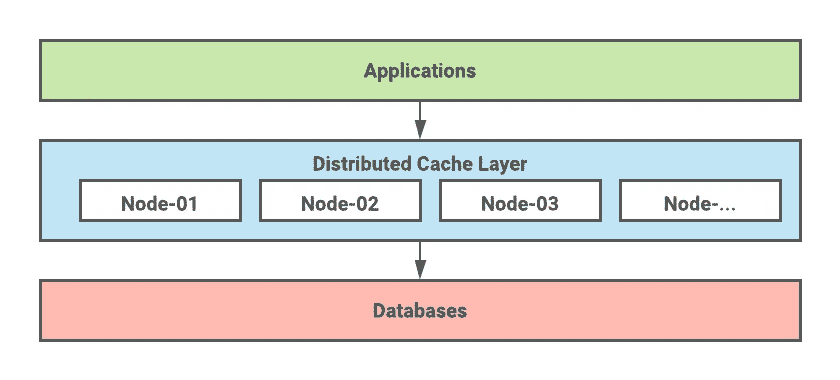
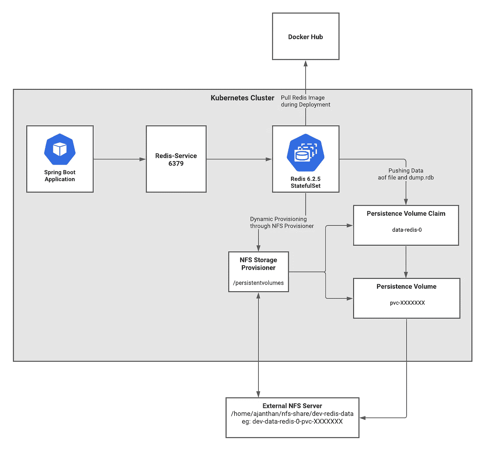

# 面向微服务的分布式缓存模式

> 原文：<https://medium.com/geekculture/distributed-caching-pattern-for-microservices-with-redis-d95ea7c0e8f8?source=collection_archive---------3----------------------->

当涉及到服务的生产级部署时，缓存是关键实现之一，它作为特定应用程序和保存实际数据的持久性系统之间的中间层，帮助我们提高系统的性能。

当我们研究微服务架构中缓存实施的可能模式时，有几种模式可供选择，包括:

1.  嵌入式缓存
2.  嵌入式分布式缓存
3.  客户端服务器缓存
4.  云缓存
5.  边车缓存
6.  分布式缓存
7.  等等…

为了更好地理解这些模式，你可以参考[【1】](https://hazelcast.com/blog/architectural-patterns-for-caching-microservices/)和[【2】](https://www.youtube.com/watch?v=0x-ZV_vP73k)，在那里我们可以找到更详细的解释。

在本文中，我的目的是讨论分布式缓存模式，以及我们如何在单节点和高可用性设置中使用 Redis 部署分布式缓存解决方案。

作为第一步，我们将看看这种分布式缓存意味着什么——以下引文摘自[【3】](https://hazelcast.com/glossary/distributed-cache/)。

****分布式高速缓存*** *是一种系统，它将多台联网计算机的随机存取内存(RAM)汇集到一个内存数据存储中，用作数据高速缓存，以提供对数据的快速访问。**

*下图描述了使用分布式缓存的典型用例。同样的用例，我们将在 Kubernetes 上使用 Spring Boot、MysQL 和 Redis 来实现。*

**

# *我们要在这里做什么！*

1.  *设置单节点 Redis 部署*
2.  *设置 HA Redis 部署(禁用集群并使用 Sentinel 实现高可用性)*
3.  *准备一个样本 Spring Boot 微服务来测试应用程序和 MySQL 之间的缓存*

# *设置单节点 Redis 部署*

*下图描述了当我们在 Kubernetes 中进行单节点 Redis 部署时，需要哪些组件以及它们是如何互连的。*

**

***Spring Boot 应用** —为测试缓存而创建的应用。*

***Redis 服务** —这是 Redis 的 Kubernetes 服务，用作 Spring Boot 应用程序的入口点。*

***Redis** —这是 Redis POD，在 Kubernetes 中作为 StatefulSet 运行。*

***NFS 存储供应器** —这是通过持久性卷声明来动态供应持久性卷。当我们使用 Redis 集群时，这实际上是需要的，但我已经用单节点实现了同样的功能，因为它可以重用。这里使用的是[【4】nfs-subdir-external-Provisioner](https://github.com/kubernetes-sigs/nfs-subdir-external-provisioner)，因为默认的 nfs 置备程序不再被维护，而且当使用旧的置备程序遇到问题时，它不能正确启动 Kubernetes ( minikube 版本:v1.22.0)中的 NFS 置备程序 POD。*

***外置 NFS 服务器** —用于持久存储。*

***Minikube** —出于本地测试的目的，我们可以使用 Minikube 来设置 Kubernetes 集群。*

**注:这里我不打算解释如何设置 Minikube，如果你是新手，请参考*[*【5】*](https://github.com/kubernetes-sigs/nfs-subdir-external-provisioner/tree/v4.0.2)*。**

## *步骤 1:准备存储类。*

## *步骤 2:准备角色和访问控制。*

***步骤 3:准备部署文件。***

***步骤 4:执行脚本并检查部署。***

***步骤 5:准备 redis-config.yaml***

***步骤 6:准备 Redis 部署文件***

***步骤 7:执行 Redis 部署脚本***

***步骤 8:验证初始设置***

*现在，我们完成了单节点设置，当我们在**部分时，我们将通过 Spring Boot 应用程序验证这一点:3。***

# *设置 HA Redis 部署*

*谈到高可用性设置，有两个选项，一个是使用群集启用和群集禁用选项。这两种设置各有利弊，要获得更多信息，请参考“[比较集群选项](https://docs.aws.amazon.com/AmazonElastiCache/latest/red-ug/Replication.Redis-RedisCluster.html)”链接。*

*在这里，我将设置集群禁用模式，通过使用 Sentinel 实现高可用性。Sentinel 将监控节点，例如，考虑到主节点出现故障，它将使其中一个从节点成为主节点，使其可用。*

*在此设置中，将有 3 个 Redis 节点、3 个 Sentinel 节点以及 2 个 NFS 资源调配器来实现高可用性。*

***步骤 1:通过将副本数量增加到 2 来部署 NFS 置备程序。***

***步骤 2:使用相同的 Redis 配置文件并部署它。***

***步骤 3:使用相同的 Redis 部署文件，将副本更新为 3 并部署文件。***

***第四步:准备哨兵部署文件。***

*注意:需要相应地更新<namespace>标签。</namespace>*

***步骤 5:现在执行下面的命令来部署工件。***

*将运行 3 个 Redis PODs 和 3 个 Sentinel PODs，您可以使用相同的方法验证 Redis 节点，要验证 Sentinel 节点，您可以使用 kubectl logs -f <podname>-n <namespace>检查日志。</namespace></podname>*

# *准备一个样本 Spring Boot 微服务来测试应用程序和 MySQL 之间的缓存*

***步骤 1:** 实现 spring boot 项目以使用 Redis 缓存。我实现的样本可以在“ [**redis-sample**](https://github.com/ajanthanblog/redis-springboot-cache.git) ”找到。克隆它，转到项目文件夹，执行下面的命令来构建映像。*

*应用程序代码中的亮点:*

***应用程序开发. yaml 属性文件。***

***RedistestApplication.java***

***UserController.java***

*要构建映像，请从项目根文件夹中执行下面的命令。*

*成功构建后可以找到如下图像:*

***步骤 2:** 现在我们已经推送了我们的映像，现在需要将它部署到 minikube 集群。*

*准备以下部署文件:*

*使用以下命令进行部署，并验证是否所有单元都处于就绪状态。*

***步骤 3:** 验证缓存。*

*使用 minikube ssh 命令进入 minikube 集群并执行下面的 curl 命令。*

*还要检查应用程序日志:*

*通过从后端数据库获取记录，您可以看到第一个调用有日志。但是当你第二次执行时，它不会到达那里，但是你会得到响应。*

*要验证这是否通过我们的 Redis 缓存，请执行下面的命令并进入 redis POD。*

*你可以在那里看到我们的处决记录。这证实了我们的集成工作符合预期。*

*就是这样…此外，还可以通过更新和撤销缓存选项来更新应用程序。*

# *参考*

*[1][https://develop paper . com/deploying-single-node-redis-in-kubernetes-environment/](https://developpaper.com/deploying-single-node-redis-in-kubernetes-environment/)*

*[https://www.youtube.com/watch?v=JmCn7k0PlV4](https://www.youtube.com/watch?v=JmCn7k0PlV4)*

*[https://www.youtube.com/watch?v=AavnQzWDTEk](https://www.youtube.com/watch?v=AavnQzWDTEk)*

*[4][https://www . wwt . com/article/the-power-of-distributed-caching-with-redis/](https://www.wwt.com/article/the-power-of-distributed-caching-with-redis/)*