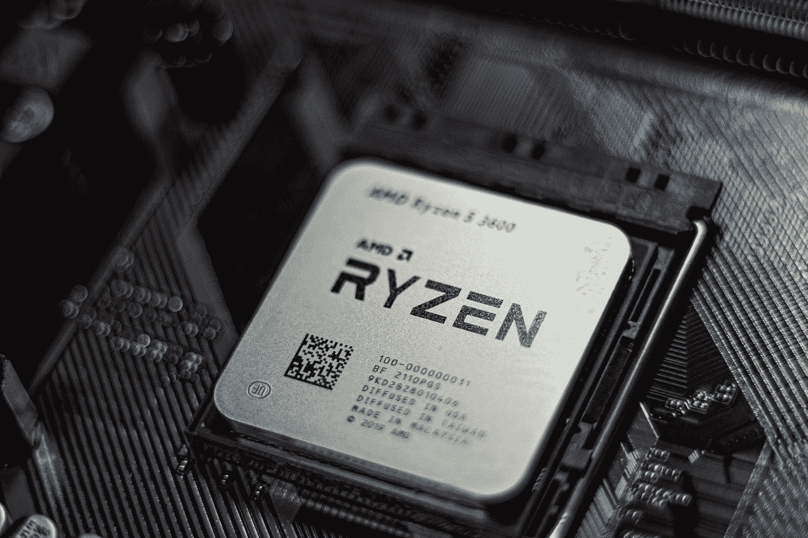
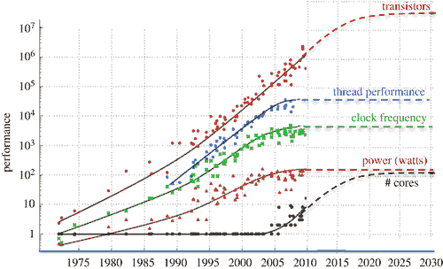
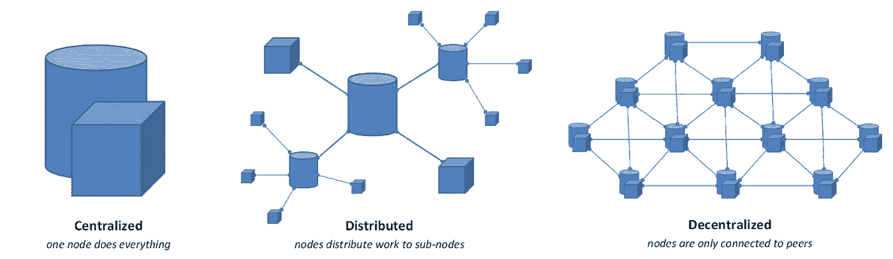
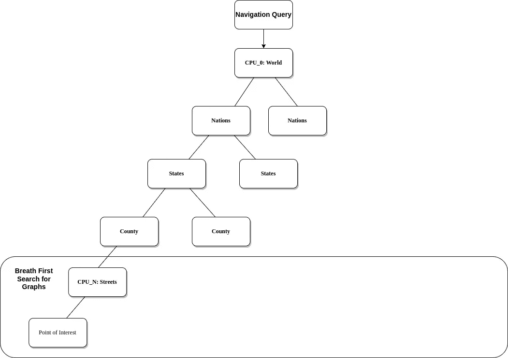
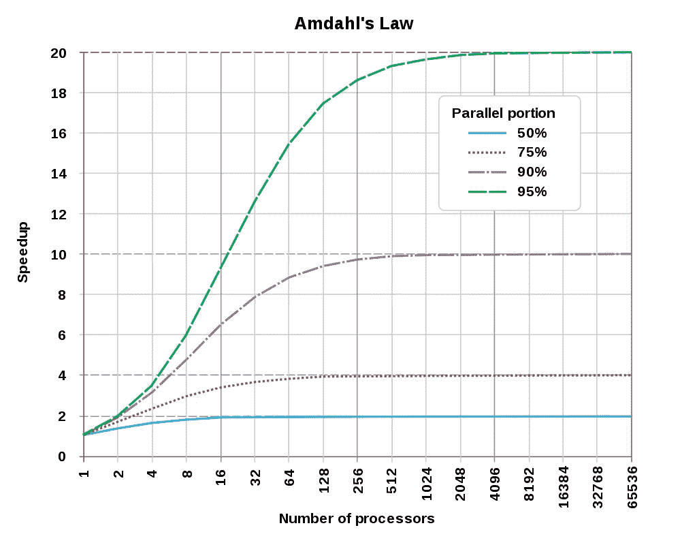

# 面向初学者的分布式计算

> 原文：<https://medium.com/geekculture/distributed-computing-for-beginners-f4116adf609d?source=collection_archive---------9----------------------->

## 如何使用分布式计算解决问题？



Photo by [Irving Marca](https://unsplash.com/@irvingmarca?utm_source=medium&utm_medium=referral) on [Unsplash](https://unsplash.com?utm_source=medium&utm_medium=referral)

摩尔定律的衰落和计算机 CPU 核心数量的增加意味着串行算法的并行化变得越来越重要。



Figure 1 from royalsocietypublishing.org

然而，作为分布式计算的初学者，可能很难弄清楚如何将您设计的串行算法转换成可以并行运行的代码。

下面是初学者对分布式计算的理解。

## 什么是分布式计算？


Photo by [Taylor Vick](https://unsplash.com/@tvick?utm_source=medium&utm_medium=referral) on [Unsplash](https://unsplash.com?utm_source=medium&utm_medium=referral)

分布式计算就是弄清楚如何让多个独立的处理单元相互通信，以在软件层面完成一项任务。举个例子，你可以使用多个 CPU，并弄清楚如何让它们相互通信来执行一项任务。这是一些可以执行分布式计算的硬件。

*   CPU 内核
*   国家政治保卫局。参见 OGPU
*   服务器

## 一般建筑



Figure 2 from [hub.packtpub.com](https://hub.packtpub.com/)

虽然有许多方法可以创建分布式系统。通常涉及以下三项。

*   客户端将消息发送到服务器
*   您有一个索引服务器，它决定哪个服务器发送消息给处理服务器并返回给客户机
*   您已经有了实际处理消息并给出输出的处理服务器

每个分布式系统都遵循这种类型的体系结构，但有一定程度的差异。

## 分布式计算可以使用的现有服务有哪些？

许多服务受益于分布式计算。这里有一些利用分布式计算的现有程序。

*   [NGINX 反向代理服务器](https://nginx.org/en/docs/http/load_balancing.html) + [NodeJS web app](https://nodejs.org/en/)
*   使用 [OpenMPI](https://www.open-mpi.org/) 的超级计算机
*   [代码编译服务器](https://www.distcc.org/)
*   [视频渲染服务器](https://www.awsthinkbox.com/blog/distributed-rendering-a-guide)

## 分布式计算的最佳编程风格和语言

虽然您可以使用任何编程风格来创建分布式计算，但是实现这种计算风格的最流行的方式是通过函数式编程。函数式编程是一种基于数学函数的编程风格。

```
f(x: int) => int
```

通过严格使用函数进行编程，我们消除了状态的保存和置换。与其他类型的编程相比，函数式编程有一些优点和缺点。

**好处**

*   无错误代码:没有状态初始化意味着您不必调试状态修改
*   高效并行编程:共享状态是并行编程的祸根
*   支持的嵌套函数:就像数学一样，你可以在函数中嵌入函数来修改输出

**弊端**

*   大内存占用:缺少状态意味着对象必须在每次状态置换时重新初始化

大多数编程语言已经内置了函数特性。例如，在 JavaScript 中，您可以使用 [reduce](https://developer.mozilla.org/en-US/docs/Web/JavaScript/Reference/Global_Objects/Array/Reduce) 和 [map](https://www.w3schools.com/jsref/jsref_map.asp) 在一个数组上链接命令来执行函数操作。或者在 Java 中，你可以使用[流 API](https://docs.oracle.com/javase/8/docs/api/java/util/stream/Stream.html) 对数组函数执行操作。其他语言只使用 [Lisp](https://lisp-lang.org/) 和 [Haskell](https://www.haskell.org/) 等函数。

要点是使用函数式编程风格来最小化状态修改。通过这样做，您降低了软件的复杂性。

## 构建导航系统

假设您想要构建一个具有即时路线导航的地图服务。在本指南中，我们将忽略地图服务的前端，而只关注服务的后端。

例如，假设您想要构建一个导航服务，以最短的距离将您从 A 点带到 B 点。大多数软件工程师和计算机科学学生首先想到的是图的广度优先搜索算法。[图的基本广度优先搜索检查每个最短优化路径，直到到达两点之间的预期最短路径。](https://www.cs.cornell.edu/courses/cs2112/2012sp/lectures/lec24/lec24-12sp.html)这是可视化的算法。

## 如何构建可扩展的导航服务？

使用常规的广度优先搜索图算法的问题是，它只利用一个处理器来计算最短距离。因此它受到单个 CPU 的时钟周期的限制。接下来的问题是，如何构建一个利用分布式架构的导航服务，以便使用多个系统来扩展地图系统。

给定一组 CPU，我们必须以一种易于并行化的方式组织算法。我们可以使用搜索树来并行化图的广度优先搜索算法。因此，该算法从 O(N)到 O(log(N))的近似最坏情况时间复杂度。该算法比标准的 [Dijkstra 算法](https://www.geeksforgeeks.org/dijkstras-shortest-path-algorithm-greedy-algo-7/)和 [A*搜索](https://www.geeksforgeeks.org/a-search-algorithm/)更快。这可能是谷歌和苹果目前或过去用于其地图服务的算法的实际变体。



这是我的算法所依据的理论研究论文。请记住，您可以更改节点/枢纽来表示火车站、港口等，以使它们适应不同的运输模式。

 [## 基于枢纽的道路网络最短路径标注算法——微软研究

### Abraham 等人[SODA 2010]最近提出了几个实用的点对点最短…

www.microsoft.com](https://www.microsoft.com/en-us/research/publication/a-hub-based-labeling-algorithm-for-shortest-paths-on-road-networks/) 

## 并行化的限制



Figure 4 from wikipedia.org

而您可以增加 CPU 数量来提高并行算法的效率。加速最终会。这就是为什么 AMD 线程 rippers 最大 CPU 核心计数停止 64 核心计数和 128 线程。根据最近的数据，超过 128 个线程的内核数量增长将导致边际增长加速，其代价是[热量的线性增加。](https://www.extremetech.com/computing/253416-amd-explains-threadripper-cpus-four-die-hood)

软件性能的任何实质性提高都必须来自软件语言的优化。我将发表一篇关于我与软件膨胀的战争的文章。

## 免费教科书和讲座

这里有一些免费的课本和讲座。在处理分布式计算之前，您需要更好地理解函数式编程。

 [## 并行处理算法和架构介绍

### 并行处理算法和架构介绍| Behrooz Parhami |下载| Z 库。下载…

u1lib.org](https://u1lib.org/book/673364/251d66) 

然后你就可以专注于分布式计算了。

 [## CS 707 分布式软件系统

### 编辑描述

cs.gmu.edu](https://cs.gmu.edu/~setia/cs707/)  [## 系统思维:入门

### 你有多喜欢这本书？文件质量如何？为…下载这本书

u1lib.org](https://u1lib.org/book/2351339/9d9931) 

在这里注册我的电子邮件列表。

## 概括起来

虽然有许多方法可以建立分布式系统。主要思想是任务必须被分解成独立于状态的微任务。这将允许通过跨不同处理单元发送消息来并行化算法。

请留下您对分布式计算的看法。此外，留下评论，说明指南的哪些部分可以改进。在你不理解的地方留下私人笔记。

IT 和工程领域是快速发展的领域。跟不上意味着你将被落在后面。跟上的最好方法是保持最新的新闻和教育内容。[订阅免费电子邮件列表，将您的职业生涯提升 10 倍。](/subscribe/@dretechtips)

**加入我们吧，因为 50 多位想要快速提升职业生涯和知识基础的人已经注册了。**

**相关内容:**

*   [如何备份您的媒体状态？](/geekculture/how-to-backup-your-media-presence-b1b5a9125159)
*   [去谷歌化的完整指南](/@drechang/how-to-dismantle-the-google-empire-e652bff6d2)
*   [停止为网飞和 Spotify 付费](/@drechang/how-to-build-your-own-illegal-streaming-service-ff353ef70cd0)