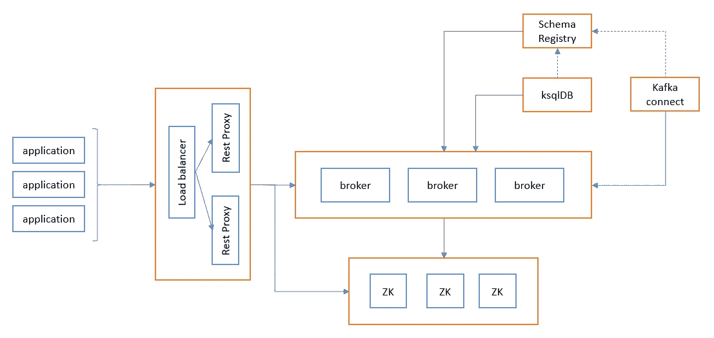
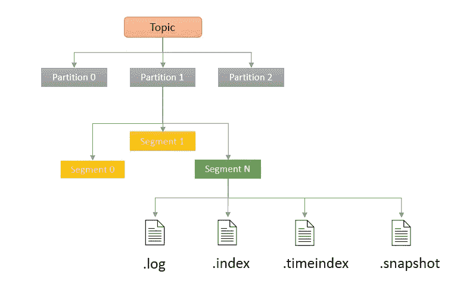
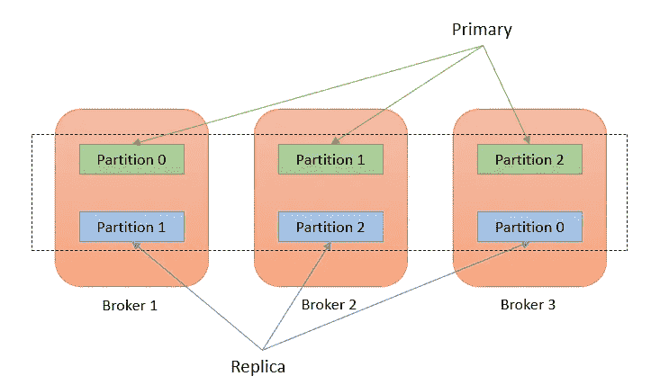
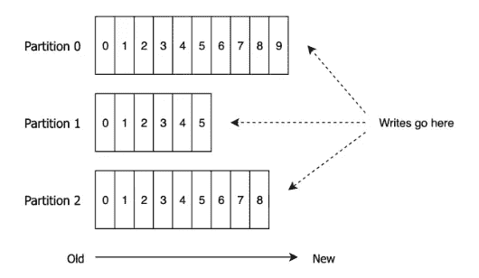
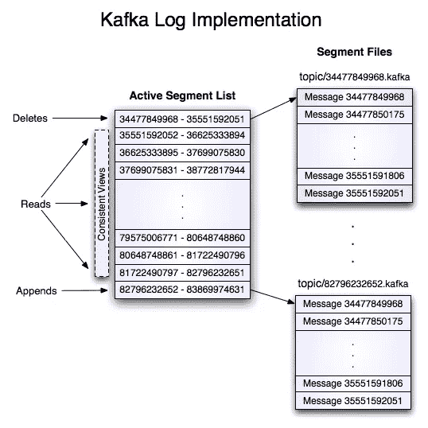
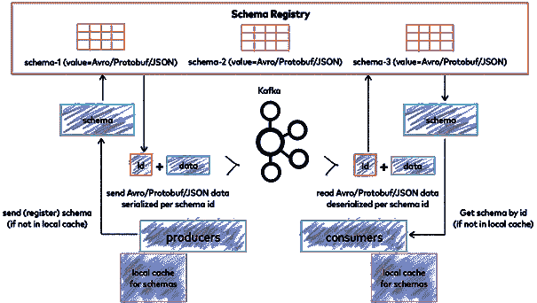
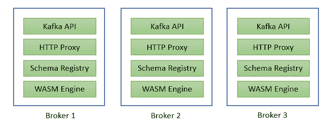

# 分布式事件流—卡夫卡

> 原文：<https://medium.com/geekculture/distributed-event-streaming-kafka-dca9ca58ad69?source=collection_archive---------4----------------------->

用于存储、读取和分析流数据的框架

Kafka 为我们提供了流媒体平台的三种功能:

1.  **发布**(写)和**订阅**(读)事件流
2.  **持久可靠地存储**个事件流
3.  在事件发生时处理事件流

## 特征

*   分布的
*   弹性和容错
*   水平可伸缩
*   高性能和低延迟([点击了解原因](https://blog.devgenius.io/what-makes-kafka-so-performant-df5dbecb7f3a))
*   与模式无关的存储
*   多语言(Java、Python、Go，甚至 REST 代理)
*   生产者和消费者之间的异步处理和解耦
*   持久性消息存储、缓冲、突发负载和消费者故障
*   已经过生产测试，被 LinkedIn、网飞、Airbnb、沃尔玛使用…

## 卡夫卡的用例

*   命令查询责任分离(CQRS)
*   复杂事件处理
*   分阶段事件驱动架构(SEDA)
*   日志传送和聚合
*   活动采购
*   变更数据捕获
*   可伸缩消息存储
*   请求-回复集成模式
*   物化视图模式

## [生产者](https://asrathore08.medium.com/kafka-internals-of-producer-and-consumers-5a1aebb2b3ce)

生产者是生成消息/数据流的服务/应用程序。他们使用**代理**或 **Zookeeper** URL 连接到 Kafka 集群。**所有具有相同键的事件将在同一个分区**中发布，这是一种保证消费事件时排序的方法。这是通过 murmur2 算法使用密钥散列来完成的。由生产者产生消息将具有以下属性:

> Key — binary |可选的
> 值— binary |可选的
> 压缩— none | gzip | snappy | zstd | lz4
> 头—消息的元数据| Key: Value |可选的
> 分区&偏移量
> 时间戳

## [消费者](https://asrathore08.medium.com/kafka-internals-of-producer-and-consumers-5a1aebb2b3ce)

消费者是从单个分区消费消息/批处理流的应用程序。

## 消费者群体

使用者组是由多个使用者组成的组，组中的每个使用者直接从独占分区读取数据。如果消费者的数量大于分区的数量，一些消费者将处于非活动状态。

重新平衡——将分区所有权从一个用户转移到另一个用户称为*重新平衡*。

> 消费者订阅一个或多个主题。一个消费者只能属于一个消费者群体。

## 主题

主题是在 Kafka 集群中存储消息的逻辑分隔。Kafka 将消息记录保留为日志。**补偿**决定了生产者/消费者消费日志的相对定位。这些存储在 Kafka 内部主题 **__consumer_offsets 中。一个主题可以有零个或多个消费者，也可以有零个或多个生产者。**

[For details on each file click here](https://asrathore08.medium.com/kafka-internals-part-2-7dad1977f7d1)

## 经纪人

Kafka 集群由多个满足高可用性需求的服务器组成，称为代理。这些是运行 Kafka 流程的实际机器和实例。每个代理可以托管一组分区，并处理向这些分区写入和读取事件的请求。它们还有助于跨分区复制消息数据。

## 划分

主题被细分为**分区**，是卡夫卡层级中最小的存储单元。分区是一个有序且不可变的记录序列。在每个分区内，每个发布的事件都接收一个标识符，即**偏移量**。使用者使用偏移量来控制哪些事件已经被使用，哪些事件是下一个要使用的事件。但是**消费顺序只在同一个分区中得到保证。**

> 对于 Kafka 消费者来说，分区是一个并行单位。

每个分区存储跨节点复制的**日志文件，这些日志文件分布在多个代理中以实现容错。这些日志文件称为段。一个段只是一个分区的消息集合。段 N 包含最近的记录，段 1 包含最老的保留记录。该段包含 1 GB 的数据(`log.segment.bytes`)或一周的数据(`log.roll.ms`或`log.roll.hours`)，以较小者为准。如果达到这个限制，那么段文件将被关闭，并创建一个新的段文件。**

> 一个分区的每个使用者组只有一个使用者。
> 在任何时候，单个经纪人将成为一个分区的领导者。该代理将负责接收和提供该分区的数据。

*注意:在使用 zookeeper 时，Kafka 集群应该有少于 200k 的分区。*

## 动物园管理员

zookeeper 帮助管理 Kafka 集群的活动，例如在代理之间进行协调，为复制选择主分区等。

*注:从卡夫卡****3 . 3 . 0****阿帕奇动物园管理员依赖被移除。相反，卡夫卡现在依赖于一个内部的 Raft 定额组。从 3.3 版本开始，此功能已可用于生产。*

## 流处理器

流消耗来自一个或多个主题的输入流，并产生到一个或多个输出主题的输出流，有效地将输入流转换成输出流。**主要用于转换 ELT/ETL 管道中的数据。** Kafka 提供了一个集成的 Streams API 库。这类似于消费者 API。

## 连接器

连接器是将 Kafka 主题连接到现有应用程序或数据系统的可重用生产者或消费者。例如，关系数据库的连接器可能捕获表的每一次更改。可以看作是 Kafka 的数据集成框架。因为这些通常是由系统专家开发的，所以它也在连接器中封装了操作方面。使用已定义连接器的充分理由如下，但不仅限于此:

> 减少开发工作量
> 自动偏移管理&恢复丢失的消息
> 可插拔&高可用性和可扩展性
> 标准化
> 源/接收器改造
> 减少维护

## 模式注册表

在 Kafka 中，生产者和消费者并不直接交流，而是通过 Kafka 主题传递数据。生产者必须知道如何序列化数据，消费者必须知道如何反序列化数据。

模式注册中心是一个独立的进程，独立于 Kafka 代理运行。它存储和检索 Avro、JSON、Protobuf 模式等。使用这些模式，它执行数据序列化和反序列化的验证。

# 写作策略

Ack —它表示在我们认为写入成功之前必须收到记录的代理数量。有效值为 0、1 和全部。

> 0 →生产者不会等待代理的响应
> 
> 1 →当领导收到记录时，制作人将认为写入成功
> 
> 2→当所有同步副本收到记录时，生产者将认为写入成功

# 语义学

> 恰好一次→因为 Kafka 生产者 API 是幂等的。写将恰好发生一次。

## 储存；储备

在大多数情况下，使用尾读取以流的方式消耗数据。尾部读取利用操作系统的页面缓存来提供数据，而不是磁盘读取。出于回填或故障恢复目的，通常会从磁盘中读取较旧的数据，这种情况并不常见。在分层存储方法中，Kafka 集群配置有两层存储—本地和远程。

> 本地
> 远程(尚未生产就绪)

# 配置

## 集群/代理

> max . message . bytes
> default . deserialization . exception . handlererrors . deadletterqueue . topic . name
> min . in sync . replicas
> auto . create . topics . enable(在生产中为假)
> num . replica . fetchers
> default . replication . factor

## 生产者

> bootstrap . servers
> client . id
> acks
> retries
> max . in-flight . requests . per . connection
> batch . size
> linger . ms
> compression . type
> enable .幂等性

## 消费者

> bootstrap . servers
> client . id
> group . id
> session . time out . ms
> heart beat . interval . ms
> enable . auto . commit
> auto . commit . interval . ms
> auto . offset . reset
> max . poll . interval . ms
> max . poll . records
> message . max . bytes
> auto . offset . reset

## 使用的端口

> 代理:9092
> Zookeeper:2181
> REST Proxy:8082
> Schema Registry:8081
> KSQL:8088

## 跨集群复制(XDCR)

Kafka 使用 MirrorMaker2 进行复制。MM2 是 Apache Kafka 源连接器和接收器连接器的组合。

> 镜像源连接器
> 镜像检查点连接器
> 镜像心跳连接器

MM2 自动检测新主题和分区，同时还确保主题配置在集群之间同步。

Once all consumers are migrated then switch the producer to the new cluster

其他选项有 **uReplicator** (来自优步)、Mirus(来自 Salesforce)、Brooklin(来自 LinkedIn)和 confluent Replicator(来自 confluent，而非开源)。

*注意:Kafka 不是一个消息服务，虽然它可以提供一个受约束的排队解决方案，但明智的做法是选择 NATS 或 RabbitMQ 作为一个专门的解决方案*

## 可观察性和监控(控制台/用户界面)

有许多第三方、开源或商业图形工具提供了额外的管理和监控功能。

[Kafdrop](https://github.com/obsidiandynamics/kafdrop)
[镜头](https://lenses.io/usecases/kafka-monitoring/)
[AKHQ](https://github.com/tchiotludo/akhq)
[Kafka UI](https://github.com/provectus/kafka-ui)
[控制台(Kowl)](https://github.com/redpanda-data/console/)
[巡航控制 UI](https://github.com/linkedin/cruise-control-ui)
[汇流控制中心](https://www.confluent.io/en-gb/product/confluent-platform/gui-driven-management-and-monitoring/)
[Conduktor](https://www.conduktor.io/)

# AWS MSK(托管卡夫卡)

**控制平面(动物园管理员、经纪人)**

Broker 和 Zookeeper 节点**和**是在**亚马逊管理的 VPC 服务账户**中创建的。在我们的 AWS 帐户中，创建了网络接口( **ENIs** ),这些接口允许我们访问 broker 和 zookeeper 节点。 **MSK 不公开任何公共端点**，因此任何客户端都需要通过私有连接访问 MSK(从同一个 VPC(ENI 的创建地)，对等的 VPC，或者通过中转网关，等等)。

**数据平面(生产者&消费者)**

Kafka 客户不得不**只关注**生产者和消费者**的**，而将设置和管理细节留给 AWS 平台！

**定价**

> 计算时间→＄0.75/小时
> 分区时间→＄0.0015/分区/小时
> 存储→＄0.10/GiB-月
> 数据输入→＄0.10/GiB
> 数据输出→＄0.05/GiB
> 连接器→＄0.11/小时

*注意:AWS 使用 AWS Glue 提供模式注册。*

## 《红熊猫》(卡夫卡的替代品)

*   seastar 框架上 Kafka 的 C++重写
*   没有 JVM
*   每核心线程策略
*   无 Zk(使用 Raft 算法)
*   并行提交
*   内联 WebAssembly 转换(不需要像 Flink 那样使用单独的处理器)。它使用 V8 发动机。
*   影子索引
*   异步调度
*   生产就绪分层存储(内存→磁盘→对象存储)
*   专门构建的用于消息交换的 RPC
*   完全兼容 Kafka API
*   臂支架

其他备选方案有[阿帕奇脉冲星](https://pulsar.apache.org/)、[流集](https://streamsets.com/)、[流](https://www.estuary.dev/product/)和[汇流](https://www.confluent.io/)。

快乐流媒体！！